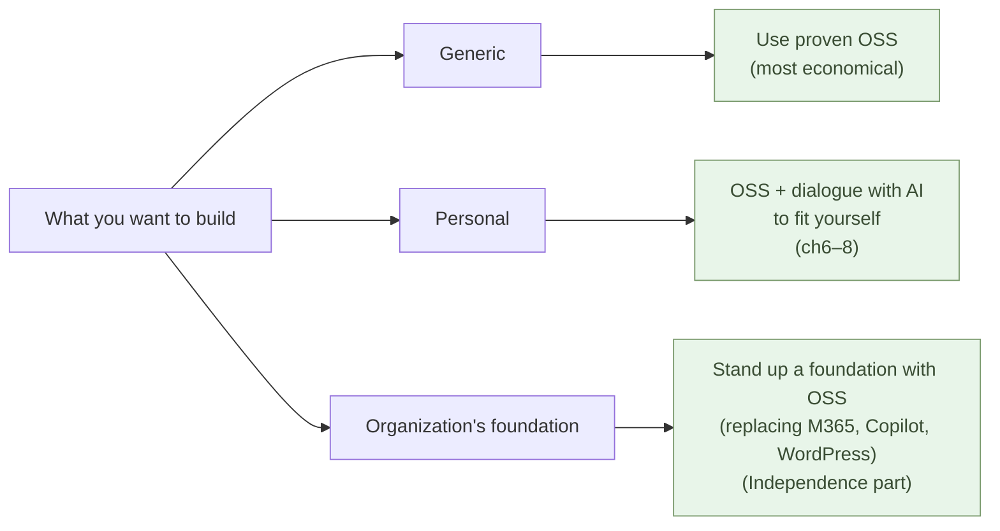

# Customers Co-Develop with AI

**Customers themselves come to build, paired with AI. But the first move
is not writing code — it is to use proven OSS**.

1-04 showed that a builder need not be on the company's payroll. If
you can stand on the building side in dialogue with AI, **the customer
becomes the builder**. And the customer holds the business context from
the start — what the SIer used to gather from the outside and translate
can be skipped.

So where does it start? It helps to split what you want to build into
three — **the generic, the personal, and the organization's foundation**.
Let's take them in turn.

## First, the generic on OSS — this is the most economical

Authentication, documents, the database, video conferencing, the web —
these **generic capabilities are already shared with the world as OSS**.
Someone built them, released them, and tens of thousands hardened them.
There is no need to write them from scratch, and no need to buy them from
a vendor. **Just use them.** That is the most economical path.

And not only economical — **it is also effective for security**. Widely
used OSS has been exposed to eyes all over the world; countless
vulnerabilities have been found and closed. It is far more battle-tested
than code you wrote from scratch or a vendor product whose insides you
cannot see.

There is an overlooked inversion here. **The attention goes to AI, but
most of the generic work is actually carried by shared OSS — the effect
of OSS is greater than the effect of AI.** AI is only the tool that
quickly builds the specific part that sits on top.

> The generic — don't write it, don't buy it — **use OSS**.
> AI takes the spotlight, but OSS holds up the foundation.

## For the personal — add yourself onto OSS, in dialogue with AI

When an individual builds a tool for themselves, using OSS as-is is
sometimes not enough. So you **take OSS as the base and, in dialogue with
AI, customize it to fit yourself**. No need to learn a framework — say
what you want in plain words, try what comes back, ask again. That is all.

This became possible because **the cost of learning fell by orders of
magnitude**. What used to be "six months to a year for an entry-level
grasp" becomes "a few hours to a few days and you have something
running." What you would have given up on at half a year, you do yourself
when it takes a few days — **the line moved**.

The worked examples live in the parent series' individual track:

- **parent series Chapter 2** — write logic in Python (Excel macros to Python too)
- **parent series Chapter 6** — build a website in dialogue with AI
- **parent series Chapter 8** — build embedded software

Each is about an individual who is not a professional programmer building
their own tool with OSS and AI.

> A personal tool — **OSS as the base, customized to fit you in dialogue
> with AI**. What you learn is not a framework, but how to put into words
> what you want.

## For the organization — first stand up the generic foundation on OSS

For an organization, the starting point is the same — **first, stand up
the generic foundation with OSS**. Most of a company's software was never
something to "build"; it was something to "buy": Microsoft 365, Copilot,
WordPress, the vendor packages under the core systems. What replaces them
already runs all over the world.

- Authentication: **PocketBase** (in place of Entra ID)
- Documents: **OnlyOffice** (in place of Word, Excel, PowerPoint)
- Sharing and versioning: **Forgejo** (in place of GitHub)
- Mail: **Stalwart**; meetings: **Jitsi**; web: **Cloudflare Pages** (in place of WordPress)
- AI: a local **LLM + RAG** (in place of Copilot)

**First, untie the vendor with OSS and put the foundation — identity,
data, documents, mail, web, AI — on your own side.** Then, and only then,
write **the logic that is genuinely your own** together with AI. Writing
code comes in the later half, after the foundation is laid — and the
amount shrinks to your company-specific part.

This foundation-building is the **Independence part** (Part 2) of this
sub-series. One OSS stack at a time, you become independent of Microsoft
365, Copilot, WordPress, the core systems, and GitHub.

> An organization's software — **first stand up the generic foundation on
> OSS**. Write only the specific logic with AI — the Independence part is
> that procedure.

## What AI cannot do, the SIer cannot do either

Turn all of this over and a strong consequence falls out. If you can
build **the generic on OSS and the specific with AI yourself**, where is
the reason to commission an SIer for the whole thing?

The old reason to hire an SIer was "we cannot build it ourselves." But in
the AI-native world, **the AI the SIer uses and the AI the customer uses
is the same AI**. There is no SIer-only Claude. So — **what AI cannot do,
the SIer cannot do either**. A problem AI cannot solve, people at the SIer
using the same AI get stuck on the same way.

The SIer's real remaining advantage is "experience and judgment in areas
AI cannot reach" — genuinely new technology, specialized regulation,
cross-organizational negotiation, the pitfalls you only learn from
experience. But that is **a small slice**, and taking it in as **advice**
is enough — the same as not handing your routine business wholesale to a
lawyer or tax accountant (3-05). The multi-year SIer
commission is no longer needed.

> The SIer's distinctive capability lives **only in the small slice AI
> cannot reach**.
> The rest, the customer builds with OSS and AI.

## Where the next chapter goes

The customer builds the generic on OSS and the specific with AI. It is
clearest to start from personal examples — someone who is not a
professional programmer building their own tool with OSS and AI.

The parent series' individual track takes up those examples — Excel macros to Python
(parent series Chapter 2), a website (parent series Chapter 6), embedded software (parent series Chapter 8).

---

## Related articles

- [1-01: AI Solves the World's Hardest Coding Problems](/en/ai-native-ways/software/coder-top/)
- [1-03: AI Now Does the Software Engineer's Work](/en/ai-native-ways/software/coder-end/)
- [1-04: The Builder Role](/en/ai-native-ways/software/builder/)
- [2-01: Becoming Independent from Microsoft and Google — The Whole Map](/en/ai-native-ways/software/independence/)
- [3-04: The Lock-In Problem](/en/ai-native-ways/software/lockin/)
- [3-05: Companies Hire Builders](/en/ai-native-ways/software/hiring-builders/)
- [Structural analysis 08: Subtracting the enterprise-IT tax](/en/insights/enterprise-tax/)
- [Structural analysis 12: AI and the sole proprietor](/en/insights/ai-and-individual/)
