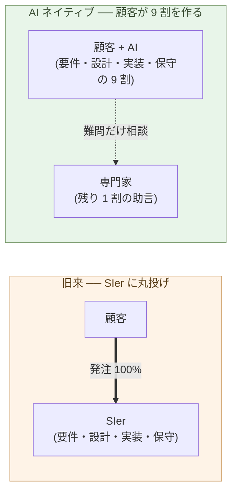

# 顧客がAIと協働して開発する時代

**ソフトウェア開発の 9 割は、顧客自身が AI と組んで作るようになる。
残りの 1 割だけ、専門家に相談する**。

第4章で、ビルダーが 1 人 + AI で動く理由を見た。判断と実行の境界が
一人の中で閉じるからだ。この構造は、ビルダーが社内の人間である必要
を持たない ── **顧客自身がビルダーをやる**ことも、同じ理屈で可能に
なる。

本章はその移行を扱う。なぜ 9 割を顧客自身ができるのか、残りの 1 割
には何が残るのか、そして「AI にできないことは SIer にもできない」と
いう、これまでの委託構造の前提を崩す事実を、順に見ていく。

## 顧客が 9 割を自分で作る、新しい構造

ソフトウェア開発の発注は、これまで一括だった。顧客が SIer に出す
── 要件定義・設計・実装・テスト・運用保守を、まるごと外部に委ねる。
これが旧来の SIer 委託モデル(構造の詳細は次の章で扱う)。

AI ネイティブな構造では、これが二分される:

- **9 割は顧客が自分で作る**(AI を組んで)── 要件は顧客の文脈から
  生まれ、設計は顧客が決め、実装は AI が書き、保守は顧客 + AI で回す
- **1 割だけ外部に頼む** ── 真に新しい技術領域、専門的な規制・コン
  プライアンス、組織横断の権限問題、あるいは経験的にしか分からない
  落とし穴の助言

「9 割」は厳密な数字ではない。だが、構造としては桁が違う ── 旧来の
**100% 委託** から、AI ネイティブの **9 : 1 内製** への転換は、
ソフトウェア開発の発注地図そのものを書き換える。

> 旧来は「顧客は要件だけ出して、あとは SIer」。
> AI ネイティブでは「**顧客 + AI が 9 割やって、難問だけ相談**」。

## なぜ 9 割を顧客自身ができるのか

三つの力が同時に揃ったからだ。

**(1) AI が実行を取った**(第1章・第3章)── 「コードを書ける人を
雇わないと作れない」は、もう要らない。Claude Max 月 3 万円で、世界
最上層のコーディング能力に接続できる。

**(2) 顧客は最初から文脈を持っていた**。要件定義の真の難しさは、業務
の文脈・関係者の力学・規制の制約・組織の歴史 ── これらをコードに
反映できる形に翻訳することにあった。SIer は文脈を**外から聞いて**
吸い上げてからコードに翻訳するが、顧客自身が AI と組めば、**文脈は
最初から手元にある**。翻訳の往復コストがゼロになる。

**(3) 学習コストが桁違いに下がった**(次節)── 「自分で作るには
勉強が要る」という壁が、AI で大きく低くなった。

これら三つが揃ったのは、ここ数年だ。10 年前なら (2) はあっても (1)
(3) がなく、自社開発は事実上不可能だった。だから委託せざるを得な
かった。**「SIer に頼むしかなかった」のは、能力ではなく構造の問題**
だった ── 三つの力のうち二つが欠けていた、それだけの話だ。

## 学習コストが桁違いに下がった

「自分で作る」の最大の障壁は、学習コストだった。

旧来の学習サイクル:

- 本を読む / 講座を受ける(数週間〜数ヶ月)
- 公式ドキュメントと格闘する(数日〜数週間)
- サンプルコードを動かす(数時間〜数日)
- 自分の問題に応用してエラーに詰まる(数日〜数週間)
- ようやく動く最初のコード

AI が入ると、こうなる:

- AI に「これをやりたい」と日本語で頼む
- AI が動くサンプルを返す(秒〜分)
- 走らせて、結果を見ながら次を頼む
- 不明な箇所はその場で質問、AI が答える
- 数時間で動く最初のバージョン

旧来「半年〜1 年で初級者」だったのが、AI と組めば「**数時間〜数日
で動くものを持っている**」になる。これは速さの話ではなく、**「自分
で作るかどうか」の意思決定を変える**話だ。半年かかるなら委託する。
数日でできるなら自分でやる。**この境目を越えた**。

> 学習コストが桁違いに下がったとき、**「外注する」と「自分で作る」
> の損益分岐点**が、根本的に動く。

## AI にできないことは、SIer にもできない

ここが本章の最も強い主張だ。

旧来、SIer に頼む理由は「自分には作れないから」だった。SIer に
**専門能力**があり、顧客にはなかった ── これが委託の前提だった。

AI ネイティブな世界で、この前提を確認してみる。**SIer が使う AI と、
顧客が使う AI は、同じ AI だ**。Claude も GPT も Gemini も、SIer
専用版があるわけではない。SIer のコーダーが Claude Code を使うのと、
顧客が Claude Code を使うのは、ツールとして同じだ。

このとき、**「AI にできないこと」は、SIer にもできない**:

- AI が解けない問題 = SIer の中の人が解いても同じ AI を使うので、
  同様に詰まる
- AI が知らない技術領域 = SIer も同じ AI を使うので、同様に手探り
- AI が間違える分野 = SIer が AI を使えば、同じく間違える

SIer の真の優位は、「AI ができない領域での経験と判断」に残る。これ
は重要だ ── 残るが、**1 割の領域**だ。9 割の「AI ができる仕事」は、
SIer に出しても、AI が裏で書くだけになる。**顧客が直接 AI に書か
せても、品質に大きな差はない**。

例外がある。**ロックイン**だ。SIer 独自のフレームワーク、独自の抽象
層、長年の人的依存 ── これらは、顧客が AI と組んでも代替できない
ように設計されている(構造は第8章で扱う)。だが、新規案件で、ロック
インのない選択肢を持つ顧客にとっては、SIer の優位は 1 割の領域に
集約される。

> SIer の独自能力は、**AI の届かない 1 割**にしかない。
> 残りの 9 割で、SIer は AI に書かせていただけだ。

## 残りの 1 割 ── 顧客が外に頼むもの

「9 : 1」の 1 のほうに、何が残るのか。

- **真に新しい技術領域** ── AI も学習データに十分な事例を持たない
  領域(最先端の研究応用、未確立のプロトコル設計など)
- **専門的な規制・コンプライアンス** ── 医療・金融・法律・建築の
  各種規制下で、判断ミスが致命的になる領域
- **組織横断の権限問題** ── 複数組織の利害調整、現場の合意形成、
  契約の交渉
- **スケール起因の設計判断** ── 数千万〜数億ユーザーの規模で初めて
  顕在化する問題
- **経験的にしか分からない落とし穴** ── 過去のプロジェクトで失敗
  した経験を持つ専門家による「ここはこうしないと後で痛い」

これらは、**助言**の形で外部から取り込むのが合理的だ。1 案件あたり
数時間〜数週間のコンサルティング、あるいは時間契約の専門家。**多年
契約の SIer 委託**ではない。

弁護士や税理士に、定常業務まで全部任せる人はいない。難問が出たとき
だけ相談する。AI ネイティブな世界では、**ソフトウェア開発の専門家
も、弁護士や税理士と同じ位置**に動く ── 第9章で詳しく扱う。

## 次の章へ

顧客が 9 割を自分で作るようになると、SIer に流れていた発注の 9 割
が消える。SIer 委託モデルは、なぜ構造的にこのコストを吸収できない
のか ── 価格・プロセス・組織のどこに、構造的な不経済が埋まっている
のか。

次の章では、SIer 委託モデルそのものの構造を分解する。

---

## 関連記事

- [第1章: AIがコードを書く能力で人間トップクラスに到達した](/ai-native-ways/software/coder-top/)
- [第3章: コーダーの仕事はなくなる](/ai-native-ways/software/coder-end/)
- [第4章: ビルダーという役割](/ai-native-ways/software/builder/)
- [構造分析08: 企業ITの税を引く](/insights/enterprise-tax/)
- [構造分析12: AIと個人事業](/insights/ai-and-individual/)
