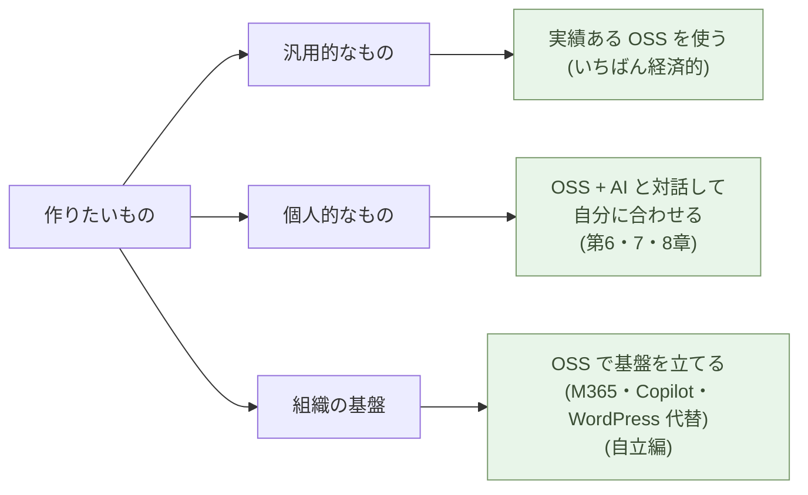

# 顧客がAIと協働して開発する時代

**顧客自身が、AI と組んで作る時代になる。だが最初の一手は、コードを
書くことではない ── まず、実績ある OSS を使う**。

1-04で、ビルダーは社内の人間である必要がないと見た。AI と対話して
作る側に立てるなら、**顧客自身がビルダーになる**。しかも顧客は、業務の
文脈を最初から手元に持っている ── SIer が外から聞き取って翻訳していた
ものを、省ける。

では、何から始めるのか。作りたいものを三つに分けると、見通しがいい
── **汎用的なもの・個人的なもの・組織の基盤**。順に見ていく。

## まず、汎用は OSS ── これがいちばん経済的

認証、文書、データベース、ビデオ会議、Web ── こうした **汎用的な機能
は、すでに OSS として世界で共有されている**。誰かが作り、公開し、何万人
もが鍛えてきた。これを、ゼロから書く必要も、ベンダーから買う必要も
ない。**使えばいい**。それが、いちばん経済的だ。

そして、経済的なだけではない ── **セキュリティ対策としても有効だ**。
広く使われている OSS は、世界中の目に晒され、無数の脆弱性が見つかっては
塞がれてきた。自分でゼロから書いたコードや、中身の見えないベンダー製品
より、よほど鍛えられている。

ここに、見落とされがちな逆転がある。**注目は AI に集まるが、汎用の
大半を実際に担うのは、共有された OSS のほうだ ── AI の効果より、OSS の
効果のほうが大きい**。AI は、その上に載る固有の部分を速く作る道具に
すぎない。

> 汎用的なものは、書かない・買わない ── **OSS を使う**。
> AI が脚光を浴びるが、土台を支えているのは OSS だ。

## 個人なら ── OSS に、AI と対話して自分を足す

個人が自分のための道具を作るときは、OSS をそのまま使うだけでは足りない
ことがある。そこで、**OSS を土台に、AI と対話して、自分に合った形に
カスタマイズする**。フレームワークを学ぶ必要はない ── やりたいことを
ふだんの言葉で伝え、返ってきたものを試し、また頼む。それだけだ。

これが可能になったのは、**学習コストが桁違いに下がった**からだ。かつて
は「半年〜1 年で初級者」だったのが、AI と組めば「数時間〜数日で動くもの
を持っている」になる。半年かかるなら諦めたものを、数日でできるなら自分
でやる ── **この境目を越えた**。

その実例は、親シリーズの個人トラックが扱う:

- **親シリーズ第2章** ── 処理を Python で書く(Excel マクロも Python へ)
- **親シリーズ第6章** ── Web を、AI と対話して作る
- **親シリーズ第8章** ── 組み込みを作る

どれも、専門のプログラマーでない個人が、OSS と AI で自分の道具を作る話だ。

> 個人の道具は、**OSS を土台に、AI と対話して自分に合わせる**。
> 学ぶのはフレームワークではなく、何が欲しいかを言葉にすることだけだ。

## 組織なら ── まず、汎用の基盤を OSS で立てる

組織の場合も、出発点は同じ ── **まず、汎用的な基盤を OSS で立てる**。
会社のソフトウェアの大半は、もともと「作る」ものではなく「買う」もの
だった。Microsoft 365、Copilot、WordPress、基幹のベンダーパッケージ。
その置き換え先は、すでに世界中で動いている。

- 認証は **PocketBase**(Entra ID の代わり)
- 文書は **OnlyOffice**(Word・Excel・PowerPoint の代わり)
- 共有と版管理は **Forgejo**(GitHub の代わり)
- メールは **Stalwart**、会議は **Jitsi**、Web は **Cloudflare Pages**(WordPress の代わり)
- AI は手元の **LLM + RAG**(Copilot の代わり)

**まず OSS でベンダーを外し、土台(認証・データ・文書・メール・Web・AI)を
自分の側に置く**。その上で、**本当に自社固有のロジックだけ**を、AI と
一緒に書く。コードを書くのは、土台を据えた後半だ ── しかも、書く量は
自社固有の部分に縮む。

この基盤づくりが、本サブシリーズの **自立編**(第二部)だ。一つずつ OSS
を立てて、Microsoft 365・Copilot・WordPress・基幹システム・GitHub から
自立していく。

> 組織のソフトウェアは、**まず汎用の基盤を OSS で立てる**。
> 固有のロジックだけを AI と書く ── 自立編が、その手順だ。

## AI にできないことは、SIer にもできない

ここまでをひっくり返すと、強い帰結が一つ出る。**汎用は OSS、固有は AI と
自分で**作れるなら、SIer に丸ごと発注する理由は、どこにあるのか。

旧来、SIer に頼む理由は「自分には作れないから」だった。だが、AI ネイ
ティブな世界では、**SIer が使う AI と、顧客が使う AI は、同じ AI だ**。
SIer 専用の Claude があるわけではない。だから ── **「AI にできないこと」
は、SIer にもできない**。AI が解けない問題は、SIer の中の人が同じ AI で
解いても、同様に詰まる。

SIer の真の優位は、「AI が届かない領域での経験と判断」── 真に新しい技術、
専門規制、組織横断の交渉、経験的にしか分からない落とし穴 ── に残る。だが
それは **ごく一部**で、**助言**の形で取り込めば足りる。弁護士や税理士に
定常業務を丸投げしないのと同じだ(3-06)。多年契約の SIer 委託は、
もう要らない。

> SIer の独自能力は、**AI の届かないごく一部**にしかない。
> 残りは、OSS と AI で、顧客自身が作れる。

## 次の章へ

顧客は、汎用を OSS で、固有を AI で作る。まずは個人の実例から見ていくのが
分かりやすい ── 専門のプログラマーでない人が、OSS と AI で自分の道具を
作る。

その実例は親シリーズの個人トラックが扱う ── Excel マクロを Python に(親シリーズ第2章)、Web を(親シリーズ第6章)、組み込みを(親シリーズ第8章)。

---

## 関連記事

- [1-01: AI は、世界で最も難しいコーディング問題を解く](/ai-native-ways/software/coder-top/)
- [1-03: ソフトウェアエンジニアの仕事を AI がするようになる](/ai-native-ways/software/coder-end/)
- [1-04: ビルダーという役割](/ai-native-ways/software/builder/)
- [2-01: Microsoft と Google から自立する ── 全体像と対応表](/ai-native-ways/software/independence/)
- [3-05: ロックイン問題](/ai-native-ways/software/lockin/)
- [3-06: 各社がビルダーを雇用する時代](/ai-native-ways/software/hiring-builders/)
- [構造分析08: 企業ITの税を引く](/insights/enterprise-tax/)
- [構造分析12: AIと個人事業](/insights/ai-and-individual/)
