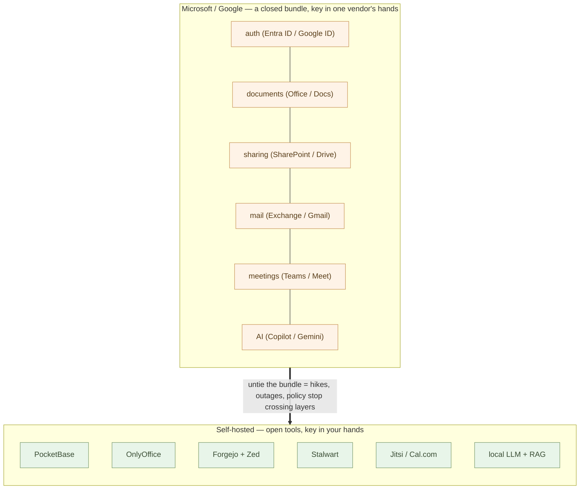
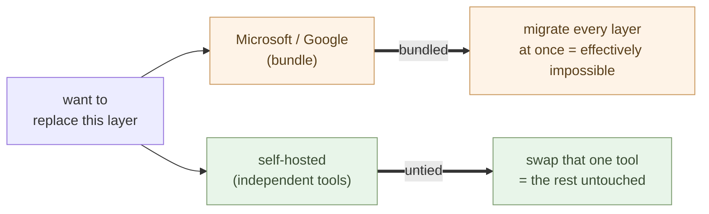
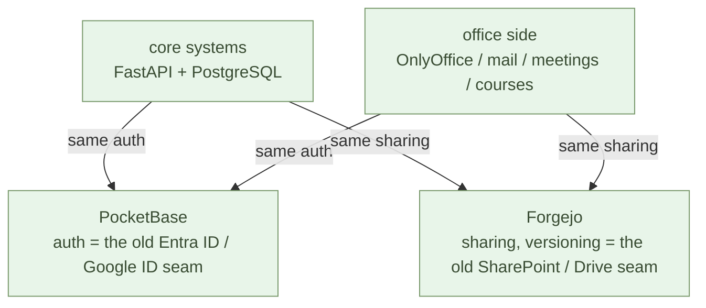

# Becoming Independent from Microsoft and Google — The Whole Map

**The problem with Microsoft 365 and Google Workspace is that the layers are
closed, and that the key (identity) is concentrated in one vendor's hands.**
The bundle is the amplifier that spreads both across every layer.

The Introduction part moved embedded logic out into Python and made core
logic something you could write yourself. The Independence part widens that
hands-on power to the **whole company** — it unties identity, documents,
sharing, mail, meetings, web, data, and AI from a single contract and puts
them back on your side. **From here it is not "writing code" but "standing
up the foundation" — the power to build reaches the company's IT
foundation itself.**

There is one thing to do: **untie the closed bundle into open tools, and move
the key into your own hands.** And the force that does the opening is AI — it
opens the Office suite and the core business systems the same way. This chapter
is the **map.** It lays out, up front, what each layer maps to and which
chapter stands it up.

## The lock-in is closedness, and someone else's key

Microsoft 365 is convenient because login (Entra ID) connects straight into
documents (Office), documents into sharing (SharePoint), sharing into mail
(Exchange), and AI (Copilot) into all of them — **all on one account, in one
straight line.**

Google Workspace has exactly the same shape. **A Google ID connects straight
into Gmail, into Drive, into Meet, into Gemini.** Only the names differ; the
binding is identical — one account, with documents, mail, meetings, and AI all
chained together inside one vendor.

Be precise here. **Bundling, by itself, is not the sin.** Tools do work
*because* they connect — the stack this Independence part stands up also
gathers authentication behind one gate and joins its tools together. A bundle
turns dangerous when what is bundled has two properties.

**First, it is closed.** The formats are proprietary, the code is unreadable,
the data sits in someone else's cloud. You cannot verify what happens inside,
and you cannot carry it all out. An open bundle can always be untied — a
closed bundle has its exits sealed.

**Second, the key is in someone else's hands.** Every layer hangs from one
gate: Entra ID / Google ID. To touch a document or read your mail, you pass
through another's door first. Whoever holds the key holds the pricing, the
policy, and the life and death of your account.

Nor is this structure unique to the Office suite. **The core business systems
stand the same way** — the code is unreadable and the specs undocumented
(closed); the understanding and the maintenance sit with the SIer (someone
else's key). On both sides of the company's information base — office and core —
closed things have hung from other people's keys.

And the bundle **amplifies both across every layer.**

- A price hike hits **every layer** at once — nowhere to escape
- A data-policy change hits **every layer** at once
- One vendor's outage stops **every layer** at once (the prologue's single point of failure)
- Close the gate, and you are locked out of **every layer at the same time**
- The vendor AI's judgment (Copilot / Gemini) seeps into **every layer**

> Being bundled is not what makes it dangerous.
> **A closed bundle, hanging from someone else's key** — that is the lock-in.

So the way out follows. Split each layer into an **open tool,** and move the
**key into your own hands.** Open means you can verify and carry out; your key
means you cannot be locked out. And once untied, each layer can be replaced on
its own — if one falls, the others keep running. This is the parent series'
2-13 "one + AI" at the scale of the company: **autonomous N beats
centralized 1.**

## Opening what is closed — that is AI's role

Why does it come apart *now*? Closedness worked as a rampart only because
**the cost of opening was too high for humans.** Reverse-engineer a proprietary
format. Read code no one can read. Reconstruct undocumented business logic —
each a multi-year, multi-million job, which is why "don't touch what's
working" stayed correct for so long.

AI crushes exactly that cost.

- **It opens proprietary formats** — OnlyOffice reads and writes the Office /
  Docs formats as-is (2-05), and AI externalizes the embedded macros and logic
  into Python (the Introduction part; the parent series' Chapter 2)
- **It opens unreadable code** — a local LLM reads the legacy core's code,
  SQL, and procedure manuals and extracts the business knowledge into Markdown
  (2-09, 2-11)
- **It opens imprisoned knowledge** — paper, images, and tacit know-how become
  structured information through OCR and dialogue (2-10)

The Office suite and the core systems stand on the same structure — a closed
bundle hanging from someone else's key — and AI opens both with the same
operations. Read, extract, translate. What AI does best is, precisely, **the
work of unlocking.**

> Closedness was a rampart only while opening cost too much.
> AI crushed that cost — **what is closed can simply be made to open.**

The same goes for the key. What kept the key out of your hands was that an
ordinary company had no way to stand up and operate its own gatekeeper
(an identity base). That operation, too, now has AI as a partner (see "one
person + AI" below). **The power to open what is closed, and the power to hold
the key — AI returned both to your own hands.** That is why the Independence
part can be written now.

## Vendors will not open themselves — so grow open tools at AI speed

If Microsoft and Google offered their suites as open components — open the
formats, hand back the key, make each layer swappable — company IT would become
easy overnight. The same if the SIer delivered its work as readable code and
documents.

It will not happen. **Being closed and holding the key IS the business.** To
open up would be to fill in their own moat (the structure in which lock-in is
itself the product is covered in detail in 3-04). The road that waits on a
vendor's goodwill is structurally closed.

So the road runs the other way: **grow the open tools, at AI speed.** AI's role
is not only to open what is closed — it runs fastest when **growing what is
already open.** OSS exposes its code and its specs, so the AI you bring along
can simply become a developer on it. A missing feature gets written with AI; a
habit that doesn't fit your business gets fixed with AI. What used to be OSS's
weakness — "if it itches, you scratch it yourself" — became, the moment AI
joined as a partner, **the fastest path of improvement.**

With closed tools, that path is walled off. Bring your AI along and it still
cannot touch the insides — you file a request and wait on the vendor's roadmap.
The gap between open and closed tools did not narrow when AI arrived. **It will
keep widening, at AI speed.**

Reality is moving in the opposite direction. The vendors are embedding AI not
as a tool that opens, but as **a tool that re-tightens the bundle** — the
vendor AI sits on top of the stack, stitches the closed layers together
through itself, and removes one more reason to untie. And much of the existing
IT profession flows the same way: proposing vendor AI on top of the familiar
closed stack is the path of least friction. **The opening move does not come
from the inside.**

How wrong this move is comes into focus once you correct one analogy. AI is
usually likened to the industrial revolution — machines replacing labor. But
when the question is **where AI belongs**, the right precedent is an
**information revolution — the same kind as movable-type printing.** The
printing press was not a convenient feature added to the scriptorium. It stood
alone as a **new infrastructure** for handling text, and the existing flow of
information reorganized itself on top of it. Nobody set a press in the corner
of a copying workshop and called it faster manuscripts. The OS and the office
suite are **infrastructure** — where information sits and moves. And AI is
**another, separate infrastructure** — the one that reads, transforms, and
produces information. Vendor built-in AI embeds one infrastructure inside
another as a feature — **a demotion of the new infrastructure to an accessory
of the old.** Separate infrastructure stands separately, reachable from every
tool. That is why this part of the series stands AI outside the bundle, not
inside it — and last (2-11). That placement is a consequence of this reading.

The reading has a sequel. Movable-type printing had a **preparatory stage** of
its own — paper spread, and manuscripts spent centuries accumulating text.
What the press detonated was that accumulation. In the same relation, **the
decades called the "IT revolution" were the preparatory stage of the AI
revolution** (the "completion" of 1-01, restated from the AI revolution's
side). And the preparatory stage's greatest legacy is not the closed suites —
it is **OSS, the open commons of code and knowledge.** The new infrastructure
runs fastest on exactly this open accumulation. Which makes "grow the open
tools at AI speed" not a detour but **the main current.** Seen this way, the
treatment the IT industry gives AI — a press set in the corner of the
scriptorium — also explains itself: the custodians of the preparatory stage
trying to fit the next revolution into a corner of their own workshop, the
usual reflex.

One more waste deserves naming. Having AI write code on the spot, from
nothing, pile upon pile — live coding alone only **reinvents the world's
average software at premium compute.** The thinner the structure you hand
AI, the more its output converges on the average. There is one use that
compounds: **stand proven open tools as the base, and write only the missing
difference with AI** (the OSS-first move of 1-05).

> You don't need to wait for the vendors to open up — and the opening move
> won't come from the inside.
> **Grow the open tools, at AI speed.**

## The map — dissolving Microsoft and Google into independent OSS

Untie the bundle and the layers of Microsoft 365 and Google Workspace land on
the same independent OSS. **Replace the two left columns with the same right.**

| Microsoft 365 | Google Workspace | Self-hosted (OSS) | Chapter |
| --- | --- | --- | --- |
| **Entra ID** | **Google ID / Cloud Identity** | **PocketBase** | [2-03](/ai-native-ways/software/auth/) |
| **Word / Excel / PowerPoint** | **Docs / Sheets / Slides** | **OnlyOffice** | [2-05](/ai-native-ways/software/documents/) |
| **SharePoint + GitHub** | **Drive** | **Forgejo + Zed** | [2-04](/ai-native-ways/software/code/) |
| **Exchange / Outlook** | **Gmail** | **Stalwart** | [2-06](/ai-native-ways/software/mail/) |
| **Teams / Bookings** | **Google Meet / Calendar** | **Jitsi / Cal.com** (BigBlueButton for courses) | [2-07](/ai-native-ways/software/meetings/) |
| **Power Pages** | **Google Sites** | **Cloudflare Pages** | [2-08](/ai-native-ways/software/web/) |
| **Azure SQL** | **Cloud SQL / BigQuery** | **PostgreSQL / SQLite** | [2-02](/ai-native-ways/software/foundation/) |
| **Power BI / Excel** | **Looker / Sheets** | **DuckDB + Polars** | [2-02](/ai-native-ways/software/foundation/) |
| **(Power Apps etc.)** | **Apps Script** | **FastAPI** | [2-09](/ai-native-ways/software/fastapi/) |
| **Copilot** | **Gemini** | **local LLM (Command A+ etc.) + RAG** | [2-11](/ai-native-ways/software/ai/) |

The tools on the right are **separate open tools built by separate
organizations.** You can read inside them, the formats are open, and the data
can be carried anywhere. So one vendor's decision can't ripple into the others,
and swapping any one for something else changes nothing around it. **Open, with
the key in your own hands** — that is the point; the untied bundle is its
consequence.

This chapter is the map. **It includes no build steps** — the docker, config,
and migration for each layer live in that layer's own chapter. Here we fix only
which layer maps to which, and in what order they untie. Microsoft or Google,
the destination is the same — so whichever suite holds you, the road ahead
merges into one. And what each chapter fixes is **the method, not an
exhaustive command list** — ask the AI for the fine steps each time you work.
That is also why the Google-side specifics (Gmail, Drive) look thin: when the
method is the same, the AI fills in the details. Fattening the manual is
itself the old common sense.

## What changes — cost and independence

Untie it yourself and the monthly structure changes. Microsoft 365 and Google
Workspace both bill **per seat × month** (roughly $8–20 per seat, plus several
dollars more once you add the vendor AI) — it grows linearly as you add people.
A full self-hosted set is the **fixed cost of one server** (a VPS at a few
dollars a month, or the electricity for an in-house mini PC) — it barely grows
as you add people.

But cost is not the point. The point is that **it is open, and the key is in
your own hands.**

- No one else holds life-and-death power over your entrance (auth)
- One vendor raises prices — replace only that one layer
- One vendor has an outage — the other layers keep running
- One vendor changes its data policy — the effect stays inside that layer
- The AI's judgment is something the company chooses

## In what order to untie

You don't have to do it all at once. Go **in order of what is easiest to pull
out of the bundle,** one at a time. The Independence part is structured in
exactly that order.

1. **Data layer** (2-02) — PostgreSQL, SQLite, DuckDB. Analysis, RAG,
   scheduling, and the core systems all sit on this. So it goes first
2. **Auth** (2-03) — PocketBase. The shared gate for every app. Move this
   to your side and the root of the bundle is cut
3. **Sharing and versioning** (2-04) — Forgejo + Zed. Folds in SharePoint
   / Drive
4. **Documents** (2-05) — OnlyOffice. Reads and writes Office / Docs
   formats as-is
5. **Mail** (2-06) — Stalwart. Keep the contents of your communication on
   your own disk
6. **Meetings and scheduling** (2-07) — Jitsi, Cal.com. Meetings and online
   courses on your own side
7. **Web publishing** (2-08) — Cloudflare Pages. Hosting with no lock-in
8. **Core logic** (2-09) — FastAPI. Turn Power Apps / Apps Script back into
   readable code
9. **Prepare the information** (2-10) — OCR, classification, codifying tacit
   knowledge. Before you put AI on it, build information worth putting it on —
   preparation is the main body, AI the last move
10. **AI** (2-11) — local LLM + RAG. Hold AI without your data leaving the
   building

Run each step in **parallel**, the way the 2-09 describes.
Don't stop the old (Microsoft / Google) — run the new alongside it, confirm the
same work flows through, and only then cancel the old. **Time it to the renewal
date** — that, too, follows the 2-09.

> You don't need to switch all at once.
> **Each layer you untie loosens the bundle a little more** — one at a time, at
> your own pace.

## Operating it — one person + AI

The obvious question arises — **with this much self-hosted, who maintains it?**
The answer is **one person + AI.** The new unit of work shown in the parent
series' 2-13 "one + AI" applies directly to running the company's
infrastructure.

Why does one person suffice? Three reasons.

- **Every piece is a standard, boxed open tool** — PocketBase is one file, the
  rest are one docker compose file each. Claude writes the compose, sets up DNS
  and DKIM, reads the logs, and isolates the fault. **Your operations partner is
  the AI.**
- **Because the bundle is untied, faults don't cascade** — with a suite, one
  vendor's trouble drags everything down; here, mail lives even if Forgejo falls,
  and meetings continue even if the AI stops. **Fix them one at a time,
  independently.**
- **Visible, readable, testable** — config and logs are in your own hands.
  Unlike a black-box vendor AI, you can **read inside and fix it, together with
  the AI.**

Honestly, the heavy parts too. **Operational load concentrates in two places —
mail and the course server (BigBlueButton).** Mail delivery (DKIM / SPF /
reputation) is delicate, so you can offload just the outbound to an external
relay. The course server is heavy, so **stand it up only for the duration of a
course and tear it down after.** The rest you can mostly leave alone once it's
up — and "the rest of operations" — backup, monitoring, updates, failure —
need not be written in the idiom of the old operations manual. The premise has
changed here too.

**Protect only the data and the specification.** The implementation and the
environment can be rebuilt at any time by AI, from the spec and the OSS
(2-09). So replicate only what cannot be regenerated — the databases, the
files (xattr permissions included), the mail, the business rules in Markdown —
daily, to another box. That is all. Restore testing is not a ritual either:
ask the AI to "rebuild everything on a blank box from the spec and the
backup," and that *is* the restore test.

**Monitoring needs nothing more than readable logs.** Standing up a separate
monitoring stack is the old common sense. The logs are all in your hands (the
third reason above); liveness checks and notifications are a few dozen lines
the AI writes, and log anomalies are something the AI reads. **Updates, too,
are deliberate acts** — when you raise a version, have the AI read the release
notes and verify alongside, parallel-run style (2-09), before switching. Things
don't get upgraded on you; you upgrade them. Secrets (passwords, keys) live in
an environment file and never leave the box — write that one line of policy
first.

**Availability is taken by speed of rebuild, not by redundancy.** If the box
dies, rebuild on a spare from the spec and the backup. When recovery runs at
AI speed, you don't need a cluster. Concentrating on one box is fine precisely
because the box is disposable and the assets — data and spec — are replicated.

> Protect only the data and the spec.
> **The box and the implementation can always be rebuilt** — the
> non-functional requirements collapse into a few lines of instructions to AI.

As for the floor under the box — installing the OS, SSH, the basics of
defense, protecting the data — the
[Learning Debian with Claude, Server Edition](/claude-debian/server/) *is* the
floor's specification. Here too, the generic is handled by reference.

This is the very thesis of the parent series' 2-13. **You don't need a
siloed IT department.** One person who understands the business holds, with the
AI as partner, everything from auth to mail, meetings, AI, and the database.
**Individual independence holds at the level of company infrastructure.**

> One person + AI operates this whole set of open tools.
> Compared with handing the suite to one vendor, **the effort is the same — only
> the control moves to your side.**

## And on to the core systems

What you've assembled becomes, directly, the **foundation for rewriting the core
systems.** The parallel-run rewrite the 2-09 describes
actually **assumed a place to stand (a platform)** — and that place is fully in
place by the end of the Independence part.

- **The DB the new core runs on** — PostgreSQL + pgvector (2-02)
- **The runtime** — FastAPI / Python + a Rust layer beneath (2-09)
- **Versioning and CI** — Forgejo (2-04)
- **Auth** — PocketBase takes on login for the new system, all in one place
  (2-03)
- **Extracting business logic** — read legacy code, SQL, and procedure manuals
  with a **local LLM + RAG** (2-11) and emit Markdown — **without the
  source ever leaving the building**

In fact, all the core systems and Microsoft / Google ever shared were **just two
things — auth (Entra ID / Google ID) and document sharing (SharePoint /
Drive).** The world of business systems and the world of the office are mostly
separate by nature, joined only at those two seams.

Those two are replaced, in the Independence part, with **PocketBase and
Forgejo.** That means **the seams are already on your side.** The new core
system authenticates with the same PocketBase as the office side and shares
documents and versions through the same Forgejo — and the two worlds meet again
at a single point, with no vendor in between.

The two seams are not the same weight. **Sharing is a place to put things; auth
is the key.** A place to put documents can be moved later, any number of times.
But auth is the single point from which every app, login, and permission in both
worlds hangs — as long as that is held by someone else, no matter what you
self-host, **the entrance belongs to another.**

So the move that really tells in the Independence part is **auth → PocketBase**
(2-03). The moment you move the seam of identity to your side, both the core
and the office **authenticate against your own gate.** It is exactly here that
Microsoft and Google try to dig in deepest — because **identity is the root of
the bundle.** Hold this, and the rest is a matter of time.

To be clear: PocketBase also concentrates authentication at a single point.
The concentration itself cannot be removed — everything is convenient *because*
every app uses the same gate, and that holds for the self-hosted stack too. The
difference is two things only. **The key is in your own hands. And because it
is open, it can be replaced at any time.** Back to the anatomy at the top:
concentration was never the problem — **closed concentration, in someone else's
hands, was.**

> The foundation built in the Independence part is also the foundation for
> dissolving the core systems.
> Once the platform is on your side, replacement is only "one more step."

## In the AI-native era, rebuilding becomes the default

Finally, step back one notch. Rewriting the Microsoft or Google suite is **not a
special decision.** In the AI-native era, **rebuilding becomes the default.**

Two reasons interlock.

**First — the suites are structurally "anti-AI-native."** They lock content into
Office / Docs formats, imprison data in the cloud, and wire the vendor AI
directly into work with no verification layer. None of this is accidental — it
is **a design that keeps content away from where AI can reach it: plain text,
open formats, local execution, readable code.** The more you try to make AI a
colleague, the harder you hit this wall.

**Second — the cost of rewriting has fallen by a factor of ten** (2-09). The AI extracts the business logic, translates it to Python, and
writes the tests. A multi-year, multi-million project becomes a few months for
one person on the ground + AI.

The old structure **doesn't fit AI-native,** and rebuilding is **cheap** — when
those two overlap, the conclusion is one. **Keeping it becomes the unnatural
choice.** "Don't touch what's working" was once correct only because rewriting
was too expensive. Now that the premise is gone, **it is the reason *not* to
rebuild that needs explaining.**

This is not hostility toward Microsoft or Google. It is the natural turn in which
the AI revolution **rebuilds and inherits** what the IT revolution stacked up
(the prologue; the parent series' 2-13). The question is not "whether" but
"when, and led by whom." **Leave it with the vendor, or rebuild it on your own
side** — that is all.

> In the AI-native era, rebuilding the suite is not a revolution.
> **It is a routine update.**

## Reference implementation — aiseed-migration-kit

This way of untying the bundle exists as a toolkit: the public repo
**aiseed-migration-kit**
([`aiseed-dev/aiseed-migration-kit`](https://github.com/aiseed-dev/aiseed-migration-kit)).
It carries the static-site migration pipeline (ingest → classify → Markdown →
build → publish) and the form-sheet method for inquiries (no web form: an xlsx
sheet plus mail intake, machine-readable), as a CLI plus a design document.
The DESIGN.md holds this chapter's mapping table with its reasoning — identity,
boundaries, placement — so you can read it first and then fit it to your own
organization. The document-side reference is kura (2-05); the
business-system-side examples are seminar-kit and mfg-kit (2-09). Every design
put into words in these chapters can be checked in code.

## Summary

Business Microsoft 365 and Google Workspace are SaaS suites that bundle closed
layers into one vendor and hang all of them from a single key (identity). The
core business systems have stood the same way. The danger was never the
bundling — it was a closed bundle hanging from someone else's key. And opening
what is closed is AI's role. The Independence part, working with AI, unties
that bundle, layer by layer, into open OSS and moves the key to your side —
and the two suites land on the same right-hand side.

- **Auth**: Entra ID / Google ID → **PocketBase** (2-03)
- **Documents**: Office / Docs → **OnlyOffice** (2-05)
- **Sharing, versioning**: SharePoint+GitHub / Drive → **Forgejo + Zed** (2-04)
- **Mail**: Exchange / Gmail → **Stalwart** (2-06)
- **Meetings, scheduling**: Teams / Meet → **Jitsi / Cal.com** (2-07)
- **Web publishing**: Power Pages / Sites → **Cloudflare Pages** (2-08)
- **Data layer**: Azure SQL / Cloud SQL → **PostgreSQL / SQLite** (2-02)
- **Data analysis**: Power BI / Looker → **DuckDB + Polars** (2-02)
- **Core logic**: Power Apps / Apps Script → **FastAPI** (2-09)
- **AI**: Copilot / Gemini → **local LLM + RAG** (2-11)

One-to-one — replace the left with the right. The tools on the right are separate
open tools built by separate organizations — readable inside, portable out — so
**one vendor's decision can't ripple into the others.** This is not about
efficiency — it restates the parent series' 2-13 "one + AI" at the height of
the company's foundation. **Autonomous N beats centralized 1.**

Untie the closed bundle into open tools. Move the key into your own hands. The
force that opens — AI — is already at hand. One at a time, at your own pace.
With each layer untied, the company is that much less a vendor's hostage and
**that much more able to move on its own judgment.** The next chapter stands up
the first layer — the **data layer** everything sits on, on your own side.

---

## Related articles

- [2-02: Lay the Foundation — SQLite, PostgreSQL, pgvector, DuckDB, Polars](/ai-native-ways/software/foundation/)
- [2-05: Take Documents Back — OnlyOffice Docs on PocketBase](/en/ai-native-ways/software/documents/)
- [2-09: Build an API — Expose Core Logic with FastAPI](/en/ai-native-ways/software/fastapi/)
- [Structural Analysis 08: Subtracting the Enterprise IT Tax](/insights/enterprise-tax/)
- [Will You Still Keep Using Windows and Office?](/blog/windows-office-facts/)
