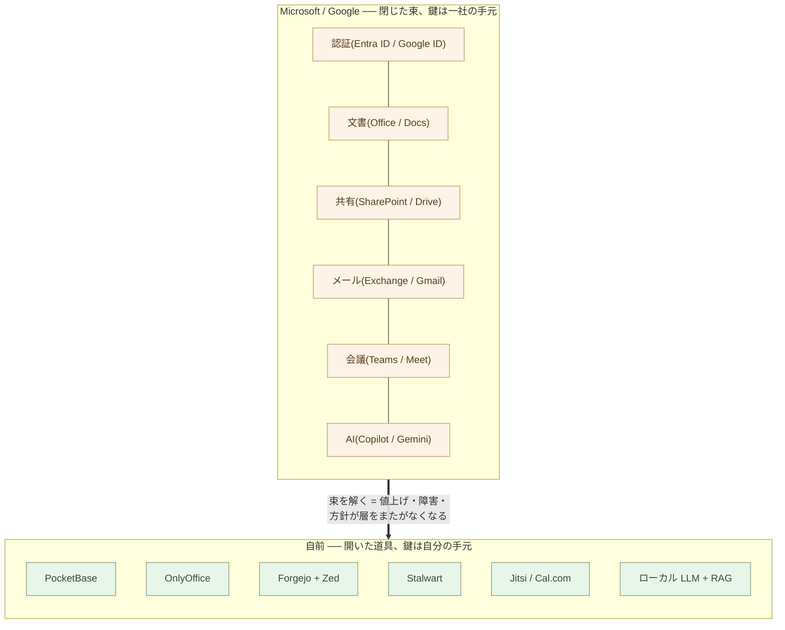
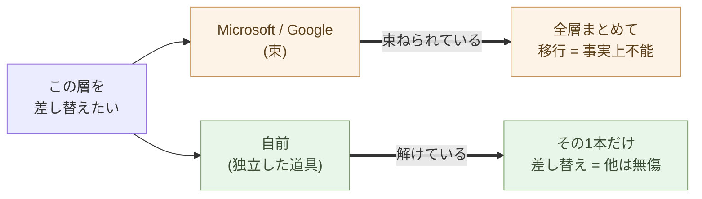
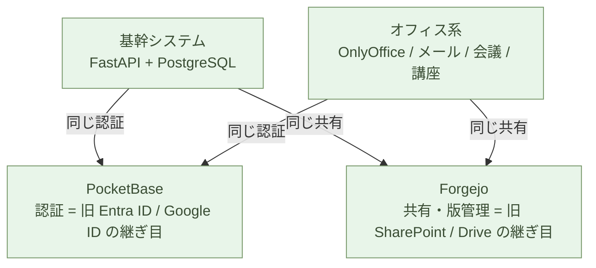

# Microsoft と Google から自立する ── 全体像と対応表

**Microsoft 365 と Google Workspace の問題は、中身が閉じていること、そして
鍵(認証)が一社の手元に集中していることだ**。束は、その二つを全層に広げる
増幅器である。

導入編で、組み込みを Python に外部化し、基幹ロジックを書けるようにした。
自立編は、その手元の力を **会社全体の土台** に広げる ── 認証・文書・共有・
メール・会議・Web・データ・AI が一社に束ねられた SaaS スイートを、契約から
解いて、自分の側に置き直す。**ここからは「コードを書く」ではなく「基盤を
立てる」── 開発の力が、会社の IT 基盤そのものに及ぶ**。

やることは一つ。**閉じた束を、開いた道具に解いて、鍵を自分の手元に移す**。
そして、その「開かせる」力こそ AI だ ── Office スイートも、業務システムも、
同じやり方で開く。この章はその **地図**だ。各層が何にどう対応し、どの章で
立てるかを、最初に一望する。

## ロックインの正体は、閉じていることと、他人の鍵だ

Microsoft 365 が便利なのは、ログイン(Entra ID)が文書(Office)に、文書が
共有(SharePoint)に、共有がメール(Exchange)に、そして全部に AI(Copilot)が、
**同じアカウントで一直線に繋がっている** からだ。

Google Workspace もまったく同じ構造だ。**Google ID が Gmail に、Drive に、
Meet に、Gemini に一直線に繋がる**。名前が違うだけで、束ね方は同じ ── 一つの
アカウントで、文書も、メールも、会議も、AI も、すべてが一社の中で連結している。

ここで正確に切り分ける。**束ねること自体は、罪ではない**。道具は繋がって
いるから仕事になるのであり、この自立編が立てるスタックも、認証を一つの門に
集め、道具同士を継いで使う。束が危険になるのは、束の中身が次の二つの性質を
持つときだ。

**第一に、閉じている**。書式は独自形式、コードは読めず、データは向こうの
クラウドにある。中で何が起きているかを検証できず、丸ごと持ち出すこともでき
ない。開いた束なら、いつでも解ける ── 閉じた束は、出口が塞がれている。

**第二に、鍵が他人の手元にある**。全層が Entra ID / Google ID という一つの
門にぶら下がる。文書に触るにも、メールを読むにも、まず他人の門を通る。鍵を
握る者は、価格も、ポリシーも、アカウントの生殺与奪も握る。

この構造は、Office スイートだけのものではない。**業務システム(基幹)も、
同じ立ち方をしている** ── コードは読めず、仕様は文書化されていない(閉)。
仕組みの理解と保守は SIer の手元にある(他人の鍵)。会社の情報基盤は、事務と
基幹の両側で、閉じたものが他人の鍵にぶら下がってきた。

そして束は、この二つを **全層に増幅する**。

- 値上げは **全層まとめて** 効く ── 逃げ場が無い
- データポリシーの変更は **全層まとめて** 効く
- 一社の障害は **全層まとめて** 止まる(序章の単一障害点)
- 門を閉じられれば、**全層から同時に** 締め出される
- ベンダー AI(Copilot / Gemini)の判断基準は **全層に** 浸透する

> 束ねられているから危険なのではない。
> **閉じた束が、他人の鍵にぶら下がっている** ── それがロックインの正体だ。

だから解き方も決まる。各層を **開いた道具** に分け、**鍵を自分の手元** に
移す。開いていれば検証でき、持ち出せる。鍵が手元にあれば、締め出されない。
そして解けた束は、一本ずつ置き換えられて、一本が倒れても他は動く。これは
親シリーズ2-13「1人+AI」と同じ、**自立した N は集中した 1 より強い** の、
会社版である。

## 閉じたものを開かせる ── それが AI の役割だ

なぜ、いまになって解けるのか。閉が防壁として機能してきたのは、**開くコストが
人間には高すぎた** からだ。独自形式を解析する。読めないコードを読み解く。
文書化されていない業務の仕組みを復元する ── どれも数年・数億円の仕事で、
だから「動いているものに触るな」が正解であり続けた。

AI は、まさにこのコストを潰す。

- **独自形式を開く** ── Office / Docs の書式は OnlyOffice がそのまま読み書き
  し(2-05)、埋め込まれたマクロやロジックは AI が Python に外部化する
  (導入編・親シリーズ第2章)
- **読めないコードを開く** ── レガシー基幹のコード・SQL・手順書を、ローカル
  LLM が読み解いて、Markdown の業務知識に取り出す(2-09・2-11)
- **閉じ込められた知識を開く** ── 紙・画像・属人知を、OCR と対話で構造化
  された情報に変える(2-10)

Office スイートも、業務システムも、同じ「閉じた束が他人の鍵にぶら下がる」
構造で立っている ── そして AI は、その両方の閉を同じ操作で開く。読む・
抽出する・翻訳する。AI が最も得意な操作は、そのまま **開錠の操作** である。

> 閉は、開くコストが高いあいだだけ、防壁だった。
> AI がそのコストを潰した ── **閉じたものは、開かせればいい**。

鍵も同じだ。これまで鍵を自分の手元に移せなかったのは、門番(認証基盤)を
自前で立てて運用する力が、普通の会社に無かったからだ。その運用も、AI が
相棒になった(後述「一人 + AI」)。**閉を開く力と、鍵を持つ力 ── 二つとも、
AI が自分の手に戻した**。だから自立編は、いま書ける。

## ベンダーは自分からは開かない ── だから、開いた道具を AI で育てる

もし Microsoft と Google が、スイートを開いた部品に分けて提供してくれたら ──
書式を開き、鍵を返し、層ごとに差し替え可能にしてくれたら ── 会社の IT は
一気に簡単になる。SIer が納品物を、読めるコードと文書で開いてくれても同じだ。

だが、それは起きない。**閉じていることと、鍵を握っていることが、商売の本体
だからだ**。開くことは、自らの堀を埋めることと同義になる(ロックインが商品
そのものである構造は 3-04 で詳述)。ベンダーの善意を待つ道は、構造的に
閉じている。

だから、進む道は逆側にある。**開いた道具を、AI の速度で育てる**。AI の役割は
「閉じたものを開かせる」だけではない ── **開いたものを育てる** ときにこそ、
最も速く回る。OSS はコードも仕様も開いているから、あなたの連れてきた AI が
そのまま開発者になれる。足りない機能は AI と書き足し、自社の業務に合わない
癖は AI と直す。かつて OSS の弱点だった「痒いところは自分で書くしかない」は、
AI が相棒になった瞬間、弱点ではなく **一番速い改善経路** に変わった。

閉じた道具では、この経路が塞がっている。あなたが AI を連れて行っても、
中身に触れない ── 要望を出して、ベンダーのロードマップを待つだけだ。開いた
道具と閉じた道具の差は、AI の登場で縮まったのではない。**AI の速度で、
これから開き続ける**。

現実は、むしろ逆方向に動いている。ベンダーは AI を、開く道具としてではなく
**束を締め直す道具** として組み込んでいる ── ベンダー AI は束の最上層に座り、
閉じた各層を AI ごしに縫い合わせ、解く理由をまた一つ消しにかかる。そして
既存の IT 関係者の多くも、同じ方向に流れる。使い慣れた閉じたスタックの上に
ベンダー AI を載せる提案が、いちばん摩擦が少ないからだ。**開く方向は、
内側からは出てこない**。

この動きの筋の悪さは、革命の見立てを一つ正すと、はっきり見える。AI は
よく産業革命 ── 機械が労働を置き換えた話 ── にたとえられる。だが、AI を
**どこに置くか** を考えるときの正しい先例は、**活版印刷と同じ「情報革命」**
のほうだ。活版印刷は、写本という既存の仕組みに足された便利な機能では
なかった。文字を扱う **新しいインフラ** として独立に立ち、既存の情報の
流れのほうが、その上で組み直された。写本工房の隅に印刷機を据えて「写本が
速くなった」と呼んだ者はいない。OS も Office スイートも、情報を置いて
動かす **インフラ** だ。そして AI は、情報を読み、変換し、作る **別の
インフラ** だ。ベンダーの組み込み AI とは、別のインフラを既存インフラの
一機能として埋め込むこと ── **新しいインフラを、旧いインフラの付属品に
格下げする倒錯** である。独立したインフラは、独立に立てて、どの道具から
も使えるようにする。自立編が AI を束の中ではなく外に、それも最後に
(2-11)据えるのは、この見立ての帰結だ。

見立てには、続きがある。活版印刷にも **前段** があった ── 紙が普及し、
写本が数世紀かけて文字を蓄えた。印刷機が爆発させたのは、その蓄積だ。
同じ関係で、**「IT 革命」と呼ばれた数十年は、AI 革命の前段だった**
(1-01 の「成就」を、AI 革命の側から言い直した読み方だ)。そして前段が
遺した最大の資産は、閉じたスイートではなく、**OSS ── 開いたコードと
知識の共有財** のほうだ。新しいインフラは、この開いた蓄積の上でこそ
最も速く回る。だから「開いた道具を AI の速度で育てる」は、迂回路では
なく **本流** である。そう見れば、IT 業界が AI に与えている扱い ──
写本工房の隅に印刷機を据える ── も説明がつく。前段の担い手が、次の
革命を自分の工房の一角に収めようとする、いつもの反応にすぎない。

もう一つの無駄遣いも、名指ししておく。何もないところから、AI にその場
その場でコードを書かせて積み上げる ── ライブコーディングだけでは、世の中の
**平均的なソフトウェアを、高い計算資源で再発明する** ことにしかならない。
AI の出力は、渡す構造が薄いほど平均に収束する。積み上がる使い方は一つだ ──
**実績ある開いた道具を土台に据え、足りない差分だけを AI と書く**(1-05 の
OSS ファースト)。

> ベンダーが開くのを待つ必要はない。内側から開く動きも来ない。
> **開いた道具を、AI の速度で育てればいい**。

## 対応表 ── Microsoft と Google を、独立した OSS に解く

束を解くと、Microsoft 365 と Google Workspace の各層は、同じ独立した OSS に
着地する。**左の二列を、同じ右に置き換える**。

| Microsoft 365 | Google Workspace | 自前(OSS) | 立てる章 |
| --- | --- | --- | --- |
| **Entra ID** | **Google ID / Cloud Identity** | **PocketBase** | [2-03](/ai-native-ways/software/auth/) |
| **Word / Excel / PowerPoint** | **Docs / Sheets / Slides** | **OnlyOffice** | [2-05](/ai-native-ways/software/documents/) |
| **SharePoint + GitHub** | **Drive** | **Forgejo + Zed** | [2-04](/ai-native-ways/software/code/) |
| **Exchange / Outlook** | **Gmail** | **Stalwart** | [2-06](/ai-native-ways/software/mail/) |
| **Teams / Bookings** | **Google Meet / Calendar** | **Jitsi・Cal.com**(講座は BigBlueButton) | [2-07](/ai-native-ways/software/meetings/) |
| **Power Pages** | **Google Sites** | **Cloudflare Pages** | [2-08](/ai-native-ways/software/web/) |
| **Azure SQL** | **Cloud SQL / BigQuery** | **PostgreSQL・SQLite** | [2-02](/ai-native-ways/software/foundation/) |
| **Power BI / Excel** | **Looker / Sheets** | **DuckDB + Polars** | [2-02](/ai-native-ways/software/foundation/) |
| **(Power Apps 等)** | **Apps Script** | **FastAPI** | [2-09](/ai-native-ways/software/fastapi/) |
| **Copilot** | **Gemini** | **ローカル LLM(Command A+ 等)+ RAG** | [2-11](/ai-native-ways/software/ai/) |

右側の道具は **別々の組織が作った、別々の開いた道具** だ。中が読めて、形式が
開いていて、データはどこへでも持ち出せる。だから、一本の方針変更が他に波及
せず、一本を別のものに差し替えても、残りは何も変わらない。**開いていて、鍵が
自分の手元にある** ── これが核心で、束が解けているのはその帰結だ。

この章は地図だ。**構築の手順は書かない** ── 各層の docker や設定や移行は、
それぞれの章にある。ここでは、どの層がどこに対応し、どの順で解けるかだけを
押さえる。Microsoft でも Google でも、置き換わる先は同じ ── だから、どちらの
スイートに縛られていても、進む道は一本に合流する。そして、各章が固定するのは
**方式であって、コマンドの網羅ではない** ── 手順の細部は、作業のたびに AI に
聞けばよい。Gmail や Google Drive 側の記述が薄く見えるのも同じ理由で、方式が
同じなら、細部は AI が埋める。手順書を厚くすることこそ、旧常識である。

## 何が変わるか ── コストと自立

自前に解くと、月額の構造が変わる。Microsoft 365 も Google Workspace も
**人数 × 月額**(一人あたり月 1,000〜2,500 円、ベンダー AI を足すとさらに
+数千円/人)── 人が増えるほど線形に増える。自前の道具一式は **サーバー一台分の
固定費**(VPS なら月 1,000〜数千円、社内 miniPC なら電気代)── 人が増えても、
ほぼ増えない。

しかし本質はコストではない。本質は、**開いていて、鍵が自分の手元にある**
ことだ。

- 入口(認証)の生殺与奪を、他人に握られない
- 一社が値上げしても、その一層だけ差し替えればいい
- 一社が障害を起こしても、他の層は動き続ける
- 一社がデータポリシーを変えても、影響はその層に閉じる
- AI の判断基準を、会社が選べる

## どの順で解くか

一気にやらなくていい。**束から外しやすい順** に、一本ずつ。自立編は、その
順番でそのまま章立てしてある。

1. **データ基盤**(2-02)── PostgreSQL・SQLite・DuckDB。分析も RAG も予約も
   基幹も、すべてこの上に乗る。だから最初に据える
2. **認証**(2-03)── PocketBase。全アプリ共通の門番。ここを自分の側に移すと、
   束の根が切れる
3. **共有と版管理**(2-04)── Forgejo + Zed。SharePoint / Drive を畳む
4. **文書**(2-05)── OnlyOffice。Office / Docs 形式をそのまま読み書きする
5. **メール**(2-06)── Stalwart。通信の中身を手元に置く
6. **会議・予約**(2-07)── Jitsi・Cal.com。会議とオンライン講座を自前で
7. **Web 公開**(2-08)── Cloudflare Pages。ロックインの無いホスト
8. **基幹ロジック**(2-09)── FastAPI。Power Apps / Apps Script を読める
   コードに戻す
9. **情報の整備**(2-10)── OCR・分類・属人知の成文化。AI に載せる前に、
   載せるに値する情報を作る ── 整備こそ本体、AI は最後の一手
10. **AI**(2-11)── ローカル LLM + RAG。データを社外に出さず AI を持つ

各ステップは、2-09の **並行稼働** で進める。旧(Microsoft / Google)を
止めず、横で新を動かし、同じ仕事が回ることを確かめてから、旧を解約する。
**契約更新の時期に間に合わせる** ── これも2-09どおりだ。

> 一気に乗り換える必要はない。
> **解けた分だけ、束が緩む** ── 一本ずつ、自分のペースで。

## 運用は、一人 + AI で回る

ここで当然の疑問が出る ── **これだけ自前で抱えて、誰が面倒を見るのか**。
答えは **一人 + AI** だ。親シリーズ第11章「1人+AI」で示した新しい仕事の単位が、
そのまま会社のインフラ運用に効く。

なぜ一人で回るのか。理由は三つ。

- **どれも標準的な、箱に入ったオープンな道具** ── PocketBase は1ファイル、
  ほかは docker compose 一枚。Claude が compose を書き、DNS と DKIM を整え、
  ログを読み、不調を切り分ける。**運用の相棒が AI** だ
- **束が解けているから、障害が連鎖しない** ── スイートなら一社の不調が全部を
  巻き込むが、ここでは Forgejo が落ちてもメールは生き、AI が止まっても会議は
  続く。**一個ずつ、独立に直せる**
- **見える・読める・テストできる** ── 設定もログも自分の手元にある。
  ブラックボックスのベンダー AI と違い、AI と一緒に **中を読んで直せる**

正直に、重いところも書く。**運用負荷が集中するのは2つ ── メールと講座
(BigBlueButton)** だ。メールは配送(DKIM / SPF / 評判)が繊細なので、送信
だけ外部リレーに逃がす手もある。講座サーバーは重いので、**講座の期間だけ立てて、
終わったら畳む**。残りは、立てたらほぼ放っておけるが、「残りの運用」──
バックアップ・監視・更新・障害 ── を、旧来の運用手順書の常識で書く必要は
ない。ここでも前提が変わっている。

**守るのは、データと仕様だけだ**。実装と環境は、仕様と OSS から AI がいつ
でも立て直せる(2-09)。だから複製するのは、再生成できないもの ──
データベース・ファイル(権限の xattr ごと)・メール・業務ルールの Markdown
── を、毎日、別の箱へ。それだけでいい。復旧の試験も、儀式ではない。
「まっさらな箱に、仕様とバックアップから全部立て直して」と AI に頼めば、
それがそのまま復旧試験になる。

**監視は、読めるログがあれば足りる**。監視基盤を別に立てるのは旧常識だ。
ログは全部手元にあり(前述の三つ目の理由)、死活確認と通知は AI が書く
数十行、ログの異常は AI に読ませる。**更新も、意図した操作として行う** ──
版を上げるときはリリースノートを AI に読ませ、2-09 の並行稼働の要領で横で
確かめてから切り替える。勝手に上がるのではなく、上げる。秘密(パスワード・
鍵)は環境ファイルに分離して、箱の外に出さない ── これだけは一行の決まり
として最初に書いておく。

**可用性は、冗長化ではなく、再構築の速さで受ける**。箱が壊れたら、予備の
箱に仕様とバックアップから立て直す。復旧が AI の速度なら、クラスタは
要らない。1台に集中してよいのは、箱が使い捨てで、資産(データと仕様)が
複製されているからだ。

> 守るのは、データと仕様だけ。
> **箱と実装は、いつでも立て直せる** ── 運用の非機能要件は、AI への
> 依頼文の数行に潰れる。

なお、箱そのものの床 ── OS の入れ方、SSH、守りの基本、データを守る ──
は、[「Claudeと一緒に学ぶDebian サーバー編」](/claude-debian/server/)が
そのまま床の仕様になる。ここでも、汎用は参照で済む。

これは親シリーズ第11章の主旨そのものだ。**縦割りの情報システム部門は要らない**。
業務を分かっている一人が、AI を相棒に、認証からメール、会議、AI、データベース
までを横断して持つ。**個人の自立が、会社のインフラのレベルで成立する**。

> これだけのオープンな道具を、一人 + AI が運用する。
> スイートを一社に預けるのと、**手間は変わらない ── 主導権だけが、自分の側に
> 移る**。

## そして、基幹システムへ

ここまで組んだものは、そのまま **基幹システムを書き換える土台** になる。
2-09「API を作る」で説く並行稼働の書き換えは、実は
**立つ場所(プラットフォーム)を前提にしていた** ── その場所が、自立編で全部
そろう。

- **新しい基幹システムが動く DB** ── PostgreSQL + pgvector(2-02)
- **実行系** ── FastAPI / Python + Rust 下層(2-09)
- **版管理と CI** ── Forgejo(2-04)
- **認証** ── PocketBase が、新システムのログインを一手に引き受ける(2-03)
- **業務ロジックの抽出** ── レガシーのコード・SQL・手順書を、**ローカル LLM +
  RAG**(2-11)で読み解いて Markdown に出す ── **ソースを一歩も社外に出さずに**

そもそも、これまで **基幹システムと Microsoft / Google が共有していたのは、
たった二つ ── 認証(Entra ID / Google ID)と、文書共有(SharePoint / Drive)
だけ** だった。業務システムの世界とオフィスの世界は本来ほとんど別物で、この
二つの継ぎ目だけで繋がっていた。

その二つは、自立編で **PocketBase と Forgejo** に置き換える。つまり **継ぎ目は、
もう自分の側にある**。新しい基幹システムは、オフィス系と同じ PocketBase で
認証し、同じ Forgejo で文書と版を共有する ── ベンダーを介さずに、二つの世界が
再び一点で出会う。

二つの継ぎ目は、同じ重さではない。**共有は「置き場所」、認証は「鍵」だ**。
文書の置き場所は後からいくらでも動かせる。だが認証は、両方の世界のすべての
アプリ・ログイン・権限がぶら下がる一点 ── ここを握られている限り、何を自前に
しても **入口は他人のもの** だ。

だから、自立編で本当に効く一手は **認証 → PocketBase**(2-03)だ。識別の継ぎ目を
自分の側に移した瞬間、基幹もオフィスも **自分の門番に対して認証する**。Microsoft も
Google も最も深く食い込ませようとするのは、ここ ── **ID 基盤こそ、束の根** だからだ。
ここを押さえれば、残りは時間の問題になる。

念のため言えば、PocketBase もまた、認証を一点に集める。集中そのものは消せない ──
全アプリが同じ門を使うから便利なのであり、それは自前でも変わらない。違いは
二つだけだ。**鍵が自分の手元にあること。そして開いているから、いつでも差し替え
られること**。冒頭の解剖に戻れば、集中が問題なのではない ── **閉じた集中が、
他人の手元にあること** が問題だったのだ。

> 自立編で作った土台は、**基幹システムを解く土台でもある**。
> 一度プラットフォームを自分の側に持てば、置き換えは「もう一段」でしかない。

## AI ネイティブの時代には、作り直しが当然になる

最後に、一段引いて見る。Microsoft や Google のスイートを書き換えるのは、**特別な
決断ではない**。AI ネイティブの時代には、**作り直しのほうが当然** になる。

理由は二つが噛み合っている。

**一つ目 ── スイートの作りは、構造的に「反 AI ネイティブ」だ**。中身を Office / Docs の
書式に閉じ込め、データをクラウドに幽閉し、ベンダー AI を検証層なしで業務に
直結する。これらは偶然ではない ── **AI が触れる場所(素のテキスト・開いた形式・
手元実行・読めるコード)から、中身を遠ざける設計** だ。AI を同僚にしようとする
ほど、この壁にぶつかる。

**二つ目 ── 書き換えのコストが、10 分の 1 になった**(2-09)。AI が
業務ロジックを抽出し、Python に翻訳し、テストを書く。数年・数億円のプロジェクトが、
現場の一人 + AI の数ヶ月になった。

古い構造が **AI ネイティブと噛み合わず**、しかも作り直しが **安い** ── この二つが
重なれば、結論は一つだ。**残すほうが不自然** になる。かつて「動いているものに
触るな」が正解だったのは、書き換えが高すぎたからにすぎない。その前提が消えた今、
**作り直さない理由のほうが、説明を要する**。

これは Microsoft や Google への敵意ではない。IT 革命が積み上げたものを、AI 革命が
**作り直して引き継ぐ** ── その自然な一巡だ(序章・親シリーズ第11章)。問われて
いるのは「やるか」ではなく「いつ、誰が主導でやるか」。**ベンダーに預けたままに
するか、自分の側で作り直すか** ── それだけだ。

> AI ネイティブの時代に、スイートを作り直すのは、革命ではない。
> **当然の更新だ**。

## 参考実装 ── aiseed-migration-kit

この解き方を道具一式にしたのが、公開リポジトリ **aiseed-migration-kit**
([`aiseed-dev/aiseed-migration-kit`](https://github.com/aiseed-dev/aiseed-migration-kit))だ。
公開 Web の静的化(取り込み → 分類 → Markdown 化 → 生成 → 配信)と、
問い合わせの様式方式(Web フォームを作らず、xlsx 様式+メール受付で機械可読に
受ける)を、CLI 一式と設計書で持つ。設計書(DESIGN.md)には本章の対応表が、
認証・境界・配置の理由づけごと書いてある ── 読んでから、自分の組織に
当てはめられる。文書側の参考実装は kura(2-05)、業務システム側の実例は
seminar-kit(2-09)。章で言葉にした設計は、どれもコードで確かめられる。

## まとめ

ビジネス用の Microsoft 365 と Google Workspace は、閉じた層を一社に束ね、
その全部を一つの鍵(認証)にぶら下げた SaaS スイートだ。業務システムも、
同じ構造で立ってきた。危険なのは束ねられていることではない ── 閉じた束が、
他人の鍵にぶら下がっていることだ。そして、その閉を開かせることが AI の
役割である。自立編は、AI と一緒にこの束を一層ずつ開いた OSS に解き、鍵を
自分の手元に移す ── 二つのスイートが、同じ右側に着地する。

- **認証**:Entra ID / Google ID → **PocketBase**(2-03)
- **文書**:Office / Docs → **OnlyOffice**(2-05)
- **共有・版管理**:SharePoint+GitHub / Drive → **Forgejo + Zed**(2-04)
- **メール**:Exchange / Gmail → **Stalwart**(2-06)
- **会議・予約**:Teams / Meet → **Jitsi・Cal.com**(2-07)
- **Web 公開**:Power Pages / Sites → **Cloudflare Pages**(2-08)
- **データ基盤**:Azure SQL / Cloud SQL → **PostgreSQL・SQLite**(2-02)
- **データ分析**:Power BI / Looker → **DuckDB + Polars**(2-02)
- **基幹ロジック**:Power Apps / Apps Script → **FastAPI**(2-09)
- **AI**:Copilot / Gemini → **ローカル LLM + RAG**(2-11)

一対一で、左を右に置き換える。右の道具は別々の組織が作った別々の開いた道具
だから、中が読めて、持ち出せて、**一本の方針変更が他に波及しない**。これは
効率化の話ではない ── 親シリーズ2-13「1人+AI」を、会社の土台の高さで言い直した
ものだ。**集中した 1 より、自立した N が強い**。

閉じた束を、開いた道具に解く。鍵を、自分の手元に。開かせる力(AI)は、もう
手元にある。一本ずつ、自分のペースで。解けた分だけ、会社はベンダーの人質では
なくなり、**自分たちの判断で動けるようになる**。次の章では、その一本目 ──
すべてが乗る **データ基盤** を、自分の側に立てる。

---

## 関連記事

- [2-02: 土台を据える ── SQLite・PostgreSQL・pgvector・DuckDB・Polars](/ai-native-ways/software/foundation/)
- [2-05: 文書を取り戻す ── OnlyOffice Docs を PocketBase に組み込む](/ai-native-ways/software/documents/)
- [2-09: API を作る ── FastAPI で基幹のロジックを出す](/ai-native-ways/software/fastapi/)
- [構造分析08: 企業ITの税を引く](/insights/enterprise-tax/)
- [それでも Windows と Office を使い続けますか?](/blog/windows-office-facts/)
