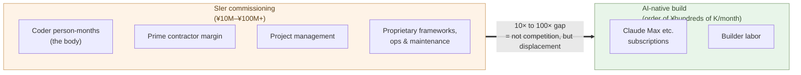

# The Order-of-Magnitude Price Gap

**SIer commissioning runs at tens of millions to hundreds of millions
of yen. AI-native development runs at the order of hundreds of
thousands of yen per month. The 10× to 100× gap is no longer
competition — it is market displacement**.

Chapter 6 showed that the SIer commission model has reached the level
where "with the same effort, you can build it yourself." This chapter
takes the next question — not effort, but **money** — and lines the
two up directly.

The conclusion up front. **The gap between SIer commissioning and
AI-native development runs at 10× to 100×**. This chapter walks
through the basis for that number and what it means.

## Quote the same scope, both ways

Use a concrete quote. A mid-size business system — customer master,
order processing, invoicing, a dashboard, SaaS-shaped, scope is
defined, users in the hundreds to a few thousand.

**SIer commissioning, market range**:

- Requirements + basic design: a few million to ten-plus million yen
- Development (6–12 months, several coders): tens of millions to over
  a hundred million yen
- Operations and maintenance (annual): a few million to ten-plus
  million yen
- Multi-year contract total: **on the order of hundreds of millions
  of yen**

"Tens of millions for a mid-size system" is the standard range in
Japan's SIer industry. This is not a special case.

**AI-native build, the same scope**:

- Tooling: Claude Max (¥30,000/mo) plus other tools, ¥50–100K/mo
- Builder labor (1 person × a few months): a few million yen
- Operations and maintenance (1 person, ongoing): hundreds of thousands
  per month
- Total at the same scope: **a few million to ten million yen**

**The gap is 10× to 100×**. Depending on scope it falls at the
narrower or wider end, but it is always **an order of magnitude or
more**.

## 10× to 100× is not competition; it is market displacement

The meaning of a price gap differs **qualitatively** with order of
magnitude.

- **1.2×** — price competition. Customers choose by service, track
  record, and relationship. Both providers coexist in the market.
- **2–3×** — hard competition. The cheaper side picks up customers,
  but the more expensive side still has reasons to keep some
  (trust, relationship, expertise).
- **10×** — structural advantage. Customers flow to the cheaper side
  unless there is a strong reason not to. The expensive side retreats
  to limited territory (the one-tenth of specialist work).
- **100×** — market displacement. Calling it the same market becomes
  meaningless. A different supply curve.

**A 10×–100× gap is not a competition story**. When pocket calculators
arrived at one-tenth the price of an abacus, abacus makers did not
"lose on price" — **the market itself moved** (Chapter 3). The same
structure is happening now, between the SIer industry and the software
development market.

What matters here is that **many customers will take time to notice
the order-of-magnitude difference**. Two reasons:

- The established sense of what things cost is deeply held — "no way
  this gets built for a few million yen"
- The option of "building it yourself" is not known, or not seriously
  evaluated

But once a customer has seen it, they cannot go back. **"What was
supposed to cost hundreds of millions of yen ran for a few million"**
— after that experience, SIer commissioning drops out of the option
set.

> 1.2× is competition. 2–3× is hard competition.
> **10× is structural advantage. 100× is market displacement**.
> Between SIer commissioning and AI-native development, the gap runs
> at the latter end of that scale.

## Japan has the widest price gap in the world

In Japan, the gap is **even wider**, for specific reasons.

- **The SIer industry is large** — a substantial share of IT spend
  flows through SIer commissioning. The in-house build ratio is low
  compared with other markets (especially the US).
- **Multi-tier subcontracting** — work flows from prime to tier-1,
  tier-2, tier-3 subcontractors, with margin stacked at each layer.
  By the time code is written, multiple intermediate layers have taken
  their cut (the structural details are covered in Chapter 10).
- **Weak yen against USD pricing** — AI tools are priced in USD;
  SIer labor is priced in JPY. Exchange-rate dynamics push the SIer
  rate up relatively, year after year.
- **Industry standard is the person-month** — pricing is negotiated
  as "unit rate × person-months," so productivity gains do not
  translate into price drops.

These stack up. **SIer commissioning prices in Japan run higher than
in the West**. AI-native development cost, on the other hand, is
common worldwide (same Claude, same GPT, same Cursor). The result:
**the price gap between SIer commissioning and AI-native development
in Japan is among the largest in the world**.

This is a threat and an opportunity at once. The larger the gap, the
larger the saving when a customer migrates to AI-native. For builders
or organizations who can offer AI-native development services in
Japan, the opportunity is greater than in Western markets.

> The wider the price gap, **the larger the saving on migration**.
> The opportunity in Japan is larger than in the West.

## Why SIers cannot follow on price

Restate the structural reasons from Chapter 6, in price terms.

The floor on SIer pricing is set by **their own payroll**. Coder
salaries, social insurance, office costs, management overhead — these
fix the bottom. However many times AI multiplies productivity, while
they still have to keep paying the people, prices cannot drop by an
order of magnitude.

On top of that, in the Japanese SIer model:

- The prime contractor adds margin and takes the order
- The subcontractor adds another margin on top
- For some engagements, four to five layers stack up

Each layer takes margin, so **the cost of one coder swells to several
times that amount by the time the customer is invoiced**. In an
AI-native build, none of these intermediate layers exist. The cost is
one builder's labor plus tooling.

> The SIer's price floor is determined by **how many payroll layers
> must keep being paid**. AI getting cheaper does not erase those
> layers.

## Customers with lock-in cannot move yet

Even a 10×–100× gap will not move every customer immediately.

- Customers **tied into existing operations contracts**
- Codebases **dependent on proprietary frameworks and abstraction
  layers**
- Organizations where **long-standing personal relationships** anchor
  decisions
- **Regulated industries** that include SIer track record as a
  requirement

These all function as **lock-in**. Even with an order-of-magnitude
price gap, migration cost is hard to see and the decision gets
deferred.

Lock-in strength differs case by case:

- **New projects** — no lock-in. The price gap acts directly.
- **Extensions to existing systems** — partial lock-in. Gradual
  migration.
- **Full replacement of core systems** — strong lock-in. Moves last.

What moves first is **new projects for new customers**. Next, **shallow
lock-in extensions**. **Core systems** come last. That ordering sets
the pace of the industry shift.

The structure of lock-in itself — where it comes from, how it
operates, why it is so durable — is covered in the next chapter.
**Palantir's FDE model** is dissected as the archetype.

## Where the next chapter goes

A 10× to 100× price gap does not, by itself, move the whole market
overnight. Lock-in is the inertia that holds the pace down. Where
does lock-in come from, and why is it strong?

The next chapter takes up the lock-in problem.

---

## Related articles

- [Chapter 5: Customers Co-Develop with AI](/en/ai-native-ways/software/customer-codev/)
- [Chapter 6: The Structural Uneconomy of the SIer Model](/en/ai-native-ways/software/sier-uneconomic/)
- [Structural analysis 08: Subtracting the enterprise-IT tax](/en/insights/enterprise-tax/)
- [Structural analysis 12: AI and the sole proprietor](/en/insights/ai-and-individual/)
