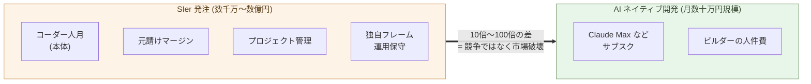

# 価格競争力の桁違いの差

**SIer 発注の数千万〜数億円と、AI ネイティブ開発の月数十万円。
10倍〜100倍の差は、もはや競争ではない ── 市場破壊だ**。

第6章で、SIer 委託モデルが「同じ手間で自分で作れる」水準に追いつ
かれていることを示した。本章はその次の問い ── 手間ではなく、
**金額で並べたら、どうなるか** ── を扱う。

結論を先に言う。**SIer 発注と AI ネイティブ開発のあいだには、
10倍〜100倍の価格差がある**。本章はこの数字の根拠と意味を、順に
見ていく。

## 同じスコープを、両方で見積もる

具体的な見積もりで比較する。中規模の業務システム ── 顧客マスタ管理、
受発注、請求書発行、ダッシュボードを備えた SaaS 風のシステム、機能
範囲は明確、ユーザー数は数百〜数千 ── を例にとる。

**SIer 発注の見積もり相場**:

- 要件定義 + 基本設計: 数百万円〜千数百万円
- 開発 (6〜12 ヶ月 + コーダー数人): 数千万円〜1 億円超
- 運用保守 (年間): 数百万円〜千数百万円
- 多年契約の総額: **数億円規模**

「中規模システムで数千万」は、日本の SIer 業界の標準的な相場帯だ。
特殊な案件ではない。

**AI ネイティブ開発の見積もり**:

- ツール: Claude Max (月 3 万円) ほか合わせて月 5〜10 万円
- ビルダー人件費 (1 人 × 数ヶ月): 数百万円〜
- 運用保守 (1 人 × 継続): 月数十万円
- 同じスコープの総額: **数百万円〜1 千万円規模**

**両者の差は 10倍〜100倍**。スコープによって 10 倍に収まる場合も
あれば、100 倍開く場合もあるが、いずれも**桁違い**の差だ。

## 10倍〜100倍は、競争ではなく市場破壊だ

価格差の意味は、桁によって**質的に違う**。

- **1.2 倍** ── 価格競争。顧客はサービス・実績・関係性で選ぶ。
  両者が市場に共存できる
- **2〜3 倍** ── 強い競争。安価側に確実な顧客流出。だが、高価側
  にも残る理由がある (信頼、関係、専門性)
- **10 倍** ── 構造的優位。よほどの理由がない限り安価側に流れる。
  高価側は限定的領域 (1 割の専門的案件) に閉じこもる
- **100 倍** ── 市場破壊。同じ市場と呼ぶこと自体が無理になる。
  別の供給曲線

**10倍〜100倍の差は、競争の話ではない**。電卓が算盤の十分の一の
値段で出たとき、算盤メーカーは「価格競争で負けた」のではない ──
**市場そのものが移動した** (第3章)。同じ構造が、いま SIer 業界と
ソフトウェア開発市場のあいだに起きている。

ここで重要なのは、**多くの顧客が桁違いの差に気づくのに時間がかかる**
点だ。理由は二つ:

- これまでの相場感が深く染みついていて、「数百万でできるはずがない」
  と判断してしまう
- 自分で作るという選択肢を知らない、または評価していない

しかし、一度知った顧客は戻れない。**「数億円かかるはずだったものが
数百万円で動いた」**を体験すると、SIer 委託は選択肢から消える。

> 1.2 倍は競争。2〜3 倍は強い競争。
> **10 倍は構造的優位。100 倍は市場破壊**。
> SIer 発注と AI ネイティブ開発のあいだに走っているのは、後者の桁の差だ。

## 日本市場は、世界で最も価格差が大きい

日本市場には、この価格差が**さらに大きく**なる事情がある。

- **SIer 産業の規模が大きい** ── IT 投資の相当部分が SIer 委託に
  流れる構造。海外 (とくに米国) と比較して、内製比率が低い
- **多重下請け構造** ── 元請けから一次・二次・三次の下請けへ仕事
  が流れるたびに、マージンが積層される。同じコードが書かれるまで
  に、複数の中間層を経由する (構造の詳細は第10章で扱う)
- **円安と USD サブスク料金** ── AI ツールは USD 建てだが、SIer
  人件費は JPY 建て。為替で SIer 単価は相対的に上がり続けている
- **業界標準が「人月」** ── 価格交渉が「人月単価 × 人月数」で固定
  される構造で、生産性向上を価格に反映しにくい

これらが重なって、**日本市場での SIer 発注価格は、欧米と比較しても
高い水準にある**。一方、AI ネイティブ開発のコストは世界共通 (同じ
Claude、同じ GPT、同じ Cursor)。結果として、**日本市場の SIer
発注と AI ネイティブ開発の価格差は、世界で最も大きい**部類に入る。

これは脅威であると同時に、**機会**でもある。価格差が大きいほど、
顧客が AI ネイティブに移行したときの節約も大きい。日本市場で AI
ネイティブな開発サービスを提供できるビルダーや組織にとって、これ
は欧米市場よりも大きい機会だ。

> 価格差が大きいほど、**移行後の節約も大きい**。
> 日本市場の機会は、欧米よりも大きい。

## なぜ SIer は価格で追随できないのか

第6章で見た構造的理由を、価格の話として再確認する。

SIer の最低価格は、**自社の人件費**で決まる。コーダーの給与・社会
保険・オフィス・管理コスト ── これらが下限を作る。AI で生産性が
何倍になっても、給与を払い続けないと組織が回らない以上、価格を桁
違いに下げることはできない。

加えて、日本の SIer モデルでは:

- 元請けは下請けにマージンを乗せて受注する
- 下請けはさらに孫請けにマージンを乗せる
- 案件によっては 4〜5 段の階層が積み重なる

各層がマージンを取るので、**コーダー一人の人件費が、顧客への請求
時には数倍に膨らんでいる**。AI ネイティブな開発では、この中間層
が全部ない。1 人のビルダーの人件費 + ツール代だけだ。

> SIer の価格下限は、**払い続けなければならない人件費の層の数**
> で決まる。AI が安くなっても、この層は消えない。

## ロックインのある顧客は、まだ動けない

10倍〜100倍の差があっても、すべての顧客がすぐに動くわけではない。

- **既存の運用保守契約**で縛られている顧客
- **独自フレームワーク・抽象層**に依存しているコードベース
- **長年の人的関係**で意思決定が固定されている組織
- **規制業界**で SIer の実績を要件にされている顧客

これらは **ロックイン** として機能する。価格差が桁違いでも、移行
コストが見えにくく、決断が先送りされる。

ただし、ロックインの強さは案件・顧客ごとに違う:

- **新規プロジェクト** ── ロックインがない。価格差が直接効く
- **既存システムの拡張** ── 部分的ロックインあり。徐々に移行
- **コアシステムの全置換** ── 強いロックイン。最後に動く

最初に動くのは **新規プロジェクトの新規顧客** だ。次に **ロックイン
の浅い拡張案件**。最後に **コアシステム** が来る。この順番が、業界
転換のスピードを決める。

ロックインの構造そのもの ── どこから生まれ、なぜ機能し、なぜ強固か
── は次の章で扱う。**Palantir の FDE モデル** を典型例として、
ロックインの仕組みを解剖する。

## 次の章へ

10倍〜100倍の価格差は、それ自体では市場全体を瞬時に動かさない。
ロックインが、変化のスピードを抑える慣性として働く。ロックインは
**どこから生まれ、なぜ強いのか**。

次の章では、ロックイン問題を扱う。

---

## 関連記事

- [第5章: 顧客がAIと協働して開発する時代](/ai-native-ways/software/customer-codev/)
- [第6章: SIer委託モデルの構造的不経済](/ai-native-ways/software/sier-uneconomic/)
- [構造分析08: 企業ITの税を引く](/insights/enterprise-tax/)
- [構造分析12: AIと個人事業](/insights/ai-and-individual/)
