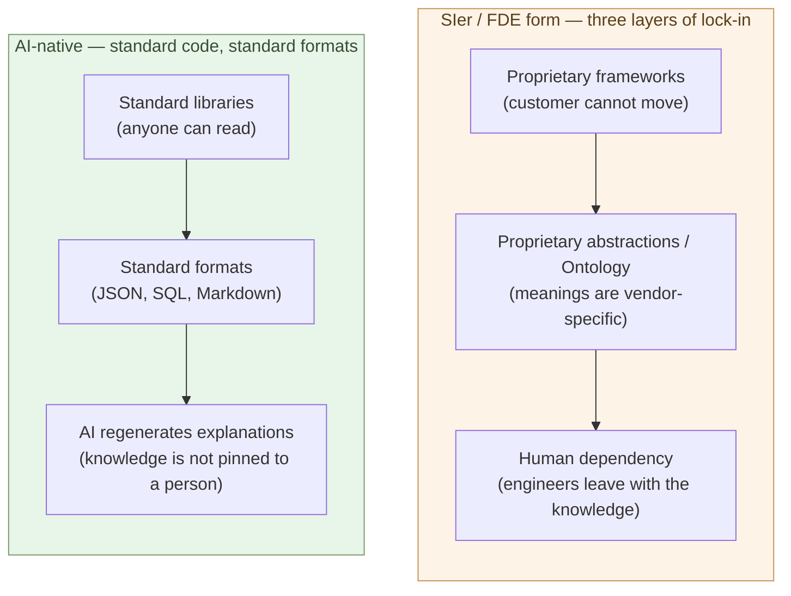

# The Lock-In Problem

**Lock-in is the state in which migration cost is high enough that
nothing moves. The SIer commission model has three layers of lock-in;
Palantir's FDE model is the extreme form. AI-native development, by
contrast, minimizes lock-in itself by working in standard code and
standard formats**.

Chapter 7 showed that the gap between SIer commissioning and AI-native
development runs at 10× to 100×. Even so, customers do not move at
once — the reason is **lock-in**. This chapter decomposes the
structure of lock-in, reads Palantir's FDE model as the archetype, and
shows why AI-native development is structurally bad at producing
lock-in in the first place.

## The three layers of lock-in

What makes the SIer commission model anchor a customer is the
combination of three layers.

**(1) Proprietary frameworks** — the SIer's in-house standard
frameworks, custom packages, custom operational stacks. A system
running on these can only be maintained by the SIer itself. Switching
vendors means rewriting the framework along with everything else.

**(2) Proprietary abstractions / Ontology** — the customer's
business concepts get expressed in vendor-specific models. Customer
master, product master, business flow — once these are encoded in the
vendor's own abstractions, **another system cannot reproduce the same
meanings**. Semantic compatibility is lost.

**(3) Human dependency** — implicit specifications live only inside
the heads of the engineers who have maintained the system for years.
When the SIer's team leaves, the knowledge leaves with them.
Documentation is stale, code is hard to read, and a new joiner cannot
find a way in.

Stacked together, the three layers make lock-in formidable. One layer
alone can be undone by switching vendors. When all three are active,
**migration becomes practically impossible**. The high price an SIer
commands rides on top of these three layers.

> Lock-in is **the state in which migration cost is high enough that
> nothing moves**.
> When two or more of the three layers are active, the customer cannot
> move even with an order-of-magnitude price gap.

## Palantir's FDE model — the extreme form of lock-in

The form that maximizes all three layers of lock-in is Palantir's
**FDE (Forward Deployed Engineer)** model. In the world of software
commissioning, it is known as the most polished — and the most
binding — form of customer attachment.

How the FDE model works:

- Palantir's engineers (FDEs) are **embedded for long periods** inside
  the customer's organization.
- The customer's operations run on **Foundry / Gotham** — Palantir's
  proprietary platforms.
- Business concepts are translated into **Ontology** — Palantir's
  proprietary semantic model.
- Contracts span years; engagement sizes range from tens of millions
  to billions of yen.

All three layers of lock-in are active:

- **Proprietary frameworks**: Foundry and Gotham only run on Palantir.
- **Proprietary abstractions**: Ontology is Palantir-specific. There
  is no practical semantic migration path to another system.
- **Human dependency**: FDEs physically sit inside the customer and
  absorb operational knowledge. Pulling FDEs out = knowledge gone.

The result is that what customers pay Palantir is far above the
commodity price of software development — pricing is not set by
competition but by **the premium that the lock-in structure
sustains**.

Read this as the **fully refined form** of the SIer commission model.
The Japanese SIers use, at different scales, the same three layers to
anchor their customers. Palantir has taken that mechanic and optimized
it globally for military, intelligence, and large-enterprise
customers.

> Palantir's FDE is **the end-state form** of SIer commissioning.
> Maximizing the three layers of lock-in produces a structure in which
> the customer keeps paying in the billions of yen.

## AI-native development tends to produce standard code

From here, look at why AI-native development is **structurally bad at
producing lock-in**.

The largest reason is that **AI tends to write standard code**.

- In Python: the standard library plus major OSS packages (Polars,
  SQLAlchemy, FastAPI, Pydantic, and so on)
- Data: standard formats (JSON, CSV, Parquet, SQLite, PostgreSQL)
- Configuration: YAML / TOML
- Documentation: Markdown
- Diagrams: Mermaid

Why does AI choose standard? AI was trained on **a large body of
public code**. The majority of that training data is standard
libraries and standard formats. AI outputs the form that is statistically
easiest to write — which lands, as a result, **biased toward standard
libraries and standard formats**.

Side effects:

- **Proprietary frameworks do not grow easily** — the same problem
  gets solved with the same standard.
- **Proprietary abstractions do not grow easily** — AI prefers
  standard abstractions over custom ones.
- **Code is easier to read** — anyone with general knowledge of the
  standard libraries can read it.

In other words, simply doing AI-native development produces, naturally,
**a structure that does not generate lock-in**. The avoidance is not
deliberate — **the standard is what you reach for because it is
faster**.

## Another AI, another builder can pick it up

Look more concretely at how lock-in dissolves.

An AI-native code base has these properties:

- **Standard libraries at the center** — another builder sees code
  built out of libraries they already know.
- **The design lives in Markdown** — structure is recorded in a form
  shared between humans and AI (Chapter 4).
- **AI regenerates tests and documentation** — knowledge is not pinned
  outside the code base (Chapter 2).
- **Data formats are standard** — JSON / Parquet / SQLite, readable
  by other systems too.

What this means is that **another AI, another builder, can pick up the
work at minimal cost**:

- Switch AI models (Claude → GPT or back) and the code keeps running.
- The original builder leaves; the successor reads the code with AI
  and understands.
- The customer decides to go in-house; they take over the code and
  keep building.
- The customer wants a different service vendor for maintenance; that
  also works.

None of these options is structurally available in the SIer / FDE
model. **The absence of lock-in is the structural strength** of
AI-native development.

> Built AI-natively, **another AI, another builder, or the customer
> themselves can take it over**. Lock-in is not even on the menu.

## Where lock-in stays, and where it dissolves

Sort engagements by whether lock-in keeps holding and where AI-native
development can dissolve it.

**Lock-in stays**:

- Core business systems still running on legacy Palantir or SIer
  proprietary frameworks — migration cost is hard to see.
- Engagements in regulated industries where "track-record SIer
  maintenance" is a regulatory requirement — migration needs the
  regulator's consent.
- Long-term maintenance contracts mid-flight — the customer cannot
  move while the contract runs.

**Lock-in dissolves, or never forms**:

- New projects started AI-native — no lock-in is generated.
- AI-native **extensions** added on top of existing systems — the
  core stays, the new part is AI-native. Lock-in dissolves on the
  extension side first.
- **Expiry** of an SIer maintenance contract — at the next renewal
  window, the customer can evaluate AI-native replacement.

The ordering is: **new projects and extensions move first**. Core
business systems move only when contract expiry, regulatory
clearance, and migration cost assessment all line up. Even with a
large price gap, not every engagement moves at the same speed.

The overall pace of the industry shift — Japan's multi-tier
subcontracting, labor mobility, transitional contract forms — is
treated in Chapter 10.

## Where the next chapter goes

Wherever lock-in dissolves, customers will need builders. Whether
in-house or external, they will be hiring **a judgment-centered
profession**.

The next chapter takes up the era in which companies hire builders —
how builders get positioned, how they are paid, and how they function.

---

## Related articles

- [Chapter 3: The Coder's Job Goes Away](/en/ai-native-ways/software/coder-end/)
- [Chapter 4: The Builder Role](/en/ai-native-ways/software/builder/)
- [Chapter 7: The Order-of-Magnitude Price Gap](/en/ai-native-ways/software/price-gap/)
- [Structural analysis 08: Subtracting the enterprise-IT tax](/en/insights/enterprise-tax/)
- [Structural analysis 12: AI and the sole proprietor](/en/insights/ai-and-individual/)
