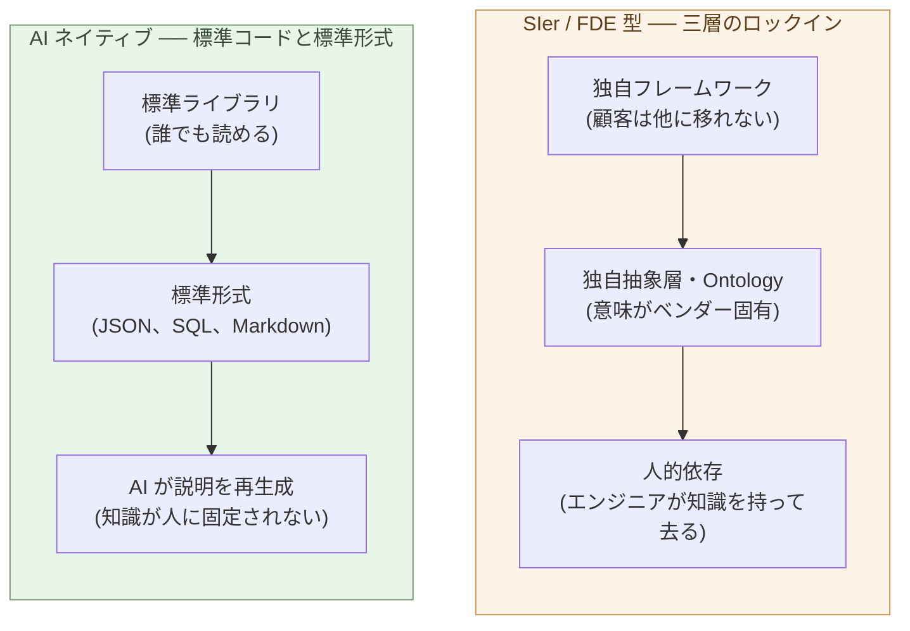

# ロックイン問題

**ロックインとは、移行コストが高くて動けない状態だ。SIer 委託モデル
には三層のロックインがあり、Palantir の FDE モデルはその極致を示す。
対して AI ネイティブ開発は、標準コードと標準形式で進めることで、
ロックインそのものを最小化する**。

第7章で、SIer 発注と AI ネイティブ開発のあいだに 10倍〜100倍の価格
差があることを示した。だが、価格差が桁違いでも、顧客がすぐには動か
ない ── その理由が **ロックイン** だ。本章はロックインの構造を分解
し、Palantir の FDE モデルを典型例として読み、AI ネイティブ開発が
なぜ構造的にロックインを生みにくいかを見ていく。

## ロックインの三層

SIer 委託モデルが顧客を固定するのは、三つの層の合わせ技だ。

**(1) 独自フレームワーク** ── SIer の社内標準フレームワーク、独自
パッケージ、独自運用基盤。これに乗っているシステムは、SIer 自身に
しか保守できない。新しいベンダーに移ろうとすると、フレームワーク
ごと書き換えになる。

**(2) 独自抽象層・Ontology** ── 顧客の業務概念を、ベンダー固有の
モデルで表現する。顧客マスタ、商品マスタ、業務フロー ── すべてが
ベンダーの独自抽象で組まれていると、移行先のシステムでは「同じ
意味」が再現できない。**意味の互換性が失われる**。

**(3) 人的依存** ── システムを長年保守してきたエンジニアの頭の中
にしかない、暗黙の仕様。SIer のチームが去ると、その知識ごと消える。
ドキュメントは古く、コードは難読で、新規参入者には手が出ない。

三層が重なると、ロックインは強固になる。一層だけなら別ベンダーへの
切り替えで解ける場合もあるが、三層すべてが効くと、**移行が事実上
不可能**になる。SIer の高い価格は、この三層の上に乗っている。

> ロックインは、**移行コストが高くて動けない状態**だ。
> 三層のうち二つ以上が効くと、価格差が桁違いでも顧客は動けない。

## Palantir の FDE モデル ── ロックインの極致

ロックインの三層をすべて最大化した形が、Palantir の **FDE (Forward
Deployed Engineer)** モデルだ。ソフトウェア委託の世界で、もっとも
洗練された ── そしてもっとも顧客を縛る ── 形態として知られている。

FDE モデルの仕組みはこうだ:

- Palantir のエンジニア (FDE) が、顧客企業の内部に **長期間張り付く**
- 顧客の業務を **Foundry / Gotham** という Palantir 独自プラットフォーム
  上で動かす
- 業務概念を **Ontology** ── Palantir 独自の意味モデル ── に翻訳する
- 契約は数年単位、案件規模は数千万円〜数十億円規模

三層のロックインがすべて発生する:

- **独自フレームワーク**: Foundry、Gotham は Palantir でしか動かない
- **独自抽象層**: Ontology は Palantir 専用のモデル。他システムへの
  意味的移行は事実上不可能
- **人的依存**: FDE は顧客企業内に物理的に常駐し、業務知識を吸い
  上げる。FDE 引き上げ = 知識消失

結果として、Palantir に支払う額は、商品としてのソフトウェア開発
よりはるかに高い ── 競合との価格競争ではなく、**ロックイン構造に
よるプレミアム**で値段が立つ。

これは、SIer 委託モデルの**極端な洗練形態**として読める。日本の
SIer も、規模は違うが、同じ三層を使って顧客を固定している。Palantir
は、その仕組みをグローバル規模で、軍事・諜報・大企業向けに最適化
した形だ。

> Palantir FDE は、SIer 委託の **最終形** だ。
> 三層のロックインを最大化した結果、顧客は数十億円を払い続ける構造
> ができあがる。

## AI ネイティブ開発は、標準的なコードを生成する

ここから先は、AI ネイティブ開発が **なぜ構造的にロックインを生みに
くいか** を見ていく。

最大の理由は、**AI が標準的なコードを書く**ことだ。

- Python なら標準ライブラリ + 主要 OSS パッケージ (Polars、SQLAlchemy、
  FastAPI、Pydantic 等)
- データは標準形式 (JSON、CSV、Parquet、SQLite、PostgreSQL)
- 設定は YAML / TOML
- ドキュメントは Markdown
- 構造図は Mermaid

なぜ AI は標準を選ぶか。AI は **公開された大量のコード** で学習して
いる。学習データの中で多数派なのは標準ライブラリと標準形式だ。AI
は確率的に最も書きやすい形式を出力する ── これが結果として、
**標準ライブラリ・標準形式に偏る**ことになる。

副作用として:

- **独自フレームワークが育ちにくい** ── 同じ問題は同じ標準で解か
  れる
- **独自抽象層が育ちにくい** ── AI は独自抽象より標準抽象を好む
- **コードが読みやすい** ── 標準ライブラリの知識があれば誰でも読める

つまり、AI ネイティブ開発を進めるだけで、自然に **ロックインを生み
にくい構造** になる。意図して避けるのではなく、**標準を使うほうが
速いから標準になる**。

## 別の AI、別のビルダーが引き継げる

ロックインの解け方を、もう少し具体的に見る。

AI ネイティブなコードベースは、こういう特性を持つ:

- **標準ライブラリ中心** ── 他のビルダーが見ても、知っているライブ
  ラリで構成されている
- **設計が Markdown で残る** ── 構造は AI と人間が共有できる形で
  書かれている (第4章)
- **テストとドキュメントは AI が再生成** ── 知識がコードベースの
  外に固定されない (第2章)
- **データ形式が標準** ── JSON / Parquet / SQLite で、別のシステム
  からも読める

これが意味するのは、**別の AI、別のビルダーが、最小コストで引き
継げる** ということだ:

- 別の AI モデル (Claude → GPT、または逆) に移行しても、コード自体
  はそのまま動く
- 元のビルダーが去っても、後任が AI に読ませて理解できる
- 顧客が内製化したくなれば、コードを引き取って続きが書ける
- 別のサービス会社に保守を頼みたくなれば、それも可能

これは、SIer / FDE モデルでは構造的に成立しない選択肢だ。**ロック
イン構造を持たないこと** が、AI ネイティブ開発の構造的な強みになる。

> AI ネイティブで作ると、**別の AI も、別のビルダーも、顧客自身も
> 引き継げる**。ロックインは選択肢として用意されていない。

## ロックインが残る場面と、解ける場面

整理する。ロックインが効き続ける場面と、AI ネイティブで解ける場面
を、案件種別で分ける。

**ロックインが残る**:

- 既存の Palantir / SIer 独自フレームワーク上で動いているコア業務
  システム ── 移行コストが見えにくい
- 規制業界で「実績ある SIer の保守」が要件になっている案件 ── 移行
  には規制側の合意が必要
- 長期保守契約が現在進行中の案件 ── 契約期間中は動けない

**ロックインが解ける、または最初から無い**:

- 新規プロジェクトを AI ネイティブで始めた案件 ── ロックインが
  発生しない
- 既存システムの **拡張部分** を AI ネイティブで足す案件 ── 中核
  は既存、新しい部分は AI ネイティブ。拡張側からロックインが消える
- SIer 保守契約の **期限切れ** ── 次の契約タイミングで、AI ネイティブ
  への置き換えを評価できる

順序として、**新規プロジェクトと拡張案件から先に動く**。コア業務
システムは、契約期限・規制対応・移行コスト評価の三つが揃ったとき
に初めて動く。価格差は大きくても、すべての案件が同じ速度では動か
ない。

業界全体の転換速度 ── 日本の多重下請け構造、雇用流動性、転換期の
中間形態 ── は第10章で扱う。

## 次の章へ

ロックインが解けた場面では、顧客はビルダーを必要とする。それが
内製のビルダーであれ、外部のビルダーであれ、**判断中心の専門職**
を雇うことになる。

次の章では、各社がビルダーを雇用する時代を扱う。ビルダーはどう
位置づけられ、どう処遇され、どう機能するのか。

---

## 関連記事

- [第3章: コーダーの仕事はなくなる](/ai-native-ways/software/coder-end/)
- [第4章: ビルダーという役割](/ai-native-ways/software/builder/)
- [第7章: 価格競争力の桁違いの差](/ai-native-ways/software/price-gap/)
- [構造分析08: 企業ITの税を引く](/insights/enterprise-tax/)
- [構造分析12: AIと個人事業](/insights/ai-and-individual/)
