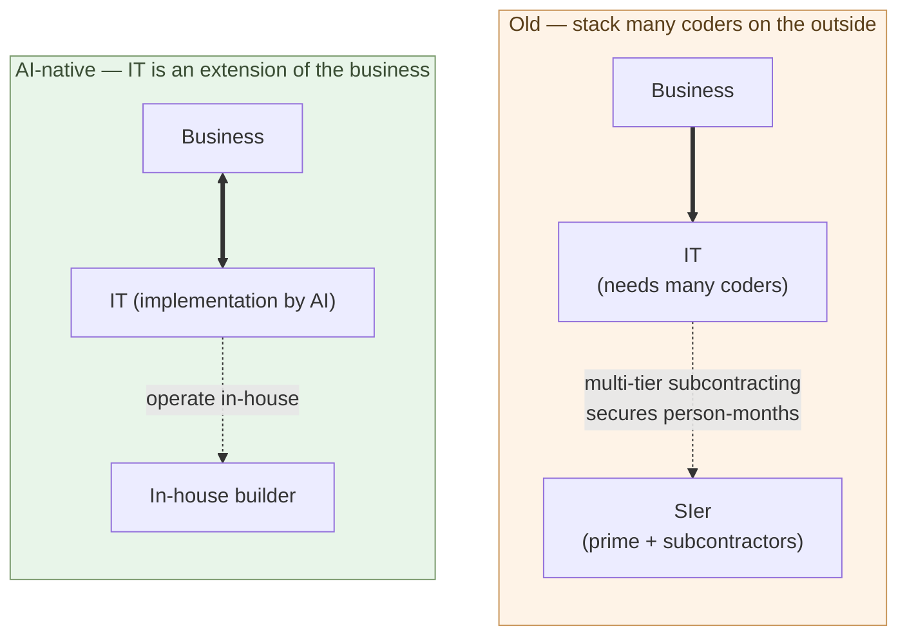

# Companies Hire Builders

**The builder is a profession that sells judgment. Same structure as
lawyers and doctors. Not a role that fits inside a general-employee
grade system**.

Chapter 5 showed that customers themselves can become builders.
Chapter 8 showed that AI-native development structurally resists
producing lock-in. Put both together, and the rational customer
**keeps the builder in-house** — that single choice covers the
structural disadvantage of outsourcing, the path out of lock-in, and
the preservation of business context, all at once.

This chapter takes up the choice of "hiring a builder" — where in the
organization to place them, how to compensate them, in what structure
they actually function.

## Outsourcing IT is the same as outsourcing the business

Start by re-examining what IT outsourcing means.

In the old model, business and IT were treated as separate concerns.
**Business is core, IT is a tool** — and tools can be outsourced. That
was the common assumption. Keep an internal IT department, write the
requirements in-house, hand the implementation to an SIer — the
standard model.

That premise held under two conditions:

- IT implementation required **a large number of coders**, and keeping
  them all in-house was impractical at the scale needed. **Multi-tier
  subcontracting stacked head-count on the outside** so that
  engagements could secure enough person-months (the structure is
  covered in Chapter 10).
- IT was viewed as a **thin surface layer** of the business —
  outsourcing it did not pull the essence of the business out with it.

Both conditions break in the AI-native world.

Implementation is written by AI — **a large number of coders is no
longer needed**. The reason multi-tier subcontracting existed in the
first place disappears. And the business of the AI-native era is **a
continuous chain of judgments encoded as code**. What to build, how
to split it, which invariants must hold — these are the body of the
business itself. Code is the mirror of the business, not a thin
surface.

So outsourcing IT becomes the same as **outsourcing the judgment of
the business** — and the head-count being stacked outside is no
longer needed in the first place. The rationale for letting the
customer's context, the meaning of the business, the non-negotiable
conditions flow outward — and the rationale for securing person-months
outside — both disappear at the same time.

If the body of the business stays in-house, the judgment that
directly drives the business stays in-house too. That role is the
**in-house builder**.

> Outsourcing IT is **the same as outsourcing the business**.
> If you keep the business in-house, you keep the builder in-house.

## The builder is a profession that sells judgment

How to position the in-house builder? An extension of the
general-employee grade ladder does not fit. The builder is a
**profession that sells judgment**.

Examples of "professions that sell judgment":

- **Lawyers** — sell legal judgment. Legal databases are open to
  everyone, case law is published. But which doctrine applies and how
  the argument is built, given the client's situation, is judgment.
  **They carry responsibility for the result**.
- **Doctors** — sell medical judgment. Diagnostic equipment is
  standardized; medical knowledge is in textbooks. But which tests to
  run and how to diagnose, given the patient's symptoms, is judgment.
  **They carry responsibility for the result**.
- **CPAs and tax accountants** — sell accounting judgment. Accounting
  software is open to anyone; tax law is published. But how to handle
  the case, given the actual state of the company, is judgment.
  **They carry responsibility for the result**.

The builder has the same structure:

- **The tools are open to anyone** — AI (Claude, GPT), IDEs,
  open-source libraries. No special access required.
- **Judgment is the content** — carve out the problem from the
  business context, decide structure, use AI, evaluate. That is what
  the builder does.
- **Responsibility for the result** — a system that does not work, a
  failed design, an operational incident — what the builder judged,
  the builder owns.

Builders move to the same position as lawyers, doctors, and
accountants. This is not a metaphor — **the structural profession is
the same**.

> The builder is a **profession with the same structure** as lawyers
> and doctors. The tools are open to anyone, but the judgment belongs
> to the professional.

## A general-employee grade does not fit

Push a "profession" into the general-employee grade ladder and it
breaks. History shows this.

The structure of a law firm makes the point:

- **Partners** — bring in cases, judge, carry responsibility
- **Associates** — do the under-the-partner work
- **Compensation runs on case basis or partnership stakes**, not on
  position grades. There is no "level-5 lawyer" on a salary table.

Medical practices and accounting firms have the same shape. Pay
follows **the volume of judgment carried**, not position grade.

What happens when builders are forced into the general-employee
grade?

- **Position-graded pay does not work** — builders are not measured
  by "level." One builder's judgment changes the scale of a business
  in a way the grade system was not designed for.
- **Assignment does not control them** — the vertical-silo split of
  "business systems" or "sales systems" does not work for someone who
  judges across multiple business areas.
- **Promotion to management does not reward them** — the builder's
  advantage is in judgment, not in management. Promoting them to
  management = pulling them out of their actual role.
- **The "interchangeable" assumption breaks** — "if a person leaves,
  another fills in and the system keeps running" does not apply to a
  judgment profession.

Trying to run all of this inside the general-employee frame causes
strong builders to leave. **An employment shape — a professional model
— is needed**:

- Per-engagement contracts, or high-grade professional positioning
- Position by scope and responsibility, not by grade or assignment
- Reward by expanding scope, not by promoting to management
- Independent-contractor / business-commission contracts are
  legitimate options

Under that framing, the in-house builder sits closer to "executive
advisor" or "professional partner" than to "member of the IT
department."

## Cost comparison example — building a corporate website

Enough abstraction. Take a concrete example: building a corporate
website.

**Commissioning a corporate website the old way**:

- A web agency or production company takes the order
- Requirements + design + implementation + maintenance
- Small to mid-size firms: millions of yen
- Larger firms: tens of millions of yen
- Each revision triggers a new quote
- Domain, server, analytics are separate contracts

**Doing it with an in-house builder (one person + AI)**:

- Builder labor: a week to a few weeks (depending on scope)
- Tooling: tens of thousands of yen per month (Claude Max etc.)
- Hosting: thousands of yen per month and up
- Revisions: the builder ships them the same day
- The same in-house builder serves other business areas too

In numbers, this lands at **less than one-tenth of the initial build
cost, with dramatically faster and cheaper ongoing operation** — the
corporate-website case of the 10×–100× price gap from Chapter 7.

But the more important comparison is **structural**, not financial:

- Old: the website is **an outsourced asset**. Revisions go through
  the agency, with delay and added cost.
- Builder-driven: the website is **part of the business itself**.
  Revisions move at the speed of judgment. The marketing decision and
  the web change connect directly.

In the outsourced model there is a buffer step — "the marketing team
judges and then commissions the agency." With an in-house builder,
**judgment and implementation collapse into one**. That is the real
reason to hire a builder.

> Bringing the website in-house is not just a cost story.
> **Closing the distance between judgment and implementation to zero**
> is the substance.

## What changes when a company hires a builder

Once a company places a builder in-house, the way the business runs
shifts.

- **Speed of decision-making** — "we want to build this" to "it is
  running" shrinks from weeks to days.
- **Unit of experimentation** — "build first, think about it after"
  becomes possible. The old constraint of "fully specify the
  requirements, then commission" falls away.
- **Structuring of the business** — in the process of preparing
  things for AI to act on, the business itself gets organized.
- **Data goes upstream** — business data moves from SIer-managed
  custodianship to forms the in-house builder can work with (standard
  databases, JSON, Parquet).
- **Vendor dependence dissolves** — lock-in eases, options expand
  (Chapter 8).

This is more than cost reduction. It is a structural change. Hiring
one builder can be **the trigger that reshapes how the company
operates**.

## The builder supply is not limited to former coders

Chapter 3 said that people who can move to the judgment side and
people who cannot will separate. Read only that and builders look
like a scarce resource. But missing one other supply source distorts
the picture — **AI is lowering the barrier to entry**.

The barrier to entry in software development has historically been a
stack of layers — grammar fluency, framework learning, build/deploy,
debugging experience. All of these are dropping, right now. Three
elements combine to make this possible:

- **AI** — the code is written by AI (Chapter 1)
- **Python** — readable, well-suited to AI collaboration
- **Flet** — desktop, mobile, and web apps in pure Python (covered
  in the parent series, Chapter 8)

With these three layers in place, **"I want to build something but I
cannot write code"** — the people who carried that line until now —
flow into the base of the builder pool.

### Makers and shop-floor engineers enter embedded programming

Software development used to be **web-centric**. HTML/CSS/JS, React,
browsers, servers — most of the learning cost concentrated there.

In the AI-native era, the barrier to **embedded programming** drops
the same way — Raspberry Pi, ESP32, MicroPython, AI generating
circuit and control code. **People who enjoy making things** can step
into writing software easily (covered in the parent series, Chapter
9).

**Robot programming** is the canonical example. Historically it
needed ROS, C++, and advanced mathematics — research labs and
specialist firms only. In the AI-native present:

- ROS2 + Python is the standard stack
- Higher-level robotics frameworks are written in Python
- AI fills in the details of control algorithms
- Flet provides the operator UI

A hobbyist maker building a robot that runs at home — until a few
years ago, this was a researcher's privilege. The kind of person who
makes things already carries the qualities a builder needs — picking
what to build, debugging when something does not move, decomposing a
system into parts and modules.

### In Japan, builder supply is likely to surge

In the Japanese context, this supply source is especially large:

- **Manufacturing base** — engineers in factories and small machine
  shops have the experience of making physical things. AI gives them
  a path into software.
- **Maker culture** — Maker Faire, electronics hobbies, embedded
  doujin / community activity have a long history
- **Gadget culture** — the underlying motivation "I want to build
  something myself" is broadly distributed
- **Education trends** — high-school robotics contests, Python
  education in schools

These bases cross the "I cannot write code" barrier through AI +
Python + Flet and **enter society as builders**. While SIers shrink
and customer companies expand builder hiring at the same time, the
supply side sees **former SIer coders converging with makers**.

Chapter 3 said that those who can move to the judgment side and those
who cannot will separate. That was a statement about former SIer
coders. What this chapter adds: **the doorway to the judgment side is
not open only to people who came from coding**.

> Builder supply is not just transfers from coders.
> **AI + Python + Flet open a new supply source — makers,
> shop-floor engineers, students**.

Read this in combination with Chapter 10's "labor demand outside the
industry" (manufacturing, agriculture, AI physical infrastructure).
The picture becomes clearer: human capital flowing out of the SIer
industry and **human capital flowing in from outside the industry as
builders** are moving in parallel. Labor reallocation is not a simple
"shrinkage → unemployment" story but **multi-directional flow**.

## Where the next chapter goes

By here, the case for keeping a builder in-house is clear. But the
industry-wide shift will not happen all at once. Japan in particular
has its own dynamics — multi-tier subcontracting, long-tenure
employment customs, the intermediate forms that show up during a
transition.

The next chapter takes up the SIer-industry transition in Japan and
labor mobility. How do the coders inside SIers move? What happens to
the prime-contractor / subcontractor structure? Which intermediate
forms appear during the transition?

---

## Related articles

- [Chapter 4: The Builder Role](/en/ai-native-ways/software/builder/)
- [Chapter 5: Customers Co-Develop with AI](/en/ai-native-ways/software/customer-codev/)
- [Chapter 8: The Lock-In Problem](/en/ai-native-ways/software/lockin/)
- [Parent series Chapter 8: Building Apps — CLI tools, Flet apps, Flutter apps](/en/ai-native-ways/apps/)
- [Parent series Chapter 9: Building Embedded — Think in Python, Have Claude Translate](/en/ai-native-ways/embedded/)
- [Structural analysis 08: Subtracting the enterprise-IT tax](/en/insights/enterprise-tax/)
- [Structural analysis 12: AI and the sole proprietor](/en/insights/ai-and-individual/)
