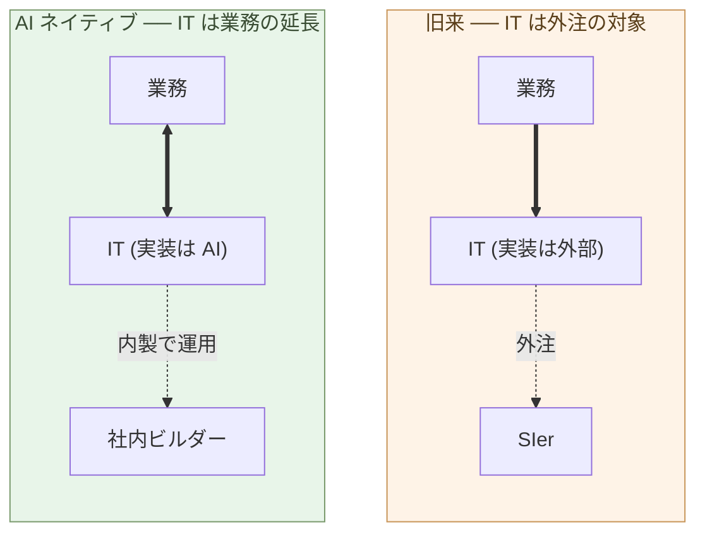

# 各社がビルダーを雇用する時代

**ビルダーは判断を売る専門職だ。弁護士・医師と同じ構造を持つ。
一般社員の枠で処遇する役割ではない**。

第5章で、顧客自身がビルダーをやれることを示した。第8章で、AI
ネイティブ開発はロックインを生みにくいことを示した。両方を合わせる
と、合理的な顧客は **ビルダーを社内に持つ** ことを選ぶ ── 外注の
構造的不利と、ロックインからの脱出と、業務の文脈を維持する三つを、
同時に満たせるのがこの選択肢だからだ。

本章は「ビルダーを雇う」という選択を、社内でどう位置づけるか ──
組織のどこに置くか、どう処遇するか、どんな構造で機能させるか ──
を扱う。

## IT を外部化することは、業務を外部化することと同じだ

最初に、IT 外注の意味を問い直す。

旧来は、業務と IT は分けて考えられてきた。**業務はコア、IT は道具**
── 道具は外注してもよい、というのが共通認識だった。情シスを抱え、
要件だけ社内で書き、実装は SIer に出す ── これが標準モデルだった。

この前提が成立したのは、二つの条件があったときだけだ:

- IT の実装が **専門技能** を要し、社内で持つコストが高かった
- IT が業務の **薄い表層** にすぎず、外注しても業務の本質は手元に
  残せた

両方の条件が、AI ネイティブな世界で崩れる。

実装は AI が書く ── 社内コストが下がる。そして、AI ネイティブな
時代の業務は、**コード化された判断の連続** だ。何を作るか、どう
分けるか、どの不変条件を守るか ── これらは業務の本体そのもの。
コードは業務を映す鏡で、薄い表層ではない。

つまり、IT を外部化することは、**業務の判断を外部化すること** と
同じになる。顧客の文脈、業務の意味、譲れない条件 ── これらが外
へ流れていく。

業務の本体を社内に持つなら、業務に直結する判断も社内に持つ。それが
**社内ビルダー** だ。

> IT を外部化することは、**業務を外部化することと同じ**だ。
> 業務を手元に残すなら、ビルダーも手元に残す。

## ビルダーは判断を売る専門職だ

社内ビルダーをどう位置づけるか。一般社員の延長線では合わない。
ビルダーは、**判断を売る専門職** だ。

「判断を売る専門職」の典型例を並べる:

- **弁護士** ── 法的判断を売る。法律 DB は誰でも引ける、判例は
  公開されている。だが、依頼者の状況に応じてどの法理を適用し、
  どう論を組み立てるかは判断だ。**結果に責任を負う**
- **医師** ── 医療判断を売る。診断機器は標準化され、医学知識は
  教科書にある。だが、患者の症状からどの検査をし、どう診断するか
  は判断だ。**結果に責任を負う**
- **公認会計士・税理士** ── 会計判断を売る。会計ソフトは誰でも
  使える、税法は公開されている。だが、企業の実態に照らしてどう
  処理するかは判断だ。**結果に責任を負う**

ビルダーも同じ構造を持つ:

- **道具は誰でも使える** ── AI (Claude、GPT)、IDE、各種ライブラリ。
  特殊な権限は要らない
- **判断が中身** ── 業務の文脈から問題を切り出し、構造を決め、
  AI を使い、評価する。これがビルダーの仕事
- **結果に責任を負う** ── 動かないシステム、設計の失敗、運用事故
  ── ビルダーが判断したことの結果は、ビルダーが負う

弁護士・医師・会計士と同じ位置に、ビルダーが動く。これは比喩では
ない ── **構造として同じ職種** だ。

> ビルダーは弁護士・医師と **同じ構造の専門職** だ。
> 道具は誰でも使えるが、判断は専門職にしかできない。

## 一般社員の枠では処遇できない

「専門職」を一般社員の枠に押し込むと、壊れる。これは歴史が示して
いる。

弁護士事務所の構造を見ると分かりやすい:

- **パートナー** ── 案件の獲得・判断・責任を負う
- **アソシエイト** ── パートナーの下で実務を担当
- **役職給ではなく案件ベース・パートナー出資** ── 給与表に「等級
  5 の弁護士」は無い

医師、会計士事務所も同じ構造を持つ。**判断量に応じた処遇** であって、
役職等級に応じた処遇ではない。

ビルダーを一般社員の枠で扱うとどうなるか:

- **役職給では処遇できない** ── ビルダーは「等級」では測れない。
  一人のビルダーの判断が業務を変える規模は、等級制度の前提を超える
- **配属でコントロールできない** ── 「業務系」「販売系」のような
  縦割りでは、横断判断ができない。ビルダーは複数業務領域を横断する
- **管理職への昇進では報えない** ── ビルダーの優位は管理ではなく
  判断にある。管理職に上げる = ビルダー本来の仕事から外す
- **取り替え可能な前提が崩れる** ── 「人が辞めても代わりが入れば
  回る」は、判断専門職には適用できない

これらを一般社員の枠で運営しようとすると、優秀なビルダーは離れて
いく。**雇用形態として、専門職モデルが要る**:

- 案件単位の契約、または高度専門職としての処遇
- 等級・配属ではなく、判断対象範囲と責任で位置づける
- 管理職昇進ではなく、業務影響範囲の拡大で報いる
- 個人事業主 / 業務委託契約も選択肢に含める

このとき、社内ビルダーの位置づけは、**「IT 部門の一員」ではなく、
「役員顧問」や「専門職パートナー」に近い** 形になる。

## ホームページ開発を例にしたコスト比較

抽象論はここまで。具体例として、よくある「コーポレートサイトを作る」
を取り上げる。

**旧来のコーポレートサイト発注**:

- Web 制作会社・代理店に発注
- 要件定義 + デザイン + 実装 + 運用保守
- 中小企業: 数百万円
- 中堅以上: 数千万円
- 改修のたびに追加見積もり
- ドメイン・サーバー・分析ツールも別契約

**社内ビルダー (1 人 + AI) でやる場合**:

- ビルダーの工数: 1〜数週間 (内容による)
- ツール: Claude Max など 月数万円
- ホスティング: 月数千円〜
- 改修: ビルダーが直接、その日のうちに
- 同じ社内ビルダーが他業務にも使える

数字で見ると、**初期構築で 10 分の 1 以下、運用フェーズで圧倒的に
安く・速く** なる。これは第7章の 10倍〜100倍の価格差の、コーポレート
サイト案件版だ。

しかし重要なのは、コスト比較ではなく **構造の比較** だ:

- 旧来: コーポレートサイトは **外注された資産**。改修は外注に依頼、
  時間がかかり、追加コスト
- ビルダー型: コーポレートサイトは **社内の業務の一部**。改修は判断
  と同じ速度。マーケ判断と Web の実装が直結する

外注では、「マーケ部門が判断して、外注に発注する」というワンクッション
がある。社内ビルダーがあれば、**判断と実装が一本化** する。これが
ビルダーを雇う本当の理由だ。

> ホームページの内製化は、コストだけの話ではない。
> **判断と実装の距離をゼロにすること** ── これが本質だ。

## ビルダーを雇うと、何が変わるか

社内にビルダーを置くと、業務の運営の仕方そのものが変わる。

- **意思決定の速度** ── 「これを作りたい」から動くまでが、数週間
  から数日に短縮される
- **試行錯誤の単位** ── 「作ってから考える」が可能になる。完璧な
  要件定義をしてから外注、という旧来の枠から外れる
- **業務の構造化** ── ビルダーが業務を AI に渡せる形に整理する
  過程で、業務そのものが整理される
- **データの一次源化** ── 業務データが SIer の管理下から、社内
  ビルダーが扱える形 (標準データベース、JSON、Parquet) に移る
- **ベンダー依存からの解放** ── ロックインが解け、選択肢が増える
  (第8章)

これは、コスト削減以上の構造変化だ。ビルダーを 1 人雇うことが、
**会社の運営構造を組み替える** きっかけになる。

## 次の章へ

ここまでで、ビルダーを社内に持つ合理性は明らかだ。だが、業界全体
としての転換は、すぐには起きない。日本市場には固有の事情 ── 多重
下請け構造、長期雇用慣行、転換期の中間形態 ── がある。

次の章では、日本の SIer 業界の転換と雇用流動性を扱う。SIer に所属
するコーダーはどう動くのか、元請けと下請けの構造には何が起きるか、
転換期にどんな中間形態が現れるか。

---

## 関連記事

- [第4章: ビルダーという役割](/ai-native-ways/software/builder/)
- [第5章: 顧客がAIと協働して開発する時代](/ai-native-ways/software/customer-codev/)
- [第8章: ロックイン問題](/ai-native-ways/software/lockin/)
- [構造分析08: 企業ITの税を引く](/insights/enterprise-tax/)
- [構造分析12: AIと個人事業](/insights/ai-and-individual/)
