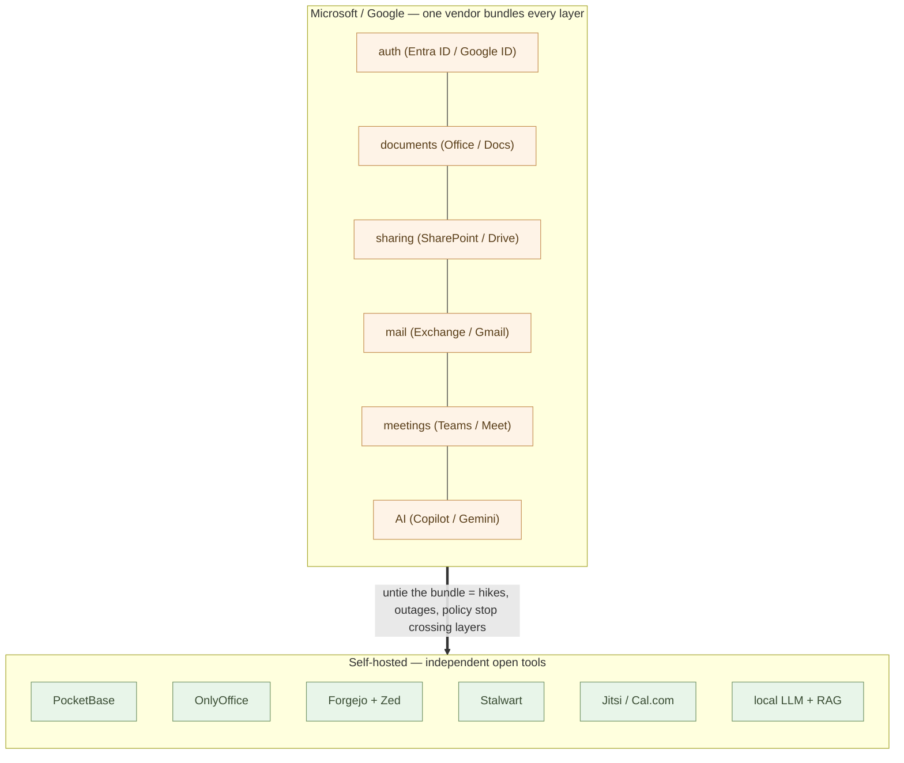
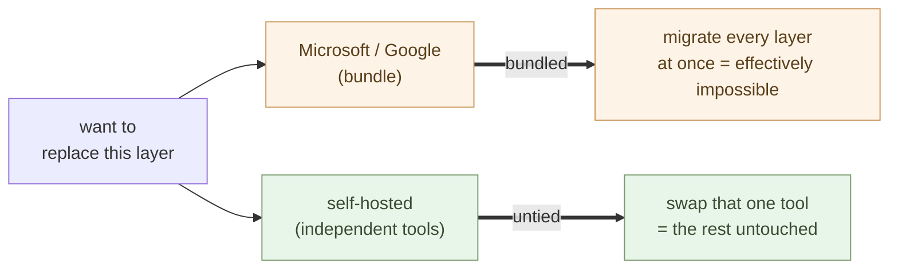
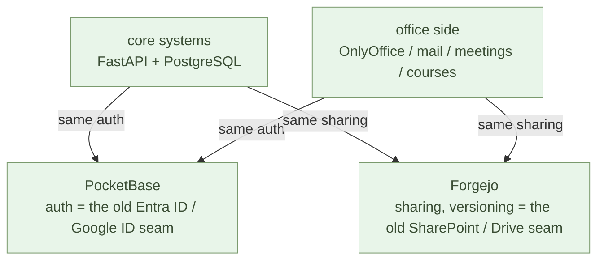

# Becoming Independent from Microsoft and Google — The Whole Map

**The real nature of Microsoft 365 and Google Workspace is that they are bundled.**

The Introduction part moved embedded logic out into Python and made core
logic something you could write yourself. The Independence part widens that
hands-on power to the **whole company** — it unties identity, documents,
sharing, mail, meetings, web, data, and AI from a single contract and puts
them back on your side.

There is only one thing to do: **untie the bundle into independent tools.**
This chapter is the **map.** It lays out, up front, what each layer maps to
and which chapter stands it up.

## Being bundled IS the lock-in

Microsoft 365 is convenient because login (Entra ID) connects straight into
documents (Office), documents into sharing (SharePoint), sharing into mail
(Exchange), and AI (Copilot) into all of them — **all on one account, in one
straight line.**

Google Workspace has exactly the same shape. **A Google ID connects straight
into Gmail, into Drive, into Meet, into Gemini.** Only the names differ; the
binding is identical — one account, with documents, mail, meetings, and AI all
chained together inside one vendor.

But that straight line is the very shape of the lock-in.

- A price hike hits **every layer** at once — nowhere to escape
- A data-policy change hits **every layer** at once
- One vendor's outage stops **every layer** at once (the prologue's single point of failure)
- The vendor AI's judgment (Copilot / Gemini) seeps into **every layer**

> Bundled means convenient, and bundled means held hostage.
> **Convenience and hostage are two faces of one chain.**

The lock-in is not weak features, nor a migration that is technically hard.
It is **the bundling itself.** So the way out is one thing — split each layer
into an independent tool. Each can be replaced on its own, and if one falls the
others keep running. This is the parent series' 2-13 "one + AI" at the
scale of the company: **autonomous N beats centralized 1.**

## The map — dissolving Microsoft and Google into independent OSS

Untie the bundle and the layers of Microsoft 365 and Google Workspace land on
the same independent OSS. **Replace the two left columns with the same right.**

| Microsoft 365 | Google Workspace | Self-hosted (OSS) | Chapter |
| --- | --- | --- | --- |
| **Entra ID** | **Google ID / Cloud Identity** | **PocketBase** | [2-03](/ai-native-ways/software/auth/) |
| **Word / Excel / PowerPoint** | **Docs / Sheets / Slides** | **OnlyOffice** | [2-05](/ai-native-ways/software/documents/) |
| **SharePoint + GitHub** | **Drive** | **Forgejo + Zed** | [2-04](/ai-native-ways/software/code/) |
| **Exchange / Outlook** | **Gmail** | **Stalwart** | [2-06](/ai-native-ways/software/mail/) |
| **Teams / Bookings** | **Google Meet / Calendar** | **Jitsi / Cal.com** (BigBlueButton for courses) | [2-07](/ai-native-ways/software/meetings/) |
| **Power Pages** | **Google Sites** | **Cloudflare Pages** | [2-08](/ai-native-ways/software/web/) |
| **Azure SQL** | **Cloud SQL / BigQuery** | **PostgreSQL / SQLite** | [2-02](/ai-native-ways/software/foundation/) |
| **Power BI / Excel** | **Looker / Sheets** | **DuckDB + Polars** | [2-02](/ai-native-ways/software/foundation/) |
| **(Power Apps etc.)** | **Apps Script** | **FastAPI** | [2-09](/ai-native-ways/software/fastapi/) |
| **Copilot** | **Gemini** | **local LLM (Command A+ etc.) + RAG** | [2-10](/ai-native-ways/software/ai/) |

The tools on the right are **separate open tools built by separate
organizations.** So one vendor's decision can't ripple into the others. Swap
any one for something else and the rest don't change. **The bundle is untied** —
that is the whole point.

This chapter is the map. **It includes no build steps** — the docker, config,
and migration for each layer live in that layer's own chapter. Here we fix only
which layer maps to which, and in what order they untie. Microsoft or Google,
the destination is the same — so whichever suite holds you, the road ahead
merges into one.

## What changes — cost and independence

Untie it yourself and the monthly structure changes. Microsoft 365 and Google
Workspace both bill **per seat × month** (roughly $8–20 per seat, plus several
dollars more once you add the vendor AI) — it grows linearly as you add people.
A full self-hosted set is the **fixed cost of one server** (a VPS at a few
dollars a month, or the electricity for an in-house mini PC) — it barely grows
as you add people.

But cost is not the point. The point is that **the bundle is untied.**

- One vendor raises prices — replace only that one layer
- One vendor has an outage — the other layers keep running
- One vendor changes its data policy — the effect stays inside that layer
- The AI's judgment is something the company chooses

## In what order to untie

You don't have to do it all at once. Go **in order of what is easiest to pull
out of the bundle,** one at a time. The Independence part is structured in
exactly that order.

1. **Data layer** (2-02) — PostgreSQL, SQLite, DuckDB. Analysis, RAG,
   scheduling, and the core systems all sit on this. So it goes first
2. **Auth** (2-03) — PocketBase. The shared gate for every app. Move this
   to your side and the root of the bundle is cut
3. **Sharing and versioning** (2-04) — Forgejo + Zed. Folds in SharePoint
   / Drive
4. **Documents** (2-05) — OnlyOffice. Reads and writes Office / Docs
   formats as-is
5. **Mail** (2-06) — Stalwart. Keep the contents of your communication on
   your own disk
6. **Meetings and scheduling** (2-07) — Jitsi, Cal.com. Meetings and online
   courses on your own side
7. **Web publishing** (2-08) — Cloudflare Pages. Hosting with no lock-in
8. **Core logic** (2-09) — FastAPI. Turn Power Apps / Apps Script back into
   readable code
9. **AI** (2-10) — local LLM + RAG. Hold AI without your data leaving the
   building

Run each step in **parallel**, the way the 2-09 describes.
Don't stop the old (Microsoft / Google) — run the new alongside it, confirm the
same work flows through, and only then cancel the old. **Time it to the renewal
date** — that, too, follows the 2-09.

> You don't need to switch all at once.
> **Each layer you untie loosens the bundle a little more** — one at a time, at
> your own pace.

## Operating it — one person + AI

The obvious question arises — **with this much self-hosted, who maintains it?**
The answer is **one person + AI.** The new unit of work shown in the parent
series' 2-13 "one + AI" applies directly to running the company's
infrastructure.

Why does one person suffice? Three reasons.

- **Every piece is a standard, boxed open tool** — PocketBase is one file, the
  rest are one docker compose file each. Claude writes the compose, sets up DNS
  and DKIM, reads the logs, and isolates the fault. **Your operations partner is
  the AI.**
- **Because the bundle is untied, faults don't cascade** — with a suite, one
  vendor's trouble drags everything down; here, mail lives even if Forgejo falls,
  and meetings continue even if the AI stops. **Fix them one at a time,
  independently.**
- **Visible, readable, testable** — config and logs are in your own hands.
  Unlike a black-box vendor AI, you can **read inside and fix it, together with
  the AI.**

Honestly, the heavy parts too. **Operational load concentrates in two places —
mail and the course server (BigBlueButton).** Mail delivery (DKIM / SPF /
reputation) is delicate, so you can offload just the outbound to an external
relay. The course server is heavy, so **stand it up only for the duration of a
course and tear it down after.** The rest you can mostly leave alone once it's
up.

This is the very thesis of the parent series' 2-13. **You don't need a
siloed IT department.** One person who understands the business holds, with the
AI as partner, everything from auth to mail, meetings, AI, and the database.
**Individual independence holds at the level of company infrastructure.**

> One person + AI operates this whole set of open tools.
> Compared with handing the suite to one vendor, **the effort is the same — only
> the control moves to your side.**

## And on to the core systems

What you've assembled becomes, directly, the **foundation for rewriting the core
systems.** The parallel-run rewrite the 2-09 describes
actually **assumed a place to stand (a platform)** — and that place is fully in
place by the end of the Independence part.

- **The DB the new core runs on** — PostgreSQL + pgvector (2-02)
- **The runtime** — FastAPI / Python + a Rust layer beneath (2-09)
- **Versioning and CI** — Forgejo (2-04)
- **Auth** — PocketBase takes on login for the new system, all in one place
  (2-03)
- **Extracting business logic** — read legacy code, SQL, and procedure manuals
  with a **local LLM + RAG** (2-10) and emit Markdown — **without the
  source ever leaving the building**

In fact, all the core systems and Microsoft / Google ever shared were **just two
things — auth (Entra ID / Google ID) and document sharing (SharePoint /
Drive).** The world of business systems and the world of the office are mostly
separate by nature, joined only at those two seams.

Those two are replaced, in the Independence part, with **PocketBase and
Forgejo.** That means **the seams are already on your side.** The new core
system authenticates with the same PocketBase as the office side and shares
documents and versions through the same Forgejo — and the two worlds meet again
at a single point, with no vendor in between.

The two seams are not the same weight. **Sharing is a place to put things; auth
is the key.** A place to put documents can be moved later, any number of times.
But auth is the single point from which every app, login, and permission in both
worlds hangs — as long as that is held by someone else, no matter what you
self-host, **the entrance belongs to another.**

So the move that really tells in the Independence part is **auth → PocketBase**
(2-03). The moment you move the seam of identity to your side, both the core
and the office **authenticate against your own gate.** It is exactly here that
Microsoft and Google try to dig in deepest — because **identity is the root of
the bundle.** Hold this, and the rest is a matter of time.

> The foundation built in the Independence part is also the foundation for
> dissolving the core systems.
> Once the platform is on your side, replacement is only "one more step."

## In the AI-native era, rebuilding becomes the default

Finally, step back one notch. Rewriting the Microsoft or Google suite is **not a
special decision.** In the AI-native era, **rebuilding becomes the default.**

Two reasons interlock.

**First — the suites are structurally "anti-AI-native."** They lock content into
Office / Docs formats, imprison data in the cloud, and wire the vendor AI
directly into work with no verification layer. None of this is accidental — it
is **a design that keeps content away from where AI can reach it: plain text,
open formats, local execution, readable code.** The more you try to make AI a
colleague, the harder you hit this wall.

**Second — the cost of rewriting has fallen by a factor of ten** (2-09). The AI extracts the business logic, translates it to Python, and
writes the tests. A multi-year, multi-million project becomes a few months for
one person on the ground + AI.

The old structure **doesn't fit AI-native,** and rebuilding is **cheap** — when
those two overlap, the conclusion is one. **Keeping it becomes the unnatural
choice.** "Don't touch what's working" was once correct only because rewriting
was too expensive. Now that the premise is gone, **it is the reason *not* to
rebuild that needs explaining.**

This is not hostility toward Microsoft or Google. It is the natural turn in which
the AI revolution **rebuilds and inherits** what the IT revolution stacked up
(the prologue; the parent series' 2-13). The question is not "whether" but
"when, and led by whom." **Leave it with the vendor, or rebuild it on your own
side** — that is all.

> In the AI-native era, rebuilding the suite is not a revolution.
> **It is a routine update.**

## Summary

Business Microsoft 365 and Google Workspace are SaaS suites that bundle every
layer into one vendor. Convenience and hostage were two faces of one chain. The
Independence part unties the bundle, layer by layer, into independent OSS — and
the two suites land on the same right-hand side.

- **Auth**: Entra ID / Google ID → **PocketBase** (2-03)
- **Documents**: Office / Docs → **OnlyOffice** (2-05)
- **Sharing, versioning**: SharePoint+GitHub / Drive → **Forgejo + Zed** (2-04)
- **Mail**: Exchange / Gmail → **Stalwart** (2-06)
- **Meetings, scheduling**: Teams / Meet → **Jitsi / Cal.com** (2-07)
- **Web publishing**: Power Pages / Sites → **Cloudflare Pages** (2-08)
- **Data layer**: Azure SQL / Cloud SQL → **PostgreSQL / SQLite** (2-02)
- **Data analysis**: Power BI / Looker → **DuckDB + Polars** (2-02)
- **Core logic**: Power Apps / Apps Script → **FastAPI** (2-09)
- **AI**: Copilot / Gemini → **local LLM + RAG** (2-10)

One-to-one — replace the left with the right. The tools on the right are separate
open tools built by separate organizations, so **one vendor's decision can't
ripple into the others.** This is not about efficiency — it restates the parent
series' 2-13 "one + AI" at the height of the company's foundation.
**Autonomous N beats centralized 1.**

Untie the bundle. One at a time, at your own pace. With each layer untied, the
company is that much less a vendor's hostage and **that much more able to move on
its own judgment.** The next chapter stands up the first layer — the **data
layer** everything sits on, on your own side.

---

## Related articles

- [2-02: Lay the Foundation — SQLite, PostgreSQL, pgvector, DuckDB, Polars](/ai-native-ways/software/foundation/)
- [2-05: Take Documents Back — OnlyOffice Docs on PocketBase](/en/ai-native-ways/software/documents/)
- [2-09: Build an API — Expose Core Logic with FastAPI](/en/ai-native-ways/software/fastapi/)
- [Structural Analysis 08: Subtracting the Enterprise IT Tax](/insights/enterprise-tax/)
- [Will You Still Keep Using Windows and Office?](/blog/windows-office-facts/)
