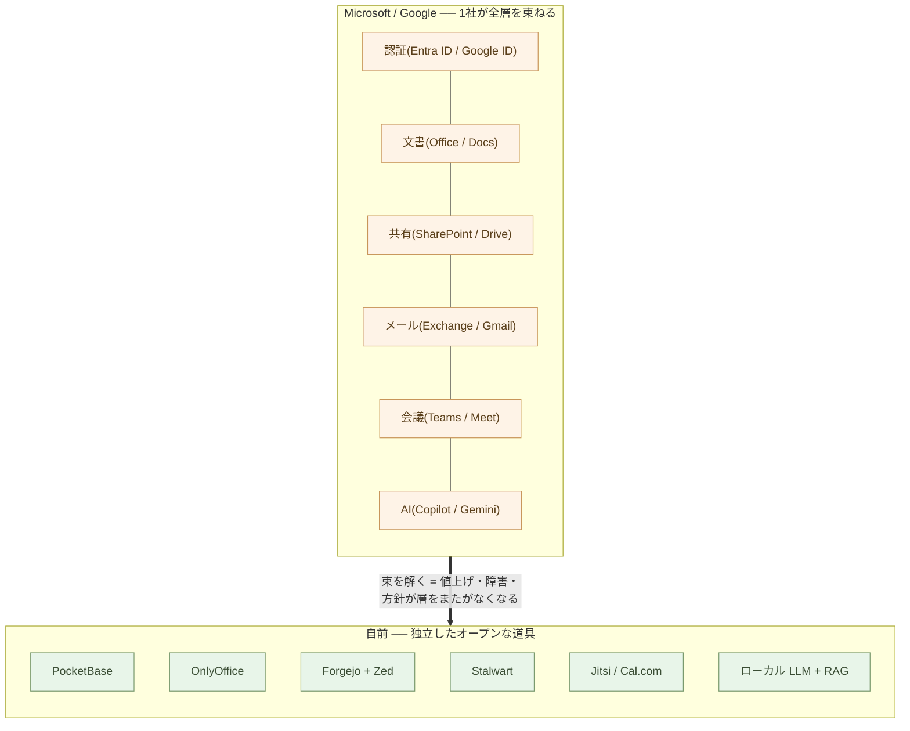
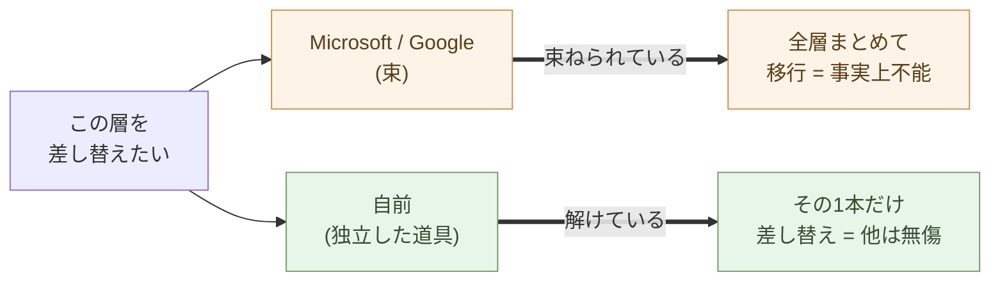
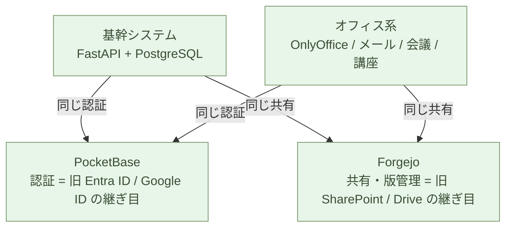

# Microsoft と Google から自立する ── 全体像と対応表

**Microsoft 365 と Google Workspace の本当の正体は「束ねられている」ことだ**。

導入編で、組み込みを Python に外部化し、基幹ロジックを書けるようにした。
自立編は、その手元の力を **会社全体の土台** に広げる ── 認証・文書・共有・
メール・会議・Web・データ・AI が一社に束ねられた SaaS スイートを、契約から
解いて、自分の側に置き直す。

やることは一つだけ。**束を解いて、独立した道具に分ける**。この章はその
**地図**だ。各層が何にどう対応し、どの章で立てるかを、最初に一望する。

## 「束ねられている」ことが、ロックインの正体だ

Microsoft 365 が便利なのは、ログイン(Entra ID)が文書(Office)に、文書が
共有(SharePoint)に、共有がメール(Exchange)に、そして全部に AI(Copilot)が、
**同じアカウントで一直線に繋がっている** からだ。

Google Workspace もまったく同じ構造だ。**Google ID が Gmail に、Drive に、
Meet に、Gemini に一直線に繋がる**。名前が違うだけで、束ね方は同じ ── 一つの
アカウントで、文書も、メールも、会議も、AI も、すべてが一社の中で連結している。

しかしこの「一直線」が、そのままロックインの構造でもある。

- 値上げは **全層まとめて** 効く ── 逃げ場が無い
- データポリシーの変更は **全層まとめて** 効く
- 一社の障害は **全層まとめて** 止まる(序章の単一障害点)
- ベンダー AI(Copilot / Gemini)の判断基準は **全層に** 浸透する

> 束ねられているから便利で、束ねられているから人質になる。
> **便利さと人質は、同じ一本の鎖の表と裏だ**。

ロックインの正体は、機能が弱いことでも、移行が技術的に難しいことでもない。
**束ねられていること自体** だ。だから解き方も一つ ── 各層を、独立した道具に
分ける。一本ずつ置き換えられて、一本が倒れても他は動く。これは親シリーズ
2-13「1人+AI」と同じ、**自立した N は集中した 1 より強い** の、会社版である。

## 対応表 ── Microsoft と Google を、独立した OSS に解く

束を解くと、Microsoft 365 と Google Workspace の各層は、同じ独立した OSS に
着地する。**左の二列を、同じ右に置き換える**。

| Microsoft 365 | Google Workspace | 自前(OSS) | 立てる章 |
| --- | --- | --- | --- |
| **Entra ID** | **Google ID / Cloud Identity** | **PocketBase** | [2-03](/ai-native-ways/software/auth/) |
| **Word / Excel / PowerPoint** | **Docs / Sheets / Slides** | **OnlyOffice** | [2-05](/ai-native-ways/software/documents/) |
| **SharePoint + GitHub** | **Drive** | **Forgejo + Zed** | [2-04](/ai-native-ways/software/code/) |
| **Exchange / Outlook** | **Gmail** | **Stalwart** | [2-06](/ai-native-ways/software/mail/) |
| **Teams / Bookings** | **Google Meet / Calendar** | **Jitsi・Cal.com**(講座は BigBlueButton) | [2-07](/ai-native-ways/software/meetings/) |
| **Power Pages** | **Google Sites** | **Cloudflare Pages** | [2-08](/ai-native-ways/software/web/) |
| **Azure SQL** | **Cloud SQL / BigQuery** | **PostgreSQL・SQLite** | [2-02](/ai-native-ways/software/foundation/) |
| **Power BI / Excel** | **Looker / Sheets** | **DuckDB + Polars** | [2-02](/ai-native-ways/software/foundation/) |
| **(Power Apps 等)** | **Apps Script** | **FastAPI** | [2-09](/ai-native-ways/software/fastapi/) |
| **Copilot** | **Gemini** | **ローカル LLM(Command A+ 等)+ RAG** | [2-10](/ai-native-ways/software/ai/) |

右側の道具は **別々の組織が作った、別々のオープンな道具** だ。だから、一本の
方針変更が他に波及しない。一本を別のものに差し替えても、残りは何も変わらない。
**束が解けている** ── これが核心だ。

この章は地図だ。**構築の手順は書かない** ── 各層の docker や設定や移行は、
それぞれの章にある。ここでは、どの層がどこに対応し、どの順で解けるかだけを
押さえる。Microsoft でも Google でも、置き換わる先は同じ ── だから、どちらの
スイートに縛られていても、進む道は一本に合流する。

## 何が変わるか ── コストと自立

自前に解くと、月額の構造が変わる。Microsoft 365 も Google Workspace も
**人数 × 月額**(一人あたり月 1,000〜2,500 円、ベンダー AI を足すとさらに
+数千円/人)── 人が増えるほど線形に増える。自前の道具一式は **サーバー一台分の
固定費**(VPS なら月 1,000〜数千円、社内 miniPC なら電気代)── 人が増えても、
ほぼ増えない。

しかし本質はコストではない。本質は **束が解けている** ことにある。

- 一社が値上げしても、その一層だけ差し替えればいい
- 一社が障害を起こしても、他の層は動き続ける
- 一社がデータポリシーを変えても、影響はその層に閉じる
- AI の判断基準を、会社が選べる

## どの順で解くか

一気にやらなくていい。**束から外しやすい順** に、一本ずつ。自立編は、その
順番でそのまま章立てしてある。

1. **データ基盤**(2-02)── PostgreSQL・SQLite・DuckDB。分析も RAG も予約も
   基幹も、すべてこの上に乗る。だから最初に据える
2. **認証**(2-03)── PocketBase。全アプリ共通の門番。ここを自分の側に移すと、
   束の根が切れる
3. **共有と版管理**(2-04)── Forgejo + Zed。SharePoint / Drive を畳む
4. **文書**(2-05)── OnlyOffice。Office / Docs 形式をそのまま読み書きする
5. **メール**(2-06)── Stalwart。通信の中身を手元に置く
6. **会議・予約**(2-07)── Jitsi・Cal.com。会議とオンライン講座を自前で
7. **Web 公開**(2-08)── Cloudflare Pages。ロックインの無いホスト
8. **基幹ロジック**(2-09)── FastAPI。Power Apps / Apps Script を読める
   コードに戻す
9. **AI**(2-10)── ローカル LLM + RAG。データを社外に出さず AI を持つ

各ステップは、2-09の **並行稼働** で進める。旧(Microsoft / Google)を
止めず、横で新を動かし、同じ仕事が回ることを確かめてから、旧を解約する。
**契約更新の時期に間に合わせる** ── これも2-09どおりだ。

> 一気に乗り換える必要はない。
> **解けた分だけ、束が緩む** ── 一本ずつ、自分のペースで。

## 運用は、一人 + AI で回る

ここで当然の疑問が出る ── **これだけ自前で抱えて、誰が面倒を見るのか**。
答えは **一人 + AI** だ。親シリーズ第11章「1人+AI」で示した新しい仕事の単位が、
そのまま会社のインフラ運用に効く。

なぜ一人で回るのか。理由は三つ。

- **どれも標準的な、箱に入ったオープンな道具** ── PocketBase は1ファイル、
  ほかは docker compose 一枚。Claude が compose を書き、DNS と DKIM を整え、
  ログを読み、不調を切り分ける。**運用の相棒が AI** だ
- **束が解けているから、障害が連鎖しない** ── スイートなら一社の不調が全部を
  巻き込むが、ここでは Forgejo が落ちてもメールは生き、AI が止まっても会議は
  続く。**一個ずつ、独立に直せる**
- **見える・読める・テストできる** ── 設定もログも自分の手元にある。
  ブラックボックスのベンダー AI と違い、AI と一緒に **中を読んで直せる**

正直に、重いところも書く。**運用負荷が集中するのは2つ ── メールと講座
(BigBlueButton)** だ。メールは配送(DKIM / SPF / 評判)が繊細なので、送信
だけ外部リレーに逃がす手もある。講座サーバーは重いので、**講座の期間だけ立てて、
終わったら畳む**。残りは、立てたらほぼ放っておける。

これは親シリーズ第11章の主旨そのものだ。**縦割りの情報システム部門は要らない**。
業務を分かっている一人が、AI を相棒に、認証からメール、会議、AI、データベース
までを横断して持つ。**個人の自立が、会社のインフラのレベルで成立する**。

> これだけのオープンな道具を、一人 + AI が運用する。
> スイートを一社に預けるのと、**手間は変わらない ── 主導権だけが、自分の側に
> 移る**。

## そして、基幹システムへ

ここまで組んだものは、そのまま **基幹システムを書き換える土台** になる。
2-09「API を作る」で説く並行稼働の書き換えは、実は
**立つ場所(プラットフォーム)を前提にしていた** ── その場所が、自立編で全部
そろう。

- **新しい基幹システムが動く DB** ── PostgreSQL + pgvector(2-02)
- **実行系** ── FastAPI / Python + Rust 下層(2-09)
- **版管理と CI** ── Forgejo(2-04)
- **認証** ── PocketBase が、新システムのログインを一手に引き受ける(2-03)
- **業務ロジックの抽出** ── レガシーのコード・SQL・手順書を、**ローカル LLM +
  RAG**(2-10)で読み解いて Markdown に出す ── **ソースを一歩も社外に出さずに**

そもそも、これまで **基幹システムと Microsoft / Google が共有していたのは、
たった二つ ── 認証(Entra ID / Google ID)と、文書共有(SharePoint / Drive)
だけ** だった。業務システムの世界とオフィスの世界は本来ほとんど別物で、この
二つの継ぎ目だけで繋がっていた。

その二つは、自立編で **PocketBase と Forgejo** に置き換える。つまり **継ぎ目は、
もう自分の側にある**。新しい基幹システムは、オフィス系と同じ PocketBase で
認証し、同じ Forgejo で文書と版を共有する ── ベンダーを介さずに、二つの世界が
再び一点で出会う。

二つの継ぎ目は、同じ重さではない。**共有は「置き場所」、認証は「鍵」だ**。
文書の置き場所は後からいくらでも動かせる。だが認証は、両方の世界のすべての
アプリ・ログイン・権限がぶら下がる一点 ── ここを握られている限り、何を自前に
しても **入口は他人のもの** だ。

だから、自立編で本当に効く一手は **認証 → PocketBase**(2-03)だ。識別の継ぎ目を
自分の側に移した瞬間、基幹もオフィスも **自分の門番に対して認証する**。Microsoft も
Google も最も深く食い込ませようとするのは、ここ ── **ID 基盤こそ、束の根** だからだ。
ここを押さえれば、残りは時間の問題になる。

> 自立編で作った土台は、**基幹システムを解く土台でもある**。
> 一度プラットフォームを自分の側に持てば、置き換えは「もう一段」でしかない。

## AI ネイティブの時代には、作り直しが当然になる

最後に、一段引いて見る。Microsoft や Google のスイートを書き換えるのは、**特別な
決断ではない**。AI ネイティブの時代には、**作り直しのほうが当然** になる。

理由は二つが噛み合っている。

**一つ目 ── スイートの作りは、構造的に「反 AI ネイティブ」だ**。中身を Office / Docs の
書式に閉じ込め、データをクラウドに幽閉し、ベンダー AI を検証層なしで業務に
直結する。これらは偶然ではない ── **AI が触れる場所(素のテキスト・開いた形式・
手元実行・読めるコード)から、中身を遠ざける設計** だ。AI を同僚にしようとする
ほど、この壁にぶつかる。

**二つ目 ── 書き換えのコストが、10 分の 1 になった**(2-09)。AI が
業務ロジックを抽出し、Python に翻訳し、テストを書く。数年・数億円のプロジェクトが、
現場の一人 + AI の数ヶ月になった。

古い構造が **AI ネイティブと噛み合わず**、しかも作り直しが **安い** ── この二つが
重なれば、結論は一つだ。**残すほうが不自然** になる。かつて「動いているものに
触るな」が正解だったのは、書き換えが高すぎたからにすぎない。その前提が消えた今、
**作り直さない理由のほうが、説明を要する**。

これは Microsoft や Google への敵意ではない。IT 革命が積み上げたものを、AI 革命が
**作り直して引き継ぐ** ── その自然な一巡だ(序章・親シリーズ第11章)。問われて
いるのは「やるか」ではなく「いつ、誰が主導でやるか」。**ベンダーに預けたままに
するか、自分の側で作り直すか** ── それだけだ。

> AI ネイティブの時代に、スイートを作り直すのは、革命ではない。
> **当然の更新だ**。

## まとめ

ビジネス用の Microsoft 365 と Google Workspace は、全層を一社に束ねた SaaS
スイートだ。便利さと人質は、同じ一本の鎖の表と裏だった。自立編は、この束を
一層ずつ独立した OSS に解く ── 二つのスイートが、同じ右側に着地する。

- **認証**:Entra ID / Google ID → **PocketBase**(2-03)
- **文書**:Office / Docs → **OnlyOffice**(2-05)
- **共有・版管理**:SharePoint+GitHub / Drive → **Forgejo + Zed**(2-04)
- **メール**:Exchange / Gmail → **Stalwart**(2-06)
- **会議・予約**:Teams / Meet → **Jitsi・Cal.com**(2-07)
- **Web 公開**:Power Pages / Sites → **Cloudflare Pages**(2-08)
- **データ基盤**:Azure SQL / Cloud SQL → **PostgreSQL・SQLite**(2-02)
- **データ分析**:Power BI / Looker → **DuckDB + Polars**(2-02)
- **基幹ロジック**:Power Apps / Apps Script → **FastAPI**(2-09)
- **AI**:Copilot / Gemini → **ローカル LLM + RAG**(2-10)

一対一で、左を右に置き換える。右の道具は別々の組織が作った別々のオープンな道具
だから、**一本の方針変更が他に波及しない**。これは効率化の話ではない ── 親シリーズ
2-13「1人+AI」を、会社の土台の高さで言い直したものだ。**集中した 1 より、
自立した N が強い**。

束を解く。一本ずつ、自分のペースで。解けた分だけ、会社はベンダーの人質では
なくなり、**自分たちの判断で動けるようになる**。次の章では、その一本目 ──
すべてが乗る **データ基盤** を、自分の側に立てる。

---

## 関連記事

- [2-02: 土台を据える ── SQLite・PostgreSQL・pgvector・DuckDB・Polars](/ai-native-ways/software/foundation/)
- [2-05: 文書を取り戻す ── OnlyOffice Docs を PocketBase に組み込む](/ai-native-ways/software/documents/)
- [2-09: API を作る ── FastAPI で基幹のロジックを出す](/ai-native-ways/software/fastapi/)
- [構造分析08: 企業ITの税を引く](/insights/enterprise-tax/)
- [それでも Windows と Office を使い続けますか?](/blog/windows-office-facts/)
