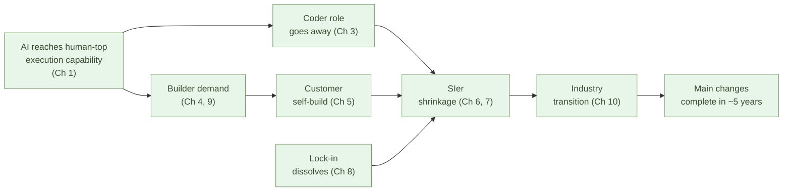

# The Structural Transition Completes in a Few Years

**The final chapter of the Software sub-series. The structural changes
shown across the previous ten chapters are not independent — they
chain together. The chain completes its main part in about five
years, and once a structure has moved, it does not move back**.

But this "complete replacement" only applies in the specific domain of
software development. The boundary is made explicit in the second
half of the chapter.

## The chain of change

Put the claims from Chapters 1 through 10 back in the order in which
they cascade.

- **AI reaches human-top execution capability** (Chapter 1) —
  Codeforces 2700 tier, $200/month
- **The main battleground of maintenance moves to design** (Chapter 2)
- **The role called "coder" goes away** (Chapter 3)
- **A new role — the builder — emerges** (Chapter 4)
- **Customers themselves become builders** (Chapter 5) — nine-tenths
  in-house, only one-tenth outsourced
- **The SIer commission model becomes structurally uneconomic**
  (Chapter 6) — the same effort builds it in-house
- **The price gap runs at orders of magnitude** (Chapter 7) — 10× to
  100×, market displacement, not competition
- **Lock-in dissolves** (Chapter 8) — AI-native standard code, the
  opposite end from Palantir's FDE
- **Companies hire builders** (Chapter 9) — same professional
  position as lawyers and doctors. The supply is not only former
  coders; AI + Python + Flet bring in **the VB / VBA generation,
  makers, shop-floor engineers, and students** as new entrants
- **Multi-tier subcontracting absorbs the transition** (Chapter 10)
  — shrinkage without internal lay-offs

These are not independent observations. **They cascade from one fact
— AI taking execution — in chain**.

Within the chain, what moves fastest is **new projects and
extensions**. What moves slowest is **full replacement of core
business systems**. But both point in the same direction, and the
direction does not reverse.

## Why only coding moves to complete replacement

This is where the **scoping** of the sub-series needs to be made
explicit.

Software development is a broad field — requirements gathering,
design, **coding**, testing, deployment, operations, incident
response, stakeholder coordination. **What AI fully replaces is only
the "coding" inside this list**. The reason: two conditions hold at
once for coding:

1. **The rules are explicit** — language specs, standard-library APIs,
   type systems, syntax — all defined formally and unambiguously.
   There is little interpretive room for "the correct way to write
   it."
2. **Correctness is verifiable** — whether code compiles, whether
   tests pass, whether a competitive-programming problem is solved
   — all checkable mechanically.

When both conditions hold, AI receives, during training, an enormous
volume of feedback both on "did it follow the rules" and "is it
correct." That is why AI reaches superhuman levels **in the coding
domain**.

> AI reaches superhuman levels in **domains where the rules are
> explicit and correctness is verifiable**.
> **"Coding" inside software development** is the textbook case.

The other parts of software development — requirements, design,
operations, incident response, stakeholder work — carry the same
structural 1% problem we will see in self-driving and Shinkansen
later. This is what Chapter 3's "coders go away, builders remain"
means: **coding gets complete replacement; builder work gets
productivity gain** — both happen inside the same field at once.

## Other AI applications stall at the last 1%

In the reverse — **domains where the rules are not explicit, or
correctness is hard to verify** — AI does not advance at the same
speed. Missing either condition is enough to leave a stubborn last 1%.
Three representative domains:

- **Desk work** — 99% of the work (routine documents, email replies,
  meeting-minute summaries, draft research, data organization,
  translation drafts) can be handed to AI. But the last 1% — unwritten
  rules inside the organization, decisions that carry responsibility,
  subtle adjustments with stakeholders, the final judgment of whether
  to submit — determines the quality and the trust of the work.
- **Self-driving** — 99% of situations are no problem. But the
  remaining 1% — an unexpected pedestrian, edge weather judgments, a
  child's ball — is what decides between safety and death. The
  difficulty of moving from 99% to 100% is the substance.
- **Robotics** — 99% of motion (routine assembly, picking, food
  delivery, cleaning, repeated actions) can be mechanized. But the
  last 1% — unexpected object placement, handling soft items, safely
  sharing space with humans, adapting to unknown environments —
  determines real-world usability.

Look at rail — especially Japan's **Shinkansen**, where route and
obstacles are tightly controlled — a **closed system**. Almost all
normal operation can be automated. The rules are explicit; correctness
in normal operation is easy to verify. But the judgment for
**accidents and equipment failures** — derailment, defective
equipment, natural disasters — is the kind of problem that cannot be
enumerated at design time. It still falls to humans. **The last 1%
sits not in the system's openness, but in the unpredictability of
abnormal events** — no matter how closed the system, that part does
not disappear.

This "judgment in abnormal events" is structurally hard for two
reasons:

- **(1) The expansion of what must be anticipated** — enumerate one
  accident or failure, and its variants, combinations, and new
  patterns keep appearing. **The "list of cases we've thought of" is
  always incomplete**; what actually occurs in the field sits outside
  the design-time list. List more and the list grows; stop and the
  gaps remain.
- **(2) The absence of a body** — humans detect anomalies by taking
  in vision, touch, sound, smell, and vibration through the body all
  at once. AI has no body, so **cameras and sensors** have to be
  installed in its place. Each physical quantity to be sensed requires
  its own equipment; placement, power, networking, and maintenance
  costs pile up. And **what to sense in the first place is itself
  another problem of predicting abnormal events** — the anomaly you
  did not anticipate has no sensor on it.

Because (1) and (2) compound, complete replacement in the physical
world — even in a closed system — stays structurally hard.

In these domains, AI delivers enormous value **as a productivity
tool** — document drafts, driver assistance, routine work by
collaborative robots. But **complete replacement does not happen**.
There is a deep valley between "can do 99%" and "can do 100%."

The IT industry's AI narrative often overlooks — or pretends not to
see — this 99/100 valley. Every time AI comes up, lines like "solves
labor shortages across every industry" and "all white-collar work gets
automated" surface. **That is overestimation**.

This sub-series stands apart from that overestimation. **We argue
complete replacement only for one specific area — "coding" inside
software development — where the rules are explicit and correctness
is mechanically verifiable**. We do not claim the same complete
replacement at the same speed in the rest of software development or
in other domains.

> There is a deep valley between "can do 99%" and "can do 100%."
> **"Coding" inside software development** is the area that has
> crossed that valley. Most other areas (including the rest of
> software development) have not.

## The writing of this article is itself the example

Living evidence of this claim sits in **the writing process of this
sub-series itself**.

As Chapter 4 noted, this sub-series was written by one person plus AI
in about a week. But that week included a long list of human
corrections:

- "A few tens of thousands of yen a month" as the price anchor was
  corrected to **Claude Max ($200/mo ≈ ¥30,000/mo)**
- "30,000 lines" of code base was corrected to the measured **6,000
  lines**
- The **abacus (soroban)** was added as the primary example alongside
  the human computer
- The calculator transition was corrected from "decades" to
  **"roughly a decade"**
- Chapter 1 added the **"IT revolution completing"** framing
- The origin of multi-tier subcontracting was correctly attributed to
  **"large coder head-count demand"**
- Chapter 10 added the **"physical goods become scarcer than
  software"** section
- This chapter's scoping — **"complete replacement is only in
  coding"** — was added

All of these are **corrections produced by a human reading the AI's
draft and judging**. AI alone lets factual errors, slanted arguments,
and tonal slips — exactly the kind of problems that cost a reader's
trust — pass through. The level of this sub-series **required human
judgment, in every loop**.

In other words, the writing process of this sub-series carried **the
same structure as desk work, self-driving, and robotics** — AI writes
most of the draft; the human holds judgment and correction.
**Productivity multiplies several times, but complete replacement
does not happen**.

> "Coding is complete replacement; writing is productivity gain" —
> the claim of this sub-series and the writing process of this
> sub-series line up in the same structure.

## The five-year horizon

The "few years" of this sub-series — fix the concrete time scale here.
**The main changes complete in about five years** — that is the
outlook of this book.

Why five? Several independent time scales converge in that band:

- **The AI capability curve** — crossed the threshold in 2024-2025
  (Chapter 1). Capability-wise, transition is already feasible.
- **The customer learning curve** — it takes a few years for
  customers to learn to pair with AI (Chapter 5). It is moving now.
- **The contract-renewal cycle** — SIer long-term maintenance
  contracts typically run 3-5 years. The next renewal becomes the
  evaluation window for replacement (Chapter 8).
- **The pace of multi-tier shrinkage** — without internal employment
  adjustment, shrinkage on the order of a few years is achievable
  (Chapter 10).
- **The historical calculator/abacus transition** — completed in
  about ten years from the 1972 Casio Mini (Chapter 3). The AI shift
  is faster than that.

The band where these overlap is **roughly five years**. Not so slow
that it deserves "ten years," not so fast that it deserves "one to
two." **The main changes complete in about five years** — that is
the concrete time-scale outlook.

But "five years" refers only to the main changes, not everything.
Core-system replacement in regulated industries takes longer. Some
areas will still hold old models after ten years. Even so, **the
mainstream of the industry moves to AI-native within about five years**.

## The transition is irreversible

Finally, confirm the **irreversibility** of the change.

- Once a customer has experienced AI-native in-house development,
  they do not go back to SIer commissioning (Chapter 5) — the
  learning cost has been paid already
- Once an SIer has shrunk its multi-tier subcontracting, it does not
  hire subcontractors back at scale (Chapter 10) — the contracts that
  were closed do not re-form
- Once the builder is recognized as a profession, that role
  definition persists (Chapter 9) — what moved into the position of
  lawyer and doctor does not move back
- The fact that AI generates standard code at low cost does not
  change — the structure of "top-tier coding for $200/month" remains
  in place (Chapter 1)

Each piece moves only in one direction. So the chain as a whole moves
in one direction. **Once the chain starts, no structural force exists
that stops it**.

> The change completing in five years is irreversible.
> It is driven by one-way forces only, so a rewind cannot happen
> structurally.

## In closing

Compress the conclusion of the Software sub-series, all eleven
chapters, into one passage here.

**AI has reached human-top execution capability. This happened
because the domain has explicit rules and verifiable correctness. As
a consequence, the role called "coder" (the role centered on coding)
goes away, and the builder (the judgment-side role) takes its place.
The SIer commission model cannot structurally hold, and within
roughly five years, the mainstream of the industry moves to AI-native
in-house development — irreversibly.**

But this is the story of one specific area: **"coding" inside
software development**. The other parts of software development
(requirements, design, operations, incident response, stakeholder
coordination) carry the same structural 1% problem as self-driving
and Shinkansen — this is where the builder remains. And the same
speed of complete replacement is not claimed for other domains either
(desk work, self-driving, robotics). In those, AI operates as a
productivity tool — it does not reach complete replacement.

And during the same few years that AI advances, **society as a whole
moves toward physical goods becoming scarce** (Chapter 10). AI
data-center construction, manufacturing reshoring, the shift to
natural farming — all generate physical-labor demand. Coders flowing
out of the SIer industry are absorbed both inside and outside the
industry.

What aiseed.dev has argued across the eleven chapters of this
sub-series is:

**A structural transition centered on "coding" inside software
development completes in roughly five years. The transition is
irreversible. And the conclusions from this specific area (= coding)
must not be casually extended to the rest of software development or
to other domains**.

Hold those three, and the IT industry's AI narrative no longer sweeps
you along. You can read what is actually happening, structurally,
calmly. And from the position you stand in — customer commissioning
software, coder, builder candidate, SIer executive — you can decide
what to do over the next few years.

Thank you for reading to the end.

aiseed.dev will continue to publish articles that read the structure.

---

## Related articles

- [Chapter 1: AI Solves the World's Hardest Coding Problems](/en/ai-native-ways/software/coder-top/)
- [Chapter 3: The Coder's Job Goes Away](/en/ai-native-ways/software/coder-end/)
- [Chapter 4: The Builder Role](/en/ai-native-ways/software/builder/)
- [Chapter 10: Japan's SIer Industry Transition and Labor Mobility](/en/ai-native-ways/software/japan-transition/)
- [Phosphorus Depletion and Natural Farming](/en/phosphorus-and-farming/)
- [Structural analysis 08: Subtracting the enterprise-IT tax](/en/insights/enterprise-tax/)
- [Structural analysis 12: AI and the sole proprietor](/en/insights/ai-and-individual/)
