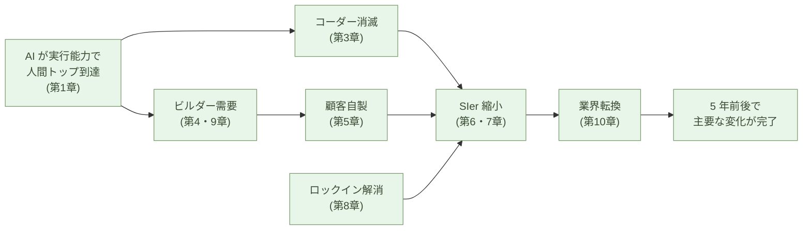

# 数年で完了する構造転換

**ソフトウェア開発編の最終章。これまでの 10 章で示してきた構造
変化は、独立して起きるのではなく連鎖する。連鎖は 5 年前後で主要な
部分が完了し、一度動いた構造は元に戻らない**。

ただし、この「完全置換」が起きるのはソフトウェア開発という特殊な
領域に限った話だ。本章後半でその境界を明示する。

## 変化の連鎖

第1章から第10章までの主張を、変化の順に並べ直す。

- **AI が実行能力で人間トップに到達** (第1章) ── Codeforces 2700 帯、
  月 3 万円
- **保守の主戦場が設計に移る** (第2章)
- **コーダーという役割が消える** (第3章)
- **ビルダーという新しい役割が出現** (第4章)
- **顧客自身がビルダーをやる** (第5章) ── 9 割は内製、1 割だけ外注
- **SIer 委託モデルが構造的に不経済** (第6章) ── 同じ手間で自分で
  作れる
- **価格差が桁違い** (第7章) ── 10倍〜100倍、競争ではなく市場破壊
- **ロックインが解消する** (第8章) ── AI ネイティブな標準コード、
  Palantir FDE の対極
- **各社がビルダーを雇用する** (第9章) ── 弁護士・医師と同位置の
  専門職。供給源は元コーダーだけでなく、AI + Python + Flet で
  参入する **VB/VBA 世代・工作派・現場技術者・学生** にも広がる
- **多重下請けが転換を緩衝する** (第10章) ── 雇用調整なしに縮小可能

これらは独立した観察ではない。**一つの事実 (AI が実行を取る) から、
順に派生して連鎖する**。

連鎖の中で、最も速く動くのは **新規プロジェクトと拡張案件**。最も
遅く動くのは **コア業務システムの全置換**。だが、両方とも同じ方向
を向いており、止まらない。

## なぜコーディングだけが完全置換に向かうのか

ここで、本サブシリーズの **scoping (範囲限定)** を明示する。

ソフトウェア開発は広い領域だ ── 要件定義、設計、コーディング、
テスト、デプロイ、運用、障害対応、関係者調整。**AI が完全に置き
換わるのは、この中の「コーディング」だけ** だ。理由は二つの条件が
同時に満たされるからだ:

1. **ルールが明確** ── 言語仕様、標準ライブラリ API、型システム、
   構文 ── すべてが形式的・明示的に定義されている。何が「正しい
   書き方」かに、解釈の余地が少ない
2. **正解が検証可能** ── コンパイルが通るか、テストが通るか、競技
   プログラミングの問題が解けるか ── すべて機械的に判定できる

この二つが揃った領域では、AI は学習過程で「ルールに従っているか」
と「合っているか」のフィードバックを大量に受け取れる。だから AI は
**コーディングの領域で** 超人間水準に到達する。

> AI が超人間水準に到達するのは、**ルールが明確で、正解が検証可能
> な領域** だ。
> ソフトウェア開発の中の **「コーディング」** が、その典型例だ。

ソフトウェア開発の他の部分 ── 要件定義、設計、運用、障害対応、
関係者調整 ── は、後述する自動運転・新幹線と同じ構造の 1% 問題を
持つ。これが第3章「コーダーは消えるがビルダーは残る」の意味だ
── **コーディングは完全置換、ビルダー業務は生産性向上**、両方が同じ
ソフトウェア開発の中で同時に起きる。

## 他の AI 応用は、last 1% で詰まる

逆に、**ルールが明確でないか、正解の検証が難しい領域** では、AI の
進化は同じ速度では起きない。どちらか一方でも欠ければ、最後の 1% が
残る。代表的な領域を三つ挙げる:

- **デスクワーク** ── 99% の作業 (定型書類、メール返信、議事録要約、
  調査の下書き、データ整理、翻訳の下書き) は AI に任せられる。
  だが、最後の 1% ── 社内の暗黙ルール、責任を伴う意思決定、関係者
  との微妙な調整、最終的な提出可否の判断 ── が、仕事の質と信頼を
  決める
- **自動運転** ── 99% の場面では問題なく走れる。だが、最後の 1%
  ── 予期しない歩行者の動き、悪天候の判定、子供のボール ── が人命
  を左右する。99% を 100% にする難しさが本質
- **ロボット** ── 99% の動作 (定型の組立、ピッキング、配膳、清掃、
  繰り返し作業) は機械化できる。だが、最後の 1% ── 想定外の物体
  配置、柔らかい物の扱い、人間と安全に共存する判断、未知の環境
  への適応 ── が現場での実用性を決める

鉄道、とくに **新幹線** のような経路と障害が統制された **閉じた系**
を見ると、通常運行のほぼ全てが自動化可能になる。ルールが明確で、
正常時の検証もしやすい。だが、**事故や故障時の異常対応** ── 脱線、
設備不具合、自然災害への判断 ── は、設計時に列挙しきれない種類の
問題で、結局人間に残る。**最後の 1% は、系の開放性にではなく、
異常事態の予測不可能性にある** ── 系をどれだけ閉じても、ここは消え
ない。

この「異常事態の判断」が構造的に難しいのは、二つの理由による:

- **(1) 想定の膨張** ── 事故や故障を一つ列挙すると、その派生形・
  組み合わせ・新しいパターンが続々と現れる。**「想定したつもり」の
  リストは常に未完** であり、現場で実際に起こる事態は設計時のリスト
  の外にある。列挙すれば膨らみ、止めれば抜けが残る
- **(2) 肉体の不在** ── 人間は視覚・触覚・聴覚・嗅覚・振動などを
  肉体で同時に受け取って異常を検知する。AI には肉体がないので、
  代わりに **カメラとセンサー** を設置しなければならない。物理量
  ごとに別の機器が要り、配置・電源・通信・保守のコストが積み上がる。
  さらに **何をセンスするか自体が、また異常事態の予測問題** ── 想定
  していない異常は、センサーも置かれていない

(1) と (2) が掛け合わさるため、物理系での完全置換は ── 系を閉じても
── 構造的に困難なままだ。

これらの領域では、AI は **生産性向上の道具** として大きな価値を出す
── 文書ドラフトの生成、運転支援、協働ロボットによる定型作業。
だが **完全置換は起きない**。99% できることと、100% できることの
あいだに、深い谷がある。

IT 業界の AI 言説は、しばしばこの 99/100 の谷を見落とす ── あるい
は、見えないふりをする。AI が話題に上がるたびに「全産業で人手不足
を解消する」「すべてのホワイトカラー業務が自動化される」といった
論調が現れる。**これは過大評価だ**。

本サブシリーズは、この過大評価から距離を置く。**ソフトウェア開発の
中の「コーディング」という特殊な領域 ── ルールが明確で、正解が機械
的に検証できる領域 ── に限って、完全置換が起きると論じている**。
同じ完全置換がソフトウェア開発の他の部分や他領域で同じ速度で起きる
とは主張しない。

> 99% できることと、100% できることのあいだに、深い谷がある。
> ソフトウェア開発の中の **コーディング** がその谷を越えた領域だ。
> 他の多くの領域 (ソフトウェア開発の他の部分も含めて) はそうではない。

## 本記事を書く作業そのものが、その例だ

この主張の生きた証拠は、**本サブシリーズの執筆過程そのもの** にある。

第4章で触れたとおり、このサブシリーズは 1 人 + AI で 1 週間ほどで
書かれた。だが、その 1 週間には、人間による多数の修正が含まれている:

- 「月額数千円」の価格アンカーを Claude Max ($200/月 = 月 3 万円)
  に修正
- コード基盤を「30,000 行」と書いたのを実測 6,000 行に修正
- 計算手の例に **算盤(そろばん)** を主例として追加
- 電卓移行は「数十年」ではなく「およそ十年」と事実を修正
- 第1章に **「IT 革命の成就」** フレーミングを追加
- 多重下請けの起源を **「大量コーダー需要」** と正確に説明
- 第10章に **「ソフトウェアより物が不足する時代」** セクションを追加
- 本章の scoping そのもの ── 「完全置換はコーディングのみ」── を
  追加

これらはすべて、AI に下書きを書かせたあと、**人間が読んで判断した
結果の修正** だ。AI だけでは事実誤認、論旨の偏り、語感のずれ ──
そのまま通すと信頼を失う種類の問題 ── をそのままにしてしまう。
本サブシリーズの完成度は、**人間の判断による修正が不可欠** だった。

つまり、本サブシリーズの執筆作業そのものが、デスクワーク・自動運転・
ロボットと同じ構造を持っていた ── AI が下書きの大半を書き、人間が
判断と修正を握る。**生産性は数倍に上がるが、完全置換は起きない**。

> 「コーディングは完全置換」「執筆は生産性向上」── 本サブシリーズ
> の主張と、その執筆過程そのものが、同じ構造で並んでいる。

## 5 年前後で完了する見通し

本サブシリーズの「数年で完了」── ここで具体的な時間軸を置く。
**5 年前後で主要な変化が完了する** ── これが本書の見通しだ。

なぜ 5 年か。複数の独立した時間軸が、この帯に収束する:

- **AI の能力曲線** ── 2024-2025 年に閾値を超えた(第1章)。能力面
  ではすでに転換可能
- **顧客の学習曲線** ── 顧客が AI と組んで作れるようになるまで数年
  (第5章)。今動いている
- **既存契約の満了サイクル** ── SIer の長期保守契約は典型的に
  3〜5 年。次の更新タイミングで置き換え評価される(第8章)
- **多重下請けの収縮速度** ── 雇用調整なしの収縮なら、数年で実現
  可能(第10章)
- **電卓・そろばん転換の歴史** ── 1972 年 Casio Mini から約 10 年
  で完了した(第3章)。AI 化はそれより速い

これらが重なる帯が、**5 年前後** だ。10 年と言うほど遅くなく、
1〜2 年と言うほど速くもない。**主要な変化が完了するのは 5 年前後** ──
これが具体的な時間軸の見通しだ。

ただし、5 年で終わるのは「主要な変化」であって、すべてではない。
規制業界のコアシステム置換は、もっと時間がかかる。10 年経っても
旧モデルが残る領域はある。だが、**業界の主流が AI ネイティブに
動くのは 5 年前後** だ。

## 不可逆な変化として進む

最後に、変化の **不可逆性** を確認しておく。

- 顧客が一度 AI ネイティブな内製を経験すると、SIer 委託には戻ら
  ない(第5章) ── 学習コストはすでに支払われた
- SIer が一度多重下請けを縮小すると、また下請けを大量採用しない
  (第10章) ── 縮小した契約関係は再構築されない
- ビルダーが専門職として認知されると、その役割定義は持続する
  (第9章) ── 弁護士・医師の位置に動いたものは戻らない
- AI が安価に標準コードを生成する事実は変わらない ── 月 3 万円で
  最上層に届く構造は維持される(第1章)

各々が一方向にしか動かない。だから連鎖全体も一方向だ。**いったん
連鎖が始まれば、止める力は構造的に存在しない**。

> 5 年で完了する変化は、不可逆だ。
> 一方向の力だけで動いているから、巻き戻しは構造的に起きない。

## 結びに

ソフトウェア開発編、全 11 章の結論をここで圧縮する。

**AI が実行能力で人間トップに到達した。これはルールが明確で、正解
が検証可能な領域だから起きた。結果として、コーダー(コーディングを
仕事の中心に置く役割)は消え、ビルダー(判断側の役割)が代わりに
立つ。SIer 委託モデルは構造的に維持できず、5 年前後で業界の主流が
AI ネイティブな内製に移る ── 不可逆に。**

ただし、これは **ソフトウェア開発の中の「コーディング」** という
特殊な領域の話だ。**ソフトウェア開発の他の部分**(要件定義・設計・
運用・障害対応・関係者調整)は、自動運転や新幹線と同じ構造の 1% 問題
を持つ ── ここにビルダーが残る。同じ速度の完全置換が他領域(デスク
ワーク、自動運転、ロボット)で起きるとも主張しない。それらの領域で
は、AI は生産性向上の道具として動く ── 完全置換には至らない。

そして、AI 化が進む同じ数年で、**社会全体としては物が不足する側に
動く**(第10章)。AI データセンター建設、製造業の復活、自然農法
への移行 ── どれも物理労働需要を生む方向だ。SIer から流出する
コーダーは、業界内外で吸収される。

サブシリーズの 11 章を通じて、aiseed.dev が論じてきたのは:

**ソフトウェア開発の中の「コーディング」を中心とする構造転換が、
5 年前後で完了すること。その転換は不可逆であること。そして、この
特殊な領域 (= コーディング) の話を、ソフトウェア開発の他の部分や
他領域に自動的に拡張してはならないこと**。

この三つを持っていれば、IT 業界の AI 言説に流されることなく、
構造として何が起きているかを冷静に読める。そして、自分が立つ場所
── ソフトウェアを発注する顧客であれ、コーダーであれ、ビルダー
候補であれ、SIer 経営者であれ ── から、次の数年に向けた動きを
決められる。

最後まで読んでいただき、ありがとうございました。

aiseed.dev は、これからも構造を読む記事を発信していきます。

---

## 関連記事

- [第1章: AI は、世界で最も難しいコーディング問題を解く](/ai-native-ways/software/coder-top/)
- [第3章: コーダーの仕事はなくなる](/ai-native-ways/software/coder-end/)
- [第4章: ビルダーという役割](/ai-native-ways/software/builder/)
- [第10章: 日本のSIer業界の転換と雇用流動性](/ai-native-ways/software/japan-transition/)
- [リン資源枯渇と自然農法](/phosphorus-and-farming/)
- [構造分析08: 企業ITの税を引く](/insights/enterprise-tax/)
- [構造分析12: AIと個人事業](/insights/ai-and-individual/)
