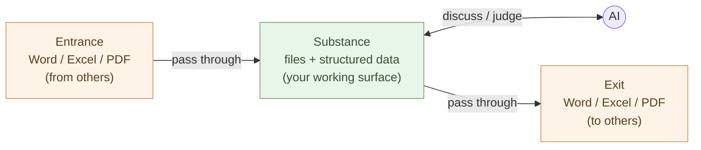

# Take Documents Back — OnlyOffice Docs on PocketBase

Inside the gate (Chapter 3), the first tool to place is **documents.** Word,
Excel, PowerPoint — these are the **input/output tools** people write and
read with, **not where the substance lives.** That role does not change
(Chapter 2). What changes is only **format compatibility and control of the
storage.**

So you don't switch to a new document format. You embed, into your own app, an
editor engine that reads and writes **`docx`, `xlsx`, and `pptx` as-is.**

First, settle the "why." **Office is a thing you "pass through," not "use."**
That single point decides the whole structure of this chapter — choosing a
high-fidelity OnlyOffice, keeping documents as files. Philosophy first,
implementation after.

## Office is a thing you "pass through," not "use"

First, don't misread the reason for leaving Office. **This is not about
efficiency.** "30 minutes of work becomes 30 seconds" — that happens as a side
effect, but it is not the substance.

The substance is this. Divide paperwork into three parts.

- **Entrance**: files arriving from others (Word, Excel, PDF)
- **Substance**: where you think, work, and store
- **Exit**: files going out to others (Word, Excel, PDF)

For most people, all three have lived in Office. A Word file arrives, you open
it in Word, edit it in Word, send it back as Word. But **as long as the
substance lives in Office, AI cannot be a colleague** — as the next section
shows.



So recast `.docx`, `.xlsx`, and `.pptx` as **an exchange format for handing
things to people at the entrance and exit — not the place where the substance
lives.** Office becomes a tool you **"pass through"** at the boundaries, not
one you **"use."** Don't change the organization's rules. **Take back only
control of your own substance.**

> Not efficiency. **Pass Office through as an exchange format, and put control
> of the substance on your own side** — that is where this chapter starts.

This framing decides the chapter's technical choices. Hold control of the
substance while keeping the entrance/exit exchange intact — that is why we
choose OnlyOffice Docs. Because it **reads and writes OOXML (`.docx` / `.xlsx`
/ `.pptx`) as-is with high fidelity,** files received at the entrance and files
handed over at the exit pass through without a format change.

## Inside Office, AI is not a colleague

Why move the substance outside the closed format? Because **as long as you are
inside Office, AI stays a tool and never becomes a colleague.**

Every time you hand a Word file to AI, conversion happens. Unzip the `.docx`,
read the XML, strip the formatting, extract the text. Excel is the same — cell
coordinates, formatting metadata, merged cells, cross-sheet references all sit
between AI and the substance.

The result: AI is **usable** but **not a colleague.** You can ask "read the
whole thing and lay out the points," but the layout breaks; you can ask
"analyze this table," but merged cells and formatted values confuse it. Every
time, you feel you are speaking to "an assistant on the other side of the
Office wall."

The moment you drop the substance down to structured text and data, that wall
disappears. AI reads it directly, writes it directly, returns thoughts. **It
feels like working next to a colleague.** Office as an editing tool — a person
opening and reading an `.xlsx` — still stays; only the substance is kept where
AI can touch it. The detailed practice of holding tables as data is in
Chapter 2.

> Not efficiency. **The relationship with AI changes** — that is the reason to
> bring the substance outside Office.

## From "processor" to "decider"

As long as paperwork happens inside Office, you remain **"the processor"** —
the person who aggregates Excel, formats Word, tidies PowerPoint, re-pastes
numbers. These are jobs AI can replace, and once AI gets cheaper, the
organization withdraws people from those roles.

Bring the substance down into structure, and your role changes — to the person
who decides **what should be done,** judges **how to interpret,** designs **new
mechanisms,** and decides **what to ask AI.** AI takes on "drafting,
processing, formatting"; the person spends time on **judgment and direction.**
Not the **quantity** of work but **the content of the work itself** changes.

> AI replaces "processors." AI cannot replace "deciders." Taking the substance
> back is **moving to the side that is not replaced.**

### A concrete example: the monthly report — same report, different work

Take "the monthly sales report."

**Old flow** (Office-centered): open the sales data in Excel → build a pivot
table → make a chart → paste into Word → write the prose → convert to PDF →
email the boss. The job you are doing here is **"tidying numbers."**

**New flow** (structured substance): read the data behind it (incoming `.xlsx`
is taken in by machine) → have AI write the aggregation, output as a Markdown
table → embed the chart → AI drafts the prose → **you add interpretation and
judgment** → convert to `.docx` or PDF at the exit. The job you are doing here
is **"thinking about what the numbers mean."**

"This month's +12% MoM — which customer caused it? Will it continue? Should
sales strategy change?" — questions that did not surface while clicking through
pivot operations in Excel **rise on their own** in front of structured local
data and AI. Whether time was saved is not the substance. **The content of the
work changed, and the system came back to your side** — that is the substance.
Efficiency only happens as a side effect.

## For the sake of organizational diversity — and consideration for boss and colleagues

Taking the substance back to your own side is not only an individual matter.
When a whole organization sits on the same cloud, the provider need only
**change its data policy** for everyone's data to flow in the same direction,
and if the AI **homogenizes judgment criteria,** diversity disappears from the
organization. This is the **single point of failure (SPOF) everyone sits on**
that the prologue described. When each person holds their own tools and
substance, any one part can go down and the others keep moving — **diversity
itself becomes strength.**

> Not efficiency. **Autonomy and diversity.**

Here is where OnlyOffice keeping OOXML compatibility pays off. No need to worry
that "I alone am producing strange documents." Convert to `.docx` at the
exit — or rather, **OnlyOffice saves as `.docx` / `.xlsx` / `.pptx` in the
first place** — so your boss and colleagues receive the same files as before.
**No one notices the process changed.** What does change visibly is the
**quality of judgment** in the output. Keep the formats; take back only
control — and from here is the "how."

## Why not add a separate storage app

"Documents" tempts you to stand up a whole OneDrive replacement like Nextcloud.
But Nextcloud is a heavyweight PHP monolith — **old-style heavy software** —
that drags in a separate user system and a separate database. It runs against
the **single-binary lightness** this Setup part has chosen (PocketBase,
Stalwart, Forgejo).

In Chapter 3 you already stood up **PocketBase,** which carries auth. For
storage, **make it the gate and keep the rest as files.**

- **The file itself** — plain files on your own storage; no heavy storage app
- **Auth** — the Chapter 3 gate (PocketBase) applies directly (no second login)
- **Permissions / sharing** — carried by the file itself (xattr); the gate verifies identity

What you add is **only the editor engine.** OnlyOffice ships "Docs (the
Document Server)" as a standalone editing engine, leaving storage to any app.
So **lay OnlyOffice Docs over files guarded by the gate (PocketBase)** — this is
the thinnest path.

## Choose Docs — not DocSpace

OnlyOffice also offers a finished platform, **DocSpace.** But **don't choose
it,** for two reasons.

- **It brings Active Directory back** — DocSpace is built around LDAP / AD / SAML SSO. The **Microsoft authentication (AD) you cut in Chapter 3 moves right back in.**
- **The free edition caps at 20 concurrent connections** — DocSpace Community limits simultaneous editing tabs to 20. Grow past it and you are pushed to the paid Enterprise edition — the doorway to lock-in.

What you need is **only the editor engine.** And there is good news — **Docs 9.4
removed the 20-connection limit from the Community edition** (the engine alone is
now unlimited). It also dropped its RabbitMQ and separate-DB dependencies and
became a **single process.** Paired with PocketBase (a single binary),
enterprise-grade co-editing is in hand **for free, and light.**

> The platform (DocSpace) brings AD along in exchange for convenience.
> **Take only the engine (Docs); leave authentication to the Chapter 3 gate.**

## Stand up OnlyOffice Docs

Stand up the editor engine **OnlyOffice Docs.** It only edits; it holds no
files of its own. Set one **JWT secret** to prevent tampering.

```yaml
# compose.yaml — stand up only the editor engine
services:
  onlyoffice:
    image: onlyoffice/documentserver:latest
    environment:
      JWT_SECRET: change-me        # signing key shared with PocketBase
    restart: always
```

It opens `docx`, `xlsx`, and `pptx` without layout breakage, saves in the same
formats, and supports **co-editing** by several people — that engine is now in
hand.

For internal use, the Community edition (AGPLv3) is fine. **Only if you resell it
as your own SaaS** do you need to mind AGPL's copyleft and attribution (naming
ONLYOFFICE in the UI) — there, consider a commercial license.

## Documents are files — auth at the gate, permissions in xattr

A document's body is **just a file** on your own storage. Rather than embed it
as a blob in a PocketBase record, keep `docx`, `xlsx`, and `pptx` as files — so
that machines (Polars, AI) can read them directly later.

- **The body** — a file on the filesystem (your own storage)
- **Auth** — the Chapter 3 gate (PocketBase) verifies who
- **Permissions** — carried by the file itself — extended attributes (xattr)

```bash
# permissions ride on the file itself, not a separate DB
setfattr -n user.ws.perm    -v 'team:rw' quote_2026.xlsx
setfattr -n user.ws.creator -v 'alice'   quote_2026.xlsx
```

No separate database just for permissions. **The gate holds identity; the file
holds permission** — split by role.

## Connect — open and save

Opening a document from the list launches the OnlyOffice editor in the browser.
The app passes only **where the file is** and **where to save (the callback),**
signed with JWT, to the engine.

```js
// open the editor — hand the engine a signed config
new DocsAPI.DocEditor("editor", {
  document:     { url: fileUrl, key: docId },          // where the file is
  editorConfig: { callbackUrl: saveBackUrl },          // save target (write back to the file)
  token:        jwt,                                    // signed with JWT_SECRET
})
```

When a person finishes editing, OnlyOffice Docs **returns the edited file to the
callback,** and you write it back to the **original file.** The engine handles
co-editing reconciliation. All the app writes is these few lines of hand-off.

## The gate stays — no second login

This is the biggest win of building it your own way. **Auth comes straight from
the Chapter 3 gate, and permissions ride on the file (xattr),** so there is no
second account like Nextcloud's and no separate permissions database. Who can
open which document is decided by the identity the gate verifies and the
permission stamped on the file.

## Migrate existing documents

Documents piled in OneDrive and SharePoint move **without a format change.**
OnlyOffice Docs opens `docx`, `xlsx`, and `pptx` as-is, so no conversion is
needed.

```bash
# pull down with rclone and lay the files on your own storage
rclone copy onedrive:Documents ./inbox --progress
# stamp permissions on each file in inbox/ with xattr (one script)
```

Migrate gradually. **Run both in parallel and cancel the old storage once the
move is done** (Chapter 9).

## People use OnlyOffice; machines use Polars

Here is the link back to Chapter 2. **People enter and read in OnlyOffice (Excel
format); machines crunch the data behind it with Polars and DuckDB.** The same
`.xlsx` is an editing tool to a person and an input to a machine — split by role.

- Summary sheets, request forms, proposals people make — open and store in OnlyOffice Docs
- Million-row reconciliations, company-wide rollups — Polars reads the `.xlsx`, writes PostgreSQL

The spreadsheet returns to being "the human's tool," and heavy processing moves
to "the machine's tool."

> Don't add separate apps for either the format or the storage.
> **Keep it as a file, leave only auth to the gate, and embed only the editor engine.**

## Reference implementation — kura

This setup is actually built in the public repo **kura** (`aiseed-dev/workspace`)
— a self-hosted Microsoft 365 / Google Workspace alternative aimed at serious
SME use (about 100 users per instance, distributed for more). It maps straight
onto this chapter:

- **Auth** — PocketBase (pluggable token validation + short-lived cache)
- **Permissions** — file xattr (`user.ws.perm` / `user.ws.creator`), no permissions DB
- **The body** — the file itself ("the AI interface is files")
- **Editing** — OnlyOffice Docs over JWT and callbacks (FastAPI + Flet)

This chapter is that design put into words. To see the code, read kura.

## Summary

Files as they are, only auth at the gate. Take back only control of the substance.

- **Office passes through** — `docx`, `xlsx`, `pptx` are an exchange format for the entrance and exit. Keep the substance where AI can touch it, and move from "the processor" to "the decider"
- **OnlyOffice Docs** — an editor engine for `docx`, `xlsx`, `pptx` with high fidelity (holds no storage); OOXML-compatible, so you can still hand anyone a plain `.docx`
- **The body is a file** — on your own storage, readable directly by machines (Polars, AI)
- **Auth at the gate (PocketBase) / permissions in xattr** — no separate permissions DB
- **Embedding is a few lines** — hand over the file location and save target, signed with JWT
- **People vs. machines** — people use OnlyOffice Docs, machines use Polars / DuckDB

No separate storage app — **files as they are, embedded into the gate you already
have.** Office became a thing you pass through, and control of the substance came
back to your side. Next, we put another large part of paperwork — **mail** — on
our own side (Chapter 6). Inside Outlook the dialogue with AI cannot happen; the
moment you export and bring it to your desk, the dialogue begins.

---

## Related articles

- [Chapter 2: Lay the Foundation — SQLite, PostgreSQL, pgvector, DuckDB, Polars](/en/ai-native-ways/software/foundation/)
- [Chapter 3: Stand Up the Gate — One Login with PocketBase](/en/ai-native-ways/software/auth/)
- [Reference implementation kura — a self-hosted Microsoft 365 / Google Workspace alternative](https://github.com/aiseed-dev/workspace)
- [Chapter 1: Becoming Independent from Microsoft and Google — The Whole Map](/en/ai-native-ways/software/independence/)
