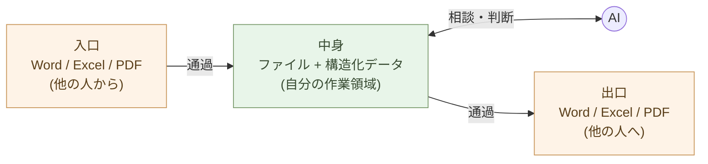

# 文書を取り戻す ── OnlyOffice Docs を PocketBase に組み込む

門番(第3章)の内側に、最初に置く道具は **文書**だ。Word・Excel・
PowerPoint ── これらは、人が書き、人が読む **入出力の道具**であって、
**中身を置く場所ではない**。その役割は変わらない(第2章)。変えるのは、
**形式の互換と、置き場の主導権**だけだ。

だから新しい文書形式に乗り換えるのではない。**`docx`・`xlsx`・`pptx` を
そのまま**読み書きできる編集エンジンを、自分のアプリに組み込む。

その「なぜ」を先に詰める。**Office は『使う』のではなく『通過させる』**
── この一点が、本章の構成すべて(高互換の OnlyOffice を選ぶこと、ファイル
のまま持つこと)を決める。先に思想を、あとに実装を置く。

## Office は「使う」のではなく「通過させる」

Office から離れる理由を、まず誤解しないでほしい。これは
**効率化の話ではない**。「30 分の作業が 30 秒に」── それは結果として
起きるが、本質ではない。

本質はこれだ。事務処理を三つに分ける。

- **入口**: 他の人から届くファイル(Word、Excel、PDF)
- **中身**: 自分が考え、作業し、保存する場所
- **出口**: 他の人に渡すファイル(Word、Excel、PDF)

これまで多くの人は、入口・中身・出口のすべてを Office で行ってきた。
Word が来たら Word で開いて、Word のまま編集して、Word のまま返す。
だが **中身まで Office にしている限り、後で見るとおり AI は同僚になれない**。



だから `.docx`・`.xlsx`・`.pptx` は、**中身が住む場所ではなく、入口と
出口で人とやり取りするための交換形式**だと捉え直す。Office は「使う」
道具ではなく、**入口と出口を「通過させる」道具**になる。組織のルールは
変えない。**自分の中身の主導権だけ取り戻す**。

> 効率化ではない。**Office を交換形式として通過させ、中身の主導権を
> 自分の側に置く** ── これが本章の出発点だ。

この捉え方が、本章の技術選択を決める。中身の主導権を握りつつ、入口・
出口の交換は壊さない ── そのために OnlyOffice Docs を選ぶ。**OOXML
(`.docx`/`.xlsx`/`.pptx`)を高い互換でそのまま読み書きする**から、
入口で受けたファイルも、出口で渡すファイルも、形式を変えずに通過させ
られる。

## Office の中では、AI は同僚にならない

なぜ中身を閉じた形式の外へ出すのか。**Office の中にいる限り、AI は
道具のままで、同僚にはならない**からだ。

Word ファイルを AI に渡しても、毎回変換が起きる。`.docx` を解凍し、
XML を読み、書式を剥がして、テキストを取り出す。Excel も同じ ── セル
の座標、書式情報、結合セル、シート間の参照が、AI と中身の間に挟まる。

結果として、AI は **使える** が、**同僚にはならない**。「全文を読んで
論点を整理して」と頼めてもレイアウトが崩れ、「この表を分析して」と
頼めても結合セルや書式付き値で混乱する。毎回「Office の壁の向こう側に
いる助手」に話しかける感覚が抜けない。

中身を構造化テキスト・構造化データに降ろした瞬間、この壁が消える。AI
は直接読み、直接書き、考えを返す。**「同僚と隣で作業する」感覚に変わる**。
編集の道具としての Office(`.xlsx` を人が開いて読む)はそのまま残る ──
ただし中身は AI が触れる場所に保つ。表をデータとして持つ詳しい作法は
第2章にある。

> 効率化ではない。**AI との関係性が変わる** ── これが中身を Office の
> 外に出す理由だ。

## 「処理する人」から「判断する人」へ

Office の中で事務処理をしている限り、自分は **「処理する人」** の
ままだ ── Excel を集計する人、Word を整える人、PowerPoint を整形する人、
数字を貼り直す人。これらは AI で代替できる仕事であり、AI が安くなれば、
組織はその役割から人を引き上げる。

中身を構造に降ろすと、自分の役割が変わる ── **何をすべきか** を考え、
**どう解釈するか** を判断し、**新しい仕組み** を設計し、**AI に何を頼むか**
を決める人へ。AI が「下書き・処理・整形」を引き受け、人は **判断と方向
付け** に時間を使う。仕事の **量** ではなく、仕事の **中身そのもの** が
変わる。

> 「処理する人」は AI が代替する。
> 「判断する人」は AI が代替できない。
> 中身を取り戻すことは、**代替されない側に移ること**だ。

### 具体例: 月次報告書 ── 同じ報告書、違う仕事

「月次の売上報告書」を作る作業で見る。

**従来の流れ**(Office 中心): Excel で売上データを開く → ピボットで集計
→ グラフを作る → Word に貼る → 文章を書く → PDF にして上司に送る。
このとき自分のしている仕事は **「数字を整える」**。

**新しい流れ**(中身は構造化): 裏のデータを読み(届いた `.xlsx` は機械
が取り込む)→ 集計を AI に書かせ、結果を Markdown 表に → グラフを組み込み
→ AI が文章を下書き → **自分が解釈と判断を書き加える** → 出口で `.docx`
や PDF に変換。このとき自分のしている仕事は **「数字の意味を考える」**。

「今月の前月比 +12% は、どの顧客の影響か。継続するのか。営業戦略を
変えるべきか」── Excel の中で集計操作をしている間は出てこなかった問いが、
構造化された手元データと AI を前にすると **自然と立ち上がる**。時間が
減ったかどうかは本質ではない。**仕事の中身が変わり、システムが自分の
手元に戻った** ── これが本質だ。効率化はおまけとして起きるだけだ。

## 組織の多様性のために ── そして上司・同僚への配慮

中身を自分の側に取り戻すことは、個人だけの話ではない。組織全体が同じ
クラウドに乗ると、提供者が **データポリシーを変える** だけで全員のデータ
が同じ方向に流れ、AI が **判断基準を画一化** すれば組織から多様性が
消える。序章で言う **単一障害点(SPOF)に全員が乗る** 状態だ。ひとり
ずつが自分の道具と中身を持てば、誰か一つが倒れても他は動き続ける ──
**多様性そのものが強さ**になる。

> 効率化ではない。**自立と多様性**。

ここで OnlyOffice が OOXML 互換を保つことが効いてくる。「自分だけ変な
書類を作っている」と思われる心配は要らない。出口で `.docx` に変換すれ
ば ── というより **OnlyOffice はそもそも `.docx`/`.xlsx`/`.pptx` のまま
保存する**ので ── 上司にも同僚にも、今までと同じファイルがそのまま渡る。
**プロセスが変わったことに、誰も気づかない**。逆に、出力の **判断の質**
は目に見えて上がる。形式は変えず、主導権だけ取り戻す ── ここからが、その
「どう」だ。

## なぜ別の保管アプリを足さないのか

文書というと Nextcloud のような「OneDrive 代替」を丸ごと立てたくなる。
だが Nextcloud は、PHP の重厚なモノリスで、**旧来型の重いソフト**だ。
別のユーザ体系・別のデータベースまで抱え込む ── この導入編が選んできた
**単一バイナリの軽さ**(PocketBase・Stalwart・Forgejo)とは、逆を向いている。

第3章で、認証を持つ **PocketBase** をもう立てた。文書の置き場は、**それを
門番にして、あとはファイルで足りる**。

- **実体** ── ファイルそのもの(自分のストレージ)。重い保管アプリは要らない
- **認証** ── 第3章の門番(PocketBase)がそのまま効く(別ログインを作らない)
- **権限・共有** ── ファイル自身(xattr)が持ち、門番が身元を確かめる

足すのは、**編集エンジンだけ**だ。OnlyOffice は「Docs(Document
Server)」という編集エンジンを単体で提供していて、保管は任意のアプリに
任せられる。だから **門番(PocketBase)で守ったファイルに、OnlyOffice Docs
を重ねる** ── これがいちばん薄い。

## Docs を選ぶ ── DocSpace は選ばない

ONLYOFFICE には、完成品のプラットフォーム **DocSpace** もある。だが、これは
**選ばない**。理由は二つだ。

- **Active Directory を呼び戻す** ── DocSpace は LDAP / AD / SAML SSO を前提に
  作られている。第3章でせっかく切った **Microsoft の認証(AD)が、また居座る**
- **無料版に同時接続20の制限** ── DocSpace Community は、同時に開ける編集タブが
  20までに制限される。増えればエンタープライズ版(有償)へ ── ロックインの入口だ

要るのは、**編集エンジンだけ**だ。そして朗報がある ── **Docs 9.4 で、
Community 版の「同時接続20」制限が撤廃された**(エンジン単体では無制限)。
さらに RabbitMQ や別 DB への依存も外れ、**単一プロセス**になった。PocketBase
(単一バイナリ)と組めば、エンタープライズ級の同時編集が、**無料で・軽く**
手に入る。

> プラットフォーム(DocSpace)は、自由と引き換えに AD を連れてくる。
> **エンジン(Docs)だけを取り、認証は第3章の門番に委ねる**。

## OnlyOffice Docs を立てる

編集エンジン **OnlyOffice Docs** を立てる。これは編集だけを担い、ファイル
そのものは持たない。改ざん防止に **JWT の秘密鍵**を一つ設定する。

```yaml
# compose.yaml ── 編集エンジンだけを立てる
services:
  onlyoffice:
    image: onlyoffice/documentserver:latest
    environment:
      JWT_SECRET: change-me        # PocketBase 側と共有する署名鍵
    restart: always
```

`docx`・`xlsx`・`pptx` を、レイアウト崩れなく開き、同じ形式で保存し、
複数人で **同時編集**できる ── そのエンジンが、これで手に入る。

社内で使う分には、Community 版(AGPLv3)で問題ない。**自社 SaaS として
外販する場合だけ**、AGPL のコピーレフトと表示義務(画面に ONLYOFFICE を
明記)に注意する ── そこは商用ライセンスを検討する。

## 文書はファイルで持つ ── 認証は門番、権限は xattr

文書の実体は、**ただのファイル**として自分のストレージに置く。PocketBase の
レコードに blob として埋め込むのではなく、`docx`・`xlsx`・`pptx` をファイルの
まま持つ ── そのほうが、後で機械(Polars・AI)がそのまま読める。

- **実体** ── ファイルシステム上のファイル(自分のストレージ)
- **認証** ── 第3章の門番(PocketBase)が「誰か」を確かめる
- **権限** ── ファイル自身に持たせる ── 拡張属性(xattr)

```bash
# 権限は、別 DB ではなくファイル自身に貼る
setfattr -n user.ws.perm    -v 'team:rw' 見積_2026.xlsx
setfattr -n user.ws.creator -v 'alice'   見積_2026.xlsx
```

権限のためだけの別データベースは要らない。**門番が身元を、ファイルが権限を**
持つ ── 役割を分ける。

## つなぐ ── 開いて、保存する

一覧から文書を開くと、ブラウザに OnlyOffice の編集画面が立ち上がる。
アプリは **ファイルの場所**と **保存先(コールバック)**を、JWT で署名して
エンジンに渡すだけだ。

```js
// 編集画面を開く ── 署名つきの設定をエンジンに渡す
new DocsAPI.DocEditor("editor", {
  document:     { url: fileUrl, key: docId },          // ファイルの場所
  editorConfig: { callbackUrl: saveBackUrl },          // 保存先(ファイルへ書き戻す)
  token:        jwt,                                    // JWT_SECRET で署名
})
```

人が編集を終えると、OnlyOffice Docs が **コールバックに編集後ファイルを
返し**、それを **元のファイルへ書き戻す**。同時編集の調停は、エンジンが
引き受ける。アプリが書くのは、この受け渡しの数行だけだ。

## 門番はそのまま ── 別ログインを作らない

ここが「独自に組む」最大の利点だ。**認証は第3章の門番がそのまま効き、
権限はファイル(xattr)が持つ**ので、Nextcloud のような別アカウントも、
権限のための別データベースも要らない。誰がどの文書を開けるかは、門番が
確かめた身元と、ファイルに貼った権限だけで決まる。

## 既存の文書を移す

OneDrive・SharePoint に積まれた文書は、**形式を変えずに**運べる。
`docx`・`xlsx`・`pptx` は OnlyOffice Docs がそのまま開くので、変換は要らない。

```bash
# rclone で吸い出し、自分のストレージへ並べる
rclone copy onedrive:Documents ./inbox --progress
# inbox/ の各ファイルに xattr で権限を貼る(スクリプト一回)
```

移行は段階的でよい。**並行で動かし、移り終えてから旧ストレージを
解約する**(第9章)。

## 人は OnlyOffice、機械は Polars

ここで第2章とつながる。**人は OnlyOffice(Excel 形式)で入れて読み、
機械は Polars と DuckDB で裏のデータを捌く**。同じ `.xlsx` を、人は編集の
道具として、機械は入力として扱う ── 役割で分ける。

- 人が作る集計表・申請書・提案書 ── OnlyOffice Docs で開いて、しまう
- 数百万行の突き合わせ・全社集計 ── Polars が `.xlsx` を読み、PostgreSQL に書く

表計算は「人の道具」に戻り、重い処理は「機械の道具」へ移る。

> 文書形式も置き場も、別物を足して増やさない。
> **ファイルのまま置き、認証だけ門番に委ね、編集エンジンだけを組み込む**。

## 参考実装 ── kura

この構成を実際に組んだのが、公開リポジトリ **kura**(`aiseed-dev/workspace`)
だ。中小の業務利用(1 インスタンス約 100 人、増えれば分散)を狙った、
Microsoft 365 / Google Workspace の自前代替で、本章とそのまま重なる。

- **認証** ── PocketBase(差し替え可能なトークン検証＋短期キャッシュ)
- **権限** ── ファイルの xattr(`user.ws.perm` / `user.ws.creator`)、権限 DB を持たない
- **実体** ── ファイルそのもの(「AI との接面はファイル」)
- **編集** ── OnlyOffice Docs を JWT・コールバックで重ねる(FastAPI + Flet)

本章は、この設計を言葉にしたものだ。コードで見たければ、kura を読めばいい。

## まとめ

ファイルのまま、認証だけ門番に。中身の主導権だけ取り戻す。

- **Office は通過させる** ── `docx`・`xlsx`・`pptx` は入口・出口の交換形式。中身は AI が触れる場所に保ち、自分は「処理する人」から「判断する人」へ
- **OnlyOffice Docs** ── `docx`・`xlsx`・`pptx` を高互換で開く編集エンジン(保管は持たない)。OOXML 互換だから上司にも `.docx` のまま渡せる
- **実体はファイル** ── 自分のストレージに置き、機械(Polars・AI)がそのまま読める
- **認証は門番(PocketBase)/権限は xattr** ── 権限のための別 DB を持たない
- **組み込みは数行** ── ファイルの場所と保存先を JWT で署名して渡すだけ
- **人と機械の分担** ── 人は OnlyOffice Docs、機械は Polars / DuckDB

別の保管アプリを足さず、**ファイルのまま、手元の門番に組み込んだ**。
Office は「通過させる」道具になり、中身の主導権は自分の側に戻った。次章
では、もう一つの大きな事務処理 ── **メール**を自分の側に置く(第6章)。
Outlook の中にいる限り AI との対話は成立しない ── エクスポートして手元に
持ってきた瞬間、対話が始まる。

---

## 関連記事

- [第2章: 土台を据える ── SQLite・PostgreSQL・pgvector・DuckDB・Polars](/ai-native-ways/software/foundation/)
- [第3章: 門番を立てる ── PocketBase で認証を一つに](/ai-native-ways/software/auth/)
- [参考実装 kura ── 自前の Microsoft 365 / Google Workspace 代替](https://github.com/aiseed-dev/workspace)
- [第1章: Microsoft と Google から自立する ── 全体像と対応表](/ai-native-ways/software/independence/)
