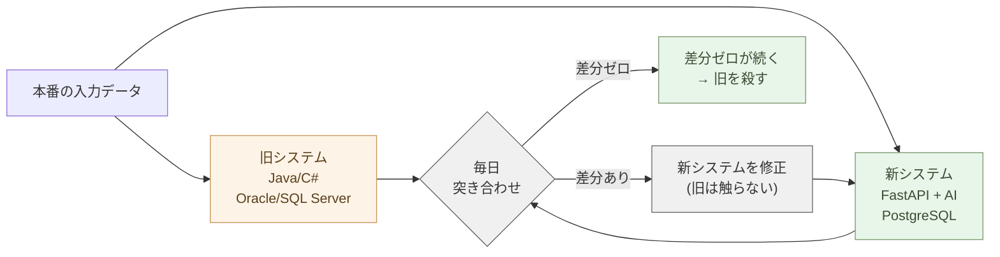

# API を作る ── FastAPI で基幹のロジックを出す

自立編の OSS で、汎用は揃った ── 認証、文書、メール、会議、公開Web。残るのは
**自社固有のロジック**、つまり基幹システムの中身だ。

その基幹は、たいてい古い。Java や C# で書かれ、Oracle や SQL Server に乗り、
誰も全部は理解していない。これを **並行稼働で書き換え**、自社固有のロジックを
**FastAPI** で一箇所の API として出す ── これが本章のやることだ。手法は
基幹を殺す段取り、道具は FastAPI。順に見ていく。

## 「壊すな」「触るな」は古い助言だ

過去 20 年、基幹システムを担当する人間に与えられてきた助言は、こうだ。

「壊すな」「触るな」「動いているものに手を入れるな」「既存資産を活かせ」。

これは、**書き換えのコストが高すぎた時代の助言**だった。書き換えに数年・数億円
かかる時代には、「動いているものは触らない」が確かに正解だった。

時代が変わった。

AI が業務ロジックを Python に翻訳できる。AI が SQL の意図を Markdown で書き出せる。
AI がテストデータを生成できる。AI がドキュメント無しのコードからルールを抽出できる。
**書き換えのコストが、10 分の 1 になった**。

10 分の 1 になったコストで、まだ「触るな」と言うのは、新しい現実を無視している。
**残す理由は、もう無い**。

## 並行稼働の論理

書き換えのコストが下がったとはいえ、リスクはゼロではない。新システムが旧システムと
完全に同じ動きをする保証は、どんな手法でも与えられない。

そこで、**並行稼働**だ。

新システムを AI で作る。旧システムはそのまま動かす。同じ入力を両方に流す。出力を
比較する。



A と B が一致するなら、新システムは正しい。一致しないなら、どちらかが間違っている。
**だいたい、旧システムに 20 年前から残っていたバグが先に見つかる**。ドキュメントに
書かれていなかったバグだ。

これを 1 ヶ月、3 ヶ月続ける。差分がゼロになり、想定外のケースもカバーされたと確認
できたら、旧システムを止める。

並行稼働は、書き換えのリスクを **実測** で潰す手段だ。机上の検証ではない。仕様書の
レビューではない。**本番環境で、実データで、動かして確かめる**。

## 旧システムをいつまで残すか

並行稼働の期間は、長くて 6 ヶ月、ふつう 3 ヶ月もあれば充分だ。

それ以上長く並行稼働させる必要があるなら、そもそも新システムが正しくない。新システム
を直す。**並行稼働を「ずっと」やってはいけない**。

組織の中には「旧システムを念のため残しておく」という心理が働く。これは罠だ。残し
続けると:

- 運用コストが二重になる
- 担当者が分散する
- トラブル時にどちらの責任か揉める
- 新機能が両方に必要になり、書く量が二倍になる
- いつか旧を殺す決断が、永遠に先送りされる

> 並行稼働は手段であって、目的ではない。新が正しいと分かったら、旧を殺す。

殺せないなら、最初から書き換えるべきではなかった。**やる時はやる**。

「既存資産を活かしつつ AI で補う」── これは、結局、旧システムが残り続けることを許容
する考え方だ。新しい機能は外側に積み上がり、中身は古いまま。3 年経っても 5 年経っても、
組織は AI ネイティブにならない。**中途半端な共存は、組織を硬直させる**。「補う」が
許されるのは、書き換えコストが本当に高すぎた過去の話だ。今は違う。

## ベンダー製品をどう殺すか

Oracle、SAP、Salesforce、Microsoft の業務製品 ── これらは「製品」を売っているのでは
ない。「**製品を使い続けないといけない状況**」を売っている。

並行稼働で殺すパターン:

1. 製品からデータを毎日エクスポートする(製品はそのまま動かす)
2. AI で書いた新システムが、エクスポートを処理して同じ業務を回す
3. 同じ業務指標(売上、在庫、顧客状態)を、両方で計算する
4. 数字が一致したら、**製品契約を更新しない**
5. 製品から「全データエクスポート」を最後にもらって、新システムに完全移行

**契約更新時期に間に合わせる**。これは戦略的なスケジュールだ。10 月に契約更新が
あるなら、6 月までに並行稼働を始める。3 ヶ月走らせて、9 月に意思決定。

ベンダーは「移行リスク」「データ整合性」「ベテラン担当者の引き止め」── あらゆる
カードで引き止めにかかる。並行稼働で同じ出力が出ていれば、それらは全部反論できる。
**証拠が手元にある**。ライセンス料は年に数千万円単位だ。それを止められれば、新システム
の開発コストは数ヶ月で回収できる。

## 業務知識を一気に Markdown に出す

並行稼働の準備として、業務知識を Markdown に出す。**一気にやる**。

これまでの常識では、業務知識のドキュメント化は数ヶ月から数年がかりのプロジェクト
だった。担当者が空き時間に少しずつ書く。半分も書き終わらないうちに、書いた人が異動
する。途中で頓挫する。**結局、書かれない**。

時代が変わった。

旧システムのコード、コメント、SQL、運用手順書、過去の障害報告 ── これらを **全部**
Claude に渡す。「業務ロジックを抽出して Markdown で整理しろ」と頼む。数千行の
コードベースなら、数時間で初版が出る。数万行でも、数日で完了する。

完璧でなくていい。**80% で十分**。残り 20% は、並行稼働中に出力差分として現れる。
差分を一つずつ潰していけば、業務知識は完成する。

> 数ヶ月の作業を、数日に圧縮する。これが AI の本領だ。

これが、並行稼働の隠れた効用でもある。**書かれていなかった業務ルールが、並行稼働で
全部炙り出される**。机上で書かれた仕様書には現れない、実運用で初めて分かるルール ──
これが、Claude による初版 Markdown と、並行稼働の出力差分の両方から、引き出される。
（文書を自分の側に取り戻す話は 2-05 で扱った。基幹の業務知識もまた、同じく
読める素材に落ちる。）

## 業務ルールは現場にある ── 現場がテストを書く

書き換えを誰がやるか。

これまでの常識: IT 部門、SI ベンダー、コンサルタントが、現場から仕様を聞き取って、
コードを書く。書き終わったら現場が受け入れテストをする。これは、書き換えに必要な
知識が分散していた時代のかたちだ。**コードを書く能力は IT 部門に、業務ルールの知識は
現場に**、それぞれ偏在していた。

今は違う。

**コードを書く能力は、Claude が持っている**。残るのは業務ルールの知識だけだ。そして、
業務ルールを最も深く知っているのは、毎日その業務を回している現場の人間である。現場の
人間が、Claude にコードを書かせる。**これで完結する**。途中の伝言ゲームが要らない。

並行稼働で重要なのは、出力差分を見つけることだ。「新システムが旧と同じ出力を出すか」
── これを判定するためのテストデータが要る。このテストデータを作るのに、最も向いて
いるのが現場の人間だ。

「7 月の請求は 10 日締めだが、お盆休みを考慮して翌月 5 日まで延長する」── このルールを
知っている現場の人間が、Claude にこう頼む: 「7 月のお盆延長を考慮した請求テストデータ
を 50 件作って」。Claude が作る。実際に旧システムを通して、期待出力を生成する。これが
テストデータになる。

机上の仕様書には書かれていなかったルールが、テストの形で実体化する。**業務知識が、
現場からテストへ、そしてコードへと流れる**。これは、IT 部門には絶対に書けないテスト
だ。彼らはルールを知らない。**ルールを知らない者がテストを書くから、書き換えは失敗
してきた**。

## 委託は止める

ここまで来ると、結論は明白だ。

**基幹システムの書き換えを、IT ベンダーやコンサルタントに委託する必要は無い**。

委託の伝統的な根拠は二つだった: (1) コードを書く能力が外側にしかない。(2) 業務ルール
の知識を外側に伝える必要がある。(1) は、Claude が解決した。(2) は、そもそも外に伝える
必要が無くなった。**現場 + Claude で完結する**。

ベンダーへの委託費は、基幹システム書き換えで最大のコスト項目だ。年間数千万円から
数億円。これが要らなくなる。業務ルールを知っている現場の人間が、Claude にコードを
書かせ、Claude にテストを書かせ、並行稼働で実測する。**書き換えは、外注するもの
ではなく、内製で行うものに変わる**。

これは IT 部門の役割の縮小ではない。IT 部門は、現場 + Claude のチームを支える基盤
(インフラ、データベース、デプロイ環境、セキュリティ)を整える役割に集中できる。
**重複した「業務ロジックの仲介」役を抜ける**。

> 業務を知る者が、Claude を使って、自分の業務を書き換える。これが新しい現場の作法だ。

## DB と論理層を並行稼働で置き換える

論理層を FastAPI に書き換えるのと同じ要領で、DB も並行稼働で置き換える。

データベースは残す。**しかし、ベンダー方言は捨てる**。`SELECT`、`JOIN`、`GROUP BY`、
ウィンドウ関数 ── 標準 SQL は 50 年前から動いていて、これからも 50 年動く。Claude も
完全に書ける。**残すのは標準 SQL、捨てるのはベンダー方言** ── この線引きが要だ。

しかし、Oracle の **PL/SQL**、Microsoft SQL Server の **T-SQL** ── これらは捨てる。
**ベンダー固有の方言**だ。データベースに業務ロジックを埋め込むことで、ベンダー
ロックインの最後の砦を作ってきた。PL/SQL のストアドプロシージャに埋め込まれた業務
ロジックは、Python に書き直す。Claude に PL/SQL を渡せば、業務ルールを抽出した上で
Python に翻訳して出す。**業務ロジックが、不可視のストアドからコードに戻る**。可読性が
上がり、バージョン管理でき、テストできる。

DB そのものは PostgreSQL に移す。これも並行稼働だ ── 旧 DB から PostgreSQL へ毎日
同期し、新システム(FastAPI)は PostgreSQL を、旧システムは Oracle / SQL Server を
読み書きする。出力突き合わせで両系の整合性を確認し、安定したら旧 DB を停止する。

> Oracle / SQL Server を捨てる。これがベンダーロックインからの卒業証書だ。

DDL の方言変換、Azure SQL や pgloader を使った具体的な移行手順は、**2-02** で
詳しく扱った。本章では「標準 SQL は残し、方言とロジックは抜く」という判断だけ
押さえておけばいい。論理層を Python にするだけでは、ロックインは半分しか抜けない。
**PostgreSQL への移行が、抜ける最後のステップ**だ。そして、ライセンス費の年間コスト
が、新システムの開発費を数ヶ月で回収する。財務的にも、書き換えない理由が無い。

## ベンダーロックインから抜ける方法は、いつも同じ

ここまで見てきた話は、すべて同じ構造だ。

- Java / C# のロジック層 → FastAPI(Python)に置き換える
- Oracle / SQL Server → PostgreSQL に置き換える
- PL/SQL のストアドプロシージャ → Python の関数に置き換える
- SAP / Salesforce → 自前システムに置き換える
- IT ベンダーやコンサルタントの委託 → 現場 + Claude に置き換える

これらは別々の問題ではない。**同じ手で全部抜ける ── 並行稼働で書き換える**。

旧を止めない。新を並行で作る。同じ入力を両方に流し、出力を突き合わせる。差分が
消えたら、旧を殺す。契約更新の時期に間に合わせる。ロックインは、「触れない・抜け
られない」と思わせる心理的な装置だ。並行稼働は、その心理を物理的に解除する。
**触らずに、横に新しい本流を作る**。新が動けば、旧が要らないことが誰の目にも明らか
になる。

> ベンダーロックインから抜ける方法は、すべて同じ。並行稼働で書き換える。

## 土台と門番の上に乗せる

新システムの論理層 ── つまり書き換えた基幹ロジック ── は、**FastAPI** で一箇所の
API として出す。なぜ API にするのか。基幹ロジック(在庫・受発注・料金計算…)を、
画面ごとに書き散らさず、**一箇所にまとめる**ためだ。公開Web(2-08)のフォームも、
社内アプリも、同じ API を呼ぶ ── 重複が消える。Python(FastAPI)なら AI が速く書け、
型と自動ドキュメント(OpenAPI)が付く。

API は、2-02の **PostgreSQL** を読み書きし、2-03の **門番(PocketBase)** の
トークンで本人確認する。新しい基盤は要らない ── すでにあるものに乗せる。

```python
# FastAPI ── 門番のトークンを確かめ、土台(DB)を引く
from fastapi import FastAPI, Depends
app = FastAPI()

@app.get("/orders")
def orders(user=Depends(verify_token)):       # 2-03の門番が誰かを確かめる
    return db.query("SELECT * FROM orders WHERE user_id=%s", [user.id])  # 2-02の DB
```

基幹をいきなり全部 API 化するのではない。**よく使う処理から、一本ずつ**。AI と対話
して書き、現行と突き合わせて確かめる(親シリーズ第2章 VBA→Python と同じやり方だ)。
これは並行稼働の論理そのものを、一本の API の粒度で回すことに他ならない。重い処理は
裏で Python が捌き、結果だけ返す。

公開リポジトリ **kura**(`aiseed-dev/workspace`)が、この構成だ ── PocketBase
認証＋**FastAPI**＋Flet フロント。コードは2-04の Forgejo に置き、2-08の公開
Web や社内アプリから呼ぶ。並行稼働で書き換えた基幹ロジックが、最後にこの一本の
API として着地する。

## 例: 月次決算処理

月末に動く決算処理バッチを考える。

**旧**: COBOL や Java で書かれた、5 年前から動いているバッチ。中身は誰も完全には
理解していない。月末に動く。失敗すると経理が止まる。

**第一週**: 旧バッチの入力(前月の取引データ)と出力(決算サマリ)を 12 ヶ月分
エクスポートする。これを正解データとする。

**第二週**: Claude に旧コードと運用ドキュメントを渡し、FastAPI 上の Python で同等
処理を書かせる。12 ヶ月分のデータを流し、出力が正解と一致するか確認する。一致しない
ところを潰す。

**第三週〜第六週**: 旧システムが動く本番タイミングで、同じ入力を新システムにも流す。
毎月、出力を突き合わせる。差分があれば原因を特定して修正。

**第三月**: 差分がゼロの月が連続したら、責任者が決断する。「来月から新システムで
運用」。**旧バッチは止める**。

3 ヶ月で書き換え完了。担当者の負担は、並行稼働中だけ二重になるが、それが終わると
半減する。**そして、業務ロジックがコードと Markdown の両方で読める状態になる**。

## 例: SAP の出荷管理を抜ける

中規模製造業の出荷管理を SAP で動かしている会社。ライセンス年額 **数千万円**。

1. **データ層**: SAP から夜間バッチで出荷データを **Parquet にエクスポート**
   (親シリーズ第5章)── SAP は触らない、読み取りのみ
2. **新ロジック層**: Polars + DuckDB で在庫照合・出荷判定・運送業者の振分けを
   Python で書く(Claude が現場ヒアリングと既存 SAP の設定画面のスクショから初版を
   生成)
3. **API・画面層**: 現場用の出荷指示は **FastAPI**(本章)で API 化し、HTML で画面を
   出す。社内 LAN だけで動かすので2-04の miniPC でホスト可
4. **突き合わせ**: 毎日、SAP の出荷結果と新システムの出荷結果を比較。差分があれば
   原因を Claude と一緒に追う。**ほぼ毎週、SAP 側に「実は文書化されていなかった
   ルール」が見つかる**
5. **3 ヶ月後**: 差分ゼロが 2 週間続いたら、新システムを本番に昇格、SAP は **来年度の
   契約更新前に止める**

**結果**: ライセンス費の **年間数千万円が消える**。業務ロジックが **Markdown と
Python に出る**(SAP の「業務コンサルタント」が二度と要らない)。カスタマイズが現場で
当日できる(これまでは SAP ベンダーに依頼、数ヶ月待ち)。

これは2-05の「文書を自分の側に取り戻す」の **基幹システム版** だ。「Office を一度に
捨てない、CSV から抜ける」と同じ構造で、「SAP を一度に捨てない、並行稼働で殺す」。

## 実例: 数字で見る

PL/SQL 5,000 行の業務ロジックを Python に翻訳、SI ベンダーの外注見積もり: 約
**3,000 万円**。現場担当者が Claude で書き換え、開発期間 1 ヶ月、人件費約 100 万円。
**30 分の 1**。

Oracle Enterprise Edition のライセンス: 20 CPU で年間約 **4,000 万円** + 保守料 22%。
PostgreSQL に移行で年間ゼロ円。**新システム開発費を 1 ヶ月で回収**。

並行稼働 3 ヶ月で発見した未文書化の業務ルール: 1 つの業務システムで平均
**20〜50 件**。机上の仕様書では一つも見えなかったルールが、出力差分として全部
炙り出される。

業務知識を Markdown 化する作業: 担当者の空き時間でやると 6 ヶ月〜1 年。Claude に全
コードベースを渡して一気にやれば、**1 週間で 80%**。

## まとめ

基幹システムと「うまく付き合う」のは、もう古い。

並行稼働で、書き換える。新システムを FastAPI で作って、旧と並行で動かす。出力を実測
で突き合わせる。差分が消えたら、旧を殺す。業務知識は一気に Markdown に出し、現場が
テストを書き、委託は止める。書き換えた基幹ロジックは、**2-02の DB・2-03の門番**に
乗る一本の **API** として着地する ── 新しい基盤は要らない。

**やる時はやる**。中途半端な共存は、組織を硬直させる。AI で書き換えのコストが 10 分の
1 になった時代に、残す理由は無い。

次章では、これらすべての上に **AI(自前の LLM と RAG)** を乗せ、Copilot の依存を
断つ。

---

## 関連記事

- [2-02: 土台を据える ── SQLite・PostgreSQL ほか](/ai-native-ways/software/foundation/)
- [2-03: 門番を立てる ── PocketBase で認証を一つに](/ai-native-ways/software/auth/)
- [2-05: 文書を取り戻す ── OnlyOffice Docs を PocketBase に組み込む](/ai-native-ways/software/documents/)
- [参考実装 kura ── 自前の Microsoft 365 / Google Workspace 代替](https://github.com/aiseed-dev/workspace)
</content>
</invoke>
