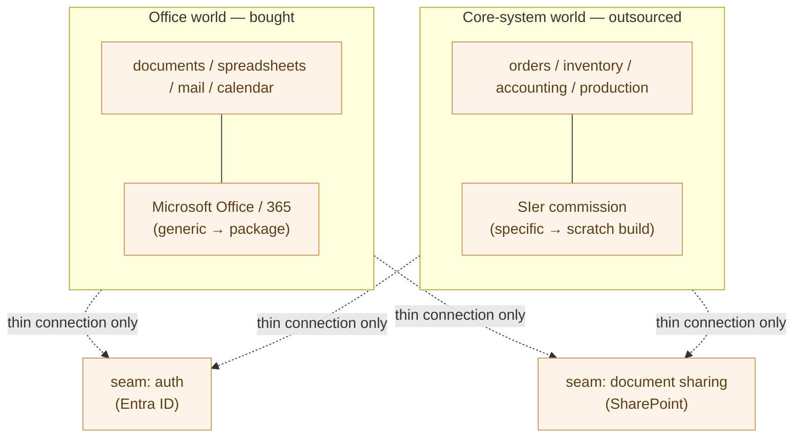
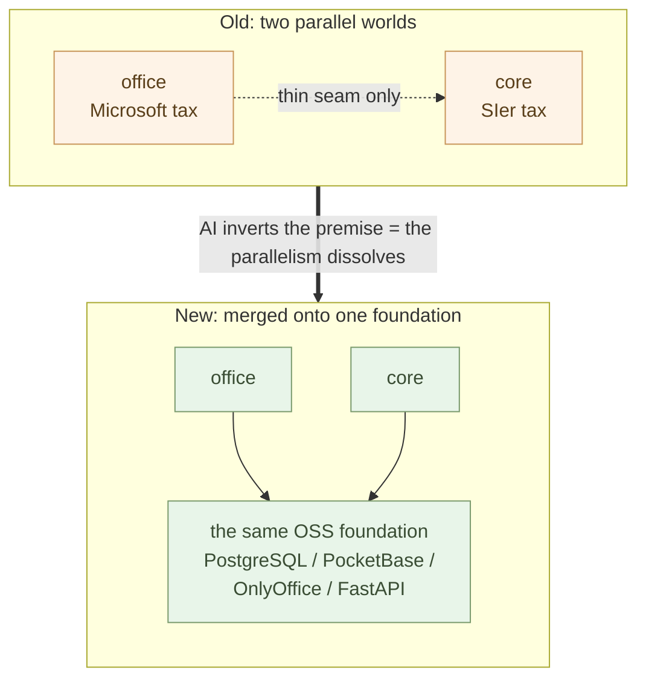

# Companies Don't Write Their Own Code — Office and Core, Two Parallel Worlds

**Companies have not written their own code — and that was "rational"**.
Writing it in-house was inefficient; it demanded a workforce of specialists
no single company could keep. So companies bought, and they outsourced.
This was not laziness — it was the rational choice under the old cost
structure.

The Independence part unwound that rational choice one layer at a time —
auth, documents, code, mail, all moved from the vendor bundle to your own
side. The Shift part now examines the **consequence for the industry
structure**. Why the SIer-commissioned model becomes uneconomic, why the
price gap reaches orders of magnitude, why the lock-in dissolves — all of
these follow from **one premise** that this chapter establishes.

That premise: **enterprise IT was split into two parallel worlds**, and
**that parallelism is what AI dissolves**.

## Writing It In-House Was Inefficient — So They Didn't Write It

Why did companies not write their own code? The answer is simple. **Because
it was inefficient**.

Restate the premise this series has returned to again and again: writing
code was labor that consumed vast person-months. Building one core system
required designers, coders, testers, and PMs locked in for months or years.
Keeping a workforce at that scale in-house — and keeping it busy so the work
never ran dry — did not pay off for most companies.

> Writing code was labor that demanded **more person-months than any single
> company could keep**. So not writing it in-house was the **rational
> choice**.

This must not be misread. Companies avoided in-house development not out of
technical ignorance or contempt for IT. **It was inefficient — so in a
sense, it was only natural**. The multi-tier subcontracting structure arose
for the same reason: writing code required a large workforce that had to be
sourced without any one company keeping it on staff (the structure is
covered in 3-07).

A rational choice not to write. This is what split enterprise IT into two
worlds.

## Two Parallel Worlds — Office Was Bought, Core Was Outsourced

When you implement "don't write it yourself," the options divide in two —
**buy** it, or **outsource** it. And enterprise IT split cleanly along
exactly that line.

- **Office systems** — documents, spreadsheets, mail, scheduling. Nearly
  the same at every company; generic work. If it's generic, there's no
  reason to build it. **So you buy a package — Microsoft Office, then
  Microsoft 365**.
- **Core systems** — orders, inventory, accounting, production control.
  Specific to each company; the business itself. If it's specific, no
  off-the-shelf product fits. **So you outsource it — commission an SIer**.

These two grew up as **separate worlds**. They were computerized in
different eras, by different vendors, from different talent pools. Office
was carried by global product vendors; core, by the domestic SIer pyramid.
Inside the same company, the two stood side by side and barely touched.

The connection was just **two thin seams**. As 2-01 showed — **auth (Entra
ID) and document sharing (SharePoint)**. Those two points were all that the
core-system world and the office world shared.

> Enterprise IT stood **split into two parallel worlds — office and core**.
> The connection was auth and document sharing — **just two thin seams**.

## The Double Tax — Because They Stood in Parallel, You Paid Twice

That the two worlds stood in parallel means the lock-in and the rent were
**levied twice over**.

- **The Microsoft tax** — in the office world. Documents, calendar, and
  mail bundled into one vendor's suite, with a per-seat monthly charge
  levied in perpetuity.
- **The SIer tax** — in the core world. Proprietary frameworks, multi-year
  maintenance contracts, and the enclosure of business knowledge made
  moving to another option impossible.

These two taxes **arose separately and were both paid**. Being locked to
Microsoft in office and being locked to the SIer in core were distinct
phenomena, each gripping the company independently. Escape one, and the
other remains.

But at the time this was not a diseconomy — it was **the rational
equilibrium of the old cost structure**. Buying and outsourcing genuinely
cost less than building. As long as writing code took person-months, buying
the generic and outsourcing the specific was rational beyond dispute.

> Because they stood in parallel, the tax was double — **the Microsoft tax
> and the SIer tax**. Yet that was not waste; it was **the rational
> equilibrium of the old cost structure**.

## AI Inverts the Premise

That equilibrium rested on a single premise — **"writing code takes
person-months, so in-house is inefficient."** When AI takes on execution,
that premise vanishes.

As the Independence part showed, **one person plus AI can stand up both
worlds on the same OSS foundation**. Office and core are no longer something
to procure from separate vendors.

- **Office systems** — PostgreSQL, PocketBase, OnlyOffice (2-02, 2-05)
- **Core systems** — PostgreSQL, FastAPI, the same auth and the same
  sharing (2-09)

The two ride on **the same data foundation, the same gatekeeper, the same
code**. Generic and specific alike are stood up by one person plus AI. The
very premise that "buying and outsourcing is cheaper" is gone — **because
writing it yourself is no longer inefficient**.

> "Writing code takes person-months" — this one premise vanished with AI.
> The ground that held the parallelism **drops out from under it**.

## When the Parallelism Dissolves, Both Industries Collapse at Once

This is the heart of the chapter. When office and core ride **the same
foundation**, the seam that separated them disappears. Auth and document
sharing are no longer thin bridges between two worlds but **part of one
foundation** (2-01's section "And then, to the core systems").

And from here the consequence follows. **Microsoft's grip on office and the
SIer's grip on core were never separate phenomena**. They were the **two
sides of one parallel structure**, both born of the single rational choice
"don't write it yourself."

- The rationality of buying the generic produced Microsoft's rent.
- The rationality of outsourcing the specific produced the SIer's rent.
- Both issued from the same premise — **code equals a large workforce's
  person-months**.

Now that the premise is inverted, **the two collapse at once**. It will not
be that one dissolves under AI while the other survives for some separate
reason. Because **the parallel structure itself dissolves**, both grips come
off together.

This is the premise of the whole Shift part. The chapters that follow each
view this **single collapse** from a different face — digital sovereignty and the
Microsoft problem (3-02), the uneconomy of SIer commissioning (3-03), the order-of-magnitude price gap (3-04), the nature of
lock-in (3-05), companies hiring builders directly (3-06), Japan's specific
transition (3-07), completion within a few years (3-08). **Each is the same
single collapse, lit from a different angle**.

> When the parallelism dissolves, **both industries collapse at once**.
> Microsoft's grip and the SIer's grip were **two sides of one structure**.

## Rebuilding Becomes the New Rational Default

Step back once more. Companies not writing their own code was neither
laziness nor incompetence — **it was rational**. Buying and outsourcing
genuinely cost less than writing it yourself.

That rationality has inverted. Now that AI takes on execution, the premise
that buying and outsourcing is cheaper has collapsed. So "rebuild it
yourself" is no longer a **special decision**. Stand up the generic with
OSS, write the specific with AI — this becomes the new **rational default**.

The same rationality that once steered companies away from in-house now
steers them toward it. The premise changed, so of course the conclusion
changes. The question is no longer "whether," only "when, and led by whom."

> Not writing it yourself was rational.
> Now that the rationality has inverted, **rebuilding becomes the rational
> default**.

## To the Next Chapter

This chapter set the premise of the Shift part — the parallelism of office
and core, the double tax, and AI's inversion of the premise. The chapters
that follow light each of the two worlds' consequences from a different face.

First, the **office (Microsoft) side**. The next chapter asks **why OSS and
sovereign AI are now better on both economics and security** — the problem of
Microsoft dependence, and the geopolitical risk of not being able to trust
the US government (the Trump problem).

---

## Related articles

- [2-01: Stand Free of Microsoft and Google — Overview and Mapping](/en/ai-native-ways/software/independence/)
- [3-03: The Structural Uneconomy of the SIer Model](/en/ai-native-ways/software/sier-uneconomic/)
- [Parent series Chapter 2: Owning Your Tools with Python](/en/ai-native-ways/python/)
