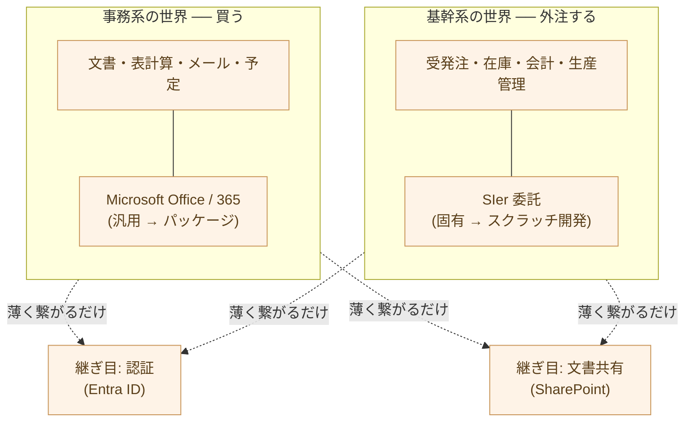
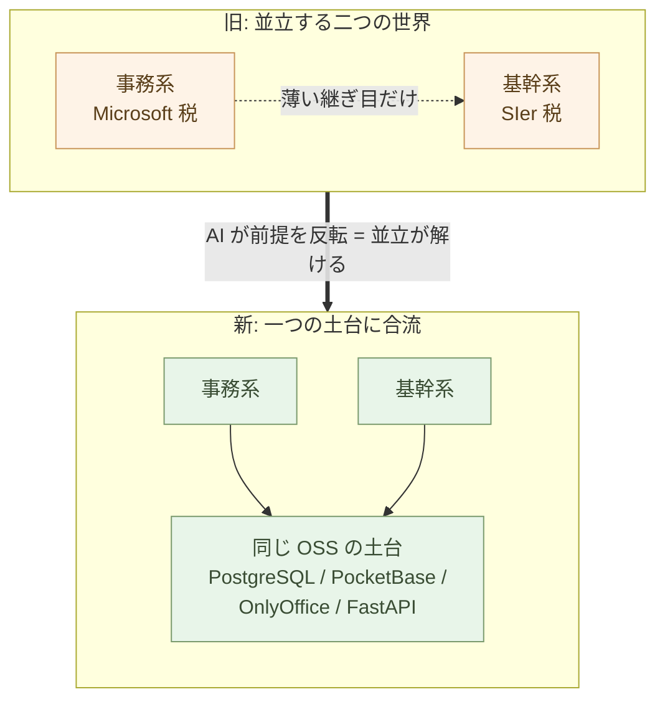

# 企業は自分でコードを書かない ── 事務と基幹、二つの世界の並立

**企業は、自分でコードを書いてこなかった ── そして、それは「当然」
だった**。自前で書くのは非効率で、一社では抱えきれない人数の専門
人員を要した。だから企業は買い、外注した。これは怠慢ではなく、
旧来のコスト構造のもとでの合理的な選択だった。

自立編は、その合理的な選択を一層ずつ解いてきた ── 認証も文書も
コードもメールも、ベンダーの束から自分の側へ。転換編は、ここから
**産業構造の帰結**を見ていく。SIer 委託モデルがなぜ不経済になるか、
価格差がなぜ桁違いになるか、ロックインがなぜ解けるか ── これらは
すべて、本章が据える**一つの前提**から導かれる。

その前提とは、**企業 IT が二つの世界に分かれて並立していた**こと、
そして**その並立が AI によって解ける**ことだ。

## 自前で書くのは非効率だった ── だから書かなかった

なぜ企業は自分でコードを書かなかったのか。理由は単純だ。**非効率
だったからだ**。

このシリーズが繰り返してきた前提を、もう一度置く ── コードを書く
とは、大量の人月を投じる労働だった。一つの業務システムを作るには、
設計者・コーダー・テスター・PM が、月単位・年単位で張り付く。その
規模の専門人員を、一社が自前で抱えて、しかも仕事が途切れないよう
維持し続けるのは、ほとんどの企業にとって割に合わなかった。

> コードを書くとは、**一社では抱えきれない人月**を要する労働だった。
> だから自前で書かないのが、**合理的な選択**だった。

ここを誤読してはならない。企業が自前開発を避けたのは、技術への
無理解でも、IT 軽視でもない。**効率が悪いから、ある意味で当然
だった**。多重下請け構造が成立したのも同じ理由による ── コードを
書くのに必要な大人数を、一社で抱えずに調達する仕組みが要ったから
だ(構造は3-06で詳述する)。

書かない、という合理的な選択。これが企業 IT を、二つの世界に
割った。

## 二つの並立世界 ── 事務は買い、基幹は外注した

「自分で書かない」を実装すると、選択肢は二つに分かれる ── **買う**
か、**外注する**かだ。そして企業 IT は、この二つにきれいに割れた。

- **事務系** ── 文書、表計算、メール、スケジュール。どの会社でも
  ほぼ同じ、汎用の仕事だ。汎用なら、自分で作る理由がない。**だから
  パッケージを買う ── Microsoft Office、そして Microsoft 365**。
- **基幹系** ── 受発注、在庫、会計、生産管理。会社ごとに固有の、
  その企業の業務そのものだ。固有なら、既製品では足りない。**だから
  外注する ── SIer に委託する**。

この二つは、**別の世界**として育った。コンピュータ化された時期が
違い、担当するベンダーが違い、人材プールが違う。事務系は世界共通の
製品ベンダーが、基幹系は国内の SIer ピラミッドが担った。同じ会社の
中にありながら、二つはほとんど交わらずに並び立った。

繋がりは、**薄い継ぎ目が二つ**だけだった。2-01で見たとおり ──
**認証(Entra ID)と、文書共有(SharePoint)**。基幹システムと
オフィスの世界が共有していたのは、この二点に過ぎない。

> 企業 IT は、**事務と基幹、二つの世界に分かれて並び立っていた**。
> 繋がりは、認証と文書共有 ── **二つの薄い継ぎ目だけ**だった。

## 二重の税 ── 並立していたから、二度払った

二つの世界が並立していた、ということは、ロックインも地代も**二重に
かかっていた**ということだ。

- **Microsoft 税** ── 事務系の世界で。文書も予定もメールも一社の
  スイートに束ねられ、人数 × 月額が永続的に課された。
- **SIer 税** ── 基幹系の世界で。独自フレームワーク、多年の運用
  保守契約、業務知識の囲い込みによって、別の選択肢へ動けなくなった。

この二つの税は、**別々に発生し、両方とも払われた**。事務系で
Microsoft に縛られていることと、基幹系で SIer に縛られていることは、
別の現象として、それぞれ独立に企業を捉えていた。一方を逃れても、
他方は残る。

だがこれは、当時としては不経済ではなかった ── **旧来のコスト構造の
もとでの、合理的な均衡だった**。買う・外注するほうが、自前で作る
より、本当に安かったからだ。コードを書くのに人月が要る以上、汎用は
買い、固有は外注するのが、文句なく合理的だった。

> 並立していたから、税は二重だった ── **Microsoft 税と SIer 税**。
> だがそれは不経済ではなく、**旧コスト構造の合理的な均衡**だった。

## AI が、前提を反転させる

その均衡を支えていたのは、たった一つの前提だった ── **「コードを
書くには人月が要る、だから自前は非効率」**。AI が実行を取ったとき、
この前提が消える。

自立編で示したとおり、**一人 + AI が、二つの世界を同じ OSS の土台の
上にまとめて立てられる**。事務系も基幹系も、もはや別々のベンダーに
分けて調達するものではない。

- **事務系** ── PostgreSQL、PocketBase、OnlyOffice(2-02・2-05)
- **基幹系** ── PostgreSQL、FastAPI、同じ認証・同じ共有(2-09)

二つは、**同じデータ基盤・同じ門番・同じコード**の上に乗る。汎用も
固有も、一人 + AI が立てる。「買う・外注するほうが安い」という前提
そのものが消えた。**自前で書くことが、もはや非効率ではなくなった**
からだ。

> 「コードを書くには人月が要る」── この一つの前提が、AI で消えた。
> 並立を支えていた地盤が、**そのまま抜ける**。

## 並立が解ける = 二つの産業が同時に崩れる

ここが本章の核心だ。事務系と基幹系が**同じ土台**に乗ると、二つを
隔てていた継ぎ目が消える。認証も文書共有も、もはや二つの世界を
繋ぐ細い橋ではなく、**一つの土台の一部**になる(2-01の「そして、
基幹システムへ」)。

そして、ここから帰結が出る。**Microsoft の事務系支配と、SIer の
基幹系支配は、もともと別々の現象ではなかった**。両者は、「自前で
書かない」という一つの合理的選択が生んだ、**一つの並立構造の、
表と裏**だったのだ。

- 汎用を買う合理性が、Microsoft の地代を生んだ。
- 固有を外注する合理性が、SIer の地代を生んだ。
- 両方とも、同じ前提 ──「コード = 大人数の人月」── から出ていた。

その前提が反転した今、**二つは同時に崩れる**。一方が AI で解け、
他方が別の理由で残る、ということにはならない。**並立構造そのものが
解ける**のだから、二つの支配は一緒に外れる。

これが転換編全体の前提だ。続く章は、この**一つの崩壊**を、それぞれ
別の面から見ていく ── デジタル主権と Microsoft 問題(3-02)、SIer 委託の不経済(3-03)、ロックインの正体(3-04)、ビルダーの直接雇用(3-05)、
日本固有の転換(3-06)、近い将来の転換と逆転ゆえの不可逆(3-07)。**どれも、同じ一つの
崩壊を、別の角度から照らした像**だ。

> 並立が解けるとき、**二つの産業は同時に崩れる**。
> Microsoft の支配と SIer の支配は、**一つの構造の表と裏**だった。

## 作り直しが、新しい合理的な既定値になる

最後に一段引いて見る。企業が自分でコードを書かなかったのは、怠慢でも
無能でもなかった ── **合理的だった**。自前で書くより、買い、外注する
ほうが、本当に安かったからだ。

その合理性が、反転した。AI が実行を取った今、買う・外注するほうが
安いという前提は崩れた。だから「自分で作り直す」は、もはや**特別な
決断ではない**。汎用は OSS で立て、固有は AI と書く ── これが、新しい
**合理的な既定値**になる。

かつて自前を避けたのと同じ合理性が、今度は自前を選ばせる。前提が
変わったのだから、結論が変わるのは当然だ。問われているのは「やるか」
ではなく、「いつ、誰が主導でやるか」だけだ。

> 自前で書かなかったのは、合理的だった。
> その合理性が反転した今、**作り直しが、合理的な既定値になる**。

## 次の章へ

本章は、転換編の前提を据えた ── 事務と基幹の並立、二重の税、そして
AI による前提の反転。続く章は、二つの世界それぞれの帰結を、別の面から
照らしていく。

まず **事務(Microsoft)側**だ。次の章で問うのは、**なぜ OSS とソブリン
AI のほうが、いまや経済でも安全保障でも有利なのか** ── Microsoft 依存の
問題と、米国政府を信頼しきれないという地政学リスク(Trump 問題)を見ていく。

---

## 関連記事

- [2-01: Microsoft と Google から自立する ── 全体像と対応表](/ai-native-ways/software/independence/)
- [3-03: SIer委託モデルの構造的不経済](/ai-native-ways/software/sier-uneconomic/)
- [親シリーズ第2章: Python で自分の道具を持つ](/ai-native-ways/python/)
