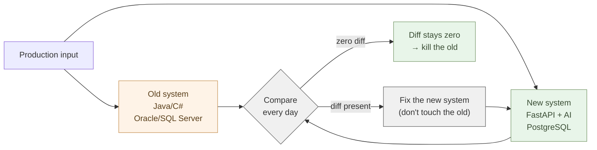

# Build an API — Expose Core Logic with FastAPI

The Independence part's OSS covers the generic — auth, documents, mail,
meetings, the public web. What remains is **your own business logic,** the
substance of the core systems.

That core is usually old. Written in Java or C#, riding on Oracle or SQL Server,
understood in full by no one. This chapter **rewrites it via parallel operation**
and exposes your own logic as one API with **FastAPI** — the method is the
sequence for killing a core system, the tool is FastAPI. In order.

## "Don't break it, don't touch it" was advice for a different era

For the past 20 years, the standard advice given to people responsible for core
systems has been:

"Don't break it." "Don't touch it." "Don't change something that works." "Use the
legacy assets."

This was **advice from an era when the cost of rewriting was prohibitive**. When
rewriting took years and millions of dollars, "don't touch it" was indeed the
right answer.

The era has changed.

AI translates business logic to Python. AI extracts the intent of SQL into
Markdown. AI generates test data. AI mines undocumented rules out of legacy code.
**The cost of rewriting has fallen by a factor of ten.**

Saying "don't touch it" at one-tenth the cost is denying the new reality. **There
is no longer a reason to keep the legacy.**

## The logic of parallel operation

Even with rewriting cost down, the risk is not zero. No method can guarantee that
a new system behaves exactly like the old.

That is what **parallel operation** is for.

Build the new system in AI. Keep the old running. Feed the same input to both.
Compare the outputs.



If A and B match, the new system is correct. If they don't, one of them is wrong.
**Usually, a 20-year-old bug in the old system surfaces first** — a bug that was
never in any document.

Continue this for one month, three months. When diffs reach zero and edge cases
are covered, stop the old.

Parallel operation eliminates rewrite risk through **measurement**. Not
desk-checking. Not spec reviews. **Production environment, real data, run and
verify.**

## How long to keep the old running

The parallel-operation period should be at most six months, usually three is
enough.

If you need longer, the new system is not actually correct. Fix the new system.
**Don't run parallel "indefinitely."**

Inside organizations, there is a psychology of "keep the old around just in case."
This is a trap. Keeping it means:

- Operations cost doubles
- Engineers split their attention
- When something breaks, arguments erupt over who is responsible
- New features must be built in both, doubling the work
- The decision to kill the old gets postponed forever

> Parallel operation is a means, not an end. When the new is verified, kill the old.

If you can't kill it, you shouldn't have started rewriting. **When you do it, do it.**

"Use the legacy assets, augment with AI" — this approach ultimately permits the
old system to remain. New features pile up on the outside; the substance stays
old. Three years pass, five years pass, and the organization is still not
AI-native. **Half-hearted coexistence freezes the organization.** "Augment" was
acceptable when rewriting was truly too expensive. That era is over.

## How to kill vendor products

Oracle, SAP, Salesforce, Microsoft business products — these aren't selling
"products." They are selling "**the situation in which you have to keep using the
product**."

Pattern for killing via parallel operation:

1. Export data from the product daily (the product keeps running)
2. The new AI-built system processes the export and runs the same business
3. Compute the same business metrics (sales, inventory, customer state) in both
4. When the numbers match, **don't renew the product contract**
5. Take a final "full data export" from the product and switch entirely to the new

**Time it for the contract renewal cycle.** This is a strategic schedule. Renewal
in October? Start parallel in June. Run for three months. Decide in September.

The vendor will pull every card to keep you: "migration risk," "data integrity,"
"your veterans will leave." Parallel operation with matching outputs answers all
of them. **You have the evidence.** License fees are tens of thousands of dollars
per year. Stopping that recovers the new-system development cost in months.

## Push business knowledge out — all at once

As preparation for parallel operation, push business knowledge into Markdown.
**All at once.**

Old common sense said documenting business knowledge was a months-to-years
project. Someone scribbles in spare hours. Before half is written, that person
transfers. The project collapses partway. **Ultimately, it never gets written.**

The era has changed.

Hand Claude **everything** — old code, comments, SQL, runbooks, past incident
reports. Tell it: "extract the business logic and organize it as Markdown." A
codebase of a few thousand lines: hours for the first draft. Tens of thousands of
lines: days at most.

It does not have to be perfect. **80% is enough.** The remaining 20% will surface
as output diffs during parallel operation. Resolve them one by one, and the
documentation completes itself.

> Compress months of work into days. This is what AI is actually for.

This is also the hidden benefit of parallel operation. **Business rules that were
never written down all surface during parallel run.** Rules that no spec captured,
only operations knew — these get pulled out, both from Claude's first-pass
Markdown and from the diffs the parallel run produces. (Taking documents back onto
your own side was 2-05; the core's business knowledge, too, falls into the
same readable material.)

## Business rules live with the people who do the work — the floor writes the tests

Who does the rewriting?

Old common sense: the IT department, SI vendors, or consultants gather
requirements from the floor, then write code. When done, the floor performs
acceptance testing. This was the shape of an era when the knowledge needed for a
rewrite was distributed. **Coding ability lived in IT; business-rule knowledge
lived on the floor.**

That has changed.

**Coding ability is held by Claude.** What remains is business-rule knowledge. And
the people who know business rules most deeply are the people running that business
every day. The people on the floor have Claude write the code. **That is the whole
loop.** No middle layer of "translation" needed.

What matters in parallel operation is finding output diffs. "Does the new system
produce the same output as the old?" — verifying this requires test data. The
people best suited to creating this test data are the people on the floor.

"July billing closes on the 10th, but we extend by Obon to the 5th of the
following month" — the floor knows this rule. They tell Claude: "make 50 billing
test cases that account for the Obon extension in July." Claude makes them. They
are run through the old system to capture expected outputs. This becomes the test
data.

Rules that were never in any spec materialize as tests. **Business knowledge flows
from the floor → tests → code.** This is a kind of test the IT department, by
itself, cannot write. They do not know the rules. **Rewrites have failed because
people who didn't know the rules wrote the tests.**

## Stop outsourcing

Once you reach this point, the conclusion is clear.

**You do not need to outsource core-system rewrites to IT vendors or consultants.**

The traditional rationale for outsourcing was twofold: (1) coding ability lived
only on the outside; (2) business knowledge had to be transferred to the outside.
(1) was solved by Claude. (2) is no longer needed in the first place. **The floor +
Claude completes the loop.**

Outsourcing fees are the single largest cost item in core-system rewrites. Tens of
millions to hundreds of millions of yen per year. That cost disappears. People on
the floor — who know the rules — have Claude write the code, Claude write the
tests, and verify by parallel operation. **Rewriting changes from "something to
outsource" to "something done in-house."**

This is not a contraction of the IT department's role. IT focuses on supporting the
(floor + Claude) teams: infrastructure, databases, deploy environments, security.
**They escape the duplicative role of "business-logic intermediary."**

> The people who know the business use Claude to rewrite their own systems. That is the new floor practice.

## Migrate the DB and the logic layer in parallel

The same parallel-run approach used to rewrite the logic layer into FastAPI
applies to the DB.

Keep the database. **But drop the vendor dialect.** `SELECT`, `JOIN`, `GROUP BY`,
window functions — standard SQL has run for 50 years and will run for 50 more.
Claude writes it perfectly. **Keep standard SQL, drop the vendor dialect** — that
line is the crux.

But Oracle's **PL/SQL** and Microsoft SQL Server's **T-SQL** — drop them. They are
**vendor-specific dialects**. Embedding business logic inside the database has been
the last bastion of vendor lock-in. Business logic embedded in PL/SQL stored
procedures gets rewritten in Python. Hand Claude the PL/SQL; it extracts the
business rules and outputs Python. **Business logic returns from invisible stored
procedures into code.** Readable. Version-controlled. Testable.

The DB itself moves to PostgreSQL. This too is parallel operation — sync data
daily from the old DB into PostgreSQL; the new system (FastAPI) reads/writes
PostgreSQL while the old reads/writes Oracle / SQL Server. Verify consistency via
output comparison, and when stable, stop the old DB.

> Drop Oracle / SQL Server. That is your graduation certificate from vendor lock-in.

The DDL dialect translation and the concrete migration steps using Azure SQL and
pgloader were covered in detail in **2-02**. Here you only need to hold the
judgment: "keep standard SQL, pull out the dialect and the logic." Rewriting just
the logic layer is only half-escaping the lock-in. **Migrating to PostgreSQL is the
final step out.** And the annual license cost recovers the new-system development
cost in a few months. Financially, there is no reason left not to rewrite.

## The way out of every lock-in is the same

Everything described above has the same structure.

- Replace the Java / C# logic layer with FastAPI (Python)
- Replace Oracle / SQL Server with PostgreSQL
- Replace PL/SQL stored procedures with Python functions
- Replace SAP / Salesforce with your own systems
- Replace IT vendor and consultant outsourcing with the floor + Claude

These are not separate problems. **The same move escapes them all — rewrite via
parallel operation.**

Don't stop the old. Build the new beside it. Feed the same inputs to both; compare
the outputs. When diffs vanish, kill the old. Time it to the contract renewal
cycle. Lock-in is a psychological device that makes you feel "I can't touch it, I
can't leave." Parallel operation dismantles that psychology physically. **Without
touching the old, build the new mainstream beside it.** When the new works, that
the old is unnecessary becomes visible to everyone.

> The way out of every vendor lock-in is the same: rewrite via parallel operation.

## On top of the foundation and the gate

The new logic layer — the rewritten core logic — is exposed as one API with
**FastAPI**. Why make it an API? To gather core logic (inventory, ordering,
pricing…) **into one place** instead of scattering it across screens. The
public-web form (2-08) and the in-house apps call the same API — duplication
disappears. In Python (FastAPI), AI writes it fast, with types and automatic docs
(OpenAPI).

The API reads and writes the 2-02 **PostgreSQL** and verifies identity with
the 2-03 **gate (PocketBase)** token. No new foundation — it rides on what
already exists.

```python
# FastAPI — verify the gate's token, query the foundation (DB)
from fastapi import FastAPI, Depends
app = FastAPI()

@app.get("/orders")
def orders(user=Depends(verify_token)):       # the 2-03 gate verifies who
    return db.query("SELECT * FROM orders WHERE user_id=%s", [user.id])  # the 2-02 DB
```

Don't expose all the core at once. **The most-used operations, one at a time.**
Write it with AI in dialogue and check against the running version (the same way as
1-06, VBA → Python). This is nothing but running the very logic
of parallel operation at the granularity of a single API. Heavy work runs in Python
behind it, returning only the result.

The public repo **kura** (`aiseed-dev/workspace`) is this setup — PocketBase auth +
**FastAPI** + a Flet front end. The code lives in the 2-04 Forgejo, called
from the 2-08 public web and the in-house apps. The core logic rewritten via
parallel operation lands, finally, as this one API.

## Example: monthly closing batch

Take a closing batch that runs at month-end.

**Old**: A COBOL or Java batch from five years ago. No one fully understands the
internals. Runs at month-end. Failure stops accounting.

**Week 1**: Export 12 months of inputs (last month's transaction data) and outputs
(closing summaries) from the old batch. Treat as ground truth.

**Week 2**: Hand Claude the old code and runbooks; have it write equivalent
processing in Python on FastAPI. Run 12 months of data through it; verify output
matches ground truth. Resolve mismatches.

**Weeks 3–6**: At the production timing when the old runs, also feed the same input
to the new. Compare every month. When diffs appear, identify and fix.

**Month 3**: When zero diffs occur for consecutive months, the responsible person
decides: "from next month, run the new." **Stop the old batch.**

Three months to complete the rewrite. Engineer load is doubled only during parallel
run; afterward it is halved. **And the business logic now lives in both code and
Markdown.**

## Example: getting out from under SAP shipping

A mid-sized manufacturer runs shipping management on SAP. License cost: **tens of
millions of yen per year.**

1. **Data layer**: Nightly batch exports shipping data from SAP to **Parquet**
   (parent series, Chapter 5) — SAP is not touched, read-only.
2. **New logic layer**: Stock matching, shipment decisions, carrier routing written
   in Python with Polars + DuckDB (Claude generates the first version from floor
   interviews and screenshots of the existing SAP configuration screens).
3. **API and screen layer**: The floor-facing shipping instruction is exposed as an
   API with **FastAPI** (this chapter) and rendered in HTML. Runnable inside the LAN
   on the 2-04 miniPC.
4. **Reconciliation**: Compare SAP's shipping output with the new system's daily;
   investigate any differences with Claude. **Nearly every week, an "undocumented
   rule" inside SAP surfaces.**
5. **Three months in**: When the diff has been zero for two weeks, promote the new
   system to production. **Cancel SAP before the next contract renewal.**

**Result**: the **tens-of-millions-of-yen license fee disappears**. Business logic
emerges into **Markdown and Python** (no more SAP "business consultant" middlemen).
Customizations happen on the floor the same day (previously: ask the SAP vendor,
wait months).

This is 2-05's "take documents back onto your own side" in **core-system
form**. Same structure as "don't drop Excel all at once, get out of CSV" — "don't
drop SAP all at once, kill it through parallel run."

## In numbers

Translating 5,000 lines of PL/SQL business logic to Python, SI vendor quote: about
**30M yen**. On-floor staff rewrite using Claude: 1-month development, about 1M yen
in personnel cost. **One-thirtieth.**

Oracle Enterprise Edition license: about **40M yen/year** for 20 CPUs + 22%
maintenance. Migrating to PostgreSQL: zero per year. **New-system development cost
recovered in one month.**

Undocumented business rules surfaced during 3 months of parallel operation:
typically **20–50 per system**. Rules invisible on paper specs all emerge as output
diffs.

Migrating business knowledge into Markdown: 6 months to 1 year if done in spare
time. Hand the whole codebase to Claude, do it in one sweep: **80% in one week.**

## In summary

"Getting along with" a core system is old.

Rewrite, with parallel operation. Build the new system in FastAPI; run it parallel
with the old. Compare outputs against reality. When diffs vanish, kill the old.
Push business knowledge out into Markdown all at once, let the floor write the
tests, stop outsourcing. The rewritten core logic lands as one **API** riding on
**the 2-02 DB and the 2-03 gate** — no new foundation needed.

**When you do it, do it.** Half-hearted coexistence freezes the organization. In an
era when AI cuts rewriting cost by 10x, there is no reason left to keep the legacy.

Next, we lay **AI (a self-hosted LLM and RAG)** on top of all of this and cut the
dependency on Copilot.

---

## Related articles

- [2-02: Lay the Foundation — PostgreSQL, SQLite, and more](/en/ai-native-ways/software/foundation/)
- [2-03: Stand Up the Gate — One Login with PocketBase](/en/ai-native-ways/software/auth/)
- [2-05: Take Documents Back — OnlyOffice Docs on PocketBase](/en/ai-native-ways/software/documents/)
- [Reference implementation kura — a self-hosted Microsoft 365 / Google Workspace alternative](https://github.com/aiseed-dev/workspace)
</content>
