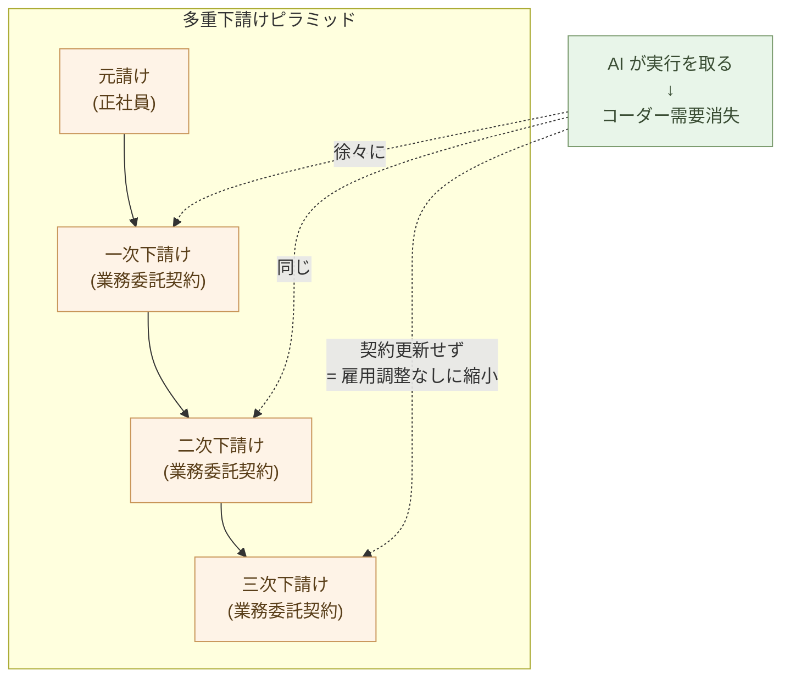

# 日本のSIer業界の転換と雇用流動性

**日本の SIer 業界の多重下請け構造は、転換を阻害する障害として
語られることが多い。だが構造を解剖すると、むしろ逆 ── 多重下請け
だからこそ、業界転換は雇用調整なしに進められる**。

第17章で、IT 外注の本来の駆動力が「大量のコーダー人月の確保」だった
ことを確認した。本章はその裏面 ── AI でコーダー需要が消えたとき、
人月確保のための構造そのものが、どう動くか ── を扱う。

日本固有の事情を中心に見るが、結論はシンプルだ。**多重下請け構造
が、逆説的に転換を容易にする**。

## 多重下請け構造が、逆説的に転換を容易にする

日本の SIer 業界の典型構造を整理する。

- **元請け** ── 顧客と直接契約する大手 SIer。社員は数百〜数千人規模
- **一次下請け** ── 元請けから業務委託を受ける中堅 SIer
- **二次下請け・三次下請け** ── さらにその下、人月単位で人を出す
  小規模ベンダーや個人事業主
- 案件によっては 4〜5 段の層が積み重なる

この階層が嫌われる理由は分かりやすい ── マージンが層ごとに積層
される、現場のコーダーに利益が届きにくい、責任の所在が曖昧、など。
第14章・第15章でも、価格差を生む構造として扱った。

しかし、**転換期にこの構造を見ると、性質が反転する**。多重下請けは
コーダー需要を **契約という形で外部化** している。元請け企業の中に
正社員として抱え込んでいるのではなく、契約で繋がっている関係だ。

これは何を意味するか。**需要が消えたとき、契約を更新しないだけで
縮小できる**。元請けの正社員を解雇する必要はない。法律的にも、
社内政治的にも、世論的にも、契約解消は雇用調整よりはるかに容易だ。

> 多重下請け構造は、コーダー需要を **契約で外部化** している。
> 需要が消えたとき、契約を更新しないだけで縮小できる ──
> **多重下請けは、転換期の緩衝装置として機能する**。

## 元請けは、下請け契約解消で雇用調整なしに転換できる

具体的な動き方を見る。

ある元請け SIer が、年間 10 万人月の案件を回しているとする。内訳:

- 自社正社員: 1 万人月
- 一次下請けからの調達: 3 万人月
- 二次〜三次下請け: 6 万人月

AI ネイティブ案件の比率が増え、コーダー需要が下がっていくとき、
元請けは何をするか:

- **正社員はそのまま** ── 解雇は法律的にも文化的にも難しい。配置
  転換でビルダー育成や顧客向け判断業務へ
- **下請け契約から順に縮小** ── 三次下請けの契約から更新しない、
  二次下請けの発注を絞る
- **新規案件は AI ネイティブで** ── 元請け正社員が判断側に立ち、
  AI が実行
- **段階的シフト** ── 既存の長期保守案件は契約期間中は維持し、
  契約満了時に AI ネイティブへの置き換えを評価

これらは、**元請けの中央経営判断だけで実行できる**。社内の雇用調整
を伴わない。社外への影響 (下請け各社の縮小) はあるが、それは契約上
許される範囲の話だ。

このため、**元請け SIer の経営者にとって、AI ネイティブへの転換は
意思決定上の障害が低い**。逆に、転換を選ばないと、AI ネイティブな
競合に案件を取られていくリスクを負う ── 「動かない」の方が経営的
リスクが高くなる時点で、転換は加速する。

## 下請けの優秀な人材は、元請けや独立に流れる

縮小される側 ── 下請け各社、特に二次・三次下請けに所属するコーダー
は、どうなるか。

これは厳しい。需要が消えると、契約が更新されない。中規模の下請け
ベンダーは、案件が来なくなれば事業を縮小・廃業せざるを得ない。

ただし、**優秀な人材には複数の出口がある**:

- **元請けに移る** ── 元請けは判断側に立てる人材 (= ビルダー候補)
  を必要とする。判断能力のあるコーダーは、元請けの正社員枠に吸収
  される可能性がある
- **顧客企業に移る** ── 第17章で見た「社内ビルダー」として、これ
  まで SIer に発注していた顧客企業に直接雇用される
- **独立して個人事業主・小規模法人** ── ビルダーとして直接顧客と
  契約する。第17章で見た弁護士・医師型の専門職モデル
- **別業界に移る** ── ソフトウェア開発を離れる選択肢もある (第3章
  で見た「計算手や組版工が別領域へ移った」例と同じ)

中間〜下層の下請けコーダーすべてが移れるわけではない。判断能力を
持つ、あるいは持とうとする層から先に流動する。これは厳しい話だが、
**業界全体としては、人材が下層に滞留せず、上層と外部に流れる方向
に動く**。

> 縮小されるのは下層、流動するのは判断能力。
> 優秀な人材ほど、元請け・顧客企業・独立に流れていく。

## 雇用流動性という条件

ここまでの話は、**雇用流動性** という条件の上に成立する。

旧来の日本型雇用 ── 終身雇用、年功序列、社内異動による配置転換 ──
は、多重下請け構造を支えていた。元請けは新卒で採用したコーダーを
40 年間抱え続けることが期待され、不足分は下請けで埋めた。流動性は
低かった。

この前提は、ここ 20 年で徐々に崩れてきた。中途採用が当たり前になり、
転職市場が整備され、フリーランス・個人事業主としての契約形態が
増えた。AI による業界転換は、**この流動性の上限を試す** 試金石に
なる。

流動性が高い前提が成立すれば:

- 元請け → 元請け への中途転職が増える
- 元請け → 顧客企業 への移籍 (第17章のビルダー雇用)
- 元請け → 独立 (個人事業主・小規模法人)
- 下請け各層 → 上記すべてへの流動

逆に、流動性が低いままだと:

- 縮小される下請けで人材が滞留する
- 新しい雇用形態 (専門職モデル) が制度的に育たない
- 転換のスピードが社会的摩擦に阻まれる

幸い、**流動性は時間とともに高まる方向にある**。コロナ以降のリモート
ワーク普及、副業解禁の広がり、ジョブ型雇用への移行 ── すべて流動
性を上げる方向だ。AI 化と並行して、流動性を上げる施策が社会全体
として進んでいる。

## 中間形態 ── 長期業務委託、出向、社内ベンチャー

転換は一夜にして起きない。中間形態を経由する。

- **長期業務委託契約** ── 元コーダーが個人事業主として、元の所属
  企業や顧客企業と長期契約を結ぶ。社員ではなく、しかし安定して
  仕事がある形態
- **出向・転籍** ── SIer の社員が、顧客企業に出向してビルダー化
  する。出向期間中に成果が出れば、転籍が選択肢になる
- **社内ベンチャー / スピンオフ** ── SIer 内部で AI ネイティブ
  事業を立ち上げる。既存事業との利益相反を避けるため、別会社化が
  選ばれる場合もある
- **逆委託** ── 顧客企業のビルダーが、専門領域で他社に助言を売る
  (第5章の「残り 1 割の専門家」と同型)

これらは恒久的な構造ではなく、転換期の **緩衝装置** だ。日本社会は、
急激な変化を中間形態で吸収しながら進める文化を持っている。

> 多重下請け構造は急激な縮小を許す。中間形態は急激な変化を吸収する。
> **両方が同時に効いて、転換は急進にも停滞にもならない**。

## ソフトウェアより、物が不足する時代になる

SIer 業界の縮小は、孤立した労働問題ではない。同じ数年で、社会全体
としては労働需要が増える側に動く要因が、複数同時進行している。
共通する根は一つ ── **時代の希少資源が、ソフトウェアから物へ反転
する**ことだ。

**AI データセンター建設という露骨な実例** ── AI ブーム自体が、物理
インフラの大量需要を生んでいる。GPU、半導体製造装置、電力、冷却、
建屋、用地、ネットワーク ── どれも **物の話で、コードの話ではない**。
世界中で AI データセンターの建設が追いつかず、電力供給がボトルネック
になっている。**AI が安くなるほど、AI を動かすための物が不足する** ──
これは「ソフトウェアより物が不足する時代」の最も見えやすい兆候だ。

**製造業の復活** ── 中東情勢の不安定化、地政学的なエネルギー価格の
上昇、グローバル物流コストの上昇により、海外オフショア生産の経済
合理性が低下する。日本国内での製造 ── とくに高付加価値、少量生産、
即応性が要る分野 ── の競争力が相対的に上がる。製造業のリショアリング
が進めば、製造現場・設計・生産技術の労働需要は確実に増える。

**自然農法への移行** ── 化学肥料の主要原料 (天然ガスからのアンモニア
合成、ロシア・ベラルーシ産カリ、輸入リン鉱石) の供給が不安定化し、
価格が高騰する。化学農業の入力コストが採算ラインを超えると、
**自然農法は選択肢ではなく必然になる**。自然農法は土づくり・除草・
収穫の各工程で化学農業より多くの人手を要する ── つまり、農業全体
の労働需要も上がる方向だ (構造の詳細はサイト内別シリーズ「リン資源
枯渇と自然農法」で扱っている)。

三つの動き ── **AI 物理インフラ需要、製造業リショアリング、自然農法
シフト** ── は、SIer 業界の縮小と **同じ時間軸** で並行する。結果と
して、コーダーの行き先には、業界内の流動 (元請け・顧客・独立) に
加えて、**業界外の物理労働需要** という選択肢が大きく広がる。

第3章で見た歴史的並行 ── 計算手や組版工が別領域に移った転換 ──
が成立したのも、移った先の労働需要が偶然存在したからだ。今回も同じ。
**労働需要が消える側 (コード生産) と、増える側 (物の生産、農業、
AI 物理インフラ) が、同じ社会の中で同時に動く**。

> 時代の希少資源は、ソフトウェアから物へ反転する。
> SIer のコーダーが余るのではなく、**物を作る側の人手が足りない**
> ── これが本当の労働需要構造だ。

## 流動性は時間とともに高まる

最後に、転換期の方向性を確認する。

雇用流動性、ジョブ型雇用、専門職モデル、業務委託の社会的受容 ──
これらは、ここ 10 年で確実に高まってきた。今後も同じ方向に進む
要因が多い:

- **少子高齢化** ── 労働力供給が減るため、人材の流動性は経済合理性
  からも上がる
- **国際比較圧力** ── 海外 (とくに米国) の専門職市場との比較から、
  日本企業も処遇を見直す
- **AI 化そのものが圧力** ── 旧来雇用モデルで処遇できない人材
  (ビルダー、AI 専門職) が増え、制度改革の圧力になる
- **政策の方向性** ── 政府の「ジョブ型雇用への移行」「副業解禁」
  「高度専門職制度」も同じ方向

流動性は上がり続ける。時間が経つほど、AI ネイティブな業界構造への
移行は摩擦が小さくなる。**最初の数年が摩擦の最大値で、そのあとは
むしろ加速する**。

## 教育・採用の軸も同時に動く

雇用の流動と並んで、もう一つ動くべき軸がある ── 技術職の **基盤
学問**だ。日本の理工系教育は、長くプログラミング言語・フレーム
ワーク・設計パターンといった「ソフトウェア工学の核心」に重心を
置いてきた。それを AI が引き受けた以上、人間側の基盤は **リベラル
アーツ**(第4章)── 論理・言語化・倫理・体系的思考・歴史 ── に
重心を移す必要がある。これは大学のカリキュラムから企業の採用基準
まで、複数の層を貫く転換だ。「コードが書けるか」から「**判断
できるか**」への問いの転換は、教育と雇用の両側で同時に進む。

## 次の章へ

ここまでで、AI ネイティブな構造変化が日本の SIer 業界をどう動かす
か、雇用流動性がそれをどう吸収するか、を見た。残る問いは一つ ──
**この転換は、どのくらいの時間で完了するか**。

次の章では、転換が数年で完了する見通しを扱う。最終章だ。

---

## 関連記事

- [第14章: SIer委託モデルの構造的不経済](/ai-native-ways/software/sier-uneconomic/)
- [第15章: 価格競争力の桁違いの差](/ai-native-ways/software/price-gap/)
- [第17章: 各社がビルダーを雇用する時代](/ai-native-ways/software/hiring-builders/)
- [リン資源枯渇と自然農法](/phosphorus-and-farming/)
- [構造分析08: 企業ITの税を引く](/insights/enterprise-tax/)
- [構造分析12: AIと個人事業](/insights/ai-and-individual/)
