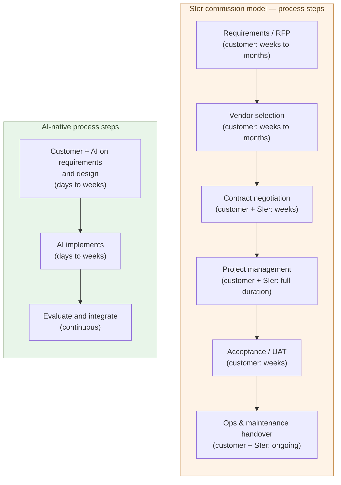

# The Structural Uneconomy of the SIer Model

**The effort customers pay to commission an SIer — requirements,
vendor selection, contracts, project management, acceptance — consumes
as much labor as building it AI-natively, sometimes more. For the same
effort, you can build it yourself**.

1-05 showed that customers can become the builder and that
nine-tenths of the work can close inside customer plus AI. This chapter
takes up the other side — why "commissioning an SIer makes life
easier" is now an illusion — by decomposing the commission process
step by step.

The cost of outsourcing carries, on top of vendor payments, a stack of
**invisible costs on the customer side**. That stack is the focus of
this chapter.

## The SIer commission model has a longer process than it looks

Moving a single SIer engagement requires a process like this:

- **Requirements / RFP** — weeks to months on the customer side.
  Decide what to build and at what level, and put it into a form that
  can be handed out.
- **Vendor selection** — pull in proposals from several vendors and
  compare them. Weeks to months.
- **Contract negotiation** — legal, procurement, vendor-side
  negotiation. Weeks.
- **Project management** — runs continuously for the duration of the
  engagement. Customer-side PM plus SIer-side PM, a two-layer
  structure.
- **Acceptance / UAT** — confirm the deliverable meets the
  requirements. Weeks.
- **Operations and maintenance handover** — verbal transfer of spec,
  document handover, ongoing.

"Hand it to the vendor and we are done" does not describe this.
**Customer-side work continues throughout the engagement**. The same
is true for small projects and for very large ones — at every step of
the process, somebody inside the customer has to stay attached, or
the project does not move.

## The customer's "invisible labor" is the real body of the cost

The thing easiest to miss in commission-cost discussions is **the
customer's internal labor**.

The amount the customer pays the SIer is written in the contract.
The time spent inside the customer's organization, to make the
engagement move, is not:

- IT-department staff pulling requirements together
- Hearing meetings with affected departments
- Reading and comparing vendor proposals
- Writing internal approval material
- Monthly meetings, steering committees, status reports
- Management time spent owning the acceptance decision
- Coordination when spec changes happen mid-project

None of this hits the invoice line as "labor cost." But it is
**actually being consumed**. IT staff, affected-department managers,
sign-off owners — every engagement pulls non-trivial time out of each.

Empirically, in mid-size SIer engagements, **the customer-side
invisible labor amounts to a significant fraction of the SIer payment
itself** (the exact ratio varies, but it is never negligible). Even
so, until now there was no alternative — building in-house meant
hiring and retaining coders, which cost more.

> The real cost of commissioning = **SIer payment + customer-side
> invisible labor**.
> The second item is not in the contract, but in practice it carries
> **half the weight**.

## With the same effort, you can build it yourself

This is the central claim of the chapter.

"Even if the SIer is expensive, we cannot build it ourselves, so we
have no choice" — that was the old argument. It does not hold in the
AI-native world.

Why not? **Because the customer-side labor consumed by an SIer
engagement (requirements, vendor selection, management, acceptance)
overlaps with the customer-side labor consumed by AI-native in-house
development (requirements, design, delegation to AI, evaluation,
integration)**.

- Pulling requirements together — same work, commissioned or in-house
- Deciding what to build — same work either way
- Evaluating the result — same work either way
- Fix bugs — commission asks the SIer, in-house asks AI

The historical difference sat in **writing the code**. That was where
enormous money and person-months landed. Once AI took execution, that
difference disappeared.

In other words, **the effort to commission an SIer and the effort to
build AI-natively in-house are now the same order of magnitude**. If
you are going to spend the effort anyway, zeroing out the SIer payment
is clearly the more efficient route.

> Once "the effort to outsource" and "the effort to build yourself"
> become equal, **the rational reason to outsource disappears**.

## Why SIers cannot absorb this diseconomy

"If SIers themselves use AI, their internal efficiency goes up" — true.
Many SIers are integrating Claude or GPT into their workflows. Even
so, the SIer commission model cannot, structurally, reach parity with
AI-native in-house development.

Four reasons:

- **The pricing model is person-month based** — revenue scales with
  "coders × months." If AI lifts productivity significantly, reflecting
  that into the price shrinks revenue by the same amount. That
  transition is not financially survivable.
- **The organization assumes managed coders** — primes plus tier-1
  and tier-2 subcontractors, team leads, PMs, QA — the whole pyramid
  is built on holding coders and assigning them (the structural
  transition is treated in 3-07).
- **Existing contracts are lock-in** — multi-year operations contracts,
  proprietary frameworks, custom abstraction layers all make it hard
  for customers to move (the FDE-style extreme lock-in is treated in
  3-05).
- **Hiring and training are coder-shaped** — new-graduate programs
  and mid-career hires are organized around framework fluency, SQL,
  and test writing — execution skills. The organization is not built
  to grow judgment-centered builders.

The result is that when SIers internally use AI, **AI sits on top of
person-months kept in place to defend revenue**. Costs drop; prices
do not. From the customer's perspective, the total cost of an SIer
engagement stays anchored **at a level above what an in-house
AI-native build would cost**.

## Commissioning splits judgment from substance

The diseconomy of commissioning is not only labor and cost. It runs
deeper — commissioning **splits the side that judges from the side
that builds, into separate organizations**. The moment judgment and
substance no longer meet inside one head, the quality of the result
falls.

The most expensive example is GitHub Copilot. Even Microsoft, the
world's largest software company, did not build the AI core itself —
it invested in OpenAI and had them build it (Copilot runs on OpenAI's
Codex). As a result, **capability and responsibility split across two
companies**.

- The power to build the AI sits with OpenAI. But Copilot is not
  OpenAI's product, and they have no stake in how good it is.
- On the Microsoft side, which owns the product, the people developing
  Copilot are integration engineers who cannot build the AI itself —
  they wrap a finished model into a product.

Here a fatal blind spot opens. **That what you train a model on
decides the quality of its output is the most basic common sense of
machine learning.** Yet most public code is a mix of good and bad, of
wildly varying quality. The side that can see this (OpenAI) does not
care; the side that cares (Microsoft) cannot see it. **Those who can
see don't care; those who care can't see.**

The result shows in the numbers. Independent analysis finds that since
AI-assisted coding spread, code churn (lines rewritten soon after) has
risen, refactoring has fallen, and copy-paste has increased. In
exchange for writing "fast and in volume," unmaintainable debt piles
up.

This is the structural hole of commissioning. The moment you put the
building outside, judgment and substance never again meet in one head.
**The largest company in the world, spending the most money, fell into
this hole.** SIer commissioning has the same structure, only at a
different scale.

So the answer is in-house building — the customer becoming the builder
(1-05). Only rejoining judgment and substance in one pair of hands
closes the hole. Fittingly, the next form — "the builder directs and
AI runs it to completion" — emerged not from Copilot either, but from
the side closer to the builders.

## SIers will shrink and reconstitute

This is not "SIers all disappear at once." It is structural
shrinkage: nine-tenths moves to the customer side, the SIer share
concentrates in the remaining tenth.

- **What stays**: the one-tenth from 1-05 — genuinely new
  technical territory, specialized regulation, cross-organizational
  authority, scale-driven design, hard-earned pitfall knowledge
- **What disappears**: the nine-tenths "standard work AI can write"
  — absorbed on the customer side
- **What reconstitutes**: even in the remaining tenth, contract
  shapes shift from "multi-year operations commissions" to "hourly
  consulting" (3-06)

Transition speed, Japan-specific dynamics (multi-tier subcontracting),
and labor mobility are taken up in 3-07 and 3-08. What this
chapter fixes is the structural claim: **the SIer commission model
cannot reach parity with AI-native in-house development**.

> SIers do not vanish, but they cannot avoid **the 9 : 1 shrinkage
> and the reshaping of their contract forms**.

## Where the next chapter goes

This chapter has shown that "for the same effort, you can build it
yourself." The next question is: not by effort, but **by money**,
how far apart are they? Putting an SIer quote next to the cost of an
AI-native in-house build.

The next chapter takes up that price gap.

---

## Related articles

- [1-01: AI Solves the World's Hardest Coding Problems](/en/ai-native-ways/software/coder-top/)
- [1-04: The Builder Role](/en/ai-native-ways/software/builder/)
- [1-05: Customers Co-Develop with AI](/en/ai-native-ways/software/customer-codev/)
- [Structural analysis 08: Subtracting the enterprise-IT tax](/en/insights/enterprise-tax/)
- [Structural analysis 12: AI and the sole proprietor](/en/insights/ai-and-individual/)
