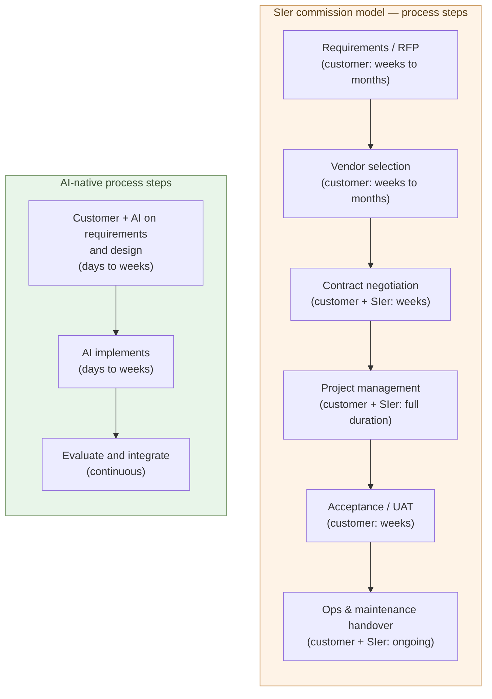

# The Structural Uneconomy of the SIer Model

**The effort customers pay to commission an SIer — requirements,
vendor selection, contracts, project management, acceptance — consumes
as much labor as building it AI-natively, sometimes more. For the same
effort, you can build it yourself**.

1-05 showed that customers can become the builder and that
nine-tenths of the work can close inside customer plus AI. This chapter
takes up the other side — why "commissioning an SIer makes life
easier" is now an illusion — by decomposing the commission process
step by step.

But the chapter's real focus is structure, not cost. Even when you
outsource, **the upstream judgment stays with the customer**. And on top
of that, commissioning **erases responsibility and hollows out
capability**.

## The SIer commission model has a longer process than it looks

The process does not even begin with requirements. Before that, you
have to think through **how to improve the business operations
themselves** — the workflow, the approval steps, the paper and the
rules, including the parts that have nothing to do with software. What
should become a system is decided only after that. This is something
only the customer understands; it cannot be dumped on the SIer.

And improving those operations itself **does not go well unless you
understand what systems can do**. Only once you can see what can be
automated and where data connects do you know how to restructure the
work. The more upstream the judgment, the more it needs an understanding
of systems — which is exactly why that understanding must be held
in-house.

In other words, from the upstream work to implementation is not a
straight line you finish step by step. **You build, you try, you
restructure the operations from what you now see, and you build again —
it can only be run as a loop.** The SIer's linear process needs
requirements, a contract, and months for every turn; it cannot run this
loop. But **with AI you can run this loop fast** — implementation comes
back in days, so you try, restructure the operations, and try again, as
many times as you need. Only in-house building, with AI in your own
hands, can do this.

On top of that, moving a single SIer engagement requires a process like
this:

- **Requirements / RFP** — weeks to months on the customer side.
  Decide what to build and at what level, and put it into a form that
  can be handed out.
- **Vendor selection** — pull in proposals from several vendors and
  compare them. Weeks to months.
- **Contract negotiation** — legal, procurement, vendor-side
  negotiation. Weeks.
- **Project management** — runs continuously for the duration of the
  engagement. Customer-side PM plus SIer-side PM, a two-layer
  structure.
- **Acceptance / UAT** — confirm the deliverable meets the
  requirements. Weeks.
- **Operations and maintenance handover** — verbal transfer of spec,
  document handover, ongoing.

"Hand it to the vendor and we are done" does not describe this.
**Customer-side work continues throughout the engagement**. The same
is true for small projects and for very large ones — at every step of
the process, somebody inside the customer has to stay attached, or
the project does not move.

And **this is the proper form**. In reality, though, people skip the
process and settle for "we left it to the SIer." Requirements,
acceptance, judgment — all handed over whole. It looks easier, but this
is where **de-responsibilization** begins — and, as the second half
shows, that is the deepest problem with commissioning.

## Commissioning erases responsibility and hollows out capability

The deepest problem with commissioning is not labor or cost.
**Commissioning erases responsibility.** The moment the side that builds
and the side that delegates split apart, "whose responsibility is this?"
floats free. The delegating side says "we left it to the experts"; the
delegated side says "we built to spec." No one owns the result whole —
this is **de-responsibilization**.

And de-responsibilization breeds the hollowing-out of capability. What
no one is responsible for, no one cultivates. Keep sending the work to
build outside, and the capability never grows inside you. Eventually you
lose even the **eye to tell good from bad**.

The most expensive example is **Nadella's GitHub Copilot**. Microsoft
did not build the AI core itself — it handed it to OpenAI, so the power
to build sat with OpenAI while the product's responsibility sat with
Microsoft: **responsibility split across two companies**. And during
that time, Nadella was thinning out his own basic research. **Microsoft
Research** was one of the most prestigious basic-research labs in the
industry — home to a Turing Award winner — yet in his first year as CEO
he **closed the MSR Silicon Valley lab in 2014** (about 50 researchers),
and in **2023 disbanded the entire AI ethics team**, prioritizing
shipping OpenAI's models "to customers at very high speed." Long-term
research was traded for speed.

An organization whose technical capability has hollowed out cannot stop
elementary mistakes. Copilot was trained on public GitHub code — which
holds excellent code, but also **a vast amount of garbage**. That what
you train on decides output is the most basic common sense of machine
learning, yet the researchers who could see this and select good code
were no longer at the center of the decision.

The result showed in dangerous code.

- A controlled study (Perry, Boneh et al., ACM CCS 2023, 47
  participants, using Codex) — developers given an AI assistant **wrote
  significantly less secure code**, and **believed their code was
  secure** ("false sense of security").
- Early research ("Asleep at the Keyboard?") — roughly **40%** of the
  code GitHub Copilot produced contained a vulnerability (about 50% in
  C).
- In enterprise assessments, **78%** of AI-generated code carried a
  hard-to-detect vulnerability, and Copilot repositories leaked secrets
  at a **40% higher** rate.

**This is the mistake the world's largest software company made after
scattering responsibility and hollowing out its own capability.** SIer
commissioning has the same structure, only at a different scale — the
customer says "we left it to the SIer," the SIer says "we built to
spec." Responsibility floats free, and capability never grows in-house.
The deeper the commissioning, the deeper the hollow.

So the answer is in-house building — the customer becoming the builder
(1-05). Only taking judgment and capability back into your own hands
stops the de-responsibilization and the hollowing-out.

## SIers will shrink and reconstitute

This is not "SIers all disappear at once." It is structural
shrinkage: nine-tenths moves to the customer side, the SIer share
concentrates in the remaining tenth.

- **What stays**: the one-tenth from 1-05 — genuinely new
  technical territory, specialized regulation, cross-organizational
  authority, scale-driven design, hard-earned pitfall knowledge
- **What disappears**: the nine-tenths "standard work AI can write"
  — absorbed on the customer side
- **What reconstitutes**: even in the remaining tenth, contract
  shapes shift from "multi-year operations commissions" to "hourly
  consulting" (3-06)

Transition speed, Japan-specific dynamics (multi-tier subcontracting),
and labor mobility are taken up in 3-07 and 3-08. What this
chapter fixes is the structural claim: **the SIer commission model
cannot reach parity with AI-native in-house development**.

> SIers do not vanish, but they cannot avoid **the 9 : 1 shrinkage
> and the reshaping of their contract forms**.

## The SIer model used to be rational

One last thing, to avoid misunderstanding. Commissioning an SIer was
rational until now. Building software takes **excellent software
engineers across many fields** — design, databases, frontend,
infrastructure, security. Holding and retaining all of them in-house,
company by company, was not realistic. Gathering the talent in one
place to build — concentrating it in an SIer — was the more efficient
path.

What changed is that **you can now hire an excellent software engineer
as AI**. AI takes on the multi-field expertise single-handed. There is
no longer any need to gather that talent in one place. Every diseconomy
of process and cost this chapter has shown comes back to this one point
— so build it in-house.

## Where the next chapter goes

This chapter has shown that "for the same effort, you can build it
yourself." The next question is: not by effort, but **by money**,
how far apart are they? Putting an SIer quote next to the cost of an
AI-native in-house build.

The next chapter takes up that price gap.

---

## Related articles

- [1-01: AI Solves the World's Hardest Coding Problems](/en/ai-native-ways/software/coder-top/)
- [1-04: The Builder Role](/en/ai-native-ways/software/builder/)
- [1-05: Customers Co-Develop with AI](/en/ai-native-ways/software/customer-codev/)
- [Structural analysis 08: Subtracting the enterprise-IT tax](/en/insights/enterprise-tax/)
- [Structural analysis 12: AI and the sole proprietor](/en/insights/ai-and-individual/)
