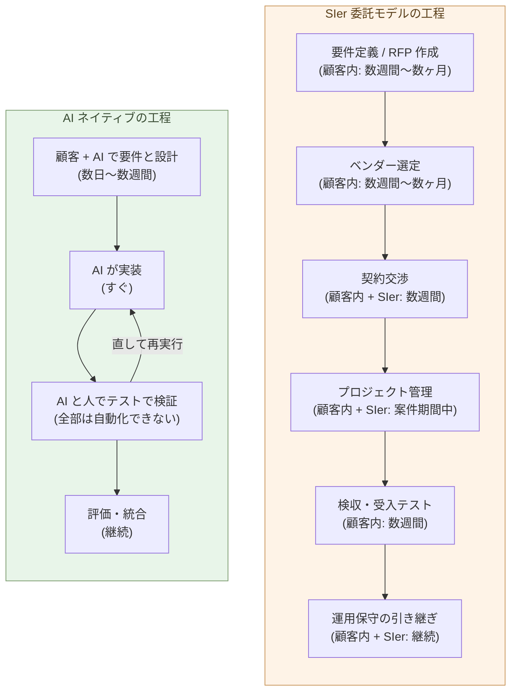

# SIer委託モデルの構造的不経済

**SIer に発注するために顧客が払う手間 ── 要件定義、ベンダー選定、
契約、管理、検収 ── は、AI ネイティブに自分で作るのと同じ量、
あるいはそれ以上の労力を消費する。同じ手間で、自分で作れる**。

1-05で、顧客自身がビルダーになれること、9 割を自分で作れること
を示した。本章はその裏面 ── なぜ「SIer に頼んで楽になる」が幻想
なのか ── を、委託プロセスの工程に分解して見ていく。

だが本章の眼目は、コストよりも構造にある。外注しても、**上流の判断は
顧客に残る**。そのうえ委託は、**責任と技術を空洞化させる**。

## SIer 委託モデルは、見える以上に長い工程を持つ

そもそも工程は、要件定義から始まらない。その前に、**事務処理そのもの
をどう改善するか**を考えねばならない ── 業務の流れ、承認のしかた、紙や
ルールの見直しまで、システム化以前の部分を含めて。何をシステムにすべき
かは、その後で決まる。ここは顧客にしか分からず、SIer に丸投げできない。

しかも、その事務処理の改善は、**システムで何ができるかを理解していな
ければ、うまくいかない**。何を自動化でき、どこがデータで繋がるかが見えて
初めて、業務の組み替え方が決まる。上流の判断ほど、システムの理解を要する
── だから、その理解こそ、社内に持たねばならない。

つまり、上流から実装までは、順番に片づく直線ではない。**作っては試し、
見えたことで業務を組み替え、また作る ── ループで回すしかない**。SIer の
直線的な工程は、一周ごとに要件定義・契約・数ヶ月を要し、このループを
回せない。だが、**AI を使えば、このループを高速に回せる**。実装はすぐ
返る ── 時間がかかるのはむしろテストだ。テストは全部を自動化できず、人手
の確認が残るからだ。それでも一周は数日で、SIer の一周(要件定義・契約・
数ヶ月)とは桁が違う。試して、業務を組み替えて、また試す ── 何度でも
繰り返せる。これができるのは、AI を手元に持つ内製だけだ。

そのうえで、SIer 案件を一つ動かすには、こういう工程が要る:

- **要件定義 / RFP 作成** ── 顧客側で数週間〜数ヶ月。何を作るか、
  どのレベルで作るか、外部に出せる形に整理する作業
- **ベンダー選定** ── 複数社の提案を取り寄せて比較、数週間〜数ヶ月
- **契約交渉** ── 法務、調達、SI 側との折衝、数週間
- **プロジェクト管理** ── 案件期間中ずっと続く、顧客側 PM + SIer
  側 PM の二重体制
- **検収・受入テスト** ── 納品物が要件を満たすかの確認、数週間
- **運用保守の引き継ぎ** ── 仕様の口頭伝達、ドキュメント授受、継続

「ベンダーに頼んで終わり」ではない。**顧客側にも、案件期間にわたって
継続的な作業が発生する**。これは小規模案件でも、巨大案件でも同じ
── 工程の各段に、顧客内部の担当者が張り付かなければ案件は動かない。

そして、**これが本来の姿だ**。だが現実には、この工程を省いて「SIer に
任せた」で済ませてしまう。要件も、検収も、判断も、丸ごと相手に預ける。
楽に見えて、ここから**無責任化**が始まる ── 後半で見るとおり、これが
委託の最も深い問題だ。

## 委託は、責任を消し、技術を空洞化させる

委託の最も深い問題は、手間でもコストでもない。**委託は、責任を消す**。
作る側と任せる側が分かれた瞬間、「これは誰の責任か」が宙に浮く。任せた
側は「専門家に任せた」と言い、任された側は「仕様どおり作った」と言う。
誰も、結果の全体を引き受けない ── これが**無責任化**だ。

そして無責任化は、技術の空洞化を呼ぶ。誰も責任を負わないものは、誰も
育てない。作る力を外に出し続ければ、技術は自分の中に育たず、やがて
出てきたものの良し悪しを**見抜く力**まで失う。

その最も高価な実例が、**ナデラの GitHub Copilot** だ。Microsoft は AI の
中核を自社で作らず、OpenAI に委ねた ── 作る力は OpenAI、製品の責任は
Microsoft と、**責任が二社に割れた**。そしてその間、ナデラは自社の基礎
研究を細らせていった。**Microsoft Research** は産業界で最も権威ある基礎
研究所の一つ ── チューリング賞受賞者を擁した ── だったが、CEO 就任初年
の **2014 年に MSR シリコンバレー研究所を閉鎖**(約 50 名)、**2023 年には
AI 倫理チームを丸ごと解体**し、OpenAI のモデルを「最速で顧客に届ける」
ことを優先した。長期の研究は、速度に置き換えられた。

技術が空洞化した組織は、初歩的な失敗を止められない。Copilot は、公開
された GitHub のコードで学習した ── そこには優れたコードもあるが、
**ゴミのようなコードも大量にある**。何を学習させるかが出力を決めるのは
機械学習の常識中の常識だが、それを見抜き、優良なコードを選ぶ研究者は、
もう判断の中心にいなかった。

結果は、危険なコードに出た。

- スタンフォードの対照実験(Perry, Boneh ら, ACM CCS 2023, 47名、
  Codex 使用)── AI 補助を与えられた開発者は、**有意に安全でないコード
  を書き**、しかも**自分のコードを安全だと誤認した**("false sense of
  security")。
- NYU の初期研究("Asleep at the Keyboard?")── Copilot 出力の
  **約 40%** が脆弱性を含む(C は約 50%)。
- 企業評価では、AI 生成コードの **78%** に検出困難な脆弱性。Copilot
  リポジトリは secret 漏洩が **40% 高い**。

**世界最大のソフトウェア企業が、責任を散らし、技術を空洞化させた末に
犯した失敗だ**。SIer 委託も、規模が違うだけで、同じ構造を持つ ── 顧客は
「SIer に任せた」、SIer は「仕様どおり作った」。責任は宙に浮き、技術は
社内に育たない。委託が深いほど、空洞は深くなる。

だから答えは、内製 ── 顧客自身がビルダーになることだ(1-05)。判断と
技術を自分の手元に握り直すことだけが、無責任化と空洞化を止める。

## SIer の縮小と再構成

これは「SIer が一斉に消える」話ではない。9 割が顧客側に移り、SIer
の取り分が 1 割に集約される、という**構造的縮小**の話だ。

- **残るもの**: 1-05で見た 1 割 ── 真に新しい技術領域、専門規制、
  組織横断の権限問題、スケール起因の設計判断、経験的な落とし穴
- **消えるもの**: 9 割の「AI が書ける標準的な仕事」── ここは顧客
  側で吸収される
- **再構成されるもの**: 残った 1 割の領域でも、契約形態が「多年の
  運用委託」から「時間契約のコンサルティング」に変わる(3-06)

転換の速度、日本固有の事情(多重下請け構造)、雇用流動性は、
3-07と3-08で扱う。本章では「**構造として、SIer 委託は AI
ネイティブと対等にならない**」までを確定させておく。

> SIer は消えないが、**9 : 1 の縮小と契約形態の再構成**を避けられない。

## かつて、SIer は合理的だった

最後に、誤解のないよう付け加えておく。SIer 委託は、これまで合理的だった。
ソフトウェアを作るには、**多分野にわたる優秀なソフトウェアエンジニア**が
要る ── 設計、データベース、フロントエンド、インフラ、セキュリティ。それ
を一社一社が社内に抱えて維持するのは、現実的でなかった。人材を一か所に
集めて作る ── SIer に集中させるほうが、効率的だったのだ。

変わったのは、**優秀なソフトウェアエンジニアを、AI として雇えるように
なった**ことだ。多分野の専門性を、AI が一手に引き受ける。もう、その人材
を一か所に集める必要はない。本章で見てきた工程とコストの不経済は、すべて
この一点に帰る ── だから、内製すればいい。

## 次の章へ

「同じ手間で自分で作れる」までは、本章で示した。次に問うのは、
「同じ手間ではなく、**金額で直接比較するとどうか**」だ。SIer 発注
の見積もり額と、AI ネイティブな自社開発のコストを並べる。

次の章では、この価格差を扱う。

---

## 関連記事

- [1-01: AI は、世界で最も難しいコーディング問題を解く](/ai-native-ways/software/coder-top/)
- [1-04: ビルダーという役割](/ai-native-ways/software/builder/)
- [1-05: 顧客がAIと協働して開発する時代](/ai-native-ways/software/customer-codev/)
- [構造分析08: 企業ITの税を引く](/insights/enterprise-tax/)
- [構造分析12: AIと個人事業](/insights/ai-and-individual/)
