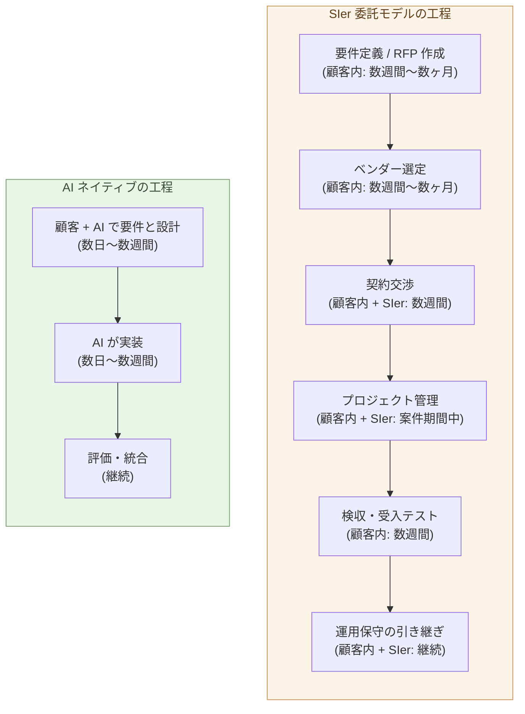

# SIer委託モデルの構造的不経済

**SIer に発注するために顧客が払う手間 ── 要件定義、ベンダー選定、
契約、管理、検収 ── は、AI ネイティブに自分で作るのと同じ量、
あるいはそれ以上の労力を消費する。同じ手間で、自分で作れる**。

1-05で、顧客自身がビルダーになれること、9 割を自分で作れること
を示した。本章はその裏面 ── なぜ「SIer に頼んで楽になる」が幻想
なのか ── を、委託プロセスの工程に分解して見ていく。

外注のコストには、ベンダーへの支払い以外に、**顧客側で見えにくい
コスト**が積み上がる。これが本章の中心だ。

## SIer 委託モデルは、見える以上に長い工程を持つ

SIer 案件を一つ動かすには、こういう工程が要る:

- **要件定義 / RFP 作成** ── 顧客側で数週間〜数ヶ月。何を作るか、
  どのレベルで作るか、外部に出せる形に整理する作業
- **ベンダー選定** ── 複数社の提案を取り寄せて比較、数週間〜数ヶ月
- **契約交渉** ── 法務、調達、SI 側との折衝、数週間
- **プロジェクト管理** ── 案件期間中ずっと続く、顧客側 PM + SIer
  側 PM の二重体制
- **検収・受入テスト** ── 納品物が要件を満たすかの確認、数週間
- **運用保守の引き継ぎ** ── 仕様の口頭伝達、ドキュメント授受、継続

「ベンダーに頼んで終わり」ではない。**顧客側にも、案件期間にわたって
継続的な作業が発生する**。これは小規模案件でも、巨大案件でも同じ
── 工程の各段に、顧客内部の担当者が張り付かなければ案件は動かない。

## 社内担当者の「見えない工数」が本体だ

委託コストの議論で見落とされやすいのが、**顧客側の社内工数**だ。

SIer に払う金額は契約書に書いてある。だが、案件を回すために顧客の
中で誰かが投じている時間は、契約書には書かれない:

- 情シスの担当者が要件をまとめる時間
- 関係部署にヒアリングする時間
- ベンダー提案を読み比べる時間
- 内部承認を通すための説明資料の作成
- 月次会議、ステコミ、進捗報告への参加
- 検収判断の責任を負う管理職の時間
- 仕様変更が発生したときの調整

これらは「人件費」として勘定書に乗らない。だが、**実際に消費されて
いる**。情シス部の人員、関係部署の管理職、決裁権者 ── 案件のたび
に、それぞれが少なくない時間を投じる。

経験的に言って、**中規模の SIer 案件では、顧客側の見えない工数は、
SIer への支払い額に対して相当の割合**になる(具体的な比率は案件
ごとに異なるが、決して無視できる規模ではない)。それでも今まで
は選択肢が無かった ── 内製しようにも、社内でコードが書ける人材を
雇って維持する方が高くついた。

> 委託の本当のコスト = **SIer への支払い + 顧客内部の見えない工数**。
> 後者は契約書に書かれないが、**実際には半分の重さを持つ**。

## 同じ手間で、自分で作れる

ここが本章の中心命題だ。

「SIer に頼むほど高くついても、自分で作れないから仕方ない」── これ
が旧来の議論だった。AI ネイティブな世界では、この論理が成立しない。

なぜか。**SIer 委託で消費する社内工数(要件整理・ベンダー選定・
管理・検収など)は、AI ネイティブな自社開発で消費する工数(要件
整理・設計・AI への委譲・評価・統合)と、重なるからだ**。

- 要件をまとめる ── 委託でも内製でも、同じ作業
- 何を作るか決める ── 委託でも内製でも、同じ作業
- 動いた結果を評価する ── 委託でも内製でも、同じ作業
- 不具合を発見・修正する ── 委託では SIer に依頼、内製では AI に依頼

旧来の差は、「**コードを書く**」の部分だった。ここに巨大な金額と
人月が投じられていた。AI が実行を取ったとき、この差が消えた。

つまり、**SIer に発注するための手間と、AI ネイティブに自社で作る
手間は、もう同等のオーダーになっている**。同じ手間を投じるなら、
SIer への支払いをゼロにしたほうが、コスト的に明らかに有利だ。

> 「外注する手間」と「自分で作る手間」が同等になったとき、
> **外注を選ぶ合理的な理由が消える**。

## なぜ SIer はこの不経済を吸収できないのか

「SIer 自身が AI を使えば、内部効率は上がる」── これは事実だ。多く
の SIer は実際に Claude や GPT を業務に組み込みつつある。それでも、
構造的に SIer 委託モデルは AI ネイティブな内製と対等にならない。

理由は四つある。

- **価格モデルが人月ベース** ── 売上は「コーダー × 月数」で立つ。
  AI で生産性が大きく上がっても、それを価格に反映すれば、売上は
  同じ分だけ縮む。経営上、この移行はできない
- **組織が管理されたコーダー前提** ── 元請け + 一次・二次下請け、
  チームリーダー、PM、品質管理 ── ピラミッド組織の全体が、コーダー
  を抱えて配備することで成立している(構造の転換は3-07で扱う)
- **既存契約のロックイン** ── 数年単位の運用保守契約・独自フレーム
  ワーク・独自抽象層が、顧客を別の選択肢に動きにくくしている
  (FDE 型の極端なロックインは3-05で扱う)
- **採用と育成がコーダー向き** ── 新卒研修も中途採用も、フレーム
  ワーク習熟・SQL・テスト記述といった実行能力を軸に組まれている。
  判断中心のビルダーを育てる組織にはなっていない

結果として、SIer 側で AI を使っても、**売上構造を維持するための
人月の上に AI が乗る**ことになる。コストは下がっても、価格は下がら
ない。顧客から見れば、SIer 委託の総コストは、**自社で AI ネイティブ
に作る場合より高い水準で固定される**。

## 委託は、判断と実体を引き裂く

委託の不経済は、手間とコストだけではない。もっと深いところにある
── 委託は、**判断する側と、作る側を、別々の組織に引き裂く**。判断と
実体が一つの頭の中で出会わなくなった瞬間、結果の質は落ちる。

最も高価な実例が、GitHub Copilot だ。世界最大のソフトウェア企業
Microsoft でさえ、AI の中核を自社で作らず、OpenAI に出資して作らせた
(Copilot は OpenAI の Codex を中核とする)。その結果、**能力と責任が
二社に割れた**。

- AI を作る力を持つのは OpenAI の側。だが Copilot は OpenAI の製品では
  なく、彼らはその出来に関心がない。
- 製品を持つ Microsoft の側で開発するのは、AI そのものを作る力を持た
  ない統合エンジニア ── 出来上がったモデルを製品に組み込む側だ。

ここに、致命的な見落としが生まれる。**モデルに何を学習させるかが
出力の質を決めるのは、機械学習の常識中の常識**だ。だが公開コードの
大半は玉石混交で、質はまちまち。これを見抜けるのは AI を作る側
(OpenAI)だが、彼らは気にしない。気にする側(Microsoft)には、見抜く力
がない。**見抜ける者は気にせず、気にする者には見抜けない**。

結果は数字に出る。独立した分析では、AI 支援コーディングの普及後、
コードの churn(早期に書き直される率)が上がり、リファクタリングは減り、
コピペが増えている。「速く・大量に」書ける代わりに、保守できない
負債が積み上がる。

これが委託の構造的な穴だ。作ることを外に出した瞬間、判断と実体は、
二度と一つの頭の中で出会わない。**世界最大の企業が、最も金をかけて、
この穴に落ちた**。SIer 委託も、規模が違うだけで、同じ構造を持つ。

だから答えは、内製 ── 顧客自身がビルダーになることだ(1-05)。判断と
実体を、一人の手元で結び直すことだけが、この穴を塞ぐ。皮肉なことに、
「作り手が指揮し、AI が完成まで回す」という次の形も、Copilot からでは
なく、より作り手に近い側から現れた。

## SIer の縮小と再構成

これは「SIer が一斉に消える」話ではない。9 割が顧客側に移り、SIer
の取り分が 1 割に集約される、という**構造的縮小**の話だ。

- **残るもの**: 1-05で見た 1 割 ── 真に新しい技術領域、専門規制、
  組織横断の権限問題、スケール起因の設計判断、経験的な落とし穴
- **消えるもの**: 9 割の「AI が書ける標準的な仕事」── ここは顧客
  側で吸収される
- **再構成されるもの**: 残った 1 割の領域でも、契約形態が「多年の
  運用委託」から「時間契約のコンサルティング」に変わる(3-06)

転換の速度、日本固有の事情(多重下請け構造)、雇用流動性は、
3-07と3-08で扱う。本章では「**構造として、SIer 委託は AI
ネイティブと対等にならない**」までを確定させておく。

> SIer は消えないが、**9 : 1 の縮小と契約形態の再構成**を避けられない。

## 次の章へ

「同じ手間で自分で作れる」までは、本章で示した。次に問うのは、
「同じ手間ではなく、**金額で直接比較するとどうか**」だ。SIer 発注
の見積もり額と、AI ネイティブな自社開発のコストを並べる。

次の章では、この価格差を扱う。

---

## 関連記事

- [1-01: AI は、世界で最も難しいコーディング問題を解く](/ai-native-ways/software/coder-top/)
- [1-04: ビルダーという役割](/ai-native-ways/software/builder/)
- [1-05: 顧客がAIと協働して開発する時代](/ai-native-ways/software/customer-codev/)
- [構造分析08: 企業ITの税を引く](/insights/enterprise-tax/)
- [構造分析12: AIと個人事業](/insights/ai-and-individual/)
