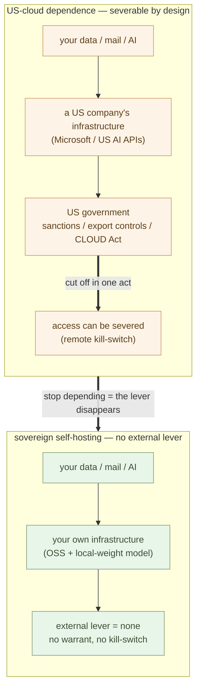

# Digital Sovereignty — The Microsoft Problem and the Trump Problem

**Leaving Microsoft 365 is no longer ideology — on both economics and
security, it has become the rational default**.

Restate the premise the previous chapter (3-01) set: companies bought office
as a package because it was **cheaper and safer** than standing it up
themselves. That was the right call. The US cloud was, for a long time,
cheap, safe, and stable. Choosing Microsoft 365 was the default that won on
both cost and security, beyond dispute.

That premise has inverted from two directions at once. **OSS plus sovereign
AI is now better on both economics and security**. This chapter reads the
inversion as two problems — the **Microsoft problem** (the dependence
itself) and the **Trump problem** (that the US government holding that
dependence can no longer be trusted).

## Microsoft 365 Used to Be the Cheap and Safe Default

Begin without hostility. **Buying Microsoft 365 was rational at the time**.
Rather than standing up your own mail server, running a document platform,
and managing authentication, bundling it all into one vendor's suite was
cheaper, safer, and more reliable.

- **Economics** — the per-seat monthly charge cost less than the labor of
  running it yourself.
- **Security** — Microsoft's data centers genuinely beat your own server on
  availability, encryption, and patching.

This is the same structure 3-01 described as "buying was cheaper." Generic
office work gave no reason to build in-house — buying won on both cost and
security.

> Microsoft 365 won on **both economics and security**. That is exactly why
> everyone bought it. It was not laziness — it was the **rational default**.

The problem is that these two premises — cheap and safe — have **both
inverted**. Take them in turn.

## The Microsoft Problem — The Convenience IS the Dependence

The first inversion comes from the dependence itself. The convenience of
Microsoft 365 is, in the same stroke, the structure of dependence. 2-01
wrote that "the convenience and the hostage are two sides of the same
chain"; here we read that chain as a **security exposure**.

**On economics** — the per-seat charge **only rises**. Once you're on it,
the vendor sets the price. A price hike lands on a hostage with nowhere to
flee. Then Copilot stacks on top — another few thousand yen per seat. **You
rent forever, and the other party sets the price**. That is the structure of
rent.

**On control** — this is the heart of the security case.

- **Your data lives on a US company's cloud** — documents, mail, calendar,
  all in a place beyond your reach. And under the US **CLOUD Act**, that data
  can be reached by US government warrant — even when the data sits outside
  the US.
- **The telemetry is opaque** — you cannot audit what is sent, when, or
  where. It runs inside a black box.
- **Copilot routes your content through Microsoft's models** — your business
  documents and conversations pass through the vendor's models, with no
  verification layer in between.

None of this is a weakness of feature. It is the **underside of the
convenience**. It is convenient because every layer is wired through one
account, and you are dependent because that one point is held by another.
The same structure 2-01 named — "being bundled is itself the lock-in" — is
read here as a **security exposure**.

> The convenience of Microsoft 365 is the dependence itself.
> **The same chain is now both economic rent and security exposure**.

## The Trump Problem — The US Government Cannot Be Trusted

This is the heart of the chapter. **Depending on US Big Tech means depending
on the US government's goodwill**. And that goodwill can no longer be
assumed.

The logic is simple. Your data, your mail, your AI all sit on a US company's
infrastructure. That US company falls under US government jurisdiction. So
when the US government acts — sanctions, export controls, cutting off
service to a targeted entity, company, or country — your "own" services can
be **severed regardless of your intent**.

This is not an abstract worry. **It happened, in reality, in 2025**.

### The ICC Case — "Your" Services Can Be Severed by a Foreign Government

In February 2025, the Trump administration sanctioned the International
Criminal Court's chief prosecutor, Karim Khan, by executive order. He then
lost access to his Microsoft account and moved to Switzerland's Proton Mail.
(Microsoft denies it "in any way involved the cessation of services to the
ICC" — but as a matter of fact, following US sanctions, the targeted party
lost his US-cloud email.) That October, the ICC decided to move from
Microsoft Office to **OpenDesk**, the OSS developed by Germany's center for
digital sovereignty.

Read structurally, the lesson is one. **A single act by the US government
can sever "your" services on a US cloud**. Even an international institution
was not spared. Set aside where the responsibility lies (the vendor or the
government) — it does not change the structure: **as long as you depend, a
third party's single act can cut you off**.

> Depending on US Big Tech means **depending on the US government's
> goodwill**. That goodwill can no longer be assumed.

### Trump Is the Era's Upheaval-Side Figure

Widen the view by a step. The Trump administration has already shown it acts
coercively and transactionally. Tariffs, sanctions, budgets, staffing — all
swing on the spot. So you **cannot assume continuity of access**. Critical
infrastructure must not be built on trust in a foreign government that has
shown it will weaponize dependence.

This is not partisan denunciation — it is a matter of **structure**. In the
frame that runs alongside the parent series: just as the Renaissance was
**an age of creation and, at the same time, an age of upheaval**, this era
has two sides. The side of creation under AI, and the side of **upheaval**,
where the old order collapses and the new one has not yet stood up. **Trump
is the canonical figure on that upheaval side** — "I decide everything
alone" governance, the old era's logic of judgment-concentration pushed to
its limit at the scale of the state.

It is precisely that **unpredictability** that makes sovereignty urgent now.
Under a calm and stable hegemon, dependence could stay a convenience. But
when the hegemon swings transactionally, dependence stops being convenient
and becomes a **liability**.

That is why, for **any organization outside the US** (Japan, and the EU —
which is the reason for the EU's "digital sovereignty" push), and even for
US entities that fall out of favor, dependence on a US vendor is now **not a
convenience but a security liability**.

> Trump is, of the two sides — creation and upheaval — **the figure of the
> upheaval side**. His unpredictability is what **made sovereignty urgent**.

## OSS Plus Sovereign AI Resolves Both Problems

The two problems — the Microsoft problem (dependence) and the Trump problem
(distrust of the government that holds it) — dissolve with **one single
solution**: stop depending. The OSS foundation the Independence part stood
up one layer at a time is itself the answer.

What the **OSS foundation** (Independence part) removes —

- **Data lives on your own infrastructure** — not a US company's cloud.
  Neither a CLOUD Act warrant nor foreign-government jurisdiction reaches it.
- **It is auditable** — settings, logs, and telemetry are all in your hands.
  No black box.
- **No per-seat rent** — a single server's fixed cost. No lever for a price
  hike.
- **No foreign-government access lever. No remote kill-switch** — there is no
  third party holding the act that cuts you off in the first place.

**Sovereign AI** — and the last layer is the AI. Run the **local
open-weight model** you stood up in 2-11 on your own hardware.

- **Data never leaves** — documents and conversations never pass through a US
  AI API.
- **It can be air-gapped** — it runs even cut off from the network.
- **It cannot be severed or repriced** — a US AI API can be cut off and can
  be raised in price. Local weights can be neither.

And the decisive point: **this is now viable**. Open models have reached the
"good enough" level, and hardware has come within affordable reach.
Sovereignty is no longer a sacrifice of cost or quality — it is the
**cheaper AND safer** choice.

> Sovereign AI means **data never leaves, it can be air-gapped, and it cannot
> be severed**. Sovereignty is no longer a sacrifice — it is the **cheaper AND
> safer** default.

## Structurally — Both Premises Inverted at Once

Step back and restate it in the Shift part's logic. The Microsoft-dependent
structure was **rational as long as the US cloud was cheap, safe, and
stable** — the same as 3-01's "buying was cheaper." At the time, dependence
was a convenience.

The two pillars that held that premise have both broken.

- **The economic pillar** — the AI cost inversion. One person plus AI can run
  the OSS foundation, and local weights have become "good enough"
  (Independence part). **In-house became cheaper**.
- **The security pillar** — the geopolitical risk of the Trump era. The
  hegemon swings transactionally, and dependence has been shown to be
  weaponizable. **In-house became safer**.

With both broken at once, the conclusion is one. **Leaving Microsoft is not
ideology — it is the new economic-and-security rational default**. The same
rationality that once steered companies to Microsoft 365 now steers them
away from it. The premise inverted, so of course the conclusion inverts.

> Dependence was rational only while the US cloud was cheap, safe, and
> stable. **The AI cost inversion and the Trump-era geopolitical risk
> inverted both**.

## To the Next Chapter

This chapter set the premise of the Shift part's **office (Microsoft) side** —
sovereignty is now the cheaper AND safer default, and the Microsoft problem
and the Trump problem together make leaving Microsoft **not an optional
choice but the rational default**.

That covers the **office side** of the two parallel worlds (3-01). From the
next chapter, we turn to the other — the **core (SIer) side**. The next
chapter asks **why the SIer-commissioned model becomes structurally
uneconomic** — examining the structure in which the overhead of the
outsourcing process itself exceeds the AI-native build cost (3-03).

---

## Related articles

- [2-01: Stand Free of Microsoft and Google — Overview and Mapping](/en/ai-native-ways/software/independence/)
- [3-01: Companies Don't Write Their Own Code — Office and Core, Two Parallel Worlds](/en/ai-native-ways/software/two-worlds/)
- [3-03: The Structural Uneconomy of the SIer Model](/en/ai-native-ways/software/sier-uneconomic/)
