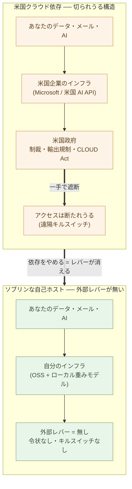

# デジタル主権 ── Microsoft 問題と Trump 問題

**Microsoft 365 から離れることは、もはやイデオロギーではない ──
経済でも安全保障でも、それが合理的な既定値になった**。

前章(3-01)で据えた前提を、もう一度置く ── 企業が事務をパッケージで
買ったのは、自前で立てるより**安くて安全だった**からだ。それは正しい
判断だった。米国のクラウドは、長く、安く、安定していた。Microsoft 365
を選ぶことは、コストでも安全でも、文句のない既定値だった。

その前提が、二つの方向から同時に反転した。**OSS + ソブリン AI のほうが、
いまや経済でも安全保障でも有利になった**。本章は、その反転を二つの問題
として見ていく ── **Microsoft 問題**(依存そのもの)と、**Trump 問題**
(その依存を握る米国政府を信頼しきれないこと)。

## かつて Microsoft 365 は、安くて安全な既定値だった

まず、敵意から始めないことだ。**Microsoft 365 を買ったのは、当時として
合理的だった**。自前でメールサーバーを立て、文書基盤を運用し、認証を
管理するより、一社のスイートに束ねて任せるほうが、安く、安全で、確実
だった。

- **経済** ── 自前運用の人件費より、人数 × 月額のほうが安かった。
- **安全保障** ── 自前のサーバーより、Microsoft のデータセンターの
  ほうが、可用性も、暗号化も、パッチ適用も、確実に上だった。

これは 3-01 で見た「買うほうが安かった」と同じ構造だ。汎用の事務は、
自前で立てる理由がなかった ── コストでも、セキュリティでも、買うほうが
勝っていたからだ。

> Microsoft 365 は、**経済でも安全でも勝っていた**。だからこそ、
> 誰もが買った。それは怠慢ではなく、**合理的な既定値**だった。

問題は、この二つの前提 ── 安い・安全 ── が、**両方とも反転した**こと
にある。順に見る。

## Microsoft 問題 ── 便利さこそが、依存だ

第一の反転は、依存そのものから来る。Microsoft 365 の便利さは、そのまま
依存の構造でもある。2-01 で「便利さと人質は同じ一本の鎖の表と裏」と
書いたが、その鎖を、いまは**安全保障の露出**として見る。

**経済の面** ── 人数 × 月額は、**上がり続ける**。一度乗れば、価格は
ベンダーが決める。逃げ場のない人質に、値上げは効く。さらに Copilot が
その上に積まれる ── 一人あたり数千円が、また乗る。**永久に借り続け、
価格は相手が決める**。これが地代の構造だ。

**支配・統制の面** ── ここが安全保障の核心だ。

- **データは米国企業のクラウドにある** ── 文書も、メールも、予定も、
  あなたの手の届かない場所にある。そして米国の **CLOUD Act** の下では、
  そのデータは米国政府の令状の対象になりうる ── データが米国外に
  あっても、だ。
- **テレメトリは不透明** ── 何が、いつ、どこへ送られているか、あなた
  には監査できない。ブラックボックスの中で動いている。
- **Copilot は内容を Microsoft のモデルに通す** ── 業務の文書も会話も、
  検証層なしに、ベンダーのモデルを経由する。

これらは機能の弱さではない。**便利であることの、裏の構造**だ。同じ
アカウントで全層が繋がっているから便利で、同じ一点を握られているから
依存している。2-01 が「束ねられていること自体がロックインの正体」と
言ったのと、同じ構造を、ここでは**セキュリティの露出**として読む。

> Microsoft 365 の便利さは、そのまま依存だ。
> **同じ鎖が、いまや経済の地代であり、安全保障の露出でもある**。

## Trump 問題 ── 米国政府は、信頼できない

ここが本章の核心だ。**米国ビッグテックに依存することは、米国政府の善意に
依存することだ**。そして、その善意は、いまや前提にできない。

論理は単純だ。あなたのデータも、メールも、AI も、米国企業のインフラの
上にある。その米国企業は、米国政府の管轄下にある。だから、米国政府が
動けば ── 制裁、輸出規制、特定の組織・企業・国へのサービス遮断 ──
あなたの「自分の」サービスは、**あなたの意思とは無関係に、切られうる**。

これは抽象的な懸念ではない。**2025 年、現実に起きた**。

### ICC の事例 ── 「あなたの」サービスは、外国政府に切られうる

2025 年 2 月、トランプ政権は大統領令で、国際刑事裁判所(ICC)の主任
検察官カリム・カーン氏に制裁を科した。その後、カーン氏は自身の Microsoft
アカウントにアクセスできなくなり、スイスの Proton Mail に移った。
(Microsoft は「ICC へのサービス停止には一切関与していない」と否定して
いるが、事実として、米国の制裁の後に、当事者は米国クラウドのメールを
失った。)そして同年 10 月、ICC は Microsoft Office から、ドイツの
デジタル主権機関が開発する OSS の **OpenDesk** へ移行することを決めた。

構造として読めば、教訓は一つだ ── **米国政府の一手で、米国クラウド上の
「あなたの」サービスは断たれうる**。国際機関ですら、そうだった。詳細の
責任所在(ベンダーか政府か)は脇に置いていい。**依存している限り、第三者の
一手で切られうる**という構造は、変わらないからだ。

> 米国ビッグテックに依存することは、**米国政府の善意に依存する**ことだ。
> その善意は、いまや**前提にできない**。

### Trump は、この時代の「混乱」の側の象徴だ

ここで一段、視野を広げる。トランプ政権は、強圧的・取引的に振る舞うこと
を、すでに示した。関税も、制裁も、予算も、人事も、その場で振れる。だから
**アクセスの継続性を前提にできない**。重要インフラを、依存を武器化すると
示した外国政府への信頼の上に建ててはならない。

これは党派的な非難ではなく、**構造の話**だ。親シリーズと併走する枠組みで
言えば ── ルネサンスが**創造の時代であると同時に混乱の時代でもあった**
ように、この時代にも二つの側面がある。AI による創造の側と、旧秩序が崩れ
新秩序がまだ立たない**混乱の側**だ。**トランプは、その混乱の側の象徴的な
人物**である。「私が一人で全部決める」という統治 ── 旧時代の判断集中の
論理を、国家のレベルで極限まで押した姿だ。

その**予測不可能性こそ**が、主権をいま緊急の課題にしている。穏やかで
安定した覇権の下でなら、依存は便利なままでいられた。だが覇権が取引的に
振れるとき、依存は便利ではなく、**負債**になる。

だからこそ、**米国以外のあらゆる組織**(日本、そして EU ── これが EU の
「デジタル主権」推進の理由だ)にとって、いや、米国内でも不興を買った
主体にとって、米国ベンダーへの依存は、いまや**便利ではなく、安全保障上の
負債**だ。

> トランプは、創造と混乱の二つの側面のうち、**混乱の側の象徴**だ。
> その予測不可能性が、**主権を緊急の課題にした**。

## OSS + ソブリン AI が、両方の問題を解く

二つの問題 ── Microsoft 問題(依存)と Trump 問題(その依存を握る政府の
不信)── は、**同じ一つの解**で消える。依存をやめることだ。自立編で一層
ずつ立てた OSS の土台が、そのまま答えになる。

**OSS の土台**(自立編)が外すもの ──

- **データは自分のインフラ上にある** ── 米国企業のクラウドではない。
  CLOUD Act の令状も、外国政府の管轄も、届かない。
- **監査できる** ── 設定もログもテレメトリも、自分の手元にある。
  ブラックボックスではない。
- **人数課金がない** ── サーバー一台分の固定費。値上げのレバーがない。
- **外国政府のアクセス・レバーがない。遠隔のキルスイッチがない** ──
  切る一手を握る第三者が、そもそも存在しない。

**ソブリン AI** ── そして、最後の一層は AI だ。2-11 で立てた**ローカルの
オープン重みモデル**を、自前のハードウェアで動かす。

- **データは外に出ない** ── 文書も会話も、米国の AI API を経由しない。
- **エアギャップできる** ── ネットから切り離しても動く。
- **遮断・再課金されない** ── 米国の AI API は、切られうるし、値上げ
  されうる。ローカルの重みは、どちらもされない。

そして決定的なのは、**これがいまや現実的だ**ということだ。オープンな
モデルは「十分に良い」水準に達し、ハードウェアは手の届く価格になった。
主権は、もはやコストや品質の犠牲ではない ── **より安く、かつより安全な**
選択だ。

> ソブリン AI は、**データが外に出ず、エアギャップでき、切られない**。
> 主権は、もはや犠牲ではなく ── **より安く、かつより安全な**既定値だ。

## 構造として ── 二つの前提が、両方とも反転した

一段引いて、転換編の論理に置き直す。Microsoft 依存の構造は、**米国
クラウドが安く・安全で・安定していた間は、合理的だった**。3-01 が
「買うほうが安かった」と言ったのと、同じだ。当時、依存は便利さだった。

その前提を支えていた二本の柱が、両方とも折れた。

- **経済の柱** ── AI によるコスト反転。OSS の土台を一人 + AI が運用でき、
  ローカルの重みが「十分に良く」なった(自立編)。**自前のほうが安く
  なった**。
- **安全保障の柱** ── トランプ時代の地政学リスク。覇権が取引的に振れ、
  依存が武器化されうると示された。**自前のほうが安全になった**。

二本同時に折れたのだから、結論は一つだ。**Microsoft から離れることは、
イデオロギーではない ── 新しい経済かつ安全保障の合理的な既定値だ**。
かつて Microsoft 365 を選ばせたのと同じ合理性が、今度は離れることを
選ばせる。前提が反転したのだから、結論が反転するのは当然だ。

> 依存が合理的だったのは、米国クラウドが安く・安全・安定だった間だけ。
> **AI のコスト反転と、トランプ時代の地政学リスクが、両方を反転させた**。

## 次の章へ

本章は、転換編の**事務(Microsoft)側**の前提を据えた ── 主権は、いまや
より安く、かつより安全な既定値であり、Microsoft 問題と Trump 問題が
重なって、Microsoft から離れることを**選べる選択肢ではなく、合理的な
既定値**にした。

ここまでが、二つの並立世界(3-01)のうちの**事務側**だ。次の章からは、
もう一方 ── **基幹(SIer)側**に移る。次章で問うのは、**なぜ SIer 委託の
モデルが、構造的に不経済になるのか** ── 外注プロセスそのものの工数が、
AI ネイティブの構築コストを上回る、その構造を見ていく(3-03)。

---

## 関連記事

- [2-01: Microsoft と Google から自立する ── 全体像と対応表](/ai-native-ways/software/independence/)
- [3-01: 企業は自分でコードを書かない ── 事務と基幹、二つの世界の並立](/ai-native-ways/software/two-worlds/)
- [3-03: SIer委託モデルの構造的不経済](/ai-native-ways/software/sier-uneconomic/)
