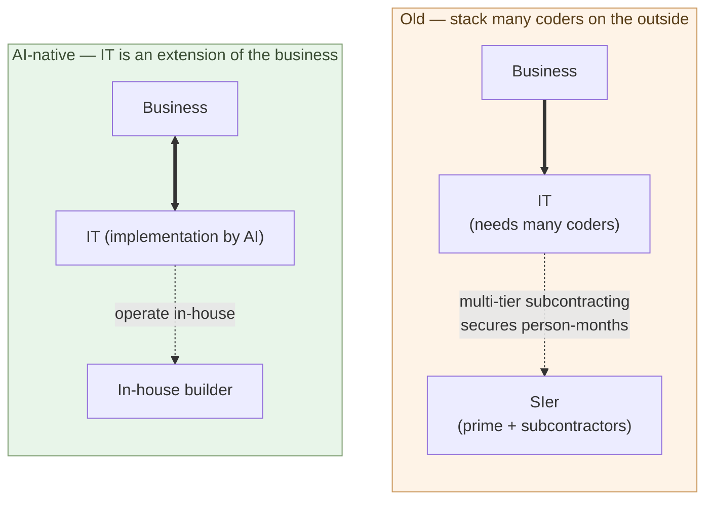

# Companies Hire Builders

**The senior builder is management. They stand on the side that
makes business decisions. The professional work is done by AI. Not a
role that fits inside a general-employee grade system**.

1-05 showed that customers themselves can become builders.
3-04 showed that AI-native development structurally resists
producing lock-in. Put both together, and the rational customer
**keeps the builder in-house** — that single choice covers the
structural disadvantage of outsourcing, the path out of lock-in, and
the preservation of business context, all at once.

This chapter takes up the choice of "hiring a builder" — where in the
organization to place them, how to compensate them, in what structure
they actually function.

## Outsourcing IT is the same as outsourcing the business

Start by re-examining what IT outsourcing means.

In the old model, business and IT were treated as separate concerns.
**Business is core, IT is a tool** — and tools can be outsourced. That
was the common assumption. Keep an internal IT department, write the
requirements in-house, hand the implementation to an SIer — the
standard model.

That premise held under two conditions:

- IT implementation required **a large number of coders**, and keeping
  them all in-house was impractical at the scale needed. **Multi-tier
  subcontracting stacked head-count on the outside** so that
  engagements could secure enough person-months (the structure is
  covered in 3-06).
- IT was viewed as a **thin surface layer** of the business —
  outsourcing it did not pull the essence of the business out with it.

Both conditions break in the AI-native world.

Implementation is written by AI — **a large number of coders is no
longer needed**. The reason multi-tier subcontracting existed in the
first place disappears. And the business of the AI-native era is **a
continuous chain of judgments encoded as code**. What to build, how
to split it, which invariants must hold — these are the body of the
business itself. Code is the mirror of the business, not a thin
surface.

So outsourcing IT becomes the same as **outsourcing the judgment of
the business** — and the head-count being stacked outside is no
longer needed in the first place. The rationale for letting the
customer's context, the meaning of the business, the non-negotiable
conditions flow outward — and the rationale for securing person-months
outside — both disappear at the same time.

If the body of the business stays in-house, the judgment that
directly drives the business stays in-house too. That role is the
**in-house builder**.

> Outsourcing IT is **the same as outsourcing the business**.
> If you keep the business in-house, you keep the builder in-house.

## The senior builder is management — into the CIO's seat

How to position the in-house builder? An extension of the
general-employee grade ladder does not fit. But neither is it "a
profession that sells judgment, in the same position as lawyers and
doctors" — that reading mistakes the structure. **The senior builder
is management**.

First, look squarely at what happens in the AI-native era. The
professional work that sells judgment — lawyer, doctor, accountant —
**is done by AI**:

- **Legal judgment** — legal databases are open to everyone, case
  law is published. Which doctrine to apply and how to build the
  argument given the client's situation — this practical judgment
  descends into the layer AI can make.
- **Medical judgment** — diagnostic equipment is standardized,
  medical knowledge is in textbooks. Which tests to run and how to
  diagnose given the symptoms — this practical judgment too enters
  the layer AI handles.
- **Accounting judgment** — accounting software is open to anyone,
  tax law is published. How to handle the case given the company's
  actual state — AI can make this call too.

Becoming a deeply specialized "profession" means descending into the
layer AI takes (the same reason "become a specialized engineer"
(1-03) mistakes the structure). So the human senior builder must not
be lined up there.

Where, then, does the human builder stand? **On the side that directs
the professional work (AI) and carries responsibility for the result**
— the side that makes business decisions. The argument runs in order:

- **The builder's judgment begins as a management decision** — which
  business to change, and how. Which invariants to keep, what to
  discard. This is a decision about how to run the business before it
  is a decision about IT.
- **IT judgment = business judgment = management judgment** — the
  business of the AI-native era is a continuous chain of judgments
  encoded as code (previous section). Making those judgments is
  deciding the business itself, and deciding the business is deciding
  the management of the company.
- **So: management — the CIO (Chief Information Officer)** — a C-suite
  officer who carries part of the management. They direct the
  professional work (AI) and make management decisions through IT.

The qualities the builder needs do not change here. Carve the problem
out of the business context (**judgment**), split it into structure
(**decomposition**), bind AI and existing assets together
(**integration**) — that is the work of the side that makes business
decisions. The tools (AI, IDEs, libraries) are open to anyone. What
is tested is judgment and responsibility.

> The senior builder is **management**. Their judgment begins as a
> management decision and carries responsibility for the result. The
> professional work is done by AI.

And that responsibility is **heavier than today's CIO's**. Today's CIO
oversees IT as a support function of the business. But the AI-native
senior builder treats IT not as a support function but as **the core
of management** — making the business judgments themselves through IT.
As IT moves from a thin surface layer to the core of the business, the
weight of the judgments made there, and the responsibility carried,
come to exceed today's CIO.

The parallel runs one step deeper. The foundation of the qualities for
making management decisions is not fluency in a programming language
but **the liberal arts** — logic, rhetoric, ethics, systems thinking,
history (1-04). Those judgments cannot be reduced to technique. **Hire
someone who can judge, not someone who can write code** — that is the
axis toward which builder hiring properly points.

## A general-employee grade does not fit

**Push part of the management into a general-employee grade and it
breaks**. The reason is not "because they are a high-grade
professional" — it is **because they are a layer that carries
management decisions and responsibility**.

The structure of the executive layer makes the point:

- **CIO and executive officers** — make management decisions, carry
  responsibility for the result
- **General employees** — carry out duties assigned along grades and
  positions
- **Compensated by judgment and responsibility, not position grade** —
  there is no "level-5 director" on a salary table. Management does
  not ride on a grade ladder.

A layer that carries management decisions is compensated by the volume
of judgment and the responsibility. **Not by position grade.** The
senior builder belongs precisely to this layer.

What happens when builders are forced into the general-employee
grade?

- **Position-graded pay does not work** — builders are not measured
  by "level." One builder's judgment changes the scale of a business
  in a way the grade system was not designed for.
- **Assignment does not control them** — the vertical-silo split of
  "business systems" or "sales systems" does not work for someone who
  judges across multiple business areas.
- **Promotion to management does not reward them** — the builder's
  advantage is in business judgment, not in line management. Promoting
  them to a management post = pulling them out of their actual role.
- **The "interchangeable" assumption breaks** — "if a person leaves,
  another fills in and the system keeps running" does not apply to a
  layer that carries management decisions.

Trying to run all of this inside the general-employee frame causes
strong builders to leave. **Compensation as a member of management is
needed**:

- Position by the scope and responsibility of management decisions,
  not by grade or assignment
- Reward by expanding the reach of management decisions, not by
  promoting to a management post
- Treat C-suite / executive-officer compensation as the baseline
- Independent-contractor / business-commission contracts are
  legitimate options

Under that framing, the in-house builder sits **closer to the CIO or
an executive officer** than to a "member of the IT department" —
compensation as a member of management.

## Cost comparison example — building a corporate website

Enough abstraction. Take a concrete example: building a corporate
website.

**Commissioning a corporate website the old way**:

- A web agency or production company takes the order
- Requirements + design + implementation + maintenance
- Small to mid-size firms: millions of yen
- Larger firms: tens of millions of yen
- Each revision triggers a new quote
- Domain, server, analytics are separate contracts

**Doing it with an in-house builder (one person + AI)**:

- Builder labor: a week to a few weeks (depending on scope)
- Tooling: tens of thousands of yen per month (Claude Max etc.)
- Hosting: thousands of yen per month and up
- Revisions: the builder ships them the same day
- The same in-house builder serves other business areas too

In numbers, this lands at **less than one-tenth of the initial build
cost, with dramatically faster and cheaper ongoing operation** — the
corporate-website case of the 10×–100× price gap.

But the more important comparison is **structural**, not financial:

- Old: the website is **an outsourced asset**. Revisions go through
  the agency, with delay and added cost.
- Builder-driven: the website is **part of the business itself**.
  Revisions move at the speed of judgment. The marketing decision and
  the web change connect directly.

In the outsourced model there is a buffer step — "the marketing team
judges and then commissions the agency." With an in-house builder,
**judgment and implementation collapse into one**. That is the real
reason to hire a builder.

> Bringing the website in-house is not just a cost story.
> **Closing the distance between judgment and implementation to zero**
> is the substance.

## What changes when a company hires a builder

Once a company places a builder in-house, the way the business runs
shifts.

- **Speed of decision-making** — "we want to build this" to "it is
  running" shrinks from weeks to days.
- **Unit of experimentation** — "build first, think about it after"
  becomes possible. The old constraint of "fully specify the
  requirements, then commission" falls away.
- **Structuring of the business** — in the process of preparing
  things for AI to act on, the business itself gets organized.
- **Data goes upstream** — business data moves from SIer-managed
  custodianship to forms the in-house builder can work with (standard
  databases, JSON, Parquet).
- **Vendor dependence dissolves** — lock-in eases, options expand
  (3-04).

This is more than cost reduction. It is a structural change. Hiring
one builder can be **the trigger that reshapes how the company
operates**.

## The builder supply is not limited to former coders

1-03 said that people who can move to the judgment side and
people who cannot will separate. Read only that and builders look
like a scarce resource. But missing one other supply source distorts
the picture — **AI is lowering the barrier to entry**.

The barrier to entry in software development has historically been a
stack of layers — grammar fluency, framework learning, build/deploy,
debugging experience. All of these are dropping, right now. Three
elements combine to make this possible:

- **AI** — the code is written by AI (1-01)
- **Python** — readable, well-suited to AI collaboration
- **Flet** — desktop, mobile, and web apps in pure Python.
  Underneath is a native Flutter build (AOT-compiled), so cold-start
  is lighter than React Native's JavaScript-bridge stack (covered in
  the parent series, Chapter 7)

With these three layers in place, **"I want to build something but I
cannot write code"** — the people who carried that line until now —
flow into the base of the builder pool.

### The VB / VBA generation comes back

Until about twenty years ago, **a thick layer of casual personal
programmers** existed. Excel VBA, Access VBA, Visual Basic, Delphi —
clerical staff, accountants, technical generalists, lab assistants
all built "small tools for my own work" on the side. In Japan, that
layer was routinely in the millions.

That layer shrank rapidly over the past fifteen years. The center of
gravity of programming moved to **the web or to enterprise apps**:

- **Web** — HTML / CSS / JavaScript, React, TypeScript, npm, webpack,
  deployment, CDN — a thick learning stack before anything runs.
- **Enterprise apps** — Java or C# — "you cannot run a single line
  without a class," "build, test, CI/CD all have to be managed
  before anything moves," "security policies are strict" — **the
  management layer becomes the substance, and the joy of programming
  itself disappears**.

"Like the VB days — open it, write code, hit Run, and something
works" — that feeling is essentially gone from current web and
enterprise stacks. So the old "casual personal programmer" population
**lost its place** in the polarization between competitive
programming or Kaggle as ornamental hobby on one side and full-time
Web / enterprise software work on the other.

AI + Python + Flet brings back **the VB / VBA feel** for this layer:

- Open, write, run — Python and Jupyter
- UI is largely declarative through **Flet** (a VB-Form-like feel)
- The management layer is handled by AI — build, deploy, test
- AI writes the grammar details

This layer is made of **people who have been thinking "what do I want
to build" for twenty-plus years** — clerical staff who built monthly
aggregations in VBA, shop-floor people who built inventory
management in Access, graduate students who scripted
instrument-output plots in their labs. They already carry what a
builder needs (judgment, decomposition, integration). What was
missing was just the will and the time to learn the current Web /
enterprise stack.

In AI-native development, that wall is lower. **The VB / VBA
generation comes back as builders** — a particularly large supply
source in the Japanese market. (The parent series' 3-04,
"Writing Logic — Have AI Write Python For You," covers the
VBA → Python migration in concrete detail.)

### Makers and shop-floor engineers enter embedded programming

Software development used to be **web-centric**. HTML/CSS/JS, React,
browsers, servers — most of the learning cost concentrated there.

In the AI-native era, the barrier to **embedded programming** drops
the same way — Raspberry Pi, ESP32, MicroPython, AI generating
circuit and control code. **People who enjoy making things** can step
into writing software easily (covered in the parent series, Chapter
9).

**Robot programming** is the canonical example. Historically it
needed ROS, C++, and advanced mathematics — research labs and
specialist firms only. In the AI-native present:

- ROS2 + Python is the standard stack
- Higher-level robotics frameworks are written in Python
- AI fills in the details of control algorithms
- Flet provides the operator UI

A hobbyist maker building a robot that runs at home — until a few
years ago, this was a researcher's privilege. The kind of person who
makes things already carries the qualities a builder needs — picking
what to build, debugging when something does not move, decomposing a
system into parts and modules.

### In Japan, builder supply is likely to surge

In the Japanese context, this supply source is especially large:

- **Manufacturing base** — engineers in factories and small machine
  shops have the experience of making physical things. AI gives them
  a path into software.
- **Maker culture** — Maker Faire, electronics hobbies, embedded
  doujin / community activity have a long history
- **Gadget culture** — the underlying motivation "I want to build
  something myself" is broadly distributed
- **Education trends** — high-school robotics contests, Python
  education in schools

These bases cross the "I cannot write code" barrier through AI +
Python + Flet and **enter society as builders**. While SIers shrink
and customer companies expand builder hiring at the same time, the
supply side sees **former SIer coders converging with makers**.

1-03 said that those who can move to the judgment side and those
who cannot will separate. That was a statement about former SIer
coders. What this chapter adds: **the doorway to the judgment side is
not open only to people who came from coding**.

> Builder supply is not just transfers from coders.
> **AI + Python + Flet open a new supply source — makers,
> shop-floor engineers, students**.

Read this in combination with 3-06's "labor demand outside the
industry" (manufacturing, agriculture, AI physical infrastructure).
The picture becomes clearer: human capital flowing out of the SIer
industry and **human capital flowing in from outside the industry as
builders** are moving in parallel. Labor reallocation is not a simple
"shrinkage → unemployment" story but **multi-directional flow**.

## Where the next chapter goes

By here, the case for keeping a builder in-house is clear. But the
industry-wide shift will not happen all at once. Japan in particular
has its own dynamics — multi-tier subcontracting, long-tenure
employment customs, the intermediate forms that show up during a
transition.

The next chapter takes up the SIer-industry transition in Japan and
labor mobility. How do the coders inside SIers move? What happens to
the prime-contractor / subcontractor structure? Which intermediate
forms appear during the transition?

---

## Related articles

- [1-04: The Builder Role](/en/ai-native-ways/software/builder/)
- [1-05: Customers Co-Develop with AI](/en/ai-native-ways/software/customer-codev/)
- [3-04: The Lock-In Problem](/en/ai-native-ways/software/lockin/)
- [Parent series Chapter 2: Writing Logic — Have AI Write Python For You](/en/ai-native-ways/python/)
- [Parent series Chapter 7: Building Apps — CLI tools, Flet apps, Flutter apps](/en/ai-native-ways/apps/)
- [Parent series Chapter 8: Building Embedded — Think in Python, Have Claude Translate](/en/ai-native-ways/embedded/)
- [Structural analysis 08: Subtracting the enterprise-IT tax](/en/insights/enterprise-tax/)
- [Structural analysis 12: AI and the sole proprietor](/en/insights/ai-and-individual/)
