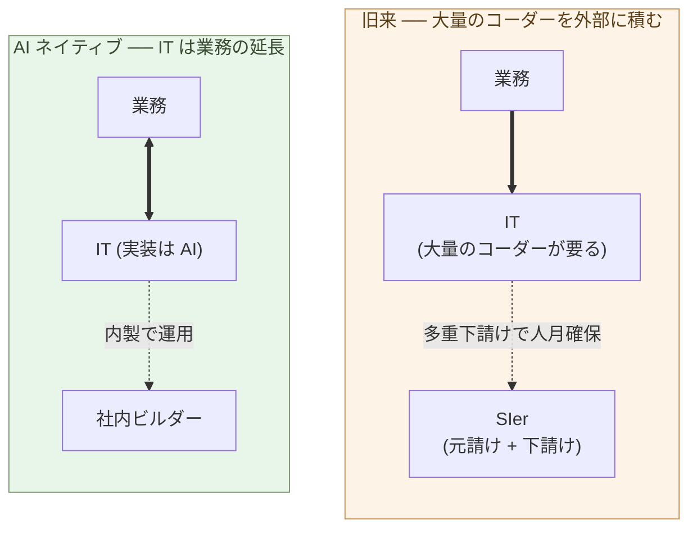

# 各社がビルダーを雇用する時代

**上級ビルダーは経営陣だ。経営判断を下す側に立つ。専門職の実務は
AI がする。一般社員の枠で処遇する役割ではない**。

1-05で、顧客自身がビルダーをやれることを示した。3-04で、AI
ネイティブ開発はロックインを生みにくいことを示した。両方を合わせる
と、合理的な顧客は **ビルダーを社内に持つ** ことを選ぶ ── 外注の
構造的不利と、ロックインからの脱出と、業務の文脈を維持する三つを、
同時に満たせるのがこの選択肢だからだ。

本章は「ビルダーを雇う」という選択を、社内でどう位置づけるか ──
組織のどこに置くか、どう処遇するか、どんな構造で機能させるか ──
を扱う。

## IT を外部化することは、業務を外部化することと同じだ

最初に、IT 外注の意味を問い直す。

旧来は、業務と IT は分けて考えられてきた。**業務はコア、IT は道具**
── 道具は外注してもよい、というのが共通認識だった。情シスを抱え、
要件だけ社内で書き、実装は SIer に出す ── これが標準モデルだった。

この前提が成立したのは、二つの条件があったときだ:

- IT の実装には **大量のコーダーが要り**、社内で全員抱えるのは規模
  的に困難だった。**多重下請けで人数を外部に積み上げる** ことで
  初めて、案件規模に見合う人月が確保できた (構造の詳細は3-06で扱う)
- IT が業務の **薄い表層** と見なされ、外注しても業務の本質は手元に
  残せると思われていた

両方の条件が、AI ネイティブな世界で崩れる。

実装は AI が書く ── **大量のコーダーが要らない**。多重下請けで人数
を確保する理由がそもそも消える。そして、AI ネイティブな時代の業務は、
**コード化された判断の連続** だ。何を作るか、どう分けるか、どの不変
条件を守るか ── これらは業務の本体そのもの。コードは業務を映す鏡で、
薄い表層ではない。

つまり、IT を外部化することは、**業務の判断を外部化すること** と
同じになる ── そして、外部に積み上げる人数も、そもそも要らない。
顧客の文脈・業務の意味・譲れない条件が外へ流れていく合理性も、
人月確保の合理性も、両方が同時に消える。

業務の本体を社内に持つなら、業務に直結する判断も社内に持つ。それが
**社内ビルダー** だ。

> IT を外部化することは、**業務を外部化することと同じ**だ。
> 業務を手元に残すなら、ビルダーも手元に残す。

## 上級ビルダーは経営陣だ ── CIO の位置へ

社内ビルダーをどう位置づけるか。一般社員の延長線では合わない。
だが「判断を売る専門職(弁護士・医師と同位置)」でもない ──
それは構造の取り違えだ。**上級ビルダーは経営陣** だ。

まず、AI ネイティブな時代に何が起きるかを正面から見る。弁護士・
医師・会計士のような **判断を売る専門職の実務は、AI が担う**:

- **法的判断** ── 法律 DB は誰でも引ける、判例は公開されている。
  依頼者の状況にどの法理を当て、どう論を組むか ── この実務判断を
  AI が下せる層に降りていく
- **医療判断** ── 診断機器は標準化され、医学知識は教科書にある。
  症状からどの検査をし、どう診断するか ── この実務判断も AI が
  担う層に入る
- **会計判断** ── 会計ソフトは誰でも使える、税法は公開されている。
  企業の実態に照らしてどう処理するか ── これも AI が下せる

深く特化した「専門職」になることは、AI が取る層に降りることだ
(1-03の「特化したエンジニアになれ」が構造の取り違えなのと同じ
理由)。だから人間の上級ビルダーを、そこに並べてはいけない。

では、人間ビルダーはどこに立つか。**専門職の実務(AI)を指揮し、
結果に責任を負う側** ── つまり経営判断を下す側だ。論を順に組む:

- **ビルダーの判断は経営判断から始まる** ── 何の業務を、どう
  変えるか。どの不変条件を守り、何を捨てるか。これは IT の判断
  である前に、業務をどう動かすかの判断だ
- **IT判断 ＝ 業務判断 ＝ 経営判断** ── AI ネイティブな時代の
  業務は、コード化された判断の連続だ(前節)。その判断を下す
  ことは、業務そのものを決めることであり、経営を決めることだ
- **だから経営陣 ── CIO(最高情報責任者)** ── 経営の一翼を担う
  C級役員。専門職の実務(AI)を指揮し、IT で経営判断を下す

このときビルダーが持つべき資質は変わらない。業務の文脈から問題を
切り出し(**判断**)、構造に分け(**分解**)、AI と既存資産を
束ねる(**統合**)── これが経営判断を下す側の仕事だ。道具(AI、
IDE、ライブラリ)は誰でも使える。問われるのは判断と責任である。

> 上級ビルダーは **経営陣** だ。その判断は経営判断から始まり、
> 結果に責任を負う。専門職の実務は AI がする。

しかも、その責任は **今の CIO より重くなる**。今日の CIO は IT を
業務の支援機能として統括する。だが AI ネイティブな時代の上級
ビルダーは、IT を支援機能としてではなく **経営の中核** として
扱う ── 業務の判断そのものを IT で下す。IT が業務の薄い表層から
中核へ移るぶん、そこで下す判断の重さも、負う責任も、今の CIO を
上回っていく。

並列はもう一歩深いところまで通る。経営判断を下す資質の基盤は、
プログラミング言語の習熟ではなく **リベラルアーツ**(論理・修辞・
倫理・体系的思考・歴史)にある(1-04)。これらの判断は技法だけ
では下せないからだ。**「コードを書ける人」ではなく「判断できる
人」を採用する** ── これが、各社のビルダー採用が本来向かうべき
軸線である。

## 一般社員の枠では処遇できない

**経営の一翼を一般社員の等級に押し込むと、壊れる**。理由は「高度
専門職だから」ではない ── **経営判断と責任を負う層だから** だ。

役員・執行役員の構造を見ると分かりやすい:

- **CIO・執行役員** ── 経営判断を下し、結果に責任を負う
- **一般社員** ── 等級・職位に沿って割り当てられた職務を担う
- **役職等級ではなく、判断と責任で処遇される** ── 給与表に「等級
  5 の取締役」は無い。経営層は等級制に乗らない

経営判断を負う層は、判断量と責任で処遇される。**役職等級に応じた
処遇ではない**。上級ビルダーは、まさにこの層に入る。

ビルダーを一般社員の枠で扱うとどうなるか:

- **役職給では処遇できない** ── ビルダーは「等級」では測れない。
  一人のビルダーの判断が業務を変える規模は、等級制度の前提を超える
- **配属でコントロールできない** ── 「業務系」「販売系」のような
  縦割りでは、横断判断ができない。ビルダーは複数業務領域を横断する
- **管理職への昇進では報えない** ── ビルダーの優位は管理ではなく
  経営判断にある。管理職に上げる = ビルダー本来の仕事から外す
- **取り替え可能な前提が崩れる** ── 「人が辞めても代わりが入れば
  回る」は、経営判断を負う層には適用できない

これらを一般社員の枠で運営しようとすると、優秀なビルダーは離れて
いく。**経営層としての処遇が要る**:

- 等級・配属ではなく、経営判断の対象範囲と責任で位置づける
- 管理職昇進ではなく、経営判断の影響範囲の拡大で報いる
- C級役員・執行役員としての処遇を前提に置く
- 個人事業主 / 業務委託契約も選択肢に含める

このとき、社内ビルダーの位置づけは、**「IT 部門の一員」ではなく、
CIO・執行役員に近い** ── 経営層としての処遇になる。

## ホームページ開発を例にしたコスト比較

抽象論はここまで。具体例として、よくある「コーポレートサイトを作る」
を取り上げる。

**旧来のコーポレートサイト発注**:

- Web 制作会社・代理店に発注
- 要件定義 + デザイン + 実装 + 運用保守
- 中小企業: 数百万円
- 中堅以上: 数千万円
- 改修のたびに追加見積もり
- ドメイン・サーバー・分析ツールも別契約

**社内ビルダー (1 人 + AI) でやる場合**:

- ビルダーの工数: 1〜数週間 (内容による)
- ツール: Claude Max など 月数万円
- ホスティング: 月数千円〜
- 改修: ビルダーが直接、その日のうちに
- 同じ社内ビルダーが他業務にも使える

数字で見ると、**初期構築で 10 分の 1 以下、運用フェーズで圧倒的に
安く・速く** なる。これは 10倍〜100倍の価格差の、コーポレート
サイト案件版だ。

しかし重要なのは、コスト比較ではなく **構造の比較** だ:

- 旧来: コーポレートサイトは **外注された資産**。改修は外注に依頼、
  時間がかかり、追加コスト
- ビルダー型: コーポレートサイトは **社内の業務の一部**。改修は判断
  と同じ速度。マーケ判断と Web の実装が直結する

外注では、「マーケ部門が判断して、外注に発注する」というワンクッション
がある。社内ビルダーがあれば、**判断と実装が一本化** する。これが
ビルダーを雇う本当の理由だ。

> ホームページの内製化は、コストだけの話ではない。
> **判断と実装の距離をゼロにすること** ── これが本質だ。

## ビルダーを雇うと、何が変わるか

社内にビルダーを置くと、業務の運営の仕方そのものが変わる。

- **意思決定の速度** ── 「これを作りたい」から動くまでが、数週間
  から数日に短縮される
- **試行錯誤の単位** ── 「作ってから考える」が可能になる。完璧な
  要件定義をしてから外注、という旧来の枠から外れる
- **業務の構造化** ── ビルダーが業務を AI に渡せる形に整理する
  過程で、業務そのものが整理される
- **データの一次源化** ── 業務データが SIer の管理下から、社内
  ビルダーが扱える形 (標準データベース、JSON、Parquet) に移る
- **ベンダー依存からの解放** ── ロックインが解け、選択肢が増える
  (3-04)

これは、コスト削減以上の構造変化だ。ビルダーを 1 人雇うことが、
**会社の運営構造を組み替える** きっかけになる。

## ビルダーの供給源は、コーダーだけではない

1-03で「コーダーから判断側に移れる人」と「移れない人」が分かれる
と書いた。これだけ見ると、ビルダー人材は希少資源に見える。だが、
もう一つの供給源を見落とすと、構造を見誤る ── **AI による参入
障壁の低下**だ。

これまでのソフトウェア開発の参入障壁は、文法習熟・フレームワーク
学習・ビルド/デプロイ・デバッグ経験など、複数の層で構成されてきた。
これらが現在進行形で大きく下がっている。三つの組み合わせが鍵だ:

- **AI** ── コードは AI が書く(1-01)
- **Python** ── 読みやすく、AI と相性がいい
- **Flet** ── 純粋な Python で desktop / mobile / web アプリが
  作れる。下層は Flutter のネイティブビルド (AOT コンパイル) なので、
  JavaScript ブリッジを介する React Native よりコールドスタート
  も軽い(親シリーズ第7章)

この三層が揃うと、「**作りたいけど、コードが書けなかった**」層が
一気にビルダーの裾野に流入する。

### VB / VBA 世代が帰ってくる

20 年ほど前まで、**個人レベルでプログラミングを楽しむ層** は厚く
存在していた。Excel VBA、Access VBA、Visual Basic、Delphi ──
事務職、経理、技術系の何でも屋、研究室の補助者が、「自分の業務に
使う小さなツール」を本業の合間に作っていた。日本では数百万人規模
で、この層は当たり前に存在していた。

この層が、ここ 15 年ほどで急速に縮小した。プログラミングの中心が
**Web か業務アプリ** に寄ったからだ:

- **Web** ── HTML / CSS / JavaScript、React、TypeScript、npm、
  webpack、デプロイ、CDN ── 「動くものを作る」までの学習層が厚い
- **業務アプリ** ── Java や C# ── 「クラスを並べないと一行も動か
  ない」「ビルド・テスト・CI/CD が管理されないと回らない」「セキュ
  リティポリシーが厳しい」── **管理レイヤーが本体になっていて、
  本来のプログラミングの楽しさが消える**

「VB の頃みたいに、開いてコードを書いて Run、それで動くものが
出来た」── あの感覚は、現在の Web や業務アプリのスタックではほぼ
失われている。だから、かつての「個人プログラマー層」は、競技プロ
グラミングや Kaggle といった観賞用と、本業のソフトウェア開発
(Web、業務アプリ) の二極化のあいだで、**居場所を失った**。

AI + Python + Flet は、この層に **VB / VBA の感覚** を取り戻させる:

- 開いて、書いて、実行 ── Python と Jupyter
- UI は **Flet** がほぼ宣言的(VB の Form のような感覚)
- 管理レイヤーは AI が引き受ける ── ビルド・デプロイ・テスト
- 細部の文法は AI が書く

この層は **「何を作りたいか」を 20 年以上考えてきた人々** だ。VBA
で月次集計を作っていた事務職員、Access で在庫管理を作っていた現場
の人、研究室で測定器のグラフ化スクリプトを書いていた院生 ── 彼ら
は、ビルダーに必要な資質 (判断・分解・統合) をすでに持っている。
足りなかったのは「現代の Web / 業務アプリスタックを学ぶ意欲と時間」
だけだ。

AI ネイティブな開発では、その壁が低くなる。**VB / VBA 世代が、
ビルダーとして帰ってくる** ── これは日本市場で特に大きい供給源
になる(親シリーズ第2章「処理を書く ── AI に Python で書いて
もらう」が VBA → Python の移行を具体的に扱っている)。

### 工作派・現場技術者が組み込みに入る

これまでのソフトウェア開発は **Web 中心** だった。HTML/CSS/JS、
React、ブラウザ、サーバー ── 学習コストの大半がここに集中していた。

AI ネイティブな時代では、**組み込みプログラミング** の障壁も同じ
ように下がる ── Raspberry Pi や ESP32 などのマイコン、MicroPython、
AI による回路・制御コード生成。「工作が好きな人」が、ソフトウェア
を書く側に容易に入れる(親シリーズ第8章)。

**ロボットプログラミング**は典型例だ。従来は ROS / C++ / 高度な
数学が必要で、研究室か専門企業の領分だった。AI ネイティブな現在
では:

- ROS2 + Python が標準化
- 高レベルロボットフレームワークが Python で書ける
- AI が制御アルゴリズムの細部を埋める
- Flet で操作 UI を作れる

工作好きな個人が、自宅で動くロボットを作る ── 数年前まで研究者の
特権だった領域に、個人が入れる。彼らは判断中心の役割 (= ビルダー)
に必要な資質を、すでに持っている ── 何を作るかを決める経験、動か
ない時のデバッグ経験、部品とモジュールを組み合わせる構造分解。

### 日本では、ビルダー供給が急増する可能性が高い

日本固有の文脈で見ると、この供給源は特に大きい:

- **製造業の裾野** ── 工場・町工場の技術者は「物を作る」経験を
  持っている。AI でソフトウェア側に入れる構造ができている
- **maker 文化** ── Maker Faire、電子工作、同人活動の歴史
- **ガジェット文化** ── 「自分で何か作りたい」動機の母数が広い
- **教育の動き** ── 中高生のロボットコンテスト、学校での Python
  教育の普及

これらの裾野が、AI + Python + Flet で「コードが書けない」障壁を
超え、**ビルダーとして社会に参入する**。SIer の縮小と顧客企業の
ビルダー雇用拡大が同時に起きるとき、供給側には **元 SIer コーダー
+ 工作派の合流** が起きる。

1-03で「判断側に移れる人と移れない人で分かれる」と書いた。それは
元 SIer コーダーの話だった。本章で追加するのは:**判断側の入り口
は、コーダー出身者だけに開かれているのではない**ということだ。

> ビルダーの供給は、コーダーからの転移だけではない。
> **AI + Python + Flet が、工作派・現場技術者・学生**を新しい
> 供給源として開く。

3-06で見た「業界外の労働需要 (製造業、農業、AI 物理インフラ)」
と組み合わせて読むと、構造が見えやすい:SIer 業界から流出する
人材と、**業界外からビルダーに流入する人材** が同時に動く。労働
再配置は、単純な「縮小 → 失業」ではなく、**多方向の流動** として
進む。

## 次の章へ

ここまでで、ビルダーを社内に持つ合理性は明らかだ。だが、業界全体
としての転換は、すぐには起きない。日本市場には固有の事情 ── 多重
下請け構造、長期雇用慣行、転換期の中間形態 ── がある。

次の章では、日本の SIer 業界の転換と雇用流動性を扱う。SIer に所属
するコーダーはどう動くのか、元請けと下請けの構造には何が起きるか、
転換期にどんな中間形態が現れるか。

---

## 関連記事

- [1-04: ビルダーという役割](/ai-native-ways/software/builder/)
- [1-05: 顧客がAIと協働して開発する時代](/ai-native-ways/software/customer-codev/)
- [3-04: ロックイン問題](/ai-native-ways/software/lockin/)
- [親シリーズ第2章: 処理を書く ── AIにPythonで書いてもらう](/ai-native-ways/python/)
- [親シリーズ第7章: アプリを作る ── CLIツール、Fletアプリ、Flutterアプリ](/ai-native-ways/apps/)
- [親シリーズ第8章: 組み込みを作る ── Pythonで考え、Claudeに翻訳させる](/ai-native-ways/embedded/)
- [構造分析08: 企業ITの税を引く](/insights/enterprise-tax/)
- [構造分析12: AIと個人事業](/insights/ai-and-individual/)
