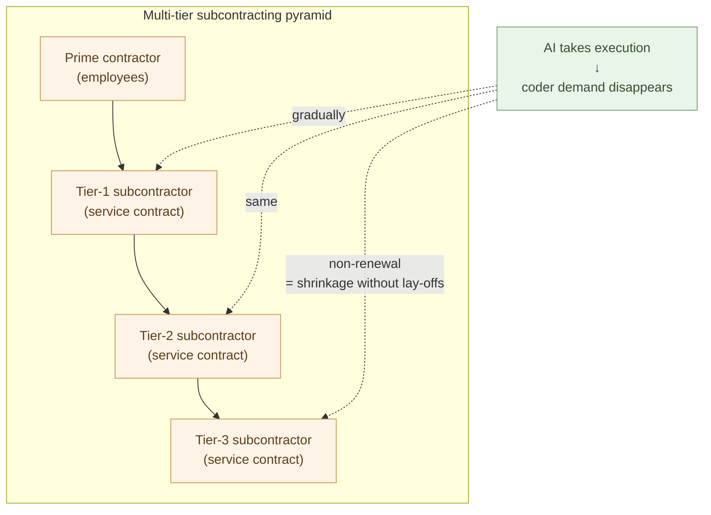

# Japan's SIer Industry Transition and Labor Mobility

**Japan's multi-tier subcontracting structure in the SIer industry is
usually framed as the obstacle that will block transition. Dissect
the structure and the conclusion reverses — precisely because the
structure is multi-tier, the industry shift can proceed without
internal lay-offs**.

Chapter 17 confirmed that the original driver of IT outsourcing was
**securing large quantities of coder person-months**. This chapter
takes the other side — when AI removes coder demand, how the structure
built to source those person-months actually moves.

The focus is on Japan-specific dynamics, but the conclusion is simple:
**multi-tier subcontracting, paradoxically, makes the transition
easier**.

## Multi-tier subcontracting, paradoxically, makes the transition easier

Sketch the typical Japanese SIer structure.

- **Prime contractors** — large SIers contracting directly with
  customers. Hundreds to thousands of employees.
- **Tier-1 subcontractors** — mid-size SIers taking commissioned work
  from primes.
- **Tier-2 and tier-3 subcontractors** — smaller vendors and
  independent contractors below them, supplying head-count by the
  person-month.
- For some engagements, four to five layers stack.

The reason this hierarchy is disliked is easy to state — margins pile
up at each layer, profit does not reach the working coder, accountability
gets blurred. Chapters 14 and 15 read this as the structure that
inflates price.

But **at a transition, the structure's property reverses**. Multi-tier
subcontracting **externalizes coder demand into contracts**. Workers
are not held inside the prime contractor as employees; they sit in
contractual relationships.

What does that mean? **When demand disappears, shrinkage happens by
not renewing contracts**. The prime's own employees do not need to be
laid off. Legally, politically, and in public-opinion terms,
non-renewing a contract is far easier than adjusting employment.

> Multi-tier subcontracting **externalizes coder demand into
> contracts**.
> When demand disappears, shrinkage happens by not renewing
> contracts —
> **multi-tier subcontracting acts as a shock-absorber during the
> transition**.

## Primes can transition without internal lay-offs by ending subcontractor contracts

Look at the concrete motion.

Say a prime SIer runs 100,000 person-months a year of engagements.
The breakdown:

- Own employees: 10,000 person-months
- Sourced from tier-1 subcontractors: 30,000 person-months
- Tier-2 and tier-3: 60,000 person-months

As AI-native engagements grow and coder demand falls, what does the
prime do?

- **Employees stay** — dismissal is legally and culturally difficult.
  Reassign for builder training or for customer-facing judgment work.
- **Shrink subcontractor contracts from the bottom up** — do not
  renew tier-3 contracts first, tighten tier-2 orders.
- **New engagements go AI-native** — the prime's own employees stand
  on the judgment side; AI handles execution.
- **Staged shift** — keep existing long-term maintenance contracts
  for their duration; evaluate AI-native replacement at renewal.

All of this **can be executed by central management decision at the
prime** alone. No internal employment adjustment is required. There
are external effects (subcontractor downsizing), but that is the
contracted allowance.

For that reason, **the decision barrier to AI-native transition is
low for the prime SIer's management**. Conversely, not choosing
transition means losing engagements to AI-native competitors —
"standing still" becomes the higher business risk, and at that point,
transition accelerates.

## Talented subcontractor coders flow to primes or independence

What happens to the side being shrunk — the subcontractors, especially
the coders inside tier-2 and tier-3?

This is hard. When demand disappears, contracts are not renewed.
Mid-size subcontractor vendors that stop getting engagements have to
scale down or close.

But, **for talented coders, there are several exits**:

- **Move to a prime** — primes need people who can stand on the
  judgment side (= builder candidates). Coders with judgment ability
  can be absorbed into the prime's full-time employee slots.
- **Move to a customer** — hired directly as in-house builders by
  customer companies that used to commission SIers (Chapter 17).
- **Go independent — individual contractor or small firm** —
  contract directly with customers as a builder. The
  lawyer/doctor-style professional model from Chapter 17.
- **Move to a different industry** — leaving software development is
  also a path (the same kind of redistribution as "human computers"
  and typesetters moving to adjacent fields, from Chapter 3).

Not every mid- or lower-tier coder will move successfully. The layer
with judgment ability — or the willingness to develop it — flows
first. This is harsh, but **the industry as a whole moves toward
talent flowing upward and outward, not stagnating at the bottom**.

> What shrinks is the bottom; what flows is judgment ability.
> The more capable coders, the more likely they flow to primes,
> customers, or independence.

## Labor mobility as the precondition

Everything above rests on the precondition of **labor mobility**.

Old-style Japanese employment — lifetime employment, seniority-based
advancement, internal reassignment — supported the multi-tier
structure. The prime was expected to hold a new graduate as a coder
for 40 years; the shortfall was filled with subcontractors. Mobility
was low.

That premise has been gradually weakening for two decades. Mid-career
hiring has become normal, the recruiting market has matured,
freelancer and independent-contractor contracts have proliferated.
The AI-driven industry transition **tests the upper bound of that
mobility**.

If mobility is high:

- Mid-career moves between primes increase
- Prime → customer-company moves grow (builder hiring per Chapter 17)
- Prime → independence (individual contractor, small firm)
- Subcontractor layers → all of the above

If mobility stays low:

- Talent stagnates in shrinking subcontractors
- New employment forms (the professional model) do not develop
  institutionally
- Transition pace is held back by social friction

Fortunately, **mobility is trending upward**. The post-COVID spread of
remote work, the wider acceptance of side jobs, the shift toward
job-type employment — all of these increase mobility. Society is
moving the mobility lever in parallel with the AI shift.

## Transitional forms — long-term service contracts, secondments, internal ventures

The transition does not happen overnight. It passes through
intermediate forms.

- **Long-term service contracts** — a former coder contracts as an
  independent with the original employer or a customer company on a
  long-term basis. Not an employee, but with stable work.
- **Secondment and transfer** — an SIer employee is seconded to a
  customer company and becomes a builder there. If results land,
  transfer becomes an option.
- **Internal ventures / spin-offs** — an SIer stands up an AI-native
  business inside, or — to avoid conflict with existing engagements —
  spins it out as a separate company.
- **Reverse-commission** — a customer's in-house builder sells advice
  to other companies in their domain of expertise (the same shape as
  Chapter 5's "remaining one-tenth of specialists").

These are not permanent structures; they are **shock absorbers** for
the transition. Japanese society has a cultural habit of moving
through rapid change by absorbing it into intermediate forms.

> The multi-tier structure allows rapid shrinkage. The intermediate
> forms absorb rapid change.
> **Both effects act in parallel, so the transition is neither
> abrupt nor stalled**.

## Physical goods become scarcer than software

The SIer industry's shrinkage is not an isolated labor problem. Over
the same few years, several forces are simultaneously pushing total
labor demand upward across the economy. They share a single root —
**the era's scarce resource is flipping from software to physical
things**.

**AI data-center construction, as the loudest visible example** — the
AI boom itself is generating massive demand for physical
infrastructure. GPUs, fab equipment, electric power, cooling,
buildings, land, networks — every one of them is **about physical
things, not about code**. AI data-center construction is backlogged
worldwide, with power supply as the bottleneck. **The cheaper AI
becomes, the more scarce the physical things that run AI** — this is
the most visible sign of "the era when physical goods get scarcer
than software."

**Reshoring of manufacturing** — Middle-East instability,
geopolitical energy-price rises, and global logistics-cost increases
are eroding the economics of offshore production. Domestic
manufacturing in Japan — especially high-value, low-volume,
fast-response work — gains relative competitiveness. As reshoring
proceeds, demand for shop-floor labor, production design, and
manufacturing engineering rises in a measurable way.

**Forced shift to natural farming** — the supply of the major
chemical-fertilizer inputs (ammonia synthesized from natural gas,
potash from Russia and Belarus, imported phosphate rock) is
destabilizing and prices are rising. Once the input cost of chemical
agriculture crosses the breakeven line, **natural farming is no
longer a choice but a necessity**. Natural farming requires more
labor than chemical agriculture across soil preparation, weeding,
and harvest — so agricultural labor demand also moves upward (the
structural details are covered in the separate aiseed.dev series
*Phosphorus Depletion and Natural Farming*).

The three forces — **physical-infrastructure demand from AI itself,
reshoring of manufacturing, the shift to natural farming** — run on
**the same time scale** as the SIer-industry shrinkage. As a result,
the options open to displaced coders broaden significantly: alongside
intra-industry flow (primes, customers, independence), the
**out-of-industry physical labor demand** becomes a major channel.

The historical parallel from Chapter 3 — human computers and
typesetters moving to adjacent fields — was viable only because labor
demand happened to exist where they landed. The same applies here.
**The side where labor demand disappears (code production) and the
sides where it grows (physical production, agriculture, AI physical
infrastructure) are moving in parallel inside the same society**.

> The scarce resource of the era is flipping from software to physical
> things.
> It is not that SIer coders are in surplus — it is that **the side
> that makes things does not have enough hands**. That is the actual
> shape of labor demand.

## Mobility rises over time

Finally, the direction of the transition period.

Labor mobility, job-type employment, professional models, social
acceptance of business commissions — all of these have measurably
risen over the past decade. Multiple forces will keep them rising:

- **Demographics** — a shrinking working-age population pushes
  mobility up on pure economic grounds.
- **International comparison pressure** — comparison with overseas
  (especially US) professional markets pushes Japanese companies to
  revise compensation.
- **AI itself as pressure** — talent that does not fit old-style
  employment models (builders, AI specialists) accumulates, creating
  pressure for institutional reform.
- **Policy direction** — government policy on "job-type employment,"
  legalized side jobs, advanced-professional regimes all point the
  same way.

Mobility will keep rising. As time passes, the friction of the
transition into the AI-native industry structure shrinks.
**The friction maximum is in the first few years; after that the
transition tends to accelerate**.

## Education and hiring axes move at the same time

Alongside labor mobility, another axis has to move — **the
foundational discipline of the technical profession**. Japan's
science-and-engineering education has long centered on programming
languages, frameworks, and design patterns — the core of software
engineering. Once AI has taken that core, the human side has to
shift its weight onto **the liberal arts** (Chapter 4) — logic,
verbalization, ethics, systems thinking, history. The shift runs
through everything from university curricula to corporate hiring
criteria. The question "can you write code?" gives way to "**can
you judge?**" on both sides at once.

## Where the next chapter goes

We have seen how the AI-native structural change moves Japan's SIer
industry and how labor mobility absorbs that motion. One question
remains — **over what time scale does this transition complete?**

The next chapter takes up the case that the transition completes in a
few years. The final chapter.

---

## Related articles

- [Chapter 14: The Structural Uneconomy of the SIer Model](/en/ai-native-ways/software/sier-uneconomic/)
- [Chapter 15: The Order-of-Magnitude Price Gap](/en/ai-native-ways/software/price-gap/)
- [Chapter 17: Companies Hire Builders](/en/ai-native-ways/software/hiring-builders/)
- [Phosphorus Depletion and Natural Farming](/en/phosphorus-and-farming/)
- [Structural analysis 08: Subtracting the enterprise-IT tax](/en/insights/enterprise-tax/)
- [Structural analysis 12: AI and the sole proprietor](/en/insights/ai-and-individual/)
