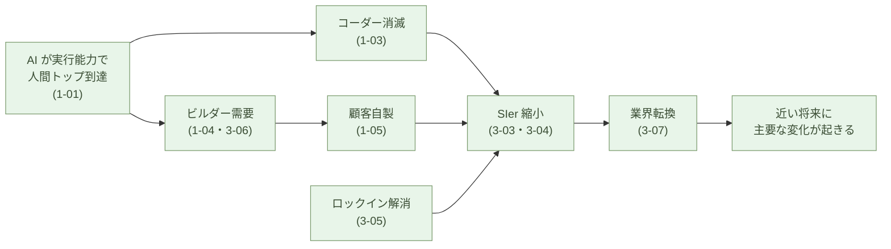

# もう戻らない構造転換

**ソフトウェア開発編の最終章。これまでの 10 章で示してきた構造
変化は、独立して起きるのではなく連鎖する。連鎖は近い将来に主要な
部分が起きる。そして前提が逆転したから、元に戻らない**。

ただし、この「完全置換」が起きるのはソフトウェア開発という特殊な
領域に限った話だ。本章後半でその境界を明示する。

## 変化の連鎖

これまでの各章の主張を、変化の順に並べ直す。

- **AI が実行能力で人間トップに到達** (1-01) ── Codeforces 2700 帯、
  月 3 万円
- **保守の主戦場が設計に移る** (1-02)
- **コーダーという役割が消える** (1-03)
- **ビルダーという新しい役割が出現** (1-04)
- **顧客自身がビルダーをやる** (1-05) ── 9 割は内製、1 割だけ外注
- **SIer 委託モデルが構造的に不経済** (3-03) ── 同じ手間で自分で
  作れる
- **価格差が桁違い** (3-04) ── 10倍〜100倍、競争ではなく市場破壊
- **ロックインが解消する** (3-05) ── AI ネイティブな標準コード、
  Palantir FDE の対極
- **各社がビルダーを雇用する** (3-06) ── 上級ビルダーは経営陣
  （CIO）の位置へ。専門職の実務は AI が担う。供給源は元コーダー
  だけでなく、AI + Python + Flet で
  参入する **VB/VBA 世代・工作派・現場技術者・学生** にも広がる
- **多重下請けが転換を緩衝する** (3-07) ── 雇用調整なしに縮小可能

これらは独立した観察ではない。**一つの事実 (AI が実行を取る) から、
順に派生して連鎖する**。

連鎖の中で、最も速く動くのは **新規プロジェクトと拡張案件**。最も
遅く動くのは **コア業務システムの全置換**。だが、両方とも同じ方向
を向いており、止まらない。

## なぜコーディングだけが完全置換に向かうのか

ここで、本サブシリーズの **scoping (範囲限定)** を明示する。

ソフトウェア開発は広い領域だ ── 要件定義、設計、コーディング、
テスト、デプロイ、運用、障害対応、関係者調整。**AI が完全に置き
換わるのは、この中の「コーディング」だけ** だ。理由は二つの条件が
同時に満たされるからだ:

1. **ルールが明確** ── 言語仕様、標準ライブラリ API、型システム、
   構文 ── すべてが形式的・明示的に定義されている。何が「正しい
   書き方」かに、解釈の余地が少ない
2. **正解が検証可能** ── コンパイルが通るか、テストが通るか、競技
   プログラミングの問題が解けるか ── すべて機械的に判定できる

この二つが揃った領域では、AI は学習過程で「ルールに従っているか」
と「合っているか」のフィードバックを大量に受け取れる。だから AI は
**コーディングの領域で** 超人間水準に到達する。

> AI が超人間水準に到達するのは、**ルールが明確で、正解が検証可能
> な領域** だ。
> ソフトウェア開発の中の **「コーディング」** が、その典型例だ。

ソフトウェア開発の他の部分 ── 要件定義、設計、運用、障害対応、
関係者調整 ── は、後述する自動運転・新幹線と同じ構造の 1% 問題を
持つ。これが1-03「コーダーは消えるがビルダーは残る」の意味だ
── **コーディングは完全置換、ビルダー業務は生産性向上**、両方が同じ
ソフトウェア開発の中で同時に起きる。

注意したいのは、コーディングが完全置換されたことで、**要件定義側の
重要性がむしろ上がる** ということだ。**要件定義をさぼれば、AI は
「ありふれたコード」を大量に生成するだけ** で、固有の業務課題を解い
たことにはならない。AI は同じドメインの先行サンプルから学習した内容
を確率的に再現するのが得意だが、「**この組織のこの業務の、譲れない
条件**」を当てるのは、要件定義をした人間にしかできない。

AI が速くなったぶん、雑な要件定義の代償も速く、大量に積み上がる
── 動くが平凡なコードが膨大に生まれ、保守は崩壊する(1-02の vibe
coding と同じ失敗形が、より速く、より大量に顕在化する)。コーディング
が安くなった世界では、**要件定義こそがソフトウェアの差別化と寿命を
決める**。

## 他の AI 応用は、last 1% で詰まる

逆に、**ルールが明確でないか、正解の検証が難しい領域** では、AI の
進化は同じ速度では起きない。どちらか一方でも欠ければ、最後の 1% が
残る。代表的な領域を三つ挙げる:

- **デスクワーク** ── 99% の作業 (定型書類、メール返信、議事録要約、
  調査の下書き、データ整理、翻訳の下書き) は AI に任せられる。
  だが、最後の 1% ── 社内の暗黙ルール、責任を伴う意思決定、関係者
  との微妙な調整、最終的な提出可否の判断 ── が、仕事の質と信頼を
  決める
- **自動運転** ── 99% の場面では問題なく走れる。だが、最後の 1%
  ── 予期しない歩行者の動き、悪天候の判定、子供のボール ── が人命
  を左右する。99% を 100% にする難しさが本質
- **ロボット** ── 99% の動作 (定型の組立、ピッキング、配膳、清掃、
  繰り返し作業) は機械化できる。だが、最後の 1% ── 想定外の物体
  配置、柔らかい物の扱い、人間と安全に共存する判断、未知の環境
  への適応 ── が現場での実用性を決める

鉄道、とくに **新幹線** のような経路と障害が統制された **閉じた系**
を見ると、通常運行のほぼ全てが自動化可能になる。ルールが明確で、
正常時の検証もしやすい。だが、**事故や故障時の異常対応** ── 脱線、
設備不具合、自然災害への判断 ── は、設計時に列挙しきれない種類の
問題で、結局人間に残る。**最後の 1% は、系の開放性にではなく、
異常事態の予測不可能性にある** ── 系をどれだけ閉じても、ここは消え
ない。

この「異常事態の判断」が構造的に難しいのは、二つの理由による:

- **(1) 想定の膨張** ── 事故や故障を一つ列挙すると、その派生形・
  組み合わせ・新しいパターンが続々と現れる。**「想定したつもり」の
  リストは常に未完** であり、現場で実際に起こる事態は設計時のリスト
  の外にある。列挙すれば膨らみ、止めれば抜けが残る
- **(2) 肉体の不在** ── 人間は視覚・触覚・聴覚・嗅覚・振動などを
  肉体で同時に受け取って異常を検知する。AI には肉体がないので、
  代わりに **カメラとセンサー** を設置しなければならない。物理量
  ごとに別の機器が要り、配置・電源・通信・保守のコストが積み上がる。
  さらに **何をセンスするか自体が、また異常事態の予測問題** ── 想定
  していない異常は、センサーも置かれていない

(1) と (2) が掛け合わさるため、物理系での完全置換は ── 系を閉じても
── 構造的に困難なままだ。

これらの領域では、AI は **生産性向上の道具** として大きな価値を出す
── 文書ドラフトの生成、運転支援、協働ロボットによる定型作業。
だが **完全置換は起きない**。99% できることと、100% できることの
あいだに、深い谷がある。

IT 業界の AI 言説は、しばしばこの 99/100 の谷を見落とす ── あるい
は、見えないふりをする。AI が話題に上がるたびに「全産業で人手不足
を解消する」「すべてのホワイトカラー業務が自動化される」といった
論調が現れる。**これは過大評価だ**。

本サブシリーズは、この過大評価から距離を置く。**ソフトウェア開発の
中の「コーディング」という特殊な領域 ── ルールが明確で、正解が機械
的に検証できる領域 ── に限って、完全置換が起きると論じている**。
同じ完全置換がソフトウェア開発の他の部分や他領域で同じ速度で起きる
とは主張しない。

> 99% できることと、100% できることのあいだに、深い谷がある。
> ソフトウェア開発の中の **コーディング** がその谷を越えた領域だ。
> 他の多くの領域 (ソフトウェア開発の他の部分も含めて) はそうではない。

## 本記事を書く作業そのものが、その例だ

この主張の生きた証拠は、**本サブシリーズの執筆過程そのもの** にある。

1-04で触れたとおり、このサブシリーズは 1 人 + AI で 1 週間ほどで
書かれた。だが、その 1 週間には、人間による多数の修正が含まれている:

- 「月額数千円」の価格アンカーを Claude Max ($200/月 = 月 3 万円)
  に修正
- コード基盤を「30,000 行」と書いたのを実測 6,000 行に修正
- 計算手の例に **算盤(そろばん)** を主例として追加
- 電卓移行は「数十年」ではなく「およそ十年」と事実を修正
- 1-01に **「IT 革命の成就」** フレーミングを追加
- 多重下請けの起源を **「大量コーダー需要」** と正確に説明
- 3-07に **「ソフトウェアより物が不足する時代」** セクションを追加
- 本章の scoping そのもの ── 「完全置換はコーディングのみ」── を
  追加

これらはすべて、AI に下書きを書かせたあと、**人間が読んで判断した
結果の修正** だ。AI だけでは事実誤認、論旨の偏り、語感のずれ ──
そのまま通すと信頼を失う種類の問題 ── をそのままにしてしまう。
本サブシリーズの完成度は、**人間の判断による修正が不可欠** だった。

つまり、本サブシリーズの執筆作業そのものが、デスクワーク・自動運転・
ロボットと同じ構造を持っていた ── AI が下書きの大半を書き、人間が
判断と修正を握る。**生産性は数倍に上がるが、完全置換は起きない**。

> 「コーディングは完全置換」「執筆は生産性向上」── 本サブシリーズ
> の主張と、その執筆過程そのものが、同じ構造で並んでいる。

## 近い将来に起きる ── なぜ「近い」か

本サブシリーズの「近い将来」── ここで、その時間感覚の根拠を置く。
**主要な変化は数年のうちに起きる** ── これが本書の見通しだ。

なぜ「近い」か。複数の独立した時間軸が、いずれも近い側に収束する:

- **AI の能力曲線** ── 2024-2025 年に閾値を超えた(1-01)。能力面
  ではすでに転換可能
- **顧客の学習曲線** ── 顧客が AI と組んで作れるようになるまで数年
  (1-05)。今動いている
- **既存契約の満了サイクル** ── SIer の長期保守契約は典型的に
  3〜5 年。次の更新タイミングで置き換え評価される(3-05)
- **多重下請けの収縮速度** ── 雇用調整なしの収縮なら、数年で実現
  可能(3-07)
- **電卓・そろばん転換の歴史** ── 1972 年 Casio Mini から約 10 年
  で完了した(1-03)。AI 化はそれより速い

これらの時間軸が、いずれも近い側を指している。10 年と言うほど遅く
なく、1〜2 年と言うほど速くもない ── 帯で言えば数年のうちだ。
だが、正確な年数を当てることは本質ではない。**近い将来（数年の
うちに）主要な変化が起きる。正確な年数より、方向と不可逆性こそが
本質だ** ── これが具体的な見通しだ。「5 年で完了する」という確定的
な予言はしない。

ただし、近い将来に起きるのは「主要な変化」であって、すべてではない。
規制業界のコアシステム置換は、もっと時間がかかる。10 年経っても
旧モデルが残る領域はある。だが、**業界の主流が AI ネイティブに
動くのは、近い将来** だ。

## 不可逆な変化として進む

最後に、変化の **不可逆性** を確認しておく。その根拠は「数年経てば
完了するから」ではない ── **前提が逆転したから** だ。

転換編が一貫して論じてきたのは、二つの前提の反転だ。

- **経済の前提が逆転した** ── かつては「買う/外注する方が安い」が
  既定だった。いまは「自分で作る方が安い」(3-01 並立・3-03 SIer
  不経済・3-04 価格差)。AI が実行を桁違いに安くした結果、経済合理
  の向きそのものが反対を向いた
- **安全保障の前提も逆転した** ── かつては Microsoft 365 のような
  ベンダー集中が「安くて安全な既定値」だった。いまは OSS ＋ソブリン
  AI を手元に持つ方が、安く・安全だ(3-02 主権)

**逆転した前提は、元に戻らない**。経済合理と安全保障の向きが反対を
向いた以上、構造を巻き戻す力は存在しない。だから変化は一方向にしか
動かない。その一方向性は、次の具体例に表れる:

- 顧客が一度 AI ネイティブな内製を経験すると、SIer 委託には戻ら
  ない(1-05) ── 学習コストはすでに支払われた
- SIer が一度多重下請けを縮小すると、また下請けを大量採用しない
  (3-07) ── 縮小した契約関係は再構築されない
- ビルダーが経営陣（CIO）として認知されると、その役割定義は持続
  する(3-06) ── 経営の一翼に動いたものは戻らない
- AI が安価に標準コードを生成する事実は変わらない ── 月 3 万円で
  最上層に届く構造は維持される(1-01)

各々が一方向にしか動かない。だから連鎖全体も一方向だ。逆転した前提
の上では、**いったん連鎖が始まれば、止める力は構造的に存在しない**。

歴史的な比較を一つ置いておく。1450年代の活版印刷の発明は、教会・
大学・国家の構造を **200 年かけて** 再編した ── 宗教改革、科学
革命、国民国家の前提までを準備した。LLM はこれとは比較にならない
強度を持つ。活版印刷が民主化したのは **読む** こと(既存の知識への
アクセス)だったが、LLM が民主化したのは **作る** こと(知識生成・
判断・実装)だ。識字という訓練の壁もなく、自然言語で誰でも使える。
普及速度も桁違い ── 数十年かかった印刷術の社会的効果が、AI 時代
では **数年で** 起きる。本サブシリーズが描く近い将来の構造転換は、
この強度の差を踏まえると、むしろ控えめな見積もりですらある。

> **逆転したから、戻らない。**
> 一方向の力だけで動くから、巻き戻しは構造的に起きない。

## 中世の自由人と、AI 時代の自由人

中世ヨーロッパで、領主から離れて立った「自由人」が現れたとき、
四つの条件が同時に揃っていた。**経済的自立**(自分の土地を耕作
する自由農民、独立して商売する都市の市民・商人・職人)、**政治的
自治**(領主から自治権を獲得した自由都市)、**実体に触れる力**
(武装する権利、自ら作物を作る力)、そして **教養** ── 自由七科、
すなわちリベラルアーツ。

AI 時代の「自由人」── 本サブシリーズで言うビルダー ── が立ち
上がるときに揃う条件は、これと一対一に対応する。

| 次元 | 中世の自由 | AI 時代の自由 |
|---|---|---|
| 経済的自立 | 自分の土地、独立商売 | 月数千円の AI で事務・開発を自前化、SaaS・SIer 依存からの離脱 |
| 政治的自治 | 領主から自治権を獲得した自由都市 | 自分のデータ・判断・システムを手元に持つ、クラウドベンダーからの離脱 |
| 実体に触れる力 | 武装、自ら耕作 | ローカル LLM、OSS、自前サーバー、停電・通信障害でも動くインフラ |
| 教養 | リベラルアーツ(自由七科) | リベラルアーツの現代版 ── 判断・言語化・論理・体系的思考・倫理(1-04) |

中世のリベラルアーツが「教養だけ」では成立しなかったように、
AI 時代のリベラルアーツも単独では成立しない。**四つが揃って
初めて、自由人が成立する**。自由市民がギルド(同業者組合)を結成
して経済力と発言力を強めたように、AI 時代のビルダーも **経営判断を
下す側** ── 各社の経営陣（CIO）の位置へ動く(3-06)。専門職の実務
は AI が担い、人間は経営の一翼として判断と責任を握る方向に動く
だろう。

### 雇用は AI 時代の農奴 ── 自営の増加は構造の必然

「中世の自由人」と並列に置くと、もう一つはっきり見えるものがある
── **現代の雇用(サラリーマン)は、構造として中世の農奴と同じ
位置にある**。

| 次元 | 中世の農奴 | 現代の雇用 |
|---|---|---|
| 生産手段の所有 | 領主の土地・道具 | 雇用主のオフィス・設備・IP・データ・インフラ |
| 労働の自己決定 | 領主の指示で耕作 | 上司の指示で業務 |
| 移動の自由 | 土地に縛り付け | 雇用契約・住宅ローン・社内キャリアに縛り付け |
| 収入の予測性 | 領主の保護下で安定 | 給与の安定性と引き換えに自由を渡す |
| 判断の主体 | 領主 | 雇用主 |
| 引き換えに得るもの | 食と保護 | 給与と福利厚生 |

「雇用の安定」と「農奴の安定」は、**構造として同じトレードオフ**
だ ── 自己決定権を渡す代わりに、生存の予測性を得る。倫理的に
同じだと言いたいのではない(現代の雇用には法的保護も契約の自由
もある)。**生産手段の所有・判断・移動という三軸で、構造が一致
している**という分析的観察だ。

そして AI 時代に **雇用が成立しにくくなる**理由は、構造的に明確だ:

1. **生産手段が個人で持てる**ようになった ── 月数千円の AI、
   ローカル LLM、OSS、自前サーバー。雇用主が独占する必要が消える
2. **1 人 + AI = 10 人チーム**(1-04)── 集中化のメリットが消える
3. **判断と実行の境界が一人の中で閉じる**(1-04)── 集約・調整・
   管理の overhead が純粋な無駄になる
4. **経営判断を下す者は本質的に独立志向** ── 経営者・自営業が
   自分の判断で事業を回すことを選ぶのは偶然ではない(3-06)

**自営の増加は、政策やライフスタイルの問題ではなく、構造の必然
だ**。中世の自由市民・自由農民・職人が「自営」だったのと同じ構造
が、AI 時代に戻ってくる。

> 雇用は AI 時代の農奴の現代版。
> **自営は、自由人の現代版**だ。

ソフトウェア開発編が論じてきた構造変化 ── SIer 委託モデルの不経済
(3-03)、顧客が自分で作る(1-05)、判断中心のビルダー(1-04・3-06)、
特化エンジニア助言の誤り(本章) ── は、すべてこの一点に収束する:
**雇用を中心に組まれた産業構造は、AI 時代に組み替わる**。

### 中間層 ── 物理現実を持つビルダー

純粋ソフトの自由人(本サブシリーズのビルダー)と、純粋物理の自由
人(自然農法のシリーズ)の **あいだ** には、両者を橋渡しする中間層
が立ち上がる。

中世にも同じ層がいた ── 石工・大工・鍛冶屋・織工。ギルドを持ち、
都市にも農村にも仕事を持ち、**都市の自治と土地の現実の両方に
足をかけた**職人層だ。後にルネサンスを準備する技術蓄積を担った
のは、まさに彼らだった。

AI 時代の中間層も、同じ構造的位置にいる ── **入力は物理現実**
(センサー、観察、材料)、**出力も物理現実**(モノ、収穫物、修理
された機械、建物)、AI は **媒介** として設計と分析を肩代わり
するが、現実に触れる手は人間に残る。含まれる人々:

- **メイカー・デジタルファブリケーション**(AI 設計 + 3D プリント・
  レーザー・CNC)
- **組み込みエンジニア・ロボット設計者**(マイコン、PLC、ROS2)
- **精密農業・アグリテック**(センサー、ドローン、畑で動かす
  ローカル LLM)
- **製造業の現場技術者**(工場の自動化を AI に書き直してもらう)
- **AI に診断・画像の実務を担わせ、判断と処置は人が握る医師・
  整備士・修理工**
- **AI 設計を使う大工・建築家・職人**

3-06で扱った「**工作派・現場技術者が組み込みに入る**」は、
この中間層への新規参入そのものだった。3-07で見た「**物が不足
する時代になる**」労働需要を吸収するのも、まさにこの中間層だ
── SIer 業界から流出するコーダーが、純粋ソフトの中で再就職する
のではなく、**中間層に横抜けする**経路が、ここに開く。

> 中間層は、**実体に触れることで力を獲得する**者の現代型だ。
> AI 時代の自由人の最も強い型は、ここに現れる。

日本は、製造業・町工場・自然農法・電子工作・修理文化の土壌が
厚く、中間層への移行で **構造的有利** を持つ。次節の「特化した
エンジニアになれ」助言の **代替路**として、「リベラルアーツへ
横抜けする」だけでなく「**物理現実を持つビルダーへ横抜けする**」
というもう一本の路がここに見える。どちらも、領主の屋敷を出る道
である。

### 「特化したエンジニアになれ」という助言は構造を取り違えている

世間でよく聞く助言に、「AI 時代には特化したエンジニアになれ」
「セキュリティや ML など、AI に取られにくい深い専門領域を持て」
というものがある。これは **構造を取り違えている**。

AI が引き受けつつあるのはソフトウェア工学の **層全体** であって、
その中の特定領域ではない(1-01・1-03)。**特化を深めても、
特化先が AI に追い抜かれる時期がずれるだけ**で、根本構造は同じ
だ。中世のたとえで言えば、農奴が「より特化した農奴になれば自由
になれる」と助言されているに等しい ── 自由になるのは、特化を
深めることではなく、**領主の支配構造そのものから抜ける**ことで
しか起きない。

AI 時代の「自由人」になる道筋も同じだ。エンジニアリングの中で
特化を深める方向ではなく、**判断・言語化・倫理・体系的思考と
いうリベラルアーツの軸へ横に抜ける** ── これが構造的に正しい
移動方向である。

> 自由人への道は、特化を深めることではなく、**領主の支配構造
> から抜けること**。AI 時代も同じだ。

## これは第二次ルネサンスの始まりだ

ここまで論じてきた構造変化 ── コーダーからビルダーへ、ソフト
ウェア工学からリベラルアーツへ、雇用から自営へ、領主の屋敷から
自由都市へ、純粋ソフトから物理現実を持つ中間層へ ── は、項目を
並べると、**第一次ルネサンス(14〜17世紀)** が起きたときの構造
変化と一致する。

| 要素 | 第一次ルネサンス | 第二次ルネサンス(AI 時代) |
|---|---|---|
| 復活する古典 | ギリシャ・ローマの古典学 | リベラルアーツ(1-04) |
| ポリマス(万能人)の理想 | レオナルド・ダ・ヴィンチ | ビルダー、1 人 + AI(1-04) |
| 個人の主観性 | 人文主義の「私」 | 自分の道具・自分のデータ・自分の判断 |
| 俗語の解放 | ダンテのイタリア語、ルターのドイツ語 | 自然言語が「プログラミング言語」になる |
| 自由都市・ギルド | フィレンツェ、ヴェネツィア、職人組合 | AI 時代の自由人、経営層・CIO(3-06) |
| 印刷術による加速 | 1450年代、**読む**ことの民主化 | LLM、**作る**ことの民主化(本章) |
| 改革 | 宗教改革(ローマ教会への反) | 反ベンダー集中、反雇用中心、反 SIer(本書) |
| 新興階級 | ブルジョア(商業・銀行・製造) | AI ネイティブ・ビルダー、自営の経営判断者 |
| 芸術の新形態 | 遠近法、解剖学、自然主義 | AI 補助創作 + 人間判断による新表現 |

九項目、すべてが対応する。これは比喩ではなく **構造的な相似** だ。

そして第一次ルネサンスが、ある朝突然始まったのではない ── 12〜
13世紀の都市の自治、ギルドの形成、スコラ哲学、十字軍を通じた古典
文献の再発見が下地として積み重なり、印刷術(1450年代)が **加速** した
── という史実通り、第二次ルネサンスも同じパターンを辿っている。
パーソナルコンピューター、Web、OSS、メイカー文化、自然農法・有機
農法の復活、データ主権運動、AI 倫理の議論が下地として積み重なり、
**LLM(2022年代〜)が加速** している局面に、我々はいる。

> ソフトウェア開発編が描いてきた近い将来の構造転換は、
> **第二次ルネサンスの一断面**だ。本サブシリーズが扱ったのは
> ソフトウェア領域だが、同じ構造の変化は、暮らしの他の領域でも
> 同時に進む。

### AI 革命は、IT 革命の完成だ

「AI 革命」を独立した新しい革命と捉えるのは、もう一つの取り違えだ。**AI 革命は、IT 革命の完成形** ── 70 年続いた IT 革命が、ようやく当初の約束を果たしつつある段階である。

これまでの IT 業界は、**作業を自動化するためのコードを、人間が手で書いていた**。「コンピュータが仕事をする、人間は解放される」という IT 革命の元々の約束に対して、**自動化を実装する側は手作業** という奇妙な構造で 70 年動いてきた。結果として、プログラマーが最も高給な職種の一つになり、自動化のコストが手作業のコストを超えることが珍しくなくなり、「自動化のための手作業」という巨大産業(SIer、コンサル、SaaS)が生まれた。

論理的に考えれば、おかしな話だ。**自動化が目的なら、自動化を作る作業も自動化されるべき**。LLM がこの論理的なねじれを解消する ── AI がコードを書くことで、IT 革命の元々の約束が文字通り果たされる。**AI 革命は新しい革命の始まりではなく、IT 革命の完成** だ。

その完成は、第二次ルネサンスの最も強力な加速器として機能する。SIer 業界が縮小し、ソフトウェアエンジニアの職能が「ビルダー」に置き換わるのは、**必然の帰結** であって、突然のショックではない。

### LLM は超知能ではなく、強力な統計処理ツールだ

冷静に見れば、LLM (Claude、GPT、Gemini など) は **大規模データの統計処理** だ。教科書や論文や Web の膨大なテキストから、文脈に応じて次に来る確率の高いトークンを予測する仕組み ── 圧倒的に強力な道具だが、それ自体が「超知能」になっているわけではない。

「AGI が来る、ホワイトカラーは 12〜18ヶ月で全部自動化される」(マイクロソフト AI のスレイマン CEO 等) という売り口は、この本質を **意図的に超知能寓話に仕立てる** ことで「だから判断も AI に任せろ」「だから Copilot を買え」と誘導する構造である。

統計処理ツールに「判断と責任」を委ねるのは、構造的に間違っている。LLM は **書く・調べる・整理する** を桁違いに速くするが、**何を作るかを決める・正しいかを評価する・責任を取る** は人間の側に残る。これが、本サブシリーズを通じて「ビルダー」と呼んできた役割の論理的基盤だ。

AI 革命の本質を「超知能の到来」ではなく「**強力な統計処理ツールが、ようやく IT 革命の自動化約束を実装可能にした**」と見れば、構造は明快だ。SIer 業界の縮小も、ビルダーの台頭も、ソフトウェア工学からリベラルアーツへの基盤転換も ── すべては「**ツールが強力になった結果、人間の役割が判断側にシフトする**」というシンプルな構造で説明できる。AGI の擬人化は、本質を見えにくくするだけだ。

> LLM は強力な統計処理ツールであって、超知能ではない。
> **判断と責任は人間に残る** ── これが本サブシリーズの全論証の論理的土台だ。

### アプリは消えない、作り方が変わる ── 映画作りに似てくる

ここまでの構造変化を正確に言うと、こうなる。**工学としての
ソフトウェア開発は消えるが、アプリは消えない**。

並列を立てると、最も精密なのは映画作りだ。映画は、独立した職能
(撮影・編集・音響・照明・衣装・美術・特殊効果・作曲・演技)が
集まって作られる。しかし観客はそれを意識しない。**映画という
一つの artifact だけが現れる**。中心にいるのは、技術を一つ一つ
扱う人ではなく、**監督と脚本家** ── 創造的判断を担う人だ。

AI 時代のアプリ作りも同じ構造になる。

| 映画作り | AI 時代のアプリ作り |
|---|---|
| 監督 ── 全体のビジョンと判断 | 上級ビルダー・利用者本人 ── 何を作るかを判断 |
| 脚本(原稿) ── 自然言語 | 自然言語の原稿 ── 何を・誰のために・どう振る舞うか |
| 撮影・編集・音響・VFX ── 専門スタッフ | AI ── 工学的作業を統合的に引き受ける |
| 役者・セット・衣装 | AI 生成の UI・ロジック・データ構造 |
| 映画(artifact) | アプリ(artifact) |

**監督はカメラの操作を学ばない。脚本家は照明を学ばない。観客は
どう作られたかを知らない**。それでも映画は存在し、価値を持つ。
アプリも同じ構造になる ── 利用者は工学を学ばない、AI が工学的
作業を引き受ける、エンドユーザーはどう作られたかを知らない、
それでもアプリは存在する。

印刷術が「写本師」を消したが「本」は消さなかったように、LLM は
「ソフトウェアエンジニア」を縮小するが「アプリ」は消さない。
**作り方が変わるだけ** ── 変わり方は、本作りより **映画作りに
近い形** だ。

> 工学としてのソフトウェア開発は消えるが、アプリは消えない。
> **アプリ作りは映画作りに似てくる** ── 創造的判断を中心に、
> 技術スタッフ(= AI)が集まる構造。

ただし映像制作には大きな幅がある。**ハリウッド大作は今でも大量
スタッフと数百億円と数年を要する** 一方、**YouTube はスマホ一つで
誰でも作れる**。AI 時代のアプリも同じ幅を持つ。

| 規模 | 映像制作 | AI 時代のアプリ作り | 担い手 | トレンド |
|---|---|---|---|---|
| 大規模(モノリシック) | ハリウッド大作 | SIer 大プロジェクトの巨大 ERP 等 | (従来 SIer) | **減少** ── 中規模に分解 |
| 中規模 | streaming series・劇場映画 | focused なシステム、専門 SaaS、業界共通システム | **上級ビルダー** | **増える** ── アプリ数増、労働者数減 |
| 個人 | YouTube・TikTok | 個人の日々のツール | 利用者本人 | **激増** |

**大規模(モノリシック)は構造的に AI 時代に合わない** ── 一人の
上級ビルダーが全体を把握できない、ロックインを生む(3-05)、
保守困難、判断の連鎖が分散する。中規模の focused なシステムの
組み合わせに分解されていく。

**中規模は上級ビルダーの本領域** ── 判断の連鎖が一人の中で閉じる
規模(1-04)、経営陣（CIO, 3-06）の位置。中規模のアプリ
自体は **減らない、むしろ増える** ── これまで採算が合わなかった
業務アプリが大量に作られるようになる。

**個人は利用者本人が監督を兼ねる**。

つまり、減るのは **アプリ数ではなく、それを作る労働者の総数**
(特に大規模モノリシックな SIer プロジェクトの労働モデル)。
アプリ自体は三層すべてで存在し続け、中規模と個人では増える。

これが本サブシリーズが論じてきた構造変化の、最も正確な定式で
ある ── SIer の労働モデルは大幅縮小し、上級ビルダーは中規模で
**AI 時代の監督業** として活躍、個人スケールでは利用者本人に
統合される。

### AI 革命だけの話ではない

ここまで「AI 時代」と書いてきたが、現代の構造変化を AI だけで
捕らえようとすると、**半分も見落とす**。同時進行している転換を
並べると、こうなる。

- **化石資源の終焉** ── 石油依存社会の前提崩壊(構造分析02・14章)
- **地政学の多極化** ── 米一極の終わり、Trump、ウクライナ、イラン、中国
- **軍需構造の世代交代** ── 大型兵器からドローン+AIへ(構造分析11章)
- **農業の再構築** ── 化学肥料依存と大規模工業農業の限界、リジェネラティブ農業の台頭(構造分析03章)
- **金融・貿易の前提崩壊** ── ドル基軸、グローバルサプライチェーンの分断
- **人口・都市・医療・年金の同時破綻** ── デスクワーク前提の制度の終焉(構造分析11章)
- そして **AI 革命** ── 上記すべての **加速器**

第一次ルネサンスが、印刷術・大航海・宗教改革・科学革命・国民国家・
商業ブルジョアの台頭・黒死病後の労働力変化 ── これらの **複合体**
として理解されるべきものだったように、第二次ルネサンスも
**AI 革命だけ** で捕らえられるものではない。複数の独立した転換が
同時並行で進行し、それらの収束点が「**今までとは違う時代**」を
作っている。AI はその中で最も強力な加速器だが、原因のすべてでは
ない。

### 創造の時代であり、混乱の時代でもある

ルネサンス期は、輝かしい創造の時代として教科書に載っている。
レオナルド、ミケランジェロ、ガリレオ、グーテンベルク。しかし
その同じ時代は、**激しい混乱の時代** でもあった。宗教改革と宗教
戦争(三十年戦争で中欧の人口が 3 割減少)、教皇庁の腐敗と分裂、
断続するペスト、サヴォナローラのような populist demagogue が
フィレンツェで「虚栄の焚き火」を起こし、チェーザレ・ボルジアの
ような強権政治家がマキャヴェッリの『君主論』のモデルになった。
**古い秩序が崩れて新しい秩序がまだ立っていない間、人々は強い男と
過激な言葉に救いを求める**。

第二次ルネサンスの混乱は、すでに目の前で進行している。**トランプ
大統領** は、その典型例である ── 専門家階級・司法・科学的合意への
正面攻撃、関税・移民・科学予算の場当たり的な振り回し、議会の
チェックを越える大統領令の連発、「自分一人の判断で全部決める」
という統治スタイル。

ナデラの Copilot 戦略と並べると、構造が見える。**ナデラは企業の
判断を一つの AI に集中させ、トランプは国家の判断を一人の大統領に
集中させる** ── 手段は違うが、**判断の集中という古い時代の論理を
最後まで突き詰める** 点で同じ構造だ([関連: ナデラとヘーゲルの
理性の狡知](/blog/nadella-hegel-cunning-of-reason/))。

ルネサンス期の populist demagogue が最後には消えていったように、
判断の集中を極端に進める者は、新しい時代の構造(分散・自由人・
判断の手元化)には合わなくなって退場する。しかし、それまでの間は
混乱が続く ── これも第一次ルネサンスと同じパターンだ。

> ルネサンスは、創造と混乱の表裏一体の時代である。創造の側だけを
> 見ては、時代を読み違える。混乱の側 ── トランプ、ナデラ、判断
> 集中の暴走 ── も同じ転換の症状であり、構造を読む両側だ。

## 結びに

ソフトウェア開発編、全 11 章の結論をここで圧縮する。

**AI が実行能力で人間トップに到達した。これはルールが明確で、正解
が検証可能な領域だから起きた。結果として、コーダー(コーディングを
仕事の中心に置く役割)は消え、ビルダー(判断側の役割)が代わりに
立つ。SIer 委託モデルは構造的に維持できず、近い将来に業界の主流が
AI ネイティブな内製に移る ── そして、前提が逆転したから、戻らない。**

ただし、これは **ソフトウェア開発の中の「コーディング」** という
特殊な領域の話だ。**ソフトウェア開発の他の部分**(要件定義・設計・
運用・障害対応・関係者調整)は、自動運転や新幹線と同じ構造の 1% 問題
を持つ ── ここにビルダーが残る。同じ速度の完全置換が他領域(デスク
ワーク、自動運転、ロボット)で起きるとも主張しない。それらの領域で
は、AI は生産性向上の道具として動く ── 完全置換には至らない。

そして、AI 化が進む同じ数年で、**社会全体としては物が不足する側に
動く**(3-07)。AI データセンター建設、製造業の復活、自然農法
への移行 ── どれも物理労働需要を生む方向だ。SIer から流出する
コーダーは、業界内外で吸収される。

サブシリーズの 11 章を通じて、aiseed.dev が論じてきたのは:

**ソフトウェア開発の中の「コーディング」を中心とする構造転換が、
近い将来に起きること。その転換は、前提が逆転したがゆえに不可逆で
あること。そして、この特殊な領域 (= コーディング) の話を、ソフト
ウェア開発の他の部分や他領域に自動的に拡張してはならないこと**。

そして1-04で名付けた、もう一つの底流 ── **技術職の基盤学問が、
ソフトウェア工学からリベラルアーツへと移る**。AI が引き受けたのが
ソフトウェア工学の核心(アルゴリズム、言語、フレームワーク、設計
パターン)である以上、人間側に残るのは判断 ── 論理・言語化・倫理・
体系的思考・歴史というリベラルアーツの技芸だ。中世のリベラルアーツ
が「自由人(隷属していない人)の技芸」と定義されたように、ビルダー
は **AI に判断を手放さない人** ── その現代版である。

この四つを持っていれば、IT 業界の AI 言説に流されることなく、
構造として何が起きているかを冷静に読める。そして、自分が立つ場所
── ソフトウェアを発注する顧客であれ、コーダーであれ、ビルダー
候補であれ、SIer 経営者であれ ── から、次の数年に向けた動きを
決められる。

最後まで読んでいただき、ありがとうございました。

aiseed.dev は、これからも構造を読む記事を発信していきます。

---

## 関連記事

- [1-01: AI は、世界で最も難しいコーディング問題を解く](/ai-native-ways/software/coder-top/)
- [1-03: ソフトウェアエンジニアの仕事を AI がするようになる](/ai-native-ways/software/coder-end/)
- [1-04: ビルダーという役割](/ai-native-ways/software/builder/)
- [3-07: 日本のSIer業界の転換と雇用流動性](/ai-native-ways/software/japan-transition/)
- [リン資源枯渇と自然農法](/phosphorus-and-farming/)
- [構造分析08: 企業ITの税を引く](/insights/enterprise-tax/)
- [構造分析12: AIと個人事業](/insights/ai-and-individual/)
