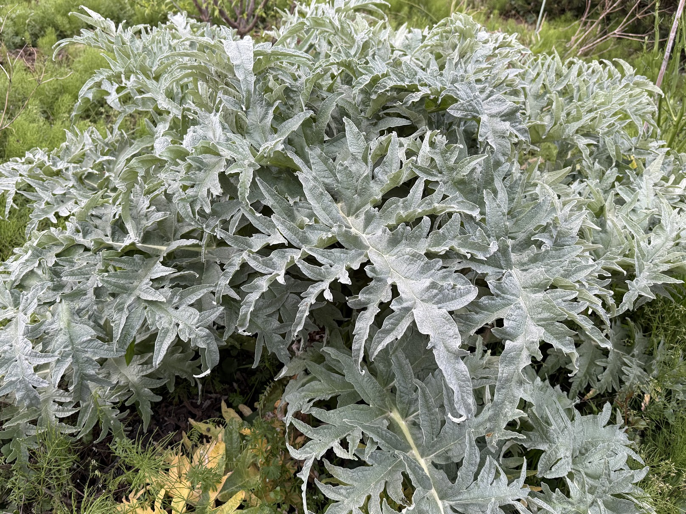
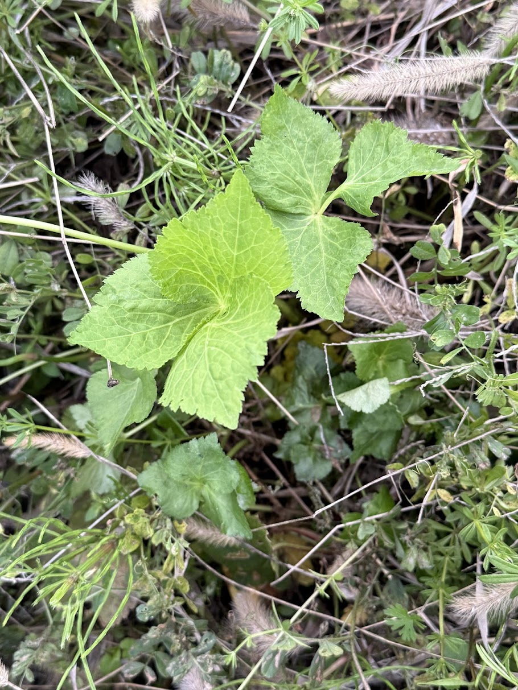

On April 7, a two-week ceasefire was agreed between the United States and Iran. The Strait of Hormuz is expected to reopen under Iranian military supervision, and markets responded with relief.

But reopening the strait doesn't make fertilizer come out of destroyed factories.

## Fertilizer Is a Petroleum Byproduct

The fertilizers sustaining global agriculture depend on three raw materials: ammonia for nitrogen fertilizers, sulfur essential for phosphate fertilizer production, and potassium chloride for potash fertilizers.

Of these, ammonia and sulfur are byproducts of oil and natural gas refining. Ammonia is synthesized through steam reforming of natural gas, and sulfur is recovered from the desulfurization of crude oil and natural gas.

When refineries and gas plants shut down, fertilizer feedstocks stop too. This is the "byproduct trap." The Persian Gulf has supplied 46% of global seaborne urea exports, 29% of ammonia exports, and roughly 50% of sulfur exports.

## A Ceasefire Doesn't Fix What's Broken

The 39-day war inflicted severe damage on Persian Gulf petrochemical facilities.

The Israeli Air Force precision-bombed the South Pars Petrochemical Complex in Assaluyeh, Bushehr Province, Iran, on March 18 and again in early April. Refinery No. 4 was almost completely destroyed, and Refinery No. 7 sustained serious damage. The Israeli Ministry of Defense claims these strikes disabled 85% of Iran's petrochemical export capacity.

Iran's retaliatory strikes hit Qatar's Ras Laffan Industrial City directly. Two LNG production trains at the world's largest LNG export hub were damaged, eliminating approximately 17% of Qatar's LNG export capacity (roughly 12.8 million tons per year).

Why will restoration take 3–5 years? Only three manufacturers in the world can produce the large gas turbines at the heart of these facilities. According to energy research firm Rystad Energy, these manufacturers were already carrying 2–4 years of backlog before the war even started, driven partly by surging demand from AI data centers. Replacement parts are physically queued, and full restoration will require at least 3–5 years. This issue is examined in detail in a separate article, "[Should Gas Turbines Power Food or AI?](/en/blog/gas-turbine-ai-vs-food/)"

## When Will Fertilizer Production Recover?

The three fertilizer types — nitrogen (urea), phosphate (DAP, MAP), and potash — each have different supply structures and recovery timelines.

### Nitrogen Fertilizer (Urea)

Urea is synthesized from ammonia, which is produced from natural gas. The Persian Gulf has accounted for 46% of global seaborne urea exports. Qatar's QAFCO and Saudi Arabia's SABIC Agri-Nutrients have declared force majeure and halted production due to feedstock disruptions. Egyptian urea plants have also shut down after gas supply from Israel was cut off.

Some natural gas plants were completely destroyed by direct bombardment, while others remain inoperable due to surrounding infrastructure damage. The latter may gradually restart. Eurasia Group's analysis estimates that repairing damaged facilities and restoring production levels will take "several months."

China, a potential alternative supplier, has effectively halted urea exports through August 2026 to prioritize its own food security. Malaysia's Petronas Bintulu urea plant (approximately 700,000 tons per year capacity) also suffered an unplanned shutdown in April.

**Recovery outlook:** Partial supply resumption in the second half of 2026. Return to pre-war levels in 2027 or later.

### Phosphate Fertilizer (DAP, MAP)

Phosphate fertilizers are produced by dissolving phosphate rock with sulfuric acid. The raw material for sulfuric acid is sulfur, which is a byproduct that "comes out" of the oil refining process. Without rebuilt refineries, there is no sulfur.

Morocco's OCP Group, the world's largest phosphate fertilizer exporter, has been importing approximately 3.7–6.5 million tons of sulfur annually, with 52% sourced from the Middle East. Sulfur depletion forced OCP to cut production capacity by up to 30% in Q2 2026.

As an emergency measure, OCP is directly importing processed sulfuric acid from Europe and China, but China itself depends on the Middle East for roughly half of its sulfur imports and has halved its own sulfuric acid exports. The emergency procurement sent sulfuric acid markets into panic, with China's sulfuric acid FOB price surging from minus $12.50 to $35.

**Recovery outlook:** Since sulfur supply depends on refinery reconstruction (3–5 years), full recovery is not expected until 2028 or later.

### Potash Fertilizer

Major producers are Canada, Russia, and Belarus, with low dependence on the Persian Gulf. Supply volumes are relatively stable, but prices are trending upward due to rising transportation costs across the board (maritime insurance premiums, fuel costs).

### Overall Assessment

| Fertilizer Type | Key Constraint | Partial Recovery | Return to Pre-War Levels |
|----------------|---------------|-----------------|------------------------|
| Nitrogen (urea) | Gas plant damage, China export halt | H2 2026 | 2027+ |
| Phosphate (DAP, MAP) | Sulfur supply cut (refinery destruction) | 2027 (high cost) | 2028+ |
| Potash | Rising transport costs | Relatively stable | Elevated prices |

Phosphate fertilizer will be the slowest to recover. The dependence on sulfur — a "byproduct" — is the biggest bottleneck.

## This Is a Global Food Crisis

For both nitrogen and phosphate fertilizers, supply recovery is measured in years, not months.

Global grain production is designed around chemical fertilizer inputs. Without fertilizer, corn yields drop 30–50%, with similar impacts on wheat and rice.

According to the USDA's 2026 planting intentions survey, farmers plan to reduce corn acreage — which requires large amounts of nitrogen fertilizer — by 3% year-over-year (3.45 million acres), while increasing soybean acreage — which can fix atmospheric nitrogen on its own — by 4% (3.49 million acres). Since the Middle East crisis began, urea prices in New Orleans surged approximately 50% in just weeks, from $475 to $680 per ton.

Corn is the foundation of the U.S. livestock industry's feed supply. If reduced planting combines with lower yields, feed prices will surge from fall 2026, passing through to meat prices. If livestock farmers cull animals early because they can't afford feed, severe meat shortages will follow in 2027 and beyond.

The Northern Hemisphere's spring 2026 planting season has already been missed. 2027 won't see major improvement either. Global food prices are entering a structural upward phase from late 2026 through 2027.

The naphtha problem — caught in the same "byproduct trap" as fertilizer (naphtha is the feedstock for packaging materials and medical plastics) — is examined in a separate article, "[The Naphtha Crisis: Food Shortages Will Start in Distribution Before the Harvest](/en/blog/grid-attack-naphtha/)."

## Mass Sweet Potato Conversion Is Not the Answer

Japan's Food Supply Crisis Response Act allows the government, in its final stage, to order "conversion to high-calorie crops such as sweet potatoes." The activation threshold is 1,850 kilocalories per person per day. It judges by calories alone.

Sweet potatoes are highly efficient at producing calories. But humans cannot survive on calories alone.

Sweet potatoes contain almost no protein — approximately 1.2g per 100g. Meeting an adult's daily requirement of 60g would require eating 5kg. Essential fatty acids, iron, zinc, and vitamin B12 are also deficient. After several months, muscle mass declines, immune function weakens, children's growth is impaired, and anemia spreads. Calories are met, but malnutrition sets in. This was exactly the condition of postwar Japan.

There are soil problems too. Sweet potatoes suffer severe replanting disease, with yields declining from the second year. They strip large amounts of potassium from the soil and destroy aggregate structure during harvest. If planted simultaneously nationwide without incoming fertilizer, this year's calories come at the cost of depleting the soil's productive capacity for years to come.

## The Age of Forced Natural Farming

If fertilizer supply won't recover for years, a significant portion of farmland will have to be planted without chemical fertilizer. This is not a choice — it's a physical necessity.

Masanobu Fukuoka's natural farming intercropping plants diverse species in the same space. Soybeans fix nitrogen, and neighboring crops use it. Tall plants create shade, while ground-cover plants prevent soil from drying out.

Using his independently bred "Happy Hill" rice variety in no-till cultivation, Fukuoka achieved approximately 5.5 tons of rice per hectare — yields comparable to conventional agriculture using chemical fertilizers and pesticides, accomplished with zero fertilizer input.

Intercropping solves both human nutrition and soil health simultaneously. Soybeans supply protein while returning nitrogen to the soil. Leafy vegetables supply vitamins and minerals while returning organic matter to the soil. Diverse root systems cultivate the soil at different depths, maintaining the habitat for microorganisms.

Mass sweet potato conversion maximizes a single metric — calories — while simultaneously destroying nutritional and soil diversity. Intercropping is the opposite. It doesn't maximize any single metric, but keeps both humans and soil healthy.

When chemical fertilizer does return, it will be far more expensive than before. Permanent transit fees, facility reconstruction costs, global demand concentration. "Farming that buys fertilizer" is no longer cheap farming.

## With Nature, We Can Survive

Japan is one of the few countries that can escape this structural trap. It has water. It has soil. It has microorganisms. It has forests. And it has thousands of years of accumulated wisdom for sustaining food production without chemical fertilizer.

Masanobu Fukuoka left these words: "With nature, we can survive."

This is no longer philosophy. It is a condition of survival.

---

**Reference:** [Fertilizer Shortage and Food Crisis — The Shift to Natural Farming (PDF)](en-004-fertilizer-crisis-natural-farming.pdf)

*Fact-finding for this article was conducted using Gemini Deep Research. Structural analysis and writing were done using Claude (Anthropic).*
