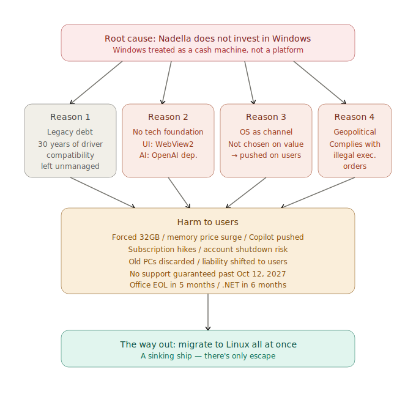

# There is no guarantee Windows will be supported after October 12, 2027 — even if you buy a new PC today

## Which of the following describes your Windows PC situation?
- A. Still using a Windows 10 PC that lost support in October 2025
- B. Running Windows 11 on an unsupported PC using workarounds
- C. Extending life with Windows 10 ESU (Extended Security Updates)
- D. Officially upgraded to Windows 11
- E. Recently bought a new Windows 11 PC

In case A, vulnerabilities discovered after October 2025 will never be patched, leaving these systems already exposed to cyberattacks.

But even in case E, as of now (May 2026), the latest date Microsoft officially guarantees Windows 11 Home/Pro support is October 12, 2027 — the end-of-support date for 25H2. That is just 1 year and 5 months from today. What happens to Windows after that, Microsoft itself has not announced.
Consider, further, what happens when offensive AI like Claude Mythos becomes available to attackers. Attackers will be able to mount attacks within hours to days. Windows' current once-a-month security patch cycle simply cannot keep up.

How did it come to this?

On April 29, 2026, Microsoft CEO Satya Nadella told investors during the earnings call that the company needs to "win back the fans."
That same week, Microsoft's marketing team officially recommended "32GB as the worry-free choice" for Windows 11 gaming PCs.
That same week, Copilot buttons were quietly pulled from Notepad, Snipping Tool, Photos, and Widgets.
These look like separate stories. They are not. They are all symptoms of the same structure.

Windows is now breaking down for four structural reasons. One is the weight of three decades of legacy that Windows has accumulated as a product. The other three are decisions made under Nadella. Microsoft no longer has the organizational capacity to fix them.

---

## Reason 1: Legacy debt — the weight of decades of driver compatibility

This is the largest debt that Windows has accumulated in 30 years as a product.

Windows has long marketed itself on running with every piece of hardware ever made. 1990s printers, old USB devices, serial port equipment, industrial peripherals, 16-bit software. If any of these stopped working, it would have been fatal for Microsoft. Compatibility was what supported Windows' de facto monopoly.

But compatibility is not free. To keep old drivers running, the Windows kernel carries a massive compatibility layer.

The cost is severe:

- The kernel becomes bloated
- Security holes accumulate (old drivers are attack vectors)
- Updates take longer, restarts drag on
- The cost of adding new features rises exponentially
- Innovation itself stops

Compared to Linux, the difference is clear. Linux kernel developers periodically remove old, unused drivers from the kernel. A 30-year-old printer might not work — but in exchange, the kernel is light, secure, and fast. This is a philosophical choice: discard the past, optimize the present. Someone is responsibly managing it.

Windows took the opposite path. Or rather, **Microsoft does not actually manage drivers at all**. And the deeper problem is that the support infrastructure for driver development itself has not been organized.

---

## Reason 2: Microsoft can no longer build its own technical foundation

What should Windows apps be built with? Microsoft has not been able to answer this question for over a decade.

WPF, Silverlight, UWP, Xamarin, WinUI 3 — none of these were ever truly finished. So internal app teams gave up waiting and ran toward web technology. Teams, the new Outlook, Widgets, parts of the Settings app — all built on Edge WebView2. It's like having a small browser living inside every app.

Ten apps means ten browser instances, all sitting in memory. **This is the real reason 16GB is no longer enough.** It's not that games got heavier. **Windows itself, and its first-party apps, got fat by swallowing web technology.**

And now Microsoft is telling users to pay for that bloat by buying 32GB of RAM — at a moment when DDR5 prices have tripled or quadrupled in a single year.

The same thing is happening with AI. Copilot is, in practice, a wrapper around OpenAI's GPT. Microsoft has its own AI research, but it has not produced a competitive product on its own.

Microsoft couldn't build its own UI framework, so it ran to web tech. It couldn't build its own AI, so it depends on OpenAI. **The organizational capacity to build its own technical foundation has been hollowed out.**

---

## Reason 3: Microsoft treats the OS as a "channel," not a "tool"

Microsoft 365 Copilot has reached 15 million paid seats. But of the people with access, only 35.8% actually use it. The remaining two-thirds either don't use it or have moved to a different AI.

The other AIs are being chosen. Anthropic's Claude is used by 70% of the Fortune 100 and is generating $30 billion in annualized enterprise revenue. **The demand for AI exists. Copilot is just not what people are choosing.**

When a product can't win on value, the only remaining tactic is to remove the user's choice.

- M365 Copilot is auto-installed on Windows devices running Microsoft 365 desktop apps, without user consent
- Copilot+ PC keyboards include a dedicated physical Copilot key that is hard to remap
- Copilot is pinned to the Windows 11 taskbar by default, auto-starts at login, and reappears even after being closed
- The OS overrides default browser settings to open in Edge
- The EEA (European Economic Area) is excluded — because regulation forces Microsoft to behave there

That last point is the giveaway. **Where regulation exists, they comply. Where regulation doesn't exist, they push it through anyway.** Microsoft itself recognizes that this is not in the user's interest. They just do it where they can.

Former Windows engineer Dave Plummer put it this way: "The problem is that Microsoft is treating our desktops as an engagement funnel."

Windows used to be a tool. Microsoft has started treating it as a channel for capturing user time. The fact that the Copilot button in Notepad was simply renamed to "writing icon" — without removing the functionality — confirms this. The strategy hasn't changed. They're just trying to deflect criticism by adjusting the surface.

---

## Reason 4: Your email can be cut off by a U.S. presidential decision

Up to this point, the problems have been internal to Microsoft. But starting in 2026, a problem of an entirely different dimension came into view.

**Geopolitical risk.**

This risk has two distinct forms.

### The first risk: An executive order — Microsoft complied with an illegal command

In February 2025, U.S. President Donald Trump issued sanctions against eleven senior officials of the International Criminal Court (ICC). Microsoft, not wanting to lose billions of dollars in U.S. government contracts, **shut down the Microsoft accounts of ICC judges**. The judges lost access to their email.

This is not hypothetical. It actually happened.

What needs to be emphasized is that **the executive order itself was unlawful**. ICC judges are foreign judicial officers. They are not even subject to U.S. criminal jurisdiction. There was no due process under the Fifth Amendment. **It was not a law. It had no congressional vote and no judicial review.** It was a single political decision by one man — the U.S. president.

Microsoft should have said no to an illegal order of this kind. The core value of Windows as a product was supposed to be that anyone in the world could rely on it, regardless of politics. Protecting that should have been Microsoft's reason to exist.

Nadella did not say no. **He prioritized keeping the contract over the trustworthiness of Windows.**

In other words, **Nadella abandoned Windows.**

The targets can be anyone. Today it was an ICC judge. Tomorrow it could be a researcher in another country. Next year it could be a Japanese company doing business with the U.S. **There is no way to predict and no way to prepare.**

Margrethe Vestager, the EU's former competition commissioner, warned: "If it can happen once that a judge cannot use their email, then it can happen again. This is a dependency, and it can be weaponized."

---

## Nobody wants to migrate to Linux — but it's becoming necessary

Let's be direct.

Switching from Windows to Linux is something nobody enjoys. Familiar shortcuts, decades of Office files, compatibility with family and coworkers — there is real learning cost and real psychological resistance.

Even so, this article recommends migrating to Linux — and migrating **all at once.**

### Microsoft is not going to stop

A $3 trillion market cap, $100+ billion in long-term contracts, "Sovereign AI" entanglements with multiple national governments, and AI usage built into internal HR evaluations — all of this constitutes **a trap Nadella himself constructed.**

He has no intention of changing course. And even if he did, undoing his own constraints would mean a stock price collapse and contract breaches. **What Nadella is actually doing is accelerating in a direction he can no longer reverse.**

Hardware requirements will keep rising. Copilot will be embedded deeper into the OS. Subscription prices will keep going up. **If you don't move now, you'll find it harder to move next year.**

### Linux in 2026 is not the Linux of 20 years ago

Web meetings, web mail, SaaS — none of it is different on Windows or Linux. Slack, Zoom, Discord, VS Code — all have native Linux versions. Steam's Proton runs the majority of games. Old PCs come back to life.

When you run into something you don't know how to do, there is plenty of information online. AI assistants will walk you through command-line operations. The situation is completely different from a Linux migration 20 years ago.

---

## Migrating from Word to Markdown raises your productivity

The replacement for Office has already become clear. **It's Markdown.**

Markdown is a lightweight plain-text notation for headings, lists, tables, code blocks, and links. The files are just plain `.md` text files.

Moving from Word to Markdown improves your productivity. The reasons are simple.

**You can focus on writing.** In Word, every keystroke pulls you into formatting decisions — fonts, line spacing, bold styles. Markdown lets you defer all of that. `#` for headings, `*` for emphasis, that's it. While you're writing, you focus only on the content.

**Files are tiny.** A 100-page Word document takes several megabytes. The same content in Markdown takes tens of kilobytes. Backups, searches, and sharing are all faster.

**No vendor lock-in.** `.docx` depends on Microsoft's format. Old files subtly break with each new version of Word. Markdown is just text. It will open in any editor, twenty years from now.

**Version control works.** Git can track your history. You can see exactly what changed line by line between last week's document and this week's. Word's "track changes" doesn't compare.

**Conversion is trivial.** Tools like Pandoc can convert Markdown to PDF, HTML, .docx, .epub, slides — anything. You decide the final output format later.

**You write faster.** No more reaching for menus with the mouse. Your hands stay on the keyboard. Once you're used to it, you write noticeably faster than in Word.

GitHub, blogging platforms, documentation sites, technical books — in the worlds of developers, writers, and researchers, Markdown is already the de facto standard. The reason is the same: higher productivity.

### Markdown editors for Linux (OSS)

- **Obsidian** — Free for personal use, local file storage
- **Logseq** — Open source, outliner-style
- **Joplin** — Open source, notebook hierarchy
- **Zettlr** — Open source, oriented toward academic writing
- **VS Code** — Many people use it as a Markdown editor

When you do need `.docx` or `.xlsx`, **OnlyOffice Desktop Editors** is free. It handles files made in Microsoft Office without layout breakage.

Write in Markdown, and convert to `.docx` with OnlyOffice or Pandoc when needed. This is what document creation looks like in 2026.

---

## Why "all at once" instead of "gradually"

Migrating gradually has a trap.

**The hybrid period is the worst part.** Data gets fragmented across two systems. Settings are duplicated. The pain just drags on.

**As long as you're using Windows, the harm doesn't stop.** A "Windows main, Linux secondary" setup keeps you in the line of fire.

**Migration cost rises over time.** Today is the cheapest it will ever be.

**"Someday" never arrives.** The weekend, the summer break, the moment a project wraps up — none of those moments come.

Set a date. Do it all at once. It turns out to be the easier path.

---

## Concrete steps for migrating all at once

Plan for two weeks to one month.

**Week 1 — Preparation**: Choose a distribution (Debian, Ubuntu, or Linux Mint will all work). Get your data out of Microsoft accounts.

**Week 2 — Migration**: Pick a weekend as migration day. Install Linux on your main PC. Restore your data and install your apps. Live in Linux starting Monday.

**Weeks 3–4 — Settling in**: When you hit something you don't know, search online or ask an AI assistant. Switch your document workflow to Markdown. Use a virtual machine for the rare task that absolutely requires Windows.

You don't need to make Linux feel exactly like Windows. **Treat it as time to get used to a new way of working.**

---

## Conclusion

It comes down to this.

**Nadella has no interest in Windows as a platform.**

Maintaining and growing Windows as a platform that the world can rely on — that is not what interests him. What interests him is making money on Azure and AI.

Microsoft's $100–120 billion in capital expenditure for fiscal year 2026 is going entirely to Azure and AI datacenters.

Nadella has transformed Windows from "an OS you buy and use long-term, with a fixed lifecycle" into "a service-style OS that requires continuous updates." But Microsoft is becoming less and less able to support Windows.

Look at the Windows 11 lifecycle pages. They show "Windows 11 Home/Pro is in support" — but the final end-of-support date and the supported hardware specifications are not stated.

- 25H2 → end of support on October 12, 2027 — the latest confirmed date for general Intel / AMD PCs
- 26H1 → end of support on March 14, 2028 — confirmed, but only for new-generation devices like Snapdragon X2

In other words, **whether any machines will be supported by Windows after October 12, 2027 has not been announced by Microsoft itself.** That is where we stand.
When the CEO has abandoned the product, users have no way to keep using it.
If you're going to leave, leave all at once. Half-measures hurt the most.

---

*Related: [Learning Debian with Claude — A practical guide to migrating to Linux](/en/claude-debian/)*

*Related: [AI-Native Ways of Working — Change your tools, change your thinking](/en/ai-native-ways/)*

*Related: [Are You Still Going to Keep Using Windows and Office? — Detailed structural analysis with primary sources and references](/en/blog/windows-office-facts/)*