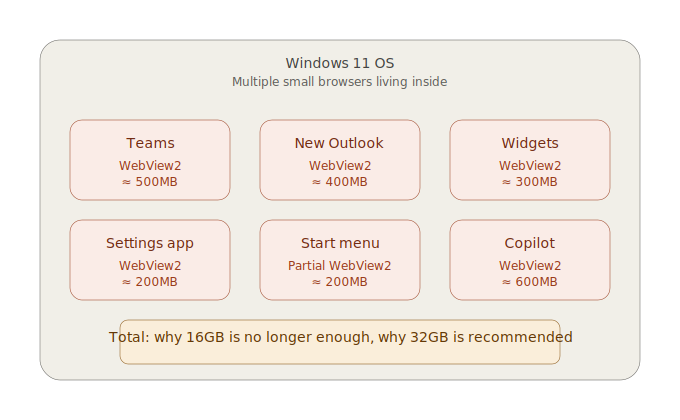
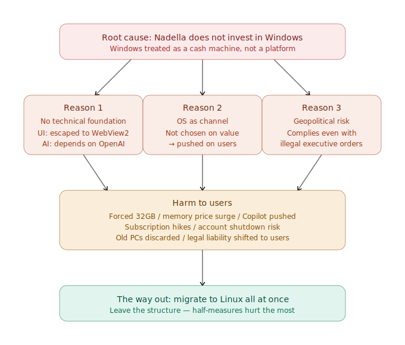
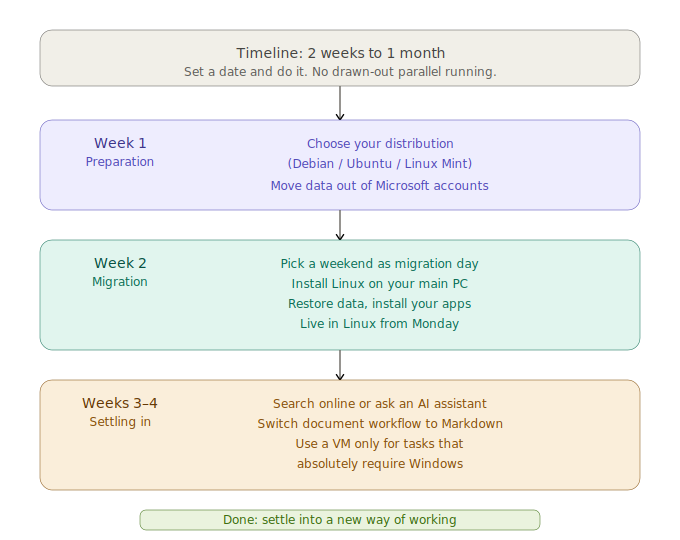

# Windows is Breaking Down

On April 29, 2026, Microsoft CEO Satya Nadella told investors during the earnings call that the company needs to "win back the fans."

That same week, Microsoft's marketing team officially recommended "32GB as the worry-free choice" for Windows 11 gaming PCs.

That same week, Copilot buttons were quietly pulled from Notepad, Snipping Tool, Photos, and Widgets.

And in February, Microsoft complied with an illegal executive order and cut off an ICC judge's Microsoft account.

These look like separate news stories. They are not. They are all symptoms of the same structure.

Windows is breaking down — under Nadella's direction. And the organization no longer has the capacity to stop it.

---

## Reason 1: Microsoft can no longer build its own technical foundation

What should Windows apps be built with? Microsoft has not been able to answer this question for over a decade.

WPF, Silverlight, UWP, Xamarin, WinUI 3 — none of these were ever truly finished. So internal app teams gave up waiting and ran toward web technology. Teams, the new Outlook, Widgets, parts of the Settings app — all built on Edge WebView2. It's like having a small browser living inside every app.

Ten apps means ten browser instances, all sitting in memory. **This is the real reason 16GB is no longer enough.** It's not that games got heavier. **Windows itself, and its first-party apps, got fat by swallowing web technology.**

And now Microsoft is telling users to pay for that bloat by buying 32GB of RAM — at a moment when DDR5 prices have tripled or quadrupled in a single year.

The same thing is happening with AI. Copilot is, in practice, a wrapper around OpenAI's GPT. Microsoft has its own AI research, but it has not produced a competitive product on its own.

Microsoft couldn't build its own UI framework, so it ran to web tech. It couldn't build its own AI, so it depends on OpenAI. **The organizational capacity to build its own technical foundation has been hollowed out.**

---

## Reason 2: Microsoft treats the OS as a "channel," not a "tool"

Microsoft 365 Copilot has reached 15 million paid seats. But of the people with access, only 35.8% actually use it. The remaining two-thirds either don't use it or have moved to a different AI.

The other AIs are being chosen. Anthropic's Claude is used by 70% of the Fortune 100 and is generating $30 billion in annualized enterprise revenue. **The demand for AI exists. Copilot is just not what people are choosing.**

When a product can't win on value, the only remaining tactic is to remove the user's choice.

- M365 Copilot is auto-installed on Windows devices running Microsoft 365 desktop apps, without user consent
- Copilot+ PC keyboards include a dedicated physical Copilot key that is hard to remap
- Copilot is pinned to the Windows 11 taskbar by default, auto-starts at login, and reappears even after being closed
- The OS overrides default browser settings to open in Edge
- The EEA (European Economic Area) is excluded — because regulation forces Microsoft to behave there

That last point is the giveaway. **Where regulation exists, they comply. Where regulation doesn't exist, they push it through anyway.** Microsoft itself recognizes that this is not in the user's interest. They just do it where they can.

Former Windows engineer Dave Plummer put it this way: "The problem is that Microsoft is treating our desktops as an engagement funnel."

Windows used to be a tool. Microsoft has started treating it as a channel for capturing user time. The fact that the Copilot button in Notepad was simply renamed to "writing icon" — without removing the functionality — confirms this. The strategy hasn't changed. They're just trying to deflect criticism by adjusting the surface.

---

## Reason 3: Your email can be cut off by a U.S. presidential decision

Up to this point, the problems have been internal to Microsoft. But starting in 2026, a problem of an entirely different dimension came into view.

**Geopolitical risk.**

This risk has two distinct forms.

### Risk 1: An executive order — Microsoft complied with an illegal command

In February 2025, U.S. President Donald Trump issued sanctions against eleven senior officials of the International Criminal Court (ICC). Microsoft, not wanting to lose billions of dollars in U.S. government contracts, **shut down the Microsoft accounts of ICC judges**. The judges lost access to their email.

This is not hypothetical. It actually happened.

What needs to be emphasized is that **the executive order itself was unlawful**. ICC judges are foreign judicial officers. They are not even subject to U.S. criminal jurisdiction. There was no due process under the Fifth Amendment. **It was not a law. It had no congressional vote and no judicial review.** It was a single political decision by one man — the U.S. president.

Microsoft should have said no to an illegal order of this kind. The core value of Windows as a product was supposed to be that anyone in the world could rely on it, regardless of politics. Protecting that should have been Microsoft's reason to exist.

Nadella did not say no. **He prioritized keeping the contract over the trustworthiness of Windows.**

In other words, **Nadella abandoned Windows.**

The targets can be anyone. Today it was an ICC judge. Tomorrow it could be a researcher in another country. Next year it could be a Japanese company doing business with the U.S. **There is no way to predict and no way to prepare.**

Margrethe Vestager, the EU's former competition commissioner, warned: "If it can happen once that a judge cannot use their email, then it can happen again. This is a dependency, and it can be weaponized."

### Risk 2: The CLOUD Act — predictable, within the limits of legal process

Separately, there is the CLOUD Act, a U.S. law passed in 2018. It allows U.S. law enforcement to demand data held by U.S. companies, regardless of where the data is physically located, by judicial warrant.

The CLOUD Act is at least an actual law passed by Congress, and operates within judicial process. It is invoked through warrants and court orders, so it has some predictability. But still, **as long as the operating company is a U.S. legal entity, it is obligated to hand over data to U.S. investigators — even if the datacenter is in Europe.**

This is why "sovereign cloud" branding like "Microsoft EU Data Boundary" is not trusted in Europe. It cannot escape the CLOUD Act.

### Combined: Microsoft cannot be trusted

Using Microsoft services means carrying two simultaneous risks:

- **Dependence on a company that complies with illegal presidential orders** (unpredictable, arbitrary)
- **Data handed over through judicial process** (somewhat predictable, but inescapable)

These are the realities. Whether the datacenter is in Europe or in Japan, the underlying nature does not change.

### Governments are starting to move

France's digital directorate has announced it will switch government desktops from Windows to Linux. Germany, Austria, and France are building Nextcloud-based sovereign productivity stacks. Vietnam and South Korea are moving in the same direction.

If a judge can be cut off, there is no guarantee you can't be.

---

## Nobody wants to migrate to Linux — but it's becoming necessary

Let's be direct.

Switching from Windows to Linux is something nobody enjoys. Familiar shortcuts, decades of Office files, compatibility with family and coworkers — there is real learning cost and real psychological resistance.

Even so, this article recommends migrating to Linux — and migrating **all at once.**

### Microsoft is not going to stop

A $3 trillion market cap, $100+ billion in long-term contracts, "Sovereign AI" entanglements with multiple national governments, and AI usage built into internal HR evaluations — all of this constitutes **a trap Nadella himself constructed.**

He has no intention of changing course. And even if he did, undoing his own constraints would mean a stock price collapse and contract breaches. **What Nadella is actually doing is accelerating in a direction he can no longer reverse.**

Hardware requirements will keep rising. Copilot will be embedded deeper into the OS. Subscription prices will keep going up. **If you don't move now, you'll find it harder to move next year.**

### Linux in 2026 is not the Linux of 20 years ago

Web meetings, web mail, SaaS — none of it is different on Windows or Linux. Slack, Zoom, Discord, VS Code — all have native Linux versions. Steam's Proton runs the majority of games. Old PCs come back to life.

When you run into something you don't know how to do, there is plenty of information online. AI assistants will walk you through command-line operations. The situation is completely different from a Linux migration 20 years ago.

---

## Migrating from Word to Markdown raises your productivity

The replacement for Office has already become clear. **It's Markdown.**

Markdown is a lightweight plain-text notation for headings, lists, tables, code blocks, and links. The files are just plain `.md` text files.

Moving from Word to Markdown improves your productivity. The reasons are simple.

**You can focus on writing.** In Word, every keystroke pulls you into formatting decisions — fonts, line spacing, bold styles. Markdown lets you defer all of that. `#` for headings, `*` for emphasis, that's it. While you're writing, you focus only on the content.

**Files are tiny.** A 100-page Word document takes several megabytes. The same content in Markdown takes tens of kilobytes. Backups, searches, and sharing are all faster.

**No vendor lock-in.** `.docx` depends on Microsoft's format. Old files subtly break with each new version of Word. Markdown is just text. It will open in any editor, twenty years from now.

**Version control works.** Git can track your history. You can see exactly what changed line by line between last week's document and this week's. Word's "track changes" doesn't compare.

**Conversion is trivial.** Tools like Pandoc can convert Markdown to PDF, HTML, .docx, .epub, slides — anything. You decide the final output format later.

**You write faster.** No more reaching for menus with the mouse. Your hands stay on the keyboard. Once you're used to it, you write noticeably faster than in Word.

GitHub, blogging platforms, documentation sites, technical books — in the worlds of developers, writers, and researchers, Markdown is already the de facto standard. The reason is the same: higher productivity.

### Markdown editors for Linux (OSS)

- **Obsidian** — Free for personal use, local file storage
- **Logseq** — Open source, outliner-style
- **Joplin** — Open source, notebook hierarchy
- **Zettlr** — Open source, oriented toward academic writing
- **VS Code** — Many people use it as a Markdown editor

When you do need `.docx` or `.xlsx`, **OnlyOffice Desktop Editors** is free. It handles files made in Microsoft Office without layout breakage.

Write in Markdown, and convert to `.docx` with OnlyOffice or Pandoc when needed. This is what document creation looks like in 2026.

---

## Why "all at once" instead of "gradually"

Migrating gradually has a trap.

**The hybrid period is the worst part.** Data gets fragmented across two systems. Settings are duplicated. The pain just drags on.

**As long as you're using Windows, the harm doesn't stop.** A "Windows main, Linux secondary" setup keeps you in the line of fire.

**Migration cost rises over time.** Today is the cheapest it will ever be.

**"Someday" never arrives.** The weekend, the summer break, the moment a project wraps up — none of those moments come.

Set a date. Do it all at once. It turns out to be the easier path.

---

## Concrete steps for migrating all at once

Plan for two weeks to one month.

**Week 1 — Preparation**: Choose a distribution (Debian, Ubuntu, or Linux Mint will all work). Get your data out of Microsoft accounts.

**Week 2 — Migration**: Pick a weekend as migration day. Install Linux on your main PC. Restore your data and install your apps. Live in Linux starting Monday.

**Weeks 3–4 — Settling in**: When you hit something you don't know, search online or ask an AI assistant. Switch your document workflow to Markdown. Use a virtual machine for the rare task that absolutely requires Windows.

You don't need to make Linux feel exactly like Windows. **Treat it as time to get used to a new way of working.**

---

## Conclusion

It comes down to this.

**Nadella has no interest in Windows as a platform.**

Maintaining and improving Windows as a platform that the world can rely on — that is not what interests him. What interests him is making money on Azure and AI, and **draining Windows as a cash machine** to fund that.

Microsoft's $100–120 billion in capital expenditure for fiscal year 2026 is going entirely to Azure and AI datacenters. The Windows division has long been treated as a cost center, with both budget and talent slowly hollowed out. The reason WPF, UWP, and WinUI 3 were never finished, and the reason internal app teams escaped to WebView2, is the same reason: **Nadella didn't put money into Windows.**

When you don't invest in improving the product, the only way left to monetize is to push and to raise prices.

- Push 32GB → Revenue for memory makers and PC vendors
- Raise ESU prices → Revenue from users of older PCs
- Force Copilot → Numbers for the AI strategy
- Raise Microsoft 365 subscription prices → Revenue from existing customers
- Cut off an ICC judge's email → Billions in U.S. government contracts

Every one of those is a money decision. The trustworthiness of Windows as a platform, and the interests of users, are simply lower priorities.

To Nadella, Windows is no longer a product to be protected. **It is an asset to be drained.**

When the company itself has abandoned the product, there is no reason for users to keep using it.

If you're going to leave, leave all at once. The hybrid state is the worst part.

The EU, France, Germany, Austria, Vietnam, and South Korea are already moving.

---

*Related: "Learning Debian with Claude" — A practical guide to migrating to Linux*

*Related: "Are You Still Going to Keep Using Windows and Office?" — Detailed structural analysis with primary sources and references*