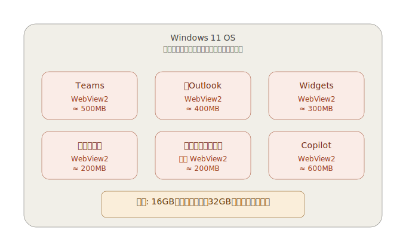
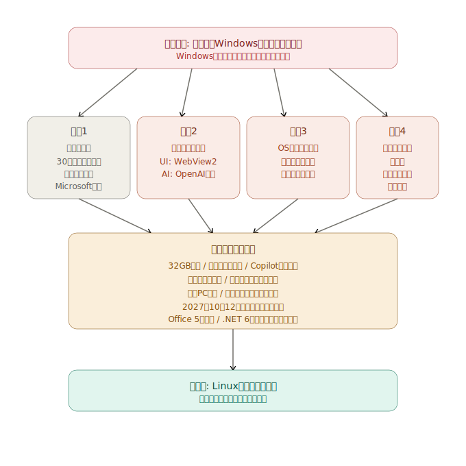
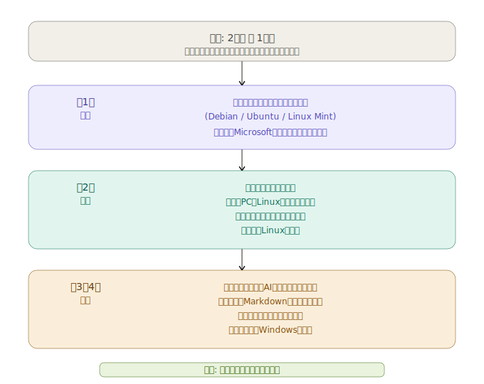

# 今、Windows PC を買っても、2027年10月12日以降サポートがされる保証がない

## あなたのWindows PCの状況は、次のどれですか?

A. 2025年10月にサポート切れになった Windows 10 PC を、そのまま使っている
B. 非対応PCに回避策で Windows 11 を入れて使っている
C. Windows 10 ESU(延長セキュリティ更新)で延命している
D. Windows 11 に正式にアップデートした
E. 最近 Windows 11 PC を買った

Aのケースでは、2025年10月以降新たに発見された脆弱性は修正されないため、すでにサイバー攻撃の危険にさらされています。
しかし、Eのケースでも、現時点（2026年5月）で、Microsoft が公式に保証している Windows 11 Home/Proのsサポート期限は、2027年10月12日(25H2 のサポート終了日)。今日から1年5ヶ月先である。それ以降、Windows がどうなるかは、Microsoft 自身も発表していない。

さらに、Claude Mythosを代表とする攻撃力の強いAIが利用できるようになった時の対応を考えてみるといい。
攻撃者は、数時間から数日で攻撃が可能になる。現在のWindowsの1ヶ月に1回のセキュリティバッチでは、対応はできない。

なぜこんな状態になったのか。

2026年4月29日、Microsoft の CEO サティア・ナデラは決算説明会で「ファンを取り戻す必要がある」と語った。

同じ週、Microsoft のマーケティング部門は Windows 11 のゲーム PC で「32GB が不安なしの選択肢」と公式に推奨した。

同じ週、Notepad、Snipping Tool、Photos、Widgets から Copilot のボタンを引き戻した。

別々のニュースに見えるが、全部、同じ構造の症状である。

Windows は今、4つの構造的な理由で壊れていっている。1つは Windows という製品が30年かけて抱え込んだ過去の重みで、残り3つはナデラ時代に意思決定された問題だ。それを改善できる組織能力はもう持っていない。

---

## 理由1: 過去の遺産 — 多数のドライバーとの互換性の重み

これは Windows という製品が、30年かけて抱え込んだ最も大きな負債である。
Windows は、過去のあらゆるハードウェアと動き続けることを売りにしてきた。1990年代のプリンター、古いUSBデバイス、シリアルポート機器、業務用の専用ハードウェア、16ビット時代のソフトウェア。これらが「動かなくなる」のは Microsoft にとって致命傷だった。互換性こそが Windows の事実上の独占を支えてきた。
しかし、互換性は無料ではない。過去のドライバーを動かし続けるために、Windows のカーネルは巨大な互換性レイヤーを抱えている。
その代償は深刻だ。

カーネルが肥大化する
セキュリティ穴が増える(古いドライバーは攻撃ベクター)
アップデートに時間がかかる、再起動が長い
新しい機能を追加するコストが指数関数的に上がる
イノベーションそのものが止まる

Linux と比較すると差が明確になる。Linux カーネル開発者は、使われなくなった古いドライバーを定期的にカーネルから削除する。30年前のプリンターは動かないかもしれない。その代わり、カーネルは軽く、安全で、速い。これは哲学の選択だ。過去を捨てて、現在を最適化する。誰かが責任を持って管理している。
Windows は逆だ。というより、Microsoft はそもそもドライバーを管理していない。
そして、ドライバー開発のサポート自体が整っていないことが、より深刻な問題である。

## 理由2: 自前の技術基盤を作れなくなった

Windows のアプリは何で作るべきか。この問いに Microsoft は10年以上答えを出せていない。

WPF、Silverlight、UWP、Xamarin、WinUI 3 — どれも完成しないまま、社内のアプリチームは Web 技術に逃げた。Teams、新 Outlook、Widgets、設定アプリの一部が Edge WebView2 で作られた。アプリの中に小さなブラウザが住み着いているようなものだ。

10個のアプリが10体のブラウザを抱える。これが「16GB では足りなくなった」本当の理由である。**Windows と公式アプリ自身が、Web 技術を抱え込んで太った**。

そして Microsoft は今週、それを「32GB が安心」と言ってユーザーに請求している。DDR5 が1年で3〜4倍になっている最中に、である。

AI でも同じことが起きている。Copilot は事実上 OpenAI の GPT のラッパーだ。Microsoft 自身の AI 研究は、製品としては形になっていない。

UI を自前で作れず Web 技術に逃げ、AI を自前で作れず OpenAI に依存した。**自前の技術基盤を作る組織能力が、もう低下している**。

---

## 理由3: OS を「道具」ではなく「チャネル」として扱っている

Microsoft 365 Copilot の有料シートは1,500万まで増えた。しかし実際に使っているのは35.8%。残り3分の2は使っていないか、別の AI に移っている。

別の AI は選ばれている。Anthropic の Claude は Fortune 100 の70%が採用、企業向け売上は年300億ドル規模。**AI への需要はある。Copilot が選ばれていないだけだ**。

価値で選ばれない製品を使ってもらうには、選択肢を奪うしかない。

- Microsoft 365 利用者の Windows に、同意なく Copilot を自動インストール
- Copilot+ PC キーボードに専用の物理キー、リマップ困難
- タスクバーにデフォルトピン留め、ログイン時に自動起動、閉じても復活
- デフォルトブラウザ設定を無視して Edge で開く
- EEA(欧州経済領域)だけは規制があるので除外

最後の点が決定的だ。**規制があれば守る、規制がなければやる**。Microsoft 自身が「ユーザーの利益にならない」と認識した上で、規制のない地域には強行している。

元 Windows エンジニアの Dave Plummer はこう言っている。「Microsoft が我々のデスクトップを"エンゲージメントファネル"として扱っていることが問題だ」。

Windows は道具だった。それを Microsoft は、滞在時間を稼ぐチャネルとして扱い始めた。今週、Notepad の Copilot ボタンが「writing icon」に名前を変えただけで残ったのも、この方針が変わっていない証拠だ。批判をかわすために表面だけ調整している。

---

## 理由4: 米国大統領の判断で、あなたのメールは止まる

ここまでは Microsoft の内部問題だった。しかし2026年に入って、別の次元の問題が表面化した。

**地政学的リスク**である。

しかもこのリスクには、2つの異なる性質のものがある。

### 第1のリスク: 大統領令 — 違法性のある命令に、Microsoft が従った

2025年2月、米国大統領ドナルド・トランプは国際刑事裁判所(ICC)の上級職員11人に制裁を発動した。Microsoft は米政府との契約を失いたくないという判断で、**ICC 判事の Microsoft アカウントを停止した**。判事はメールにアクセスできなくなった。

仮定の話ではない。実際に起きた事件である。

ここで強調すべきは、**この大統領令そのものに違法性がある**ということだ。ICC 判事は外国の司法職員であり、米国の刑事司法手続きの対象ですらない。米国憲法修正第5条が定める適正手続きを経ていない。**法律ですらなく、議会の議決も司法判断もない**、米国大統領という一人の人間の政治判断にすぎない。

Microsoft は、こういう違法性のある命令に対して**ノーと言うべきだった**。Windowsという製品の価値の核心は、「世界中のユーザーが、政治と無関係に安心して使える基盤である」ことだったはずだ。それを守ることが Microsoft の存在理由のはずだった。

ナデラはノーと言わなかった。**契約を失わないことを、Windowsの信頼性より優先した**。

つまり、**ナデラはWindowsを捨てた**。

対象は誰でも選べる。今日は ICC 判事だが、明日は別の国の研究者かもしれない。来年は米国と取引のある日本企業かもしれない。**予測も対策もできない**。

EU の元競争コミッショナー Margrethe Vestager はこう警告している。「判事がメールを使えなくなることが一度起きるなら、また起きうる。これは依存関係であり、武器化されうる」。

---

## Linux に移行したい人はいないが、移行せざるをえなくなる

率直に書く。

Windows から Linux への乗り換えは、誰でも嫌な作業だ。慣れたショートカット、Office の資産、家族や同僚との互換性。学習コストも心理的抵抗もかかる。

それでも、この記事は Linux への移行を、しかも**一気に**移行することを提案する。

### Microsoft は止まらない

3兆ドルの時価総額、1,000億ドル規模の長期契約、複数の国家との Sovereign AI の縛り、社内の人事評価への AI 利用の組み込み — これらは全部、**ナデラ自身が作った縛り**である。

ナデラはこの方針を変えるつもりがない。仮に変えたとしても、自分で作った縛りを自分で外さなければならず、それは Microsoft の株価暴落と契約破棄を意味する。**ナデラがやっていることは、引き返せない方向への加速**だ。

ハードウェア要件はさらに上がる。Copilot は OS のもっと深い場所に入る。サブスク料金は上がり続ける。今動かなければ、来年はもっと動きにくくなる。

### 2026年の Linux は、20年前の Linux ではない

Web 会議、Web メール、SaaS は Windows でも Linux でも変わらない。Slack、Zoom、Discord、VS Code は全部 Linux 版がある。ゲームも Steam の Proton で大半が動く。古い PC が現役で使える。

困ったことが出てきても、ネット上に解決策の情報が大量にある。AI アシスタントに聞けば、コマンドラインの使い方も教えてくれる。20年前の Linux 移行とは状況が全く違う。

---

## Word から Markdown に移行すると、生産性が上がる

Office に代わる文書作成の選択肢は、もう決まりつつある。**Markdown** である。

プレーンテキストで書ける軽量な記法で、見出し・箇条書き・表・コードブロック・リンクが書ける。ファイルは .md という単純なテキストファイルだ。

Word から Markdown に移行すると、生産性が上がる。理由は単純だ。

**書くことに集中できる**。Word では、文字を打つたびに「フォントは?」「行間は?」「太字のスタイルは?」と装飾の判断を強いられる。Markdown は装飾を後回しにできる。`#` で見出し、`*` で強調、それだけ。書いている最中は文章の中身だけに集中できる。

**ファイルが軽い**。100ページの Word 文書は数MBになる。同じ内容の Markdown は数十KBで済む。バックアップも、検索も、共有も速い。

**ベンダーロックインがない**。.docx は Microsoft の形式に依存している。Word のバージョンが上がるたびに、過去のファイルが微妙に崩れる。Markdown はただのテキストだから、20年後のどんなエディタでも開ける。

**バージョン管理が効く**。Git で履歴管理ができる。「先週の文書と今週の文書、どこが変わったか」が一行単位で見える。Word の「変更履歴」機能とは比べ物にならない。

**変換が自由自在**。Markdown から PDF、HTML、.docx、.epub、スライドまで、Pandoc などのツールで一発変換できる。最終出力フォーマットを後から決められる。

**書く速度が上がる**。マウスでメニューを操作する時間が消える。キーボードから手を離さずに文書が完成する。慣れれば、Word で書くより明らかに速い。

GitHub、ブログプラットフォーム、ドキュメントサイト、技術書 — 開発者やライター、研究者の世界では、もう Markdown が事実上の標準になっている。理由は同じ、生産性が高いからだ。

### Linux で使える Markdown エディタ(OSS)

- **Obsidian** — 個人利用無料、ローカル保存
- **Logseq** — オープンソース、アウトライナー型
- **Joplin** — オープンソース、ノートブック階層
- **Zettlr** — オープンソース、学術論文向け
- **VS Code** — Markdown エディタとして使う人も多い

それでも .docx や .xlsx が必要な場面では、**OnlyOffice デスクトップエディター**が無料で使える。Microsoft Office で作られたファイルのレイアウト崩れが起きにくい。

Markdown で書いて、必要なら OnlyOffice や Pandoc で .docx に変換する。これが2026年の文書作成の流れである。

---

## なぜ「少しずつ」ではなく「一気に」なのか

少しずつ移行する、という方針には罠がある。

**両方使う期間が一番つらい**。データが分散し、設定が二重になり、苦痛だけが長引く。

**Windows を使っている限り、被害は止まらない**。「メイン Windows、サブ Linux」では、被害の本体から離れられない。

**移行コストは時間とともに上がる**。今が一番安い。

**「いつかやろう」は永遠に来ない**。週末、夏休み、プロジェクトの区切り — どれも来ない。

期日を切って、一気にやる。それが結局一番楽である。

---

## 一気に移行する具体的な手順

期間は2週間〜1ヶ月。

**第1週 — 準備**: ディストリビューションを決める(Debian、Ubuntu、Linux Mint のどれかでよい)。データを Microsoft アカウントから外に出す。

**第2週 — 移行**: 週末を移行日に決める。メイン PC に Linux をインストール。データを戻し、アプリを入れる。月曜から Linux で生活を始める。

**第3〜4週 — 定着**: 困ったことが出たら、ネットや AI アシスタントで調べる。文書作成は Markdown を中心に切り替える。どうしても動かない業務だけ、例外的に仮想マシンで Windows を使う。

「Windows と同じにする」必要はない。**新しい仕事の流れに慣れる**期間だと割り切る。

---

## 結論

要するに、こういうことだ。

**ナデラは、基盤としての Windows に興味がない**。

世界中の人が安心して使える基盤として Windows を育てる仕事に、ナデラは興味がない。興味があるのは、Azure と AI で稼ぐこと。

2026会計年度の設備投資1,000〜1,200億ドルは、すべて Azure と AI データセンターに向かっている。

ナデラは、Windows を「買って長期間固定で使うOS」から「継続更新を前提としたサービス型OS」に変化させた。
しかし、Windows をサポートすることができなくなってきている。

Windows 11 のサポート期間を調べてみるといい。Windows 11 Home / Proはサポート中になっているが、**最終的なサポート期限も、対応スペックも明示されていない**。

25H2 → 2027年10月12日に終了 = 現時点での一般的なIntel / AMD PCの最終確定日
26H1 → 2028年3月14日に終了 = 現時点での最終確定日、ただし、Snapdragon X2等の新世代向けの専用リリース

つまり、**2027年10月12日以降、Windows がサポートされる機種があるかどうか、Microsoft 自身が発表していない**。これが現状である。

経営者であるナデラが見捨てたWindowsを、ユーザーが使い続けられることはない。

離れるなら、一気に離れる。中途半端が一番つらい。

---

*関連記事: [「Claude と一緒に学ぶ Debian」 — Linux への具体的な移行手順](/claude-debian/)*

*関連記事: [「AIネイティブな仕事の作法」 — 道具を変えれば、思考が変わる](//ai-native-ways/)*

*関連記事: [「それでも Windows と Office を使い続けますか?」 — 詳細な構造分析と一次情報・参考文献](/blog/windows-office-facts/)*