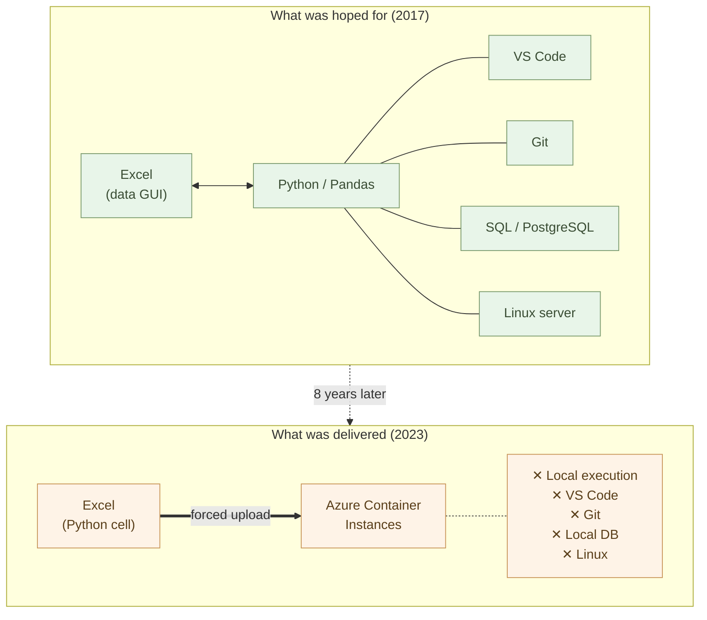

# Python in Excel? — Eight Years Later, Why You Should Leave Excel

In December 2017, I wrote an article on Qiita titled "[Python in Excel?](https://qiita.com/yniji/items/2e80ace081c4b59bc327)" Eight years have passed since that post. The time has come to settle accounts.

The expectations I had then were technically concrete. **With Pandas, you don't need Excel to run your code. It works on Linux servers**. You can edit in Visual Studio Code, manage versions with Git, debug and run terminal operations. Moving data from SQL Server to PostgreSQL becomes simple via Pandas. **You use Excel as a GUI for data, while bringing in a real development environment**. This was the technically sound architecture that working engineers were converging on.

Then in 2023, Microsoft brought Python to Excel. Soon after, they integrated Copilot.

**But the hope I described eight years ago is nowhere to be found**.

## Advantages, Stripped Away by Design

Python in Excel, as it exists today, has **closed off every advantage** I listed eight years ago.

It does not work offline. Python code is not executed on your local machine — it is **forcibly shipped to a container running on Azure Container Instances**. There is no free access to local files. No debugging in your familiar VS Code. No version control with Git. No connection to databases outside Excel through your local machine.

The advantage I wrote about — "it works on Linux servers" — is gone. The advantage of "edit in VS Code, save with Git" — gone. The advantage that "Pandas works not just with Excel, but with every database" — closed off.

This is not a technical limitation. **PyXLL and xlwings Lite, third-party tools, already implement local execution, Git management, and arbitrary library usage in full**. Microsoft has the technology to run things locally. **They chose to run them only in the cloud**.

The reason is simple. Allow local execution, and Azure resources go unused. To keep consuming the prepaid monthly subscription, **they chose an architecture that forcibly delivers your computation to the cloud**.

## This Is Not a Lack of Capability

Throughout the 2010s, Microsoft Research was among the most advanced AI research organizations in the world. ResNet for image recognition. Human-parity speech recognition. Machine translation at human-level quality. They led in these fields. The technology to safely run Python locally, the technology to integrate AI — they had both, in house.

And yet, under Nadella's leadership, Microsoft has continued to choose **stripping long-term internal assets in exchange for short-term financial metrics**. The $13 billion invested in OpenAI. The contraction of Microsoft Research and the outflow of researchers. The 15,000 layoffs executed during record profits. The $60 billion annual share buybacks. On the surface, this looks like aggressive management. Structurally, it is the conversion of **long-term technical assets into short-term cloud revenue and stock price**.

The cloud imprisonment of Python in Excel is part of this same business judgment. The user's **system sovereignty** — a long-term asset — is being dismantled and converted into Azure's monthly subscription revenue. User convenience is sacrificed as a byproduct of this conversion.

## The Structural Fragility of AI at the Core

LLMs have the property of "stating falsehoods with confidence." This is a fundamental characteristic, one that improves but never disappears. **On Microsoft's own benchmark, SpreadsheetBench, Excel Agent Mode achieves only 57.2% accuracy**. A feature that gets things wrong about forty percent of the time, integrated into the core of business systems — this is a design error.

A classical, robust principle of system design is "security by independence of implementation." Code generated by AI should be run in an isolated local environment, where humans verify behavior and tests are passed before deployment to production. This **verification layer** absorbs the AI's uncertainty.

In Microsoft's current design, this verification layer is structurally absent. Code generated by Copilot is generated inside a black box, executed inside a black box. Users cannot verify it.

And Microsoft's own security culture has been subject to grave concern. Regarding the 2023 Exchange Online intrusion, the U.S. Cyber Safety Review Board (CSRB) concluded that Microsoft's **"security culture was inadequate," that "the cascade of avoidable errors is inexcusable," and that there is "a corporate culture that deprioritized enterprise security investments and rigorous risk management."** The CrowdStrike outage has already halted 8.5 million Windows machines worldwide and caused $5.4 billion in losses. **A more serious incident is not a question of if, but when**.

## A New Way of Working

The hope of eight years ago was sealed inside the cloud cage by Microsoft. But **with the progress of AI, we no longer need to depend on Excel**.

Conversational AI like Claude now stands beside humans in every domain — design, code generation, data processing, document creation. An accountant builds an accounting system through dialogue with AI. A field worker builds a workflow tool with AI. This is not a story about the future — it is **a present reality for those who have started moving**.

The problem is not Microsoft alone. Google Workspace has the same structure. **Your data and logic are held hostage in a specific vendor's cloud** — that does not change. When the vendor's policies change, when the pricing changes, when geopolitical circumstances change, your work gets shaken with each shift.

The era in which our data and systems are held hostage to a giant vendor's business model — that era is over.

---

The specific practices for working this way are gathered in a series, "[**AI-Native Ways of Working**](https://aiseed.dev/en/ai-native-ways/)" (alpha). It is not just for engineers. The series aims to enable **anyone — in any occupation — to work AI-natively**.

If you have thoughts, reports from your own field, or suggestions for improvement, please reach out at the Facebook group "[**AI-Native Ways of Working**](https://www.facebook.com/groups/timej)."

The source for the articles is open on GitHub. For technical contributions, I welcome Issues, Pull Requests, and Discussions.

- **GitHub repository**: <https://github.com/aiseed-dev/website>

From Tokushima, Japan, I want to build — together with others — a movement to bring AI-native ways of working to every occupation.
