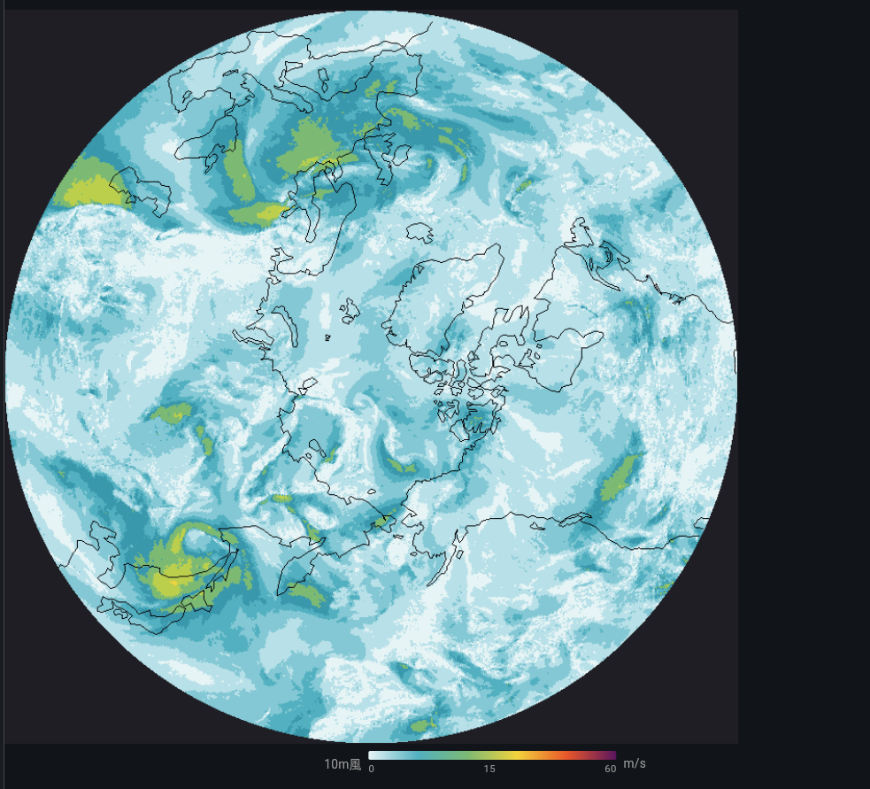

# Building Line-of-Business Software with Flet — A Modern Visual Basic

> A case study with the weather visualization app `aiseed-weather`

"Python only," "declarative," and "cross-platform GUI" —
**Flet** delivers all three for real, and as a UI stack for
line-of-business software it reclaims the productivity Visual Basic 6
once had, on a modern foundation.

Rather than speaking in the abstract, this article uses an actual
mid-size app — `aiseed-weather` (a weather studio integrating JMA,
ECMWF, and Open-Meteo; Flet 0.85 + Python 3.13; 6,800 lines of
components, 3,200 lines of figure rendering) — to show what Flet
actually solves for business GUIs.

※ Code excerpts may have evolved further in subsequent development.

---

## App layout

```
src/aiseed_weather/
├── components/        # Flet components (UI)
│   ├── app.py             ← root + navigation
│   ├── point_forecast_view.py  ← point forecast tab (2,000 lines)
│   ├── map_view.py             ← weather map tab (3,300 lines)
│   ├── radar_view.py           ← radar tab
│   └── amedas_view.py          ← AMeDAS observation tab
├── figures/           # chart rendering with matplotlib + flet.canvas
├── services/          # access layers for ECMWF / ERA5 / JMA / Open-Meteo
└── models/            # dataclasses / settings
```

UI, data fetching, and data processing are **all written in Python**.
There is no Web/REST API layer in between — polars DataFrames are
handed directly to Flet components.



---

## 1. Declarative components — React Hooks–style, Python-native

In Flet 0.70+'s declarative mode, a function decorated with
`@ft.component` becomes a component, and you use hooks like
`ft.use_state` / `ft.use_effect` / `ft.use_ref` just as you would in
React.

The point forecast view of `aiseed-weather` (excerpted from real code):

```python
@ft.component
def PointForecastView(settings: UserSettings):
    data_dir = resolved_data_dir(settings)
    locations, set_locations = ft.use_state(load_locations(data_dir))
    selected_name, set_selected_name = ft.use_state(settings.default_location)

    forecast_state, set_forecast_state = ft.use_state("idle")
    forecast_data, set_forecast_data = ft.use_state(None)
    error_msg, set_error_msg = ft.use_state("")

    variable, set_variable = ft.use_state("temperature_2m")
    visible_days, set_visible_days = ft.use_state(7)
    pan_offset_h, set_pan_offset_h = ft.use_state(0)
    # … (in the real code there are 30+ use_state slots)
```

Location list, currently selected location, load state, forecast data,
error message, displayed variable, time range, pan offset… **every
piece of state in this business UI is handled with local `use_state`
alone**. No Redux, no Context Provider, no Zustand.

```python
    async def fetch_forecast(_):
        set_forecast_state("loading")
        try:
            df = await fetch_open_meteo(lat, lon, ...)
            set_forecast_data(df)
            set_forecast_state("ready")
        except Exception as e:
            set_error_msg(str(e))
            set_forecast_state("error")

    return ft.Column([
        ft.Dropdown(
            value=selected_name,
            options=[ft.DropdownOption(loc.name) for loc in locations],
            on_change=lambda e: set_selected_name(e.value),
        ),
        ft.FilledButton("Update", on_click=fetch_forecast),
        _StatusBanner(forecast_state, error_msg),
        _HourlyStrip(forecast_data) if forecast_data else None,
        _Chart(forecast_data, variable, visible_days, pan_offset_h),
    ])
```

That's **the entire component**. Think of it as VB's `Button1_Click`
substituted directly into `on_click=`. The modern improvement is that
`async def` handlers are accepted as-is.

---

## 2. Reactive shared state — `@ft.observable`

For state that needs to outlive a single tab — like a long-running
download — use a dataclass annotated with `@ft.observable`. This is
how `aiseed-weather`'s map tab propagates progress across the entire
screen while ECMWF GRIB2 files (tens of MB each) are downloaded in
parallel from S3:

```python
@ft.observable
@dataclass
class FetchSession:
    """Lifecycle state for an ECMWF Open Data download.
    Survives tab switches; subscribed to by every component."""
    running: bool = False
    items: list = field(default_factory=list)
    progress: dict = field(default_factory=lambda: {"done": 0, "total": 0})
    status_text: str = ""
```

Just writing `session.running = True` triggers automatic re-render in
every component that reads it via `use_state`. **Conceptually similar
to Recoil / Jotai in React, but it's a Flet built-in — no extra library
needed**.

The common business-app scenario where "a long job is running in the
background, and the status bar, progress bar, and button
enable/disable state all need to stay in sync" is solved with zero
wiring code.

---

## 3. Drawing vector charts in pure Python — `flet.canvas`

Custom charts are a constant in business apps. `aiseed-weather`
originally pasted matplotlib output into an `ft.Image`, but to add
hover and click interaction later we rewrote it using `flet.canvas`.
That gave us **650 lines that overlay 5 variables × HRES + MSM +
climatology + ensemble band**:

```python
import flet.canvas as cv

shapes: list[cv.Shape] = []

# Climatology band (p25 – p75)
shapes.append(cv.Path(
    elements=band_path_elements,
    paint=ft.Paint(color="#d8e4f5", style=ft.PaintingStyle.FILL),
))

# HRES line
shapes.append(cv.Path(
    elements=hres_line_elements,
    paint=ft.Paint(color="#234b86", stroke_width=2.0,
                   style=ft.PaintingStyle.STROKE),
))

# Axis labels
for tick in time_ticks:
    shapes.append(cv.Line(x, pad_t, x, pad_t + plot_h,
                          paint=ft.Paint(color="#cccccc")))
    shapes.append(cv.Text(x, pad_t + plot_h + 14, label,
                          style=ft.TextStyle(size=10)))

return cv.Canvas(shapes=shapes, width=W, height=H)
```

**What would require d3.js / Recharts / Plotly plus a data-shaping
layer on a web frontend is done entirely in Python**. The polars
DataFrame that holds the source data feeds Canvas `Path` elements
directly. "The language for processing the data and the language for
drawing it are the same" — a property that pays off slowly but
consistently in business development.

---

## 4. A separate path for exports — matplotlib in the same codebase

The on-screen view is `flet.canvas`, but when the user clicks the "PNG
download" button, the output is generated with matplotlib:

```python
fig, ax = plt.subplots(figsize=(10, 6))
ax.plot(times, temperatures, label="HRES")
ax.fill_between(times, p25, p75, alpha=0.3, label="Climatology range")
fig.savefig(path, dpi=150, metadata={"Source": "ECMWF Open Data / ..."})
```

**Different engines for interactive and export use** — but both are
Python, so adding a variable or unifying colors is a one-place change.
The familiar web-app fracture of "React for the screen, separate
backend with Pillow for output" doesn't happen here.

---

## 5. Native async I/O — `asyncio` just works

Downloading GRIB2 files from ECMWF's S3 is network-bound and benefits
from parallelism. We call `asyncio.TaskGroup` + `httpx.AsyncClient`
directly from a Flet event handler:

```python
async def on_fetch(_):
    session.running = True  # every component updates automatically
    try:
        async with asyncio.TaskGroup() as tg:
            for param in params:
                tg.create_task(download_one(param, session))
    except* asyncio.CancelledError:
        session.status_text = "Cancelled"
    finally:
        session.running = False
```

No `DoEvents` hell from the VB 6 era. No IPC wiring hell from
Electron. **Native Python async meshes naturally with the UI update
cycle**.

---

## 6. Native dependencies are fine — miniforge / conda-forge

Business apps frequently need to call C libraries from Python.
`aiseed-weather` uses:

- **cartopy** — geographic projections (C++ + PROJ + GEOS)
- **cfgrib** — GRIB2 reading (eccodes / C library)
- **xarray + dask** — multi-dimensional array processing

These are painful to set up with pip, but with miniforge a single
`environment.yml` covers everything:

```yaml
dependencies:
  - python=3.13
  - flet>=0.85
  - polars
  - xarray
  - cfgrib
  - cartopy
  - matplotlib
```

```bash
mamba env create --prefix ./.venv -f environment.yml
mamba activate ./.venv
flet run src/aiseed_weather/main.py
```

**Flet does not collide with the scientific Python stack**. This is
exactly the territory where Electron-based tooling becomes hellish
(per-OS native builds), and where the Python + conda combination's
strengths come through directly.

---

## 7. Distribution is one command

```bash
flet pack src/aiseed_weather/main.py  # single binary
flet build apk                         # Android
flet build web                         # PWA
```

The same codebase produces desktop, web, and mobile builds. **In
business SI work, "same tool on the corporate web and on field
tablets" is a constant requirement** — this is effectively a killer
feature.

---

## 8. It also shines for embedded and dedicated business terminals

Flet's strength as a business GUI isn't limited to desktop and web.
**Because the Flutter-based renderer uses the GPU directly**, it runs
smoothly even on ARM-board-class hardware. That's a critical property
for the world of dedicated business terminals.

### Likely use cases

- **Factory HMIs** (touch panels next to production lines)
- **Warehouse handheld terminals** (Android tablets + barcode pistols)
- **POS / reception terminals / kiosks**
- **Operator panels for inspection equipment** (scales, cameras, PLCs)
- **In-vehicle / marine secondary displays**
- **Lab instrument GUIs** (via serial / GPIB / Modbus)

### Why Flet fits

| Requirement | How Flet handles it |
|---|---|
| Runs on Raspberry Pi 4/5 etc. | If Flutter Linux desktop runs, you're set. Many examples in the wild. |
| Touch-first UI | Flutter / Material is designed touch-first |
| Kiosk mode (full-screen, no window chrome) | `page.window.full_screen = True` — one line |
| Talking to hardware (GPIO / serial / CAN / Modbus / OPC-UA) | Standard Python libraries work as-is (`pyserial`, `pymodbus`, `python-can`, `asyncua`, …) |
| Image processing / inference on the same machine | OpenCV, PyTorch, ONNX Runtime, TFLite — all from Python |
| Per-site customization | Swap a line of code and redeploy; no build chain |
| Want to view monitoring on the web too | Same code with `flet run --web` — terminal-side and remote monitoring dashboard from one source |

### What `aiseed-weather` implies by analogy

This app is written as "an analysis tool that runs on a PC," but
**the same code, dropped onto a Raspberry Pi 5 + 7" touch display in
kiosk mode, instantly becomes a weather-display terminal**.

```python
def main(page: ft.Page):
    page.window.full_screen = True
    page.window.frameless = True
    page.theme_mode = ft.ThemeMode.DARK  # better night legibility
    page.padding = 0
    page.add(App())

ft.run(main)
```

Add three lines and the "dedicated business terminal" shell is in
place. matplotlib charts render smoothly at 60 fps even on a Pi 5.
That's a subtle but powerful Flet advantage.

**What stands out most is that "the firmware for the terminal and the
web dashboard for remotely monitoring it become a single source"**.
For business IoT shops that have always built monitoring web apps with
a separate team, this is a structural change to how development teams
are organized.

### Weak spots

- Memory footprint includes the Flutter runtime (around 200 MB
  resident on embedded Linux). MCU class is out of reach — that's
  LVGL's domain.
- Very small displays like 320×240 are out of scope.
- Hard real-time control loops should be split into a separate
  process — the standard pattern is "Flet for UI, separate Python
  process or C for control, talk via IPC."

For the zone of "Raspberry Pi class or above + touch panel + business
logic," Flet may well end up dominant.

---

## Reports and printing are actually a strength too — the Excel template approach

"Generating reports" — unavoidable in business apps — is not a Flet
weakness; it's traditional Python turf. **Excel-based reports**, de
facto in many business environments (especially in Japan), can be
generated by filling values into a template:

```python
from openpyxl import load_workbook

wb = load_workbook("template/monthly_report.xlsx")
ws = wb["Summary"]
ws["B3"] = report_date
ws["D5"] = total_count
for i, row in enumerate(df.iter_rows(named=True), start=10):
    ws.cell(i, 1, row["station"])
    ws.cell(i, 2, row["t_max"])
    ws.cell(i, 3, row["t_min"])
wb.save(output_path)
```

Formatting, borders, print ranges, headers/footers, and company-seal
images are all baked into the template; Python just fills in values.
**Accounting and admin staff on site can edit the template directly in
Excel**, so it slots into operations easily.

Output pipelines you can choose from:

| Output | Library | Use case |
|---|---|---|
| Excel (.xlsx) template fill-in | `openpyxl` | monthly reports, line items, quotes |
| Excel + charts / conditional formatting | `xlsxwriter` | tabulations with charts |
| Word (.docx) templates | `python-docx`, `docxtpl` | contracts, reports |
| PDF (low level) | `reportlab` | fixed-layout legal documents |
| HTML → PDF | `weasyprint` | reports laid out in CSS |
| Direct-to-printer | `win32print` (Win), `cups` (Linux) | labels, receipts |

The Flet component side is a single button:

```python
ft.FilledButton(
    "Export Report",
    icon=ft.Icons.PRINT,
    on_click=lambda _: export_excel(data, settings.template_path),
)
```

Same pattern as `aiseed-weather`'s "PNG download" — different engines
for screen display and output files, both in Python, both inside one
codebase.

---

## Synergy with AI-assisted coding

The traits described above **come into their own when combined with
AI-assisted coding**. The 6,800 lines of UI code in `aiseed-weather`
were written almost entirely through conversation with Claude Code.
The human side did the parts that matter: deciding what to build, what
the data means, and reviewing what came back.

The reasons Flet is structurally AI-friendly:

1. **Python — the language LLMs are best at**
2. **A small, consistently-named API surface** (`ft.Column` /
   `ft.Row` / `ft.Container` / `ft.Text` …)
3. **Declarative, so state → UI is a one-way dataflow** — the
   procedural "when do I update what" judgments that confuse LLMs
   never come up
4. **No HTML/CSS/JS in sight** — no cross-domain consistency to
   police (CSS selector collisions, Tailwind class names, React key
   declarations, etc.)

The result: **"write a dataclass and a component that displays it"
gets you Flet code that runs with almost no edits**. The multiple
round-trips of "rewrite the TypeScript type," "Tailwind isn't
applying," "you need a useMemo" that come with web frontend work
collapse into a single turn with Flet.

On top of that, project-specific coding conventions can ride along in
the repository so the AI always sees them (Claude Code's Skills
mechanism, for example). Once you write down "we use Flet 0.85+
declarative mode only; `page.update()` is forbidden," the AI will not
pick up older patterns from web search results. **Flet's declarative
mode being easy to write conventions for, and LLM code generation
being good, combine multiplicatively here**.

(The broader topic of "running conventions through the AI" as a
business SI organizational practice is a separate article — to come.
Pushing Python hot spots into Rust via PyO3 is also coming as a
separate piece.)

---

## Compared to Visual Basic — what carried over, what got modernized

| | VB 6 | Flet + Python |
|---|---|---|
| Learning curve | Low | Equally low (if you read Python, a day is enough) |
| GUI placement | Form designer | Code (Git, reviews, great fit with AI generation) |
| Event-driven model | `Button1_Click` | `on_click=fn` (async OK) |
| State management | Global variables + form scope | `use_state` + `@ft.observable` |
| Numerical computing | Roll your own / Excel interop | numpy / polars / xarray, standard |
| Visualization | MSChart, ActiveX | matplotlib / `flet.canvas` / Plotly |
| Networking | WinINet, Winsock | `httpx`, `asyncio`, gRPC, etc. |
| Distribution | EXE | EXE / Web / iOS / Android / embedded terminals |
| Runtime targets | Windows only | Win / Mac / Linux / Web / Mobile / Raspberry Pi |
| Ecosystem | Business ActiveX | The entire Python package ecosystem |

VB 6's productivity rested on "**language simplicity × form-designer
immediacy × distribution simplicity**." **Flet performs this same
three-part act in a modern setting, with Python as a powerful supporting
cast**.

---

## Where it shines

Situations where, after writing `aiseed-weather`, Flet's strengths
struck me most:

1. **Internal tools that handle data** — the analytics/aggregation
   core is in pandas / polars and you need to ship a GUI to business
   users
2. **Putting ML inference into production** — data scientists
   themselves can write the screen that calls a PyTorch / scikit-learn
   model
3. **Scientific computing + visualization** — embed matplotlib /
   Plotly expressivity directly into the UI
4. **Migrating off VB / VBA / Access** — cross-platform without
   sacrificing productivity
5. **You bounced off Electron / Tauri** — leave the JS stack overhead
   behind
6. **You want something more serious than Streamlit** — degrees of
   freedom in state, choice of UI components, and distribution
   options are categorically different
7. **Dedicated business terminals / embedded HMIs** — site-installed
   dedicated UIs on Raspberry Pi / Linux boards + touch panels,
   written in Python

---

## Maturity status — declarative mode is officially production-ready

As of writing, the official Flet Team has stated explicitly that
**declarative mode is ready for real apps**:

- **Flet 0.85** added **routing (`ft.Router`)** and **declarative
  dialogs (`ft.use_dialog()`)** — the last pieces missing for
  `@ft.component` to be production-grade
- The **Flet 0.83** release notes already stated "the API is 99%
  stable; little will change before 1.0"
- **Flet 1.0 Alpha → Beta** is already public; 1.0 stable is within
  sight

The "it's new, let's wait and see" phase is over. If you're starting
a new business app now, declarative mode is the choice.

A caveat: most older articles on the web use the imperative API
(`page.add()` / direct mutation). But if you're working alongside AI,
just writing "declarative mode only" into a conventions file is
enough — the AI will generate against the current API and the legacy
patterns won't leak in.

---

## Honest weaknesses

- `DataTable` isn't built for scrolling 10,000 rows. Virtualization
  is on you.
- Polished mobile UX (gestures, etc.) requires some Flutter knowledge.
- Distribution binaries bundle the Flutter runtime — minimum around
  30 MB.
- Most introductory articles on the web use the older imperative API.

**Even so, the leverage that "writing your business GUI in Python"
provides outweighs these in a broad range of situations**.

---

## Summary — "Visual Basic on top of Python" is here now

`aiseed-weather` was a personal test of whether Flet can carry a
mid-size, genuinely production-grade business app. **The answer is a
clear YES**.

- 6,800 lines of UI components
- 3,200 lines of chart rendering (`flet.canvas` + matplotlib)
- 5 data sources (ECMWF / ERA5 / JMA / Open-Meteo / dynamical.org)
- Async downloads, cancellation, retries
- Publication-quality PNG/PDF export

All of this, developed in the ordinary way — in **a single language,
Python**, with **no web frontend/backend split**, and **without React,
TypeScript, bundlers, or CSS frameworks**. It also runs on a Raspberry
Pi. It also ships to the web.

If VB 6 invented the "minimum-viable productivity stack for business
GUIs," **Flet has reinvented it in the Python context and removed the
ceiling on where it can be distributed**. Every developer who misses
VB's productivity, every data scientist who has hit Streamlit's
limits, every Python user who bounced off Electron, every SI engineer
who has built field terminals the hard way in Qt — give `flet run` a
try.

Official site: <https://flet.dev/> / Source:
[`aiseed-weather`](https://github.com/aiseed-dev/weather)