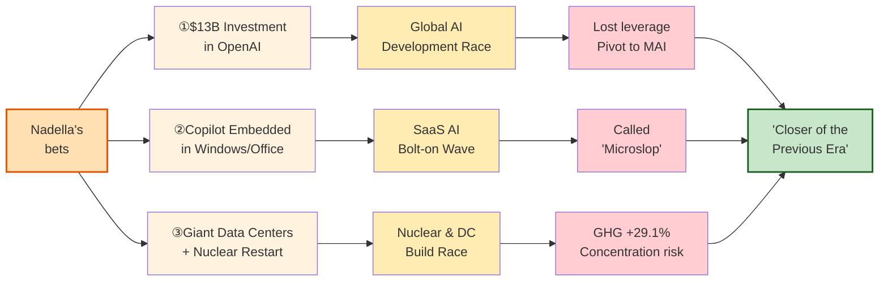

# Microsoft's Nadella and Hegel's Philosophy—Absolute Victor of the AI Era, or Stepping Stone of a Historical Transition?

Microsoft CEO Satya Nadella has been pouring trillions of yen into AI. A massive investment in OpenAI, a restarted nuclear plant, giant data centers being built around the world. By any conventional measure, this looks like a decisive bid to win the AI era.

But watching all this, I have a different impression.

"This man is, I suspect, misreading the times."

### A Word About Hegel

About two hundred years ago in Germany, there was a philosopher named Hegel. He said something interesting.

The people who move history—kings, revolutionaries, CEOs of giant corporations—act out of their own ambitions and passions. "I'll take the throne." "I'll make my company the biggest." They throw themselves into their work with that drive.

But what they don't realize, in Hegel's view, is that **history is using them as tools**. They think they're going for the win, but in reality they're being assigned the role of "stepping stone" for the transition to a new era.

Hegel called this the "**cunning of reason**" (*List der Vernunft*). History cunningly uses the passions of clever people to prepare the next age.

### Nadella's Three Bets, and the Whole Picture

Nadella is making three large bets simultaneously. Each one is unfolding in a way that pulls the entire world along with it.

Let's walk through the three bets one by one.

### The Nadella Case

Here are three specific things Nadella is doing. All three share a defining feature: **they don't stop at being Microsoft's story—they pull the entire world along**.

**First. The $13 billion investment in OpenAI dragged the entire world into an AI development race.**

In 2023, Nadella invested $13 billion (about ¥2 trillion) in OpenAI—an extraordinary sum. With it, ChatGPT spread across the world, and the AI boom caught fire.

What happened next? Google, Amazon, Meta, Elon Musk, Chinese tech firms—**everyone started making massive AI investments**, terrified of being left behind. Capital and resources from around the world surged into AI all at once.

But the very OpenAI that Nadella set ablaze grew into something Microsoft can no longer control. In 2025, OpenAI restructured into a Public Benefit Corporation, and its valuation reached **$500 billion**. It is no longer Microsoft's junior partner. It has become an **equal—or even superior—negotiating counterpart**.

As a result, in the April 2026 contract revision:

- Revenue sharing from Microsoft to OpenAI was **eliminated**
- Microsoft's right to be the exclusive cloud provider for OpenAI **expired**
- OpenAI became free to use other cloud providers, including Amazon

In other words, **Nadella has already lost his leverage over OpenAI**.

So now Nadella is developing AI **in-house** as well. He has unveiled an in-house model called "MAI" and is pivoting away from his all-in-on-OpenAI posture.

So:

- **He pulled the world into an AI race,**
- **lost his grip on his original bet (OpenAI),**
- **and is now scrambling to start over with in-house development.**

This is **about as bad as strategy gets**. The man who lit the fire is still wandering around the burning building.

**Second. Embedding autonomous agents into Windows and Office.**

Since 2024, Nadella has been repeating one direction: "**turn Copilot into an autonomous agent**."

An "autonomous agent" is a system in which the AI **judges and acts on its own**, without needing the human to issue every command. For example, if you ask it to "schedule a meeting," it reads emails, checks availability with the other party, puts it on the calendar, and sends out confirmations—that kind of AI.

He is embedding this Copilot into Windows, Word, Excel, Outlook, Teams, and even Notepad and Paint—into a large portion of Microsoft's existing product lineup. The goal: **a world where Microsoft's products do work on the user's behalf, on their own**.

And, like the first bet, this didn't stop at one company.

After Microsoft embedded Copilot across its products, Google (Workspace), Adobe, Salesforce, Notion—**software companies of every stripe began bolting AI agents onto their own services**. AI is being loaded onto software around the world, one after another.

And the result is already in.

Among users, Microsoft's products are now being called "**Microslop**." "Slop" in English means dirty water or scraps of leftover food. The nickname expresses users' biting contempt: "Microsoft's products have been turned into slop by AI bolted on top of them, and now everything is a mess."

- Boot up Windows and Copilot keeps pushing itself in your face, uninvited
- Try to reply in Outlook and the AI starts suggesting things on its own
- Write in Word and the AI tries to rewrite what you've written
- Turn the settings off, and the feature comes back with every update

Users feel the products have become **not more convenient, but more intrusive**. **Because the goal is "an agent that judges and acts on its own," from the user's side it shows up as "moves on its own" and "can't be controlled."** This is the heart of Microslop.

The user backlash hasn't stopped at complaints. Users have been **coordinating searches to make "Microslop" appear in search engine autocomplete**, and after Microslop-themed memes flooded Microsoft's own Discord community, **Microsoft locked the community down**.

And Microsoft itself has **already begun to retreat**. It has quietly slowed the Copilot rollout and is pulling AI features back from apps like Notepad. The grand plan to embed AI into every product is **starting to collapse from the inside**.

**Third. The giant data center build-out is starting to seize the world's power and water.**

To centralize all AI on Azure (its own cloud), Nadella is **building giant data centers around the world**.

This too connects directly to the autonomous agent vision. **Agents keep running in the background, even when the user is doing nothing**. Running an agent for every user, 24 hours a day, requires a different order of computing resources—electricity, water, and semiconductors at a scale that dwarfs anything before.

And Nadella has now turned on nuclear power.

**Three Mile Island**, the site of the worst meltdown in American history in 1979. Unit 1 of that plant, which had been shut down for economic reasons in 2019, is being **restarted with a $1.6 billion investment** under a 20-year electricity purchase agreement with Microsoft. On top of that, Nadella joined with then-President Trump to announce the "**Stargate**" data center build-out at a scale of **$500 billion**.

And again, it didn't stop at one company.

Watching this, Google, Amazon, and Meta have **entered their own race to build nuclear-backed giant data centers**. National governments, in the name of "AI sovereignty," have started trying to attract data centers to their own territories. **A worldwide scramble for power, water, and land has begun**.

The result: society at large is starting to absorb the burden and the risk.

Microsoft had loudly declared itself "**carbon negative**" (a net reducer of greenhouse gases). But because of the AI infrastructure build-out, the company itself now admits that **its greenhouse gas emissions in 2024 were 29.1% higher than the 2020 baseline**. For Google, the figure is 48%.

Resources that should be going to food production, healthcare, housing, or climate response are instead being pulled into giant data centers.

And what's more serious is **the fragility of concentration**.

When a giant data center stops, **every operation that depends on it stops with it**. An accident, a disaster, a cyberattack, a war—any one of these can **paralyze, in one stroke, the companies, government services, hospitals, and banks that use that data center**.

In recent years alone, AWS and Azure outages have repeatedly taken down dependent services for hours at a time. A single misconfiguration at AWS once took out banks, government agencies, railways—**half the internet**. Once AI agents are embedded into every corner of business, the impact of a data center going down will be **orders of magnitude greater**.

"Concentrated for the sake of efficiency"—and the very fact of concentration becomes the **greatest single point of failure**. This is the real risk Nadella's strategy is producing.

### The Problem Is "Making It Giant"

To be clear: **this is not an argument against autonomous agents**. Agents running on a personal computer, on a company's own server, or embedded in equipment at a worksite—those **distributed forms** wouldn't consume much electricity or water, and if one stops, the whole system keeps running. Data doesn't have to leave the user's hands, so privacy is preserved.

The problem is that Nadella chose the direction of **"gathering the world's agents into giant data centers and running them there."** It is **"making it giant" and "concentrating it in one place" that are producing serious problems**.

### What Hegel Would Say

Hegel, I think, would put it like this:

"Nadella is acting in the belief that he is becoming **the victor of the AI era**. But history is using him to **push the logic of the previous era to its absolute limit—so that everyone can see that this logic was wrong**."

He thinks he is going for the win. In fact, he is playing the role of **"the one who closes out the previous era."** That is what Hegel meant by the cunning of reason.

Tellingly, **Bill Gates**, Microsoft's co-founder, in 2024 sold off **his foundation's entire holding of approximately $3.2 billion in Microsoft stock**—at exactly the moment when AI infrastructure investments were driving the share price upward.

The founder himself is quietly stepping away from the empire Nadella is building. That, too, may be a sign of the turning point.