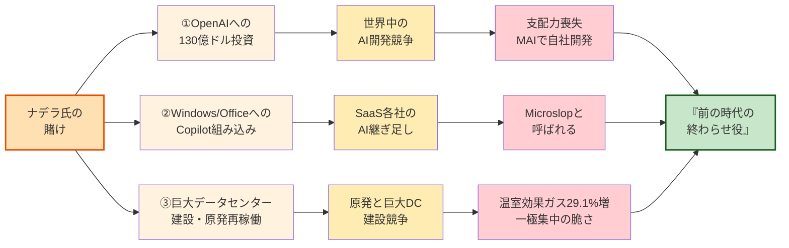

# MicrosoftのナデラCEOとヘーゲルの哲学——AI時代の絶対的覇者か、歴史的転換の踏み台か

マイクロソフトのナデラCEOが、AIに何兆円も投資しています。OpenAIに巨額の出資、原発を買い、巨大なデータセンターを世界中に建てている。誰が見ても「AI時代の勝者」を取りに行く動きです。

でも、私はこれを見ていて、ちょっと違う感想を持っています。

「この人、たぶん、時代を読み間違えている」

### ヘーゲルという哲学者の話

200年くらい前のドイツに、ヘーゲルという哲学者がいました。この人が面白いことを言っています。

歴史を動かしている人たち——王様とか、革命家とか、大企業の社長とか——は、自分の野心や情熱で動いている。「俺が天下を取る」「会社を大きくする」と思って必死にやっている。

でも、本人たちは気づいていないけれど、**実は歴史のほうが彼らを「道具」として使っている**、というのがヘーゲルの見立てです。本人は勝ちに行っているつもりで、実は時代の転換のために「踏み台」の役を演じさせられている。

ヘーゲルはこれを「**理性の狡知（こうち）**」と呼びました。歴史が、賢い人たちの情熱をうまく利用して、ずる賢く（狡猾に）次の時代を準備する、という意味です。

### ナデラ氏の三つの賭けと、その全体像

ナデラ氏は三つの大きな賭けを同時に進めています。それぞれが世界全体を巻き込む形で展開しています。

以下、三つの賭けをひとつずつ見ていきます。

### ナデラ氏の場合

ナデラ氏が今やっていることを、具体的に三つ挙げます。三つとも、**マイクロソフト一社の話では終わらず、世界全体を巻き込んでいる**のが特徴です。

**ひとつ目。OpenAIへの巨額投資で、世界中をAI開発競争に巻き込んでしまった。**

2023年、ナデラ氏はOpenAIに130億ドル(約2兆円)という、桁外れの金額を投資しました。これによって、ChatGPTが世界中に広まり、AIブームに火がついた。

すると、何が起きたか。グーグル、アマゾン、メタ、そしてイーロン・マスクや中国企業まで、**全員が「うちも乗り遅れるな」と巨額のAI投資を始めた**。世界中の資本と資源が、一斉にAIに流れ込んだ。

ところが、火をつけたOpenAI自身が、もはやマイクロソフトの手に負えない巨大な存在になってしまいました。OpenAIは2025年に公益法人へ移行し、企業評価額は**5000億ドル**に達している。マイクロソフトの単なる協力会社ではなく、**対等以上の交渉相手**になっているのです。

その結果、2026年4月の契約改定で、

- マイクロソフトからOpenAIへの収益分配は**廃止**
- マイクロソフトがOpenAIに独占的にクラウドを提供する権利は**消失**
- OpenAIはアマゾンなど他社クラウドも使えるようになった

つまり、**ナデラ氏はOpenAIに対する支配力をすでに失っている**。

それで今、ナデラ氏は**自社でもAIを開発し始めている**。「MAI」という自社モデルを発表し、OpenAI一本だった体制から方針転換しているのです。

つまり、

- **世界をAI競争に巻き込んでおきながら、**
- **最初の賭け（OpenAI）に対する支配力を失い、**
- **慌てて自社開発でやり直そうとしている**

これは、戦略としては**最悪の展開**です。火をつけた本人が、火事になった現場でまだうろうろしている、という状態。

**ふたつ目。WindowsやOfficeに、自律型エージェントを組み込もうとしている。**

2024年以降、ナデラ氏が繰り返し語っているのが「**Copilotを自律型エージェントにする**」という方針です。

「自律型エージェント」というのは、人間が一つひとつ指示しなくても、AIが**自分で判断して動くシステム**のことです。たとえば、「会議の日程を調整しておいて」と頼んだら、メールを読んで、相手の都合を聞いて、カレンダーに入れて、確認まで送ってくれる——そういうAIを指します。

これをCopilotとして、Windowsに、Wordに、Excelに、Outlookに、Teamsに、さらにはメモ帳やペイントにまで——既存の製品の多くに組み込んでいます。**「マイクロソフトの製品が、ユーザーの代わりに勝手に仕事をしてくれる」世界**を作ろうとしているわけです。

しかも、これも一社の話では終わりませんでした。

マイクロソフトがCopilotを各製品に組み込んだのを見て、グーグル（Workspace）、アドビ、セールスフォース、Notion——**ありとあらゆるソフト会社が、自社サービスにAIエージェントを組み込み始めた**。世界中のソフトに、次々とAIが乗せられている。

そして、その結果がもう出ています。

ユーザーの間で、マイクロソフトの製品は今、「**Microslop（マイクロスロップ）**」と呼ばれ始めています。「slop」というのは英語で「**汚い水**」とか「**残飯**」という意味です。「マイクロソフトの製品は、AIを継ぎ足したせいで、残飯みたいにグチャグチャになった」という、利用者からの痛烈な皮肉です。

- Windowsを起動したら、頼んでもいないCopilotがしつこく出てくる
- Outlookで返信を書こうとすると、AIが勝手に提案を始める
- Wordで文章を書いていると、AIが勝手に書き換えようとする
- 設定をオフにしても、アップデートのたびに復活する

「**便利になった**」のではなく、「**邪魔になった**」とユーザーが感じている。**「自分で判断して動く」エージェントを目指しているからこそ、ユーザーから見ると「勝手に動く」「制御できない」と感じられる**。これがMicroslopの本質です。

ユーザーの反発は、ただの不満では終わっていません。**検索エンジンのオートコンプリートに「Microslop」を表示させる**ためにみんなで検索する運動が起きていたり、マイクロソフト公式のDiscordコミュニティで「Microslop」関連のミームが溢れた結果、**マイクロソフトがコミュニティをロックダウンする**事態にまで発展しています。

そして、マイクロソフト自身も**すでに後退し始めている**。Copilotの展開ペースをひそかに落とし、メモ帳などのアプリからAI機能を縮小・撤回し始めているのです。「全製品にAIを組み込む」という壮大な計画は、**もう内側から崩れ始めている**。

**三つ目。巨大データセンターの建設競争で、世界の電力と水を奪い始めている。**

ナデラ氏は、AIをすべてAzure（自社のクラウド）に集めるために、**世界中に巨大データセンターを建設**しています。

これも、自律型エージェントの構想と直結しています。**エージェントは、ユーザーが何もしていない間も裏で動き続ける**。全ユーザー分のエージェントを24時間動かすには、桁違いの計算資源——つまり、電力と水と半導体が必要になる。

そして、ナデラ氏は原発まで動かし始めました。

1979年にアメリカ史上最悪のメルトダウン事故を起こした**スリーマイル島原発**。経済的理由で2019年に閉鎖されていた1号機を、マイクロソフトが20年契約で電力を買い取ることで、**16億ドルを投じて再稼働させる**ことになったのです。さらにトランプ大統領（当時）と組んで、**5000億ドル規模の「Stargate」**という巨大データセンター建設計画まで打ち出した。

これも一社では終わりませんでした。

これを見たグーグルもアマゾンもメタも、**対抗して原発と巨大データセンターの建設競争に突入**。さらに各国政府まで「AI主権」を掲げて、自国にデータセンターを誘致しようと動き始めた。**世界中で、電力・水・土地の奪い合いが始まっている**んです。

その結果、社会全体に負担とリスクが回り始めています。

マイクロソフトはかつて「**カーボンネガティブ（温室効果ガスを減らす）**」を高らかに宣言していました。ところが、AIインフラの拡張によって、2024年には**温室効果ガス排出量が2020年比で29.1%も増えている**と自ら認めています。グーグルに至っては48%増です。

本来なら食料生産や、医療や、住居の改善や、気候変動対策に使われるべき資源が、巨大データセンターに吸い込まれている。

そして、それ以上に深刻なのが**「一極集中の脆さ」**です。

巨大データセンターは、**一箇所が止まれば、そこに依存している業務がすべて止まる**。事故、災害、サイバー攻撃、戦争——こうしたことが一つでも起きれば、**そのデータセンターを使っている企業や行政、医療、金融が、まとめて麻痺する**。

実際、近年だけでも、AWSやAzureの障害で、依存している多くのサービスが数時間止まるという事故が何度も起きています。AWSの一箇所のミスで、銀行も、政府機関も、鉄道も、**インターネットの半分**が止まったこともありました。今後、AIエージェントが業務の隅々まで入り込めば、データセンターが止まる影響は**桁違いに大きくなる**。

「効率化のために集中させた」結果、**集中させたことそのものが、最大の脆弱性になる**——これが、ナデラ氏の戦略が生んでいる本当のリスクです。

### 問題は「巨大にすること」

念のため言っておくと、**自律型エージェントに反対しているわけではありません**。手元のパソコンで動くエージェント、会社のサーバーで動くエージェント、現場の機械に組み込まれたエージェント——そういう**分散した形**なら、電力も水もそれほど消費しないし、一箇所が止まっても全体は動き続ける。データを外に出さなくていいから、プライバシーも守られる。

問題は、ナデラ氏が**「全世界のエージェントを、巨大データセンターに集めて動かす」**という方向に舵を切ったこと。**「巨大にすること」「一箇所に集めること」が深刻な問題を引き起こして**いることです。

### ヘーゲルが見たら、何と言うか

ヘーゲルなら、たぶんこう言うはずです。

「ナデラは、自分が**AI時代の覇者**になるつもりで動いている。しかし歴史は、彼を**前の時代の論理を最後まで突き詰めることで、それが間違いだったと万人に証明する役**に使っている」と。

本人は勝ちに行っているつもりが、実は「**前の時代の終わらせ役**」を演じている——これが、ヘーゲルの言う「理性の狡知」です。

象徴的なことに、マイクロソフトの共同創業者である**ビル・ゲイツ**は、2024年に自分の財団が持っていた**約32億ドル分のマイクロソフト株をすべて売却**しました。AIインフラへの巨額投資で株価が上がっているまさにその時に、です。

創業者自身が、ナデラ氏の作っている「帝国」から静かに距離を置いている。これも、時代の転換点を示すサインなのかもしれません。
