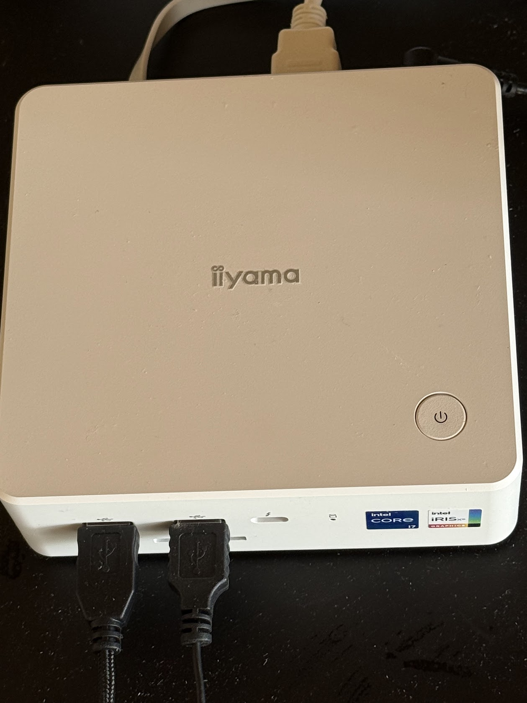
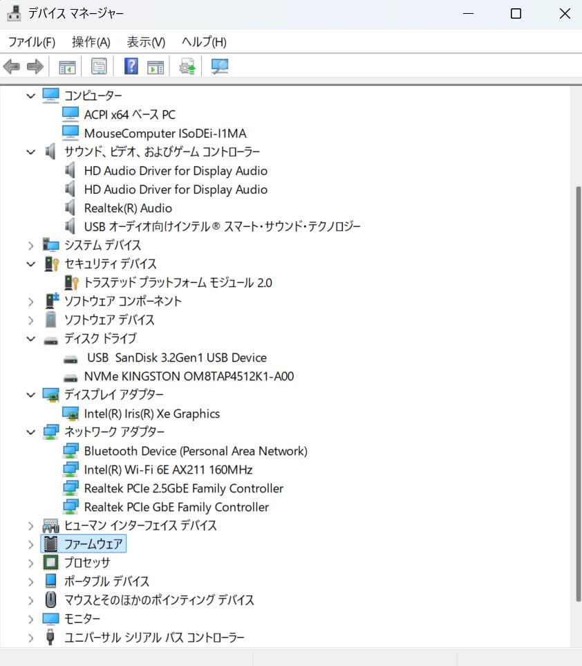
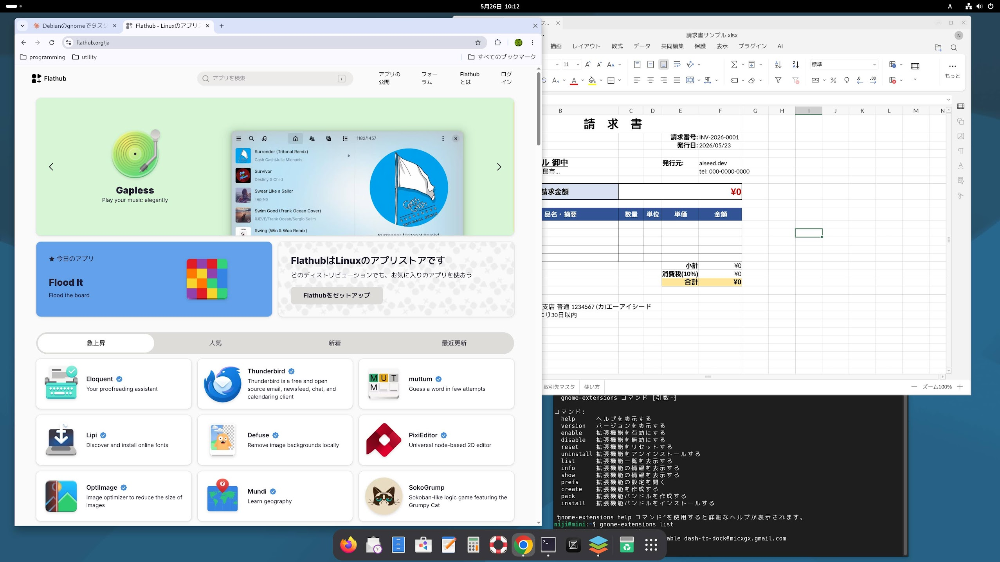

# PCが大幅値上げ ── 今あるPCにLinuxをインストールして活用

2025 年 10 月、Microsoft は Windows 10 のサポートを終了した。ESU で 1 年延ばしている人でも、個人の場合は残り 5 か月で切れる。法人は今年の10月に122ドル払い来年の10月に244ドル払って再来年の10月で完全に終わり。

Windows 11 に対応していないPCが、世界中で数億台ある。第 8 世代より前の CPU、TPM 2.0 非搭載、それがMicrosoft では「もう使えない」ことになっている。

**この「Windows 11 にアップグレードできない PC」を持っている人にとって、本記事の答えは明確だ ── Linux (Debian) への移行を、絶対にやるべきである。** ESU は有限かつ高額、新規 PC は後述の通り最悪のタイミング、そして Linux は無料でハードはそのまま使える。これで他に選ぶべき道は事実上ない。本記事の以下は、その「やるべき」をどう実行するかの話だ。

2026年は新しいPCを買う最悪のタイミングだ。**Microsoft**自身が引き起こしたAIバブルによるメモリの大量需要で、メモリーやディスクの価格は大幅に上昇している。さらに、2026年イラン戦争によるオイルショックでさらに価格が上昇する可能性が高い。具体的な数字を一つ挙げる ── **本記事で実機検証に使った mini PC は、筆者が購入してから 1 年経たないうちに、¥60,000 値上がりしている**。Microsoftが推奨する、Copilot + PC だと30万円を超える価格のものが普通だ。

### Microsoft は何をしているのか

整理すると、Microsoft の戦略は**中世のエンクロージャー（囲い込み）と同じ構造**になっている。

1. **下端を切る** ── Windows 11 の要件で TPM 2.0 / 第 8 世代以降 CPU を必須化し、動いている PC を数億台「書類上は使えない」状態にした。さらに Copilot+ で NPU 40 TOPS の新しい床を設けた
2. **中段を干上がらせる** ── 自社が煽った AI バブルでメモリと SSD の価格を吊り上げ、16GB / 500GB クラスの入門機が市場から消えつつある
3. **上端だけを押し出す** ── 30 万円超の Copilot+ PC を「次の標準」として宣伝し、そこに Copilot サブスクと Microsoft アカウントを縛り付ける

共有地（＝動く中古機・入門機）を潰して、領主の指定する高い区画しか残さない ── 中世の囲い込みと同じ構図だ。だが、エンクロージャーには出口がある。Microsoft が囲い込めるのは「Windows ユーザー」であって、「PC ユーザー」ではない。**ハードウェアそのものは、そのまま Linux に持っていける**。

Copilot+ PCには、NPU（AI処理を専門に行うプロセッサー）が搭載されているが、現状では**AI の処理がデータセンターに集中する構造は何も変わらない**。Copilot の主要機能 (Word の下書き・Excel の関数生成・PowerPoint の要約・Outlook の返信案・エージェント) は依然として Azure のクラウドで処理される。NPU が手元で動かすのは Recall や Studio Effects、ライブキャプション程度の周辺機能だけ。「エッジで AI が動く」というマーケティングとは裏腹に、AI バブルの本体である Azure データセンターへの依存は減らない。

しかも、高額な Copilot+ PC を購入しても、何年サクサクと動作するかもわからない。特に **Snapdragon (ARM) を載せた Copilot+ PC では、Linux のインストール自体が現状きわめて難しい** ── ブートローダ、ファームウェア、GPU ドライバの三方塞がりで、コミュニティの試行錯誤が続いている段階だ。

これらのことを考えると、現在は、新しい PC を買わないのが最善の選択肢だ。その場合、Linuxという選択肢がある。

## Debian という選択

Linuxには、多くのディストリビューションがあるが、世界中のボランティアによって30 年以上維持されている Debian は、最も有力な候補の一つである。商業ベンダーの都合に影響されにくいからである。

Windows 10 が動いていたハードウェアであれば、Debian 13 は普通に動くはずだ。

## 実機検証 — この記事の前提

私が実際に Debian 13 をインストールして検証した機種を公開する。Windowsアプリを開発するために昨年購入した機種である。でも、Windows アプリを開発するのはやめることにした。

| 部品 | 型番 | Debian 13 での扱い |
|---|---|---|
| マザーボード | MouseComputer ISoDEi-I1MA (mini PC) | UEFI / TPM 2.0 をそのまま使用 |
| GPU | Intel Iris Xe Graphics (内蔵) | Mesa 標準で即動作、追加ドライバ不要 |
| Wi-Fi | Intel Wi-Fi 6E AX211 160MHz | netinst 同梱の firmware-iwlwifi で **インストーラ画面から SSID 一覧が出る** |
| Bluetooth | Intel | iwlwifi と同パッケージで動く |
| 有線 LAN | Realtek 2.5GbE ＋ GbE (二口) | `r8169` で標準動作 |
| ストレージ | NVMe Kingston OM8TAP4512 (512GB) | `nvme` ドライバで標準動作 |
| サウンド | Realtek HD ＋ Intel SST | `snd-hda-intel` / `sof-firmware` で動く |

[Claude と一緒に学ぶ Debian](/claude-debian/) の第 8 章で列挙している 7 つのトラブルカテゴリ (ディスプレイ・Wi-Fi・Bluetooth・サウンド・サスペンド・日本語入力・周辺機器) のうち、**この機種で初回起動から動かなかったものは無かった**。Windows 11 の初回セットアップにある Microsoft アカウント強制・Copilot 設定・OneDrive 押し付け・同意ダイアログの山を全部スキップできる分、**むしろ Debian 13 のインストールの方が楽だった**。

## 「Linux は難しい」は、AI 時代に逆転した

Linux は難しい、という印象は根強い。コマンドを打つ黒い画面、聞いたことのない用語、Windows のような直感的な操作ができない ── これは、**人間が一人で覚える前提**の話だった。

しかし、2026 年の今、状況は二つの大きな変化で逆転している。

### ひとつ目 ── GUI での操作・設定の方が、AI には難しい

意外に思われるかもしれないが、Claude のような AI にとって、**GUI で何かを操作する・設定する手順を教えるほうが、コマンドで教えるよりずっと難しい**。

GUI を言葉で説明するのは構造的に困難だ。「設定の左メニューの上から 3 番目」はバージョンで変わる。「歯車のアイコンをクリック」は画面のどこにあるかで違う。スクリーンショットを撮っても、AI が指せるのは大まかな場所だけ。設定画面が階層化されていればされているほど、人間に手順を渡すコストが上がる。Windows の深い設定はとくに、AI が言葉で導くのが難しい場所だ。

コマンドは違う。テキストで完結する。企業で最も多く使われているAIはClaudeであるが、Claudeが書いたコマンドを、あなたがコピーして貼り付ければ、そのまま動く。エラーが出ても、その文字列をそのまま Claude に渡せば、原因を特定できる。

**Linux の「コマンドが多い」という弱点は、AI が横にいる時代には強みに変わった**。そして同時に、**Windows の「すべて GUI で完結する」という強みは、AI 時代には弱みに変わった**。

### ふたつ目 ── Linux のアプリストア Flathub

ふたつ目は、Linux のアプリストアである Flathub が整備されてきたことである。普段使っているアプリのインストールが、スマホと同じようにできるということだ。[flathub.org](https://flathub.org) を開けば、Linux で動くアプリが一つの場所に並んでいる。

| カテゴリ | アプリ |
|---|---|
| ブラウザ | Firefox、Google Chrome、Chromium、Brave |
| オフィス | ONLYOFFICE Desktop Editors、LibreOffice |
| コミュニケーション | Zoom、Slack、Discord、Element、Signal |
| メディア | Spotify、VLC、Audacity、OBS Studio |
| クリエイティブ | GIMP、Inkscape、Krita、Blender、darktable |
| 開発 | Zed、VSCodium、Visual Studio Code、PyCharm、IntelliJ IDEA、Android Studio |
| ユーティリティ | Bitwarden、Joplin、Obsidian、Thunderbird |

オフィスについては、[Claude と一緒に学ぶ Debian](/claude-debian/) では **ONLYOFFICE を中心に据え、LibreOffice は予備**として扱う方針を採っている。ONLYOFFICE は MS Office との見た目互換性が高く、`.docx` / `.xlsx` / `.pptx` をそのまま開いて返せる ── 一方、自分の作業は Markdown と Python に寄せる、というのが書籍の立場だ。

日常使うアプリに困ることは、殆どなくなったといっていいだろう。もしアプリで困ったことがあればAI(Claude)が作ってくれる時代になったので特に心配することはないだろう。

Flathubは、Microsoft Store のような場所だ。しかし、Microsoft Store より優れている面もある。Microsoft Store には Google Chrome が無い。Microsoft が自社の Edge を優遇しているため、競合ブラウザを排除している。また、アプリを探しているのに、関係ない有料アプリが「おすすめ」として割り込んでくることがある。

つまり、現代の Linux は **二層構造** になっている。

- **日常のアプリ**: Flathub から GUI で入れる。コマンドは要らない。
- **設定や開発**: コマンドで操作する。ここでこそ AI が真価を発揮する。

この二層が、AI 時代の Linux の強さだ。Windows はどちらも中途半端 ── GUI は深い設定までは届かず、PowerShell のコマンドは AI にとっても扱いにくい。

## Claude と一緒に学ぶ

このサイトには、Claude を横に置きながら学ぶための二つの教科書がある。

[**Claude と一緒に学ぶ Debian**](/claude-debian/) は、Debian への移行を Claude との対話で進めるための、プロローグ＋全23章の教科書だ。何を Claude に伝えるか、どう環境情報を取り出すか、ログをどう渡すか、詰まったときに何を試すか ── これらは、Linux の知識そのものよりも、**AI を使って学ぶための作法** に近い。

[**AI ネイティブな仕事の作法**](/ai-native-ways/) は、Debian に移った先で何をするかを書いている。Excel の VBA を Python に、Word を Markdown に、CSV を JSON や SQLite に ── AI が同僚になる時代の道具立てを、14 章で整理している。

一度この作法を身につければ、Debian だけでなく、**この先 AI と一緒に何かを学ぶ・作るときの基礎** になる。

## 今が、Debian を始める時

「Debian + AI + Flathub が揃った今だから、ちょうど良い」だ。3 年前なら違った。Linux のコマンドは難しく、Flathub の品揃えも今ほどではなく、AI も無かった。**この三つが同時に整ったのは、2026 年の今だ**。

[Claude と一緒に学ぶ Debian →](/claude-debian/)

---

*関連記事: [「Windows が壊れていく」── ナデラが Windows を見限った構造](/blog/windows-breaking-down/)*

*関連記事: [「それでも Windows と Office を使い続けますか?」── 詳細な構造分析と一次情報・参考文献](/blog/windows-office-facts/)*

*関連記事: [「日本の Windows 災害リスク」── 一斉サポート終了の社会的インパクト](/blog/japan-windows-disaster-risk/)*

*関連記事: [「AI 時代には『特化したエンジニアになれ』は構造を取り違えている」── ソフトウェア工学からリベラルアーツへの基盤転換](/blog/software-three-transitions/)*
