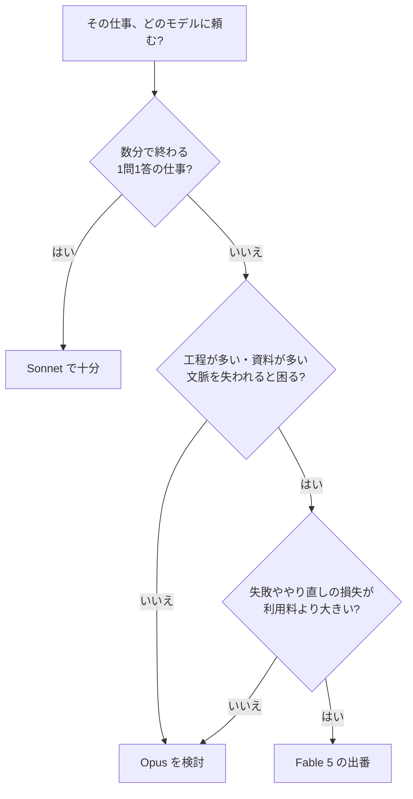

# コストの仕組みとモデルの使い分け

Fable 5 を使ってみたいが、料金表を見ても「入力 $10 / 100万トークン」の意味が分からない。結局、自分の仕事で1回頼むといくらなのか。高い分は何で取り返せるのか。

第2回では、この「お金の話」を一度だけ丁寧に整理します。ここが分かると、連載の残りの回がすべて「どの仕事に使うか」の話として読めるようになります。

## トークンとは何か ── AIが文章を数える単位

AIの料金は、文字数でもページ数でもなく、**トークン** という単位で数えます。トークンはAIが文章を処理するときの最小の区切りで、単語の一部だったり、日本語では1〜2文字だったりします。厳密な換算は文章によって変わるので、「文字数に近いが、一致はしない単位」と覚えておけば十分です。

大事なのは数え方の仕組みのほうです。料金は「読ませた量(入力)」と「書かせた量(出力)」の合計で決まります。つまり、長い資料を渡せば入力側が増え、長いレポートを書かせれば出力側が増える。使った分だけ支払う、この方式を従量課金と呼びます。

月額いくらの定額に慣れていると、従量課金は「青天井では」と不安になるかもしれません。実際には逆で、後で見るとおり1回の依頼は数円から数百円の世界です。不安の正体は金額ではなく、相場感がないことです。この回を読み終えるころには、依頼の前に「これはだいたいいくらの仕事か」を見積もれるようになっているはずです。

## 3つのモデルの価格差 ── 体感できる目安

Anthropic の主なモデルの料金を、Fable 5 を基準に並べると次のようになります。

| モデル | 位置づけ | 料金の目安 |
|---|---|---|
| Sonnet | バランス型。日常の主力 | Fable 5 の 1/3 以下 |
| Opus | 高性能。難しい単発の仕事 | Fable 5 の 1/2 |
| Fable 5 | 最上位。長く複雑な仕事 | 入力 $10 / 出力 $50(100万トークンあたり) |

体感の目安を一つ計算してみます。分厚い資料を読ませて(入力 10万トークン)、しっかりしたレポートを書かせる(出力 1万トークン)依頼なら、10万 × $10/100万 + 1万 × $50/100万 = **約 $1.5** です。逆に、メールの言い回しを直すような短い依頼は、どのモデルでも1円単位の世界です。そこに Fable 5 を使っても体感は変わらず、差額だけが積み上がります。

## 使い分けの基準 ── 「やり直しのコスト」で考える

では、どんな仕事なら3倍の料金が割に合うのか。基準は料金表ではなく、**失敗とやり直しのコスト** にあります。

安いモデルに頼んで、結果が的外れで、指示を直してもう一度、それでも噛み合わずにもう一度 ── この間に消えているのは、AIの利用料ではなくあなたの時間です。工程が多い仕事ほど、途中の誤解が後の工程に波及するので、やり直しは高くつきます。

比べる相手を間違えないでください。Fable 5 の $1.5 は、Sonnet の $0.5 と比べると3倍ですが、あなたが同じ仕事に使う数時間の人件費と比べれば、どちらも誤差の範囲です。つまりモデル間の価格差が意味を持つのは、依頼の回数が多い日常タスクの側で、大きな仕事の側では「どちらが一発で仕上げてくるか」だけが問題になります。

だから判断はこうなります。**数分で終わる1問1答は Sonnet。難しいが一発で終わる相談は Opus。長くて、複雑で、途中で文脈を失われると困る仕事だけを Fable 5 に回す。** 第1回で見た「得意なこと」と、料金の構造は、きれいに対応しています。

## 制作の舞台裏 ── この連載自体が「使い分け」で作られている

実例を一つ、身近なところからお見せします。この連載そのものです。

この連載は、**設計を Fable 5、執筆を Sonnet 5、事実確認と最終判断を人間** が分担して作っています。連載全体の構成、各回の骨子、文体のルール、使ってよい数値の一覧 ── こうした「一度だけ行う、失敗すると全部に響く判断」を Fable 5 にまとめて任せ、設計書という1つの文書にしました。

各回の執筆は、その設計書を渡した Sonnet 5 の仕事です。実際の依頼文(プロンプト)は、次のような定型です。

> あなたは連載記事のライターです。添付の設計書に厳密に従って、第◯回「(タイトル)」のドラフトを書いてください。
> 守ること: 設計書の骨子と順序に従う。文体・分量・用語統一表・禁止事項を守る。数値・事実は設計書のファクトシートにあるものだけを使う。それ以外が必要になったら本文に書かず【要確認】と印を付ける。

設計がしっかりしていれば、執筆は「定型化された作業」になり、安いモデルで十分になる。高いモデルは判断の集中する場所にだけ使う。これが従量課金の世界での、合理的な組み立て方です。

この組み立ては、連載に限らず応用が利きます。あなたの仕事にも、「一度だけ行う、影響の大きい判断」と「その判断に沿って繰り返す作業」の区別があるはずです。前者を Fable 5 で文書に固め、後者を安いモデルで回す。使い分けとは、モデルを選ぶことであると同時に、**仕事をこの2つに切り分けること** でもあります。

## その仕事は、Fable 5 に頼む価値があるか?

第2回の答えです。1回の依頼が数円で終わる仕事に、価格差は関係ありません。**やり直しの損失が利用料を上回る仕事 ── 工程が多く、失敗が高くつく仕事** から順に、Fable 5 に回してみてください。迷ったらフローチャートの3つの質問に答えれば、行き先が決まります。

次回は、最も再現しやすい高価値の使い方 ── 大量の資料をまるごと読ませる方法を扱います。

---

本記事の情報は2026年7月時点のものです。料金・提供状況は変わる可能性があるため、最新は Anthropic 公式情報をご確認ください。
