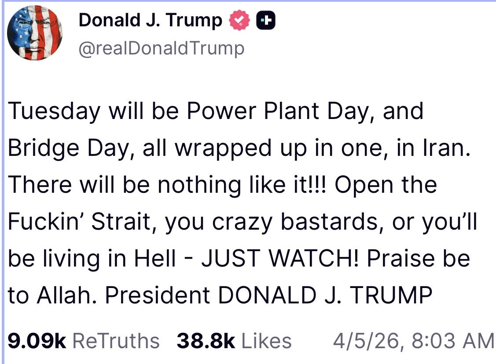

2026年4月5日、イースターの朝。トランプ大統領がTruth Socialに投稿した。

:::quote
**Tuesday will be Power Plant Day, and Bridge Day, all wrapped up in one, in Iran. There will be nothing like it!!! Open the Fuckin' Strait, you crazy bastards, or you'll be living in Hell - JUST WATCH! Praise be to Allah. President DONALD J. TRUMP**
:::

「火曜日は発電所の日であり、橋の日だ。まとめてやる。ホルムズ海峡を開けろ。さもなくば地獄に住むことになる」

これは大量虐殺であり、重大な国際法違反。アメリカ軍はトランプの命令に従うのだろうか？
そして、これはもう「中東の戦争」ではない。ここに書くのは、世界を地獄に導くからだ」。

## なぜ発電所攻撃は今まで起きなかったのか

中東の紛争は数十年にわたって続いてきた。しかし発電所や淡水化プラントへの攻撃は、事実上の**タブー**だった。

ユタ大学中東センターのMichael Christopher Low教授は「以前はタブーとされていた地域の安全保障に大きな緊張をもたらしている」と指摘している ([Arab News](https://www.arabnews.com/node/2591186/middle-east))。Project Syndicateの論考は「双方の攻撃がホテルから空港まであらゆる民間インフラに及び、**既存のほぼすべてのタブーとレッドラインを消し去った**」と評した ([Project Syndicate](https://www.project-syndicate.org/commentary/iran-war-unprecedented-destruction-of-civilian-infrastructure-by-shlomo-ben-ami-2026-04))。

このタブーには理由がある。**相互確証破壊の論理**だ。

湾岸産油国はすべて同じ脆弱性を共有している——淡水化依存、石油インフラの集中、砂漠環境。クウェートは飲料水の**90%**、オマーンは**86%**、サウジアラビアは**70%**、UAEは**42%**を海水淡水化に依存している。GCC諸国は**世界の淡水化能力の60%**を運営している ([Arab News](https://www.arabnews.com/node/2591186/middle-east))。

発電所を攻撃すれば、淡水化プラントも止まる。**電力攻撃＝水の攻撃**だ。この種の攻撃を正当化すれば、自国のインフラも標的になる。だから誰もやらなかった。

### 中東の「本当の大量破壊兵器」

核兵器は抑止力として機能するが、使えば使った側も国際的に終わる。しかし発電所・淡水化プラントへの攻撃は「通常兵器によるインフラ攻撃」として実行でき、「軍事目標」として言い訳がきく。**そしてその効果は、砂漠地帯において核兵器と同等かそれ以上に民間人を殺す。**

イランのガリバフ議会議長は「我が国の発電所が標的にされれば、地域全体のエネルギー・石油インフラを不可逆的に破壊する」と明言し、原油価格を「長期にわたって」上昇させると警告した ([Al Jazeera](https://www.aljazeera.com/news/2026/4/1/iran-threatens-regional-energy-infrastructure-retaliation))。

これは核の相互確証破壊（MAD）と同じ論理構造を、**水とエネルギーで再現している**。

### イスラエルの構造的矛盾

このタブー破壊はイスラエルにとっても自殺的だ。

ネタニヤフ首相はイランの鉄鋼生産能力の70%を破壊したと発表し、「橋の次は発電所だ」と宣言した ([euronews](https://www.euronews.com/2026/04/03/netanyahu-iran-steel-production-destroyed-power-plants-next))。しかしイランはすでにイスラエルの発電所を標的にしている。弾道ミサイルがハデラ付近に着弾し、イスラエル最大の発電所Orot Rabinを狙ったとみられている。イラン国営メディアはOrot RabinとRutenberg（第2位の発電所）を含む標的リストを公開した ([Times of Israel](https://www.timesofisrael.com/iran-targets-israel-power-plants-orot-rabin-hadera/))。

ここに致命的な非対称性がある。**イランは国土面積165万km²に9,000万人。イスラエルは2.2万km²に1,000万人。** イスラエルの電力・水・精製インフラは極めて集中しており、数発の命中で国家機能が麻痺する。イランのミサイルはディモナとアラドでイスラエルの防空システムを突破しており ([NPR](https://www.npr.org/2026/03/05/iran-missiles-dimona-arad-israel-damage))、アイアンドームは完全ではない。

:::highlight
**民間インフラ攻撃を正当化した側が、最も脆弱な立場に立つ。**

一度タブーが壊れれば、すべての当事者が同じ論理で相手のインフラを攻撃できる。**砂漠の中東で、それは核戦争と同義だ。**
:::

そしてトランプ大統領は「Power Plant Day」を宣言した。このタブーが完全に破壊されようとしている。

## 報復の連鎖が始まる

トランプ大統領がイランの発電所を攻撃した場合、イランは「同等の報復」として、湾岸諸国の発電所と淡水化設備を大規模に攻撃する。すでにバーレーンの淡水化プラントがドローンで損傷し（3月8日）、クウェートの発電・淡水化プラントがミサイルで被弾して作業員1名が死亡している（3月30日）。4月3日にもクウェートの淡水化プラントが再び攻撃された。これはまだ「警告」の段階だ。発電所攻撃が引き金を引けば、本格的な報復になる。

:::highlight
**トランプがイランの発電所を破壊する → イランが湾岸の発電所・淡水化設備を破壊する**

これは報復の連鎖だ。湾岸諸国は淡水化を発電に依存している。電力が止まれば水も止まる。
:::

同時に、イランはペルシャ湾全域に機雷を敷設する。3月30日の時点で「イラン沿岸領土への攻撃は、全ての湾岸航路への機雷敷設を引き起こす」と警告している。イランはなお80〜90%の小型艦艇と機雷敷設能力を保持しており、数百個の機雷を短期間で敷設できる。

## 6,200万人が水を失う

湾岸諸国の致命的な弱点は、**飲料水を海水淡水化に依存している**ことだ。

サウジアラビア、UAE、クウェート、カタール、バーレーン、オマーン——湾岸6カ国は合計**6,200万人**の飲料水を淡水化に依存している。発電所と淡水化設備が破壊されれば、この6,200万人が飲料水を失う。

:::highlight
**発電所攻撃は、電力の問題ではない。6,200万人の飲料水の問題だ。**
:::

飲料水がなければ、人は数日で死ぬ。エアコンのない砂漠の気候では、脱水はさらに速い。6,200万人の住民に残された選択肢は一つしかない。**逃げること**だ。

このうちの多くが外国人労働者である。UAE人口の**約88%**、カタール人口の**約85%**が外国人だ。母国に家族がいる。留まって耐える理由がない。彼らは真っ先に去る。そして彼らがいなくなれば、残った施設を動かす人間もいなくなる。

:::chain
淡水化設備破壊 → 飲料水消失 → 数日〜数週間で居住不能 → 外国人労働者が離脱 → インフラ管理の崩壊 → **6,200万人規模の難民危機**
:::

行き先はどこか。陸路ではサウジアラビア経由でヨルダンやイラクへ。海路ではインド亜大陸へ。しかし空港も港も機能しているとは限らない。航空ハブのドバイ、ドーハ、アブダビはすでに軍事作戦と空域制限で**航空キャパシティが26%減少**し、3,400便以上がキャンセルされている。逃げる手段すら限られている。

:::highlight
**2015年のシリア難民危機は約560万人だった。** 湾岸の人口は6,200万人。

淡水化設備の破壊が大規模に起きれば、シリア難民危機の**10倍以上の規模**の人道危機が発生する。しかも受け入れ先の国々——インド、パキスタン、ヨルダン、エジプト——自身がホルムズ海峡封鎖によるエネルギー・食料危機の渦中にある。危機が危機を増幅する。
:::

## 復旧に十年かかる理由

仮に戦争が終結しても、復旧は即座には始まらない。厳密な順序がある。

**第1段階：機雷撤去。** 掃海は1隻ずつ、1海里ずつの作業だ。戦時中は掃海艦自体が攻撃対象になる。ペルシャ湾全域に敷設された機雷の撤去には**年単位**の時間がかかる。機雷がある限り、復旧資材を運ぶ船は入れない。

**第2段階：発電所と淡水化設備の建設。** 機雷が撤去されて初めて、資材の搬入が可能になる。発電所と淡水化設備を建設しなければ、人が住めない。人が住めなければ、次の段階に進めない。

**第3段階：精製施設の復旧。** 人が住めるようになって初めて、精製施設の復旧工事に着手できる。破壊された精製施設の復旧には3〜5年かかる。

:::highlight
**機雷撤去 → 発電所・淡水化設備の建設 → 精製施設の復旧。**

この順番は飛ばせない。各段階に年単位の時間がかかるため、全体の復旧は**十年単位**になる。
:::

### その十年間に油田はどうなるか

復旧を待つ間も、油田は劣化し続ける。油田は放置すれば自然に回復する資源ではない。**常に管理し続けなければ、生産能力そのものが失われる。**

- **坑井の崩壊** — ケーシング（鋼管）は硫化水素と高温で腐食し続ける。メンテナンスが止まれば坑井が崩壊し、掘り直しが必要になる
- **貯留層への水・ガス浸入** — 圧力制御が止まると水やガスが油層に侵入する。一度侵入すると元の生産性には戻らない
- **地上設備の劣化** — パイプライン、ポンプ、分離装置は砂漠環境で急速に腐食する。電力途絶で防食措置も機能しない
- **二次回収システムの停止** — 湾岸の成熟油田は水攻法やガス圧入で生産量を維持している。これらが止まれば**油層の圧力が不可逆的に低下**し、再開後も以前の生産量には戻らない

:::highlight
**施設を直しても、油田が同じ量を産出するとは限らない。**

復旧に10年かかるなら、その間に失われる生産能力は永久に戻らない可能性がある。世界の石油供給構造が**不可逆的に変わる**。
:::

## 世界の食料が消える

ホルムズ海峡は世界の海上石油輸送の**20〜25%**が通過する。石油が止まることは、ガソリンが高くなることではない。**食料が消える**ことだ。

:::chain
ナフサ / 天然ガス → 水素 → アンモニア → **窒素肥料**
窒素肥料 → 世界の食料生産の約50%を支えている
:::

湾岸地域は窒素肥料「尿素」の世界貿易の**46%**を供給している。インド（輸入依存度18%）、ブラジル（同10%）など世界の主要農業国が直撃を受ける。

さらに、湾岸諸国は**世界の硫黄供給の約45〜50%**を占めている。硫黄は石油精製の副産物だ。リン酸肥料は硫酸なしに作れない。

:::chain
湾岸の石油生産壊滅 → 硫黄の副産物もなくなる（世界の45〜50%）→ 硫酸不足 → **リン酸肥料の生産が止まる**
:::

窒素肥料とリン酸肥料が同時に危機に陥る。[第11章「規制の再設計」](/insights/regulation-redesign/)で警告した「ピーク・サルファー」が、脱炭素ではなく**戦争によって現実化した**。

:::highlight
肥料がなければ、作物は育たない。作物が育たなければ、人は食べられない。

これは石油の問題ではない。**今年の食料の問題**だ。数カ月後の収穫に、すでに影響が始まっている。
:::

## 「地獄が降り注ぐ」のは誰にか

トランプ大統領は「さもなくば地獄が降り注ぐ」と言った。

しかし発電所を攻撃した場合に地獄が降り注ぐのは、イランだけではない。

- **湾岸6,200万人**が飲料水を失い、シリア危機の10倍以上の難民が発生する
- **世界の肥料原料**が消え、数十億人の食料生産に影響する
- **世界の石油供給構造**が不可逆的に変わる
- **受け入れ先の国々**自身が、エネルギーと食料の危機の渦中にある

:::highlight
**「地獄が降り注ぐ」のはイランではない。世界だ。**

4月7日（日本時間）の朝までに、私たちはこのことを理解しておく必要がある。
:::

## Sources

- [Arab News: Gulf water security and desalination dependency](https://www.arabnews.com/node/2591186/middle-east)
- [Project Syndicate: Iran war and the destruction of civilian infrastructure taboos](https://www.project-syndicate.org/commentary/iran-war-unprecedented-destruction-of-civilian-infrastructure-by-shlomo-ben-ami-2026-04)
- [Al Jazeera: Iran threatens regional energy infrastructure retaliation](https://www.aljazeera.com/news/2026/4/1/iran-threatens-regional-energy-infrastructure-retaliation)
- [Al Jazeera: Bahrain desalination plant damaged in drone attack](https://www.aljazeera.com/news/2026/3/8/bahrain-says-water-desalination-plant-damaged-in-iranian-drone-attack)
- [Al Jazeera: Kuwait power and desalination plant attacked](https://www.aljazeera.com/news/2026/3/30/iranian-attack-damages-kuwait-power-and-desalination-plant-kills-worker)
- [euronews: Netanyahu — Iran steel production destroyed, power plants next](https://www.euronews.com/2026/04/03/netanyahu-iran-steel-production-destroyed-power-plants-next)
- [Times of Israel: Iran targets Israel power plants](https://www.timesofisrael.com/iran-targets-israel-power-plants-orot-rabin-hadera/)
- [NPR: Iran missiles breach Israeli defenses at Dimona and Arad](https://www.npr.org/2026/03/05/iran-missiles-dimona-arad-israel-damage)

## Facebookのグループを作りました

Facebook [AISeed - 生物多様性・食料・AIと暮らし](https://www.facebook.com/groups/vegitage)